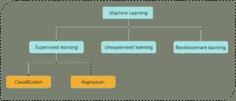
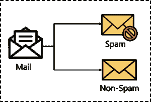
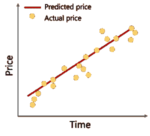
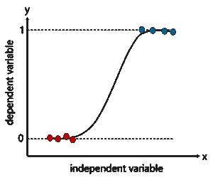
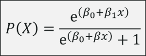
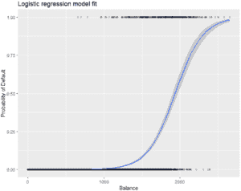

# R 逻辑回归综合指南

> 原文：<https://www.edureka.co/blog/logistic-regression-in-r/>

## **R 中的逻辑回归:**

机器学习的演变改变了整个 21 世纪。它开始重新定义我们的生活方式，现在是我们理解它是什么以及它为什么重要的时候了。逻辑回归是最广泛使用的[机器学习算法](https://www.edureka.co/blog/machine-learning-algorithms/)之一，在这篇关于 R 语言逻辑回归的博客中，你将理解它的工作原理和使用 [R 语言的实现](https://www.edureka.co/blog/r-programming-language)。

要获得深入的数据科学知识，您可以报名参加 Edureka 提供的实时 [*数据科学认证培训*](https://www.edureka.co/data-science) ，该培训提供全天候支持和终身访问。

在这篇 R 博客的逻辑回归中，我将涉及以下主题:

1.  [机器学习简介](#Introduction%20to%20Machine%20learning)
2.  [分类 vs 回归](#Classification%20vs%20Regression)
3.  [什么是回归分析？](#What%20is%20Regression%20Analysis)
4.  为什么以及何时使用逻辑回归？
5.  [什么是逻辑回归？](#What%20is%20Logistic%20Regression)
6.  [逻辑回归的类型](#Types%20of%20Logistic%20Regression)
7.  [逻辑回归是如何工作的？](#How%20does%20Logistic%20Regression%20work)
8.  [逻辑回归的实际实施](#Practical%20Implementation%20of%20Logistic%20Regression)

## **机器学习简介**

机器学习是一门通过向计算机输入数据并让它们自己学习一些技巧来让它们行动的科学，而无需明确的编程。机器学习有三种不同的方法:

*   [监督学习](https://www.edureka.co/blog/machine-learning-algorithms/)
*   [无监督学习](https://www.edureka.co/blog/k-means-clustering-algorithm/)
*   [强化学习](https://www.edureka.co/blog/machine-learning-tutorial/)

如果你希望了解更多关于机器学习的类型，你可以看看我们关于[机器学习](https://www.edureka.co/blog/machine-learning-tutorial/)的博客系列，它涵盖了各种机器学习算法及其用例的所有基本概念。

还需要对机器学习有很好的理解。你可以通过我们机器学习专家的这段视频，让自己熟悉机器学习。

## **什么是机器学习？|机器学习教程| edu reka**


[https://www.youtube.com/embed/Pj0neYUp9Tc?rel=0&showinfo=0](https://www.youtube.com/embed/Pj0neYUp9Tc?rel=0&showinfo=0)*This Edureka video on “What is Machine Learning” gives an introduction to Machine Learning and its various types.*

现在你对不同类型的机器学习有了一个概念，在这篇博客中，我们将关注逻辑回归，这是一种有监督的机器学习算法。

*监督学习算法可以用来解决两类问题:*

1.  分类问题
2.  回归问题



*分类&回归——R 中的 Logistic 回归——爱德华卡*

在我们进一步讨论逻辑回归之前，让我们试着在分类和回归问题之间划一条线。

## **分类 vs 回归**

*分类问题用于给输入变量分配标签，也就是说，它们用于将变量分为两类中的一类。*

假设您想将您的电子邮件分为两类，垃圾邮件和非垃圾邮件。对于这类问题，您必须将输入数据分配到不同的类中，您可以利用分类算法。这里需要注意的重要一点是，分类问题的响应变量本质上是绝对的。



*分类-R 中的逻辑回归-爱德华卡*

您也可以浏览我们关于[分类算法](https://www.edureka.co/blog/classification-algorithms/)的内容，以更好地了解机器学习中使用的各种分类算法。

另一方面 *回归用于预测连续量*。连续变量基本上是一个有无限种可能性的变量。比如说，一个人的体重。有人可能重 180 磅，他们可能重 180.10 磅，或者他们可能重 180.1110 磅。重量的可能性是无限的。这就是连续变量。

现在你已经对分类和回归有了一个简单的了解，让我们把重点放在回归分析上，这是逻辑回归背后的基本思想。

## **什么是回归分析？**

回归分析是一种用于预测连续量的预测技术。连续变量基本上是一个有无限多种可能性的变量。

比如一个人的身高。有人可能身高 165 厘米，或者他们可能身高 165.02 厘米，或者他们可能身高 165.022 厘米。高度的可能性是无限的。这就是连续变量。

因此，回归基本上是一种用于预测连续变量的预测分析技术。在这里，你不必将数据分为不同的类别，相反，你必须预测最终的结果，比如说你想预测一段时间内的股票价格。



*回归——R 中的 Logistic 回归——爱德华卡*

对于这类问题，你可以通过研究因变量(股票价格)和自变量(时间)之间的关系来利用回归。

## **我们为什么以及什么时候使用逻辑回归？**

为了理解我们为什么使用逻辑回归，让我们考虑一个小场景。

假设你的妹妹正在努力进入研究生院，你想预测她是否会被她梦想中的学校录取。所以，根据她的 CGPA 和过去的数据，你可以使用逻辑回归来预见结果。

逻辑回归允许您分析一组变量并预测分类结果。由于这里我们需要预测她是否会进入学校，这是一个分类问题，逻辑回归将是理想的。


*逻辑回归举例——R 中的逻辑回归——爱德华卡*

你可能想知道为什么我们在这种情况下不使用线性回归。*原因是线性回归用于预测连续量，而不是分类量*。因此，当结果只能取 2 个可能的值时，最好有一个模型预测该值为 0 或 1，或者以介于 0 和 1 之间的概率形式。

线性回归没有这个能力。如果使用线性回归对二元结果进行建模，得到的模型将不会预测 0 到 1 范围内的 Y 值，因为线性回归适用于连续的因变量，而不适用于分类变量。这就是为什么我们使用逻辑回归。

如果你仍然对线性回归和逻辑回归之间的区别感到困惑，请查看我们的机器学习专家的视频。

## **线性回归 vs 逻辑回归|数据科学培训|爱德华卡**


[https://www.youtube.com/embed/OCwZyYH14uw?rel=0&showinfo=0](https://www.youtube.com/embed/OCwZyYH14uw?rel=0&showinfo=0)*This Edureka video on Linear Regression Vs Logistic Regression covers the basic concepts of linear and logistic models.*

**什么是逻辑回归？**

逻辑回归是用于解决分类问题的最基本和最广泛使用的机器学习算法之一。它被命名为“逻辑回归”的原因是它的主要技术与线性回归非常相似。

*逻辑回归是一种用于预测因变量(Y)的方法，给定一个自变量(X)，使得因变量为分类*。



*什么是逻辑回归——R 中的逻辑回归——爱德华卡*

当我说分类变量时，我的意思是它包含 1 或 0，是或否，真或假等值。所以基本上，在逻辑回归中，结果总是绝对的。

## **Logistic 回归模型的类型**

逻辑回归的优点之一是，它可以通过使用多项式和有序逻辑模型来解决多类分类问题。

****

*逻辑回归的类型——R 中的逻辑回归——爱德华卡*

**多项逻辑回归:**

多项式回归是二元逻辑回归的扩展，当响应变量有两个以上类别时使用。多项式回归用于处理多类分类问题。

假设我们的响应变量有 K = 3 类，那么多项式逻辑模型将适合 K-1 个独立的二元逻辑模型，以便计算最终结果。

### **依次逻辑回归:**

有序逻辑回归也称为有序分类，是一种预测建模技术，用于响应变量本质上是有序的情况。

顺序变量是指值的顺序很重要，但值之间的差异不重要。例如，你可以让一个人给一部电影打 1 到 5 分。4 分比 3 分好得多，因为这意味着这个人喜欢这部电影。但是等级 4 和 3 之间的差别可能不同于等级 4 和 1 之间的差别。这些值只是表示一个顺序。

以上是不同逻辑模型的简要概述。然而，在这篇博客中，我们将只关注二元逻辑回归。

**Logistic 回归是如何工作的？**

为了理解逻辑回归的工作原理，让我们来看看线性回归方程:

***Y = βo + β1X + ∈***

*   y 代表需要预测的因变量。
*   β0 是 Y 轴截距，基本上是直线上与 Y 轴相交的点。
*   β1 是直线的斜率(斜率可以是负的，也可以是正的，取决于因变量和自变量之间的关系。)
*   这里的 x 代表独立变量，用于预测我们的合成因变量。
*   ∈表示计算中的误差

那么，假设 X 是解释变量(自变量)，Y 是响应变量(因变量)，我们如何表示 p(X)=Pr(Y=1|X)和 X 之间的关系呢？

这里，Pr(Y=1|X)表示给定某个 X 值时 Y=1 的概率。

线性回归将这些概率建模为:

*p(x)=β0+β1xT3*

逻辑回归方程是从同一个方程推导出来的，除了我们需要做一些改动，因为响应变量必须只接受分类值。

逻辑回归不一定将结果计算为 0 或 1，而是计算变量落入 0 类或 1 类的概率(范围在 0 和 1 之间)。*因此，我们可以得出结论，合成(因变量)必须是正的，并且应该在 0 和 1 之间，即它必须小于 1* 。

为了满足上述条件，我们必须做到以下几点:

*   以方程的指数为例，因为任何值的指数都是正数
*   第二，一个数被它自己+ 1 除后将永远小于 1

因此，公式为:



*Logit()函数–R 中的逻辑回归–爱德华卡*

下一步是计算 *logit()* 函数。


*推导——R 中的逻辑回归——爱德华卡*

上面的推导相当简单，我们只要交叉相乘，取 e(β0 + β1X)的公。RHS 表示自变量的线性方程，LHS 表示优势比，也称为 logit 函数。

logit 函数是以 S 曲线或 S 形曲线表示的链接函数，范围在 0-1 之间，并计算响应变量的概率。

*在逻辑回归中，增加一个测量值“X ”, logit 的变化系数为β0。简而言之，回归系数描述了预测变量单位变化的对数变化。*

现在你已经很好的理解了逻辑回归是如何工作的，让我们继续演示吧。

## **逻辑回归的实际实现**

在我们开始之前，我将使用 R 语言来实现逻辑回归模型。如果你想很好地理解 R 编程，看看这个视频。

## **R 编程初学者| R 语言教程| edu reka**


[https://www.youtube.com/embed/fDRa82lxzaU?rel=0&showinfo=0](https://www.youtube.com/embed/fDRa82lxzaU?rel=0&showinfo=0)*This Edureka R Programming Tutorial For Beginners will help you in understanding the fundamentals of R and will help you build a strong foundation in R.*

**数据集描述:**在这个演示中，我们将使用由 *ISLR* 包提供的默认数据。该数据集包含大约一万名客户的信息，例如客户是否违约、是否是学生、客户的平均余额以及客户的收入。

**问题陈述:** *拟合逻辑回归模型，根据客户持有的平均余额预测客户违约的概率。*

我们将通过安装以下软件包来开始演示:

*   tidyverse:用于数据操作和可视化
*   modelr:用于管道建模功能的简单实现
*   扫帚:用于模型输出的适当组织
*   ISLR:包含约 10，000 个客户平均余额和违约信息观察值的数据集。

```
#loading Packages
library(tidyverse)
library(modelr)
library(broom)
#Install ISLR Package
install.packages('ISLR')
#Load ISLR Package
library('ISLR')

```

我们的下一步是导入数据集并将其显示为 tible:

```
# Load data
(mydata <- as_tibble(ISLR::Default))
# A tibble: 10,000 x 4
default student balance income
<fct> <fct> <dbl> <dbl>
1 No No 730\. 44362.
2 No Yes 817\. 12106.
3 No No 1074\. 31767.
4 No No 529\. 35704.
5 No No 786\. 38463.
6 No Yes 920\. 7492.
7 No No 826\. 24905.
8 No Yes 809\. 17600.
9 No No 1161\. 37469.
10 No No 0 29275.
# ... with 9,990 more rows

```

现在让我们检查一下 NA 值，如果你在知道最好去掉它们之前已经处理过 NA 值的话:

```
#Checking for NA values
sum(is.na(mydata))
[1] 0

```

幸运的是，数据中没有空值。下一步是将数据分割成训练和测试数据集，这也称为数据拼接。

```
#Creating the Training and Testing data set
sample <- sample(c(TRUE, FALSE), nrow(mydata), replace = T, prob = c(0.6,0.4))
train <- mydata[sample, ]
test <- mydata[!sample, ]

```

在这里，我们按照 60:40 的比例分割数据，这样，60%的数据用于训练，剩下的 40%用于测试模型。

## **建立逻辑回归模型**

拆分数据后，我们的下一步是使用训练数据集来构建逻辑模型。逻辑模型试图:

*   根据客户的平均余额对客户违约的概率建模
*   估计客户违约的概率与不违约的概率
*   将客户分为两类(违约者和非违约者)

为了构建逻辑回归模型，我们将使用 glm()函数。逻辑回归属于一类称为广义线性模型(GLM)的模型，可使用 glm()函数构建。

glm()函数的语法是:

***【glm(公式，数据，家族)***

在上面的语法中:

*   **公式:**公式表示因变量和自变量之间的关系
*   **数据:**应用公式的数据集
*   **系列:**该字段指定回归模型的类型。在我们的情况下，这是一个二元逻辑回归模型

```
#Fitting a logistic regression model
logmodel <- glm(default ~ balance, family = "binomial", data = train)

```

glm()函数使用最大似然法来计算模型。

### **什么是最大似然法？**

该方法确定系数(β0，β1)的值，使得预测概率尽可能接近实际概率。简而言之，对于二元分类，最大似然估计器将尝试找到β0 和β1 的值，以使所得概率最接近 1 或 0。似然函数表示为:


*最大似然估计量——R 中的逻辑回归——爱德华卡*

建立逻辑模型后，我们现在可以可视化响应变量和预测变量之间的关系。为此，我们使用由 r。

```
#Plotting a graph: Probability of default Vs Balance
mydata %>%
mutate(prob = ifelse(default == "Yes", 1, 0)) %>%
ggplot(aes(balance, prob)) +
geom_point(alpha = .15) +
geom_smooth(method = "glm", method.args = list(family = "binomial")) +
ggtitle("Logistic regression model fit") +
xlab("Balance") +
ylab("Probability of Default")

```

结果是预期的 S 曲线或 S 形曲线。

## ****

*逻辑回归图——R 中的逻辑回归——爱德华卡*

## **逻辑回归模型诊断**

建立模型的最关键步骤之一是评估效率和检查模型的重要性。我们可以通过使用 R:

```
#Summary of the Logistic Regression Model
summary(logmodel)
Call:
glm(formula = default ~ balance, family = "binomial", data = train)

Deviance Residuals:
Min 1Q Median 3Q Max
-2.2905 -0.1395 -0.0528 -0.0189 3.3346

Coefficients:
Estimate     Std. Error    z value   Pr(>|z|)
(Intercept) -1.101e+01  4.887e-01   -22.52   <2e-16 ***
balance      5.669e-03    2.949e-04   19.22     <2e-16 ***
---
Signif. codes: 0 ‘***’ 0.001 ‘**’ 0.01 ‘*’ 0.05 ‘.’ 0.1 ‘ ’ 1

(Dispersion parameter for binomial family taken to be 1)

Null deviance: 1723.03 on 6046 degrees of freedom
Residual deviance: 908.69 on 6045 degrees of freedom
AIC: 912.69
Number of Fisher Scoring iterations: 8

```

上面的总结告诉我们一些事情:

*   Call:是对逻辑回归模型的函数调用
*   偏差:偏差是模型拟合优度的统计度量。具有较低偏差值的模型被认为是拟合良好的模型，而较高的数值总是表明拟合不良。有两种类型的异常:

1.  零偏差
2.  剩余偏差

*   *零偏差*表示仅包含截距(大平均值)而不包含独立变量或预测变量的模型对响应变量的预测程度
*   *残差偏差*显示了包括模型所有特征和系数的模型对响应变量的预测程度

*   系数:代表贝塔系数及其统计意义。

密切注意系数的 Pr(>|z|)或 p 值。只有当 p 值小于预定的统计显著性水平(理想情况下为 0.05)时，逻辑回归模型才具有统计显著性。每个系数的 p 值表示为概率 Pr(>|z|)。

我们可以看到，这两个系数都具有非常低的 p 值，这意味着这两个系数在计算响应变量时都很重要。

对应于 p 值的星号表示相应变量的显著性。由于在我们的模型中，两个 p 值都有一个 3 星，这表明这两个变量在预测响应变量中是非常重要的。

*   AIC: Akaike 信息标准是一种拟合的统计方法，它对预测变量数量的逻辑模型进行惩罚。具有最小 AIC 值的模型被认为是非常适合的模型。逻辑回归模型中的 AIC 相当于线性回归中的调整后的 R

上述指标用于检查逻辑回归模型的适用性，因此关注这些值至关重要。

## **评估逻辑回归模型**

在训练数据集上训练模型之后，最后是使用测试数据集评估模型的时候了。在下面的代码行中，我们将使用我们之前构建的逻辑回归模型来预测测试数据的响应变量(defaulter class(0/1))。

```
#Fitting a logistic regression model on the testing data
logmodel <- glm(default ~ balance, family = "binomial", data = test)

```

现在我们来看看模型的总结:

```
summary(logmodel)
Call:
glm(formula = default ~ balance, family = "binomial", data = test)

Deviance Residuals:
Min 1Q Median 3Q Max
-2.2021 -0.1574 -0.0676 -0.0272 3.6743

Coefficients:
Estimate    Std. Error   z value   Pr(>|z|)
(Intercept) -1.020e+01  5.372e-01  -18.98    <2e-16 ***
balance       5.286e-03   3.329e-04   15.88    <2e-16 ***
---
Signif. codes: 0 ‘***’ 0.001 ‘**’ 0.01 ‘*’ 0.05 ‘.’ 0.1 ‘ ’ 1

(Dispersion parameter for binomial family taken to be 1)
Null deviance: 1197.10 on 3952 degrees of freedom
Residual deviance: 685.05 on 3951 degrees of freedom
AIC: 689.05
Number of Fisher Scoring iterations: 8

```

在研究模型总结时，很明显，这两个系数都很重要，因为它们的 p 值很小，而且与训练阶段相比，AIC 和偏差值也下降了，这是一件好事。

## **预测结果**

我们的最后一步是通过对预测变量的特定值进行预测来评估模型的效率。因此，这里我们要预测一个余额为 2000 美元的客户是否会成为违约者。为此，我们将在 R:

```
predict(logmodel, data.frame(balance = c(2000)), type = "response")
1
0.5820893

```

从上面的结果可以清楚地看出，客户属于 Y=1 类，因此是一个违约者。

既然你已经知道了逻辑回归是如何工作的，我相信你一定很想了解更多关于各种机器学习算法的知识。这里有一个博客列表，深入涵盖了不同类型的机器学习算法

1.  [支持向量机](https://www.edureka.co/blog/support-vector-machine-in-r/)
2.  [决策树](https://www.edureka.co/blog/decision-trees/)
3.  [K-表示](https://www.edureka.co/blog/k-means-clustering-algorithm/)

就这样，我们结束了 R 博客中的逻辑回归。我希望你觉得这篇博客内容丰富，如果你有任何疑问，请留下评论，我们会尽快回复你。

敬请关注更多关于趋势技术的博客。

*如果你正在寻找数据科学的在线结构化培训，edureka！拥有专门策划的[数据科学课程](https://www.edureka.co/data-science)，帮助你获得统计学、数据争论、探索性数据分析、机器学习算法(如 K 均值聚类、决策树、随机森林、朴素贝叶斯)方面的专业知识。您将学习时间序列的概念、文本挖掘以及深度学习的介绍。本课程的新批次即将开始！！*