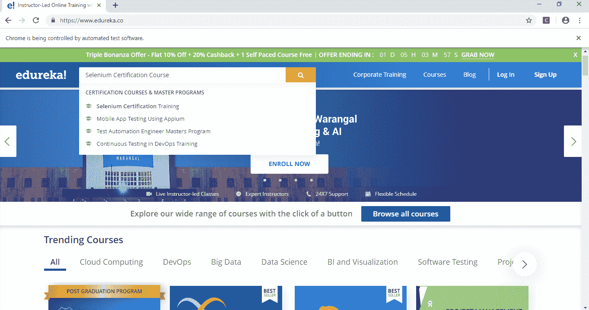
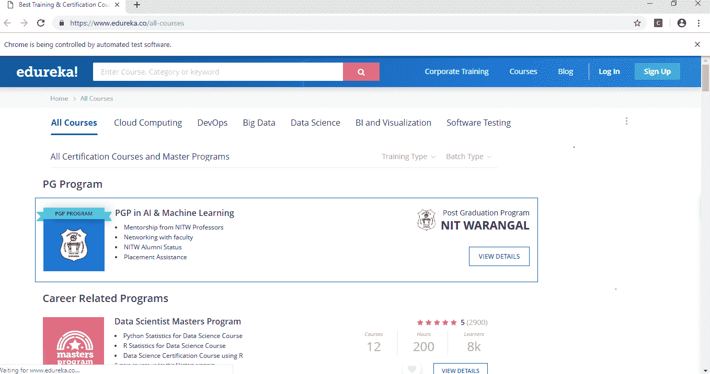
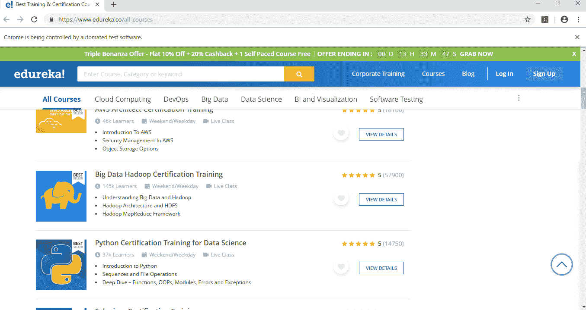
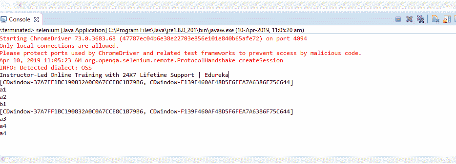

# 如何在 Selenium 中处理多个窗口？

> 原文：<https://www.edureka.co/blog/handle-multiple-windows-in-selenium/>

在这个科技飞速发展的世界里，人们必须设法跟上时代的步伐。随着世界朝着软件开发的方向发展，测试在保证过程无缺陷方面起着至关重要的作用。 [**Selenium Training**](https://www.edureka.co/selenium-certification-training) 就是这样一个帮助发现并解决 bug 的工具。这篇关于如何在 Selenium 中处理多个窗口的文章让您了解如何在测试应用程序时处理多个窗口。

所以，我们首先来看看本文将要涉及的主题:

*   [什么是 Selenium Webdriver？](#What_is_Selenium_Webdriver?)
*   [如何在 Selenium 中运行测试用例？](#How_to_run_a_test_case_in_Selenium?)

*   [如何处理多个窗口？【T2](#How_to_handle_multiple_windows?)

*   [演示](#Demo)

因此，在我们进一步了解如何在 Selenium 中同时处理多个窗口之前，我们先来看看什么是[***Selenium web driver***](https://www.edureka.co/blog/selenium-webdriver-architecture/)并了解它是如何工作的。

## **在 Selenium 中处理多个窗口:Selenium Webdriver 是什么？**

我敢打赌，大多数软件测试人员一定都使用过这个让他们的生活变得更轻松的神奇工具，对于那些不知道什么是 Selenium 的人，我将帮助你迈出探索这个工具的第一步。

[******](https://www.edureka.co/blog/what-is-selenium/)

[***Selenium***](https://www.edureka.co/blog/what-is-selenium/)是一个自动化工具，其唯一目的是测试任何组织开发的 web 应用程序。现在，这个让它流行的工具到底有什么吸引人的地方呢？

*   Selenium 是一个开源的可移植框架，有助于 web 应用程序的自动化测试。
*   Selenium 中的测试脚本可以用您选择的任何编程语言编写，比如 Java、Python、C#等等。
*   Selenium 有自己的命令集，称为 Selenese，它保存了一系列命令。
*   它可以在各种网络浏览器上运行，比如 Chrome、Safari、Firefox、IE 等等。
*   [***Selenium web driver***](https://www.edureka.co/blog/selenium-tutorial)直接与浏览器交互而不是与服务器交互。
*   它又快又有效率。
*   Selenium 在进行 [***功能测试***](https://www.edureka.co/blog/what-is-functional-testing/) 和回归测试时高度灵活。
*   另一个有趣的因素是，Selenium 使用 [***元素定位器***](https://www.edureka.co/blog/locators-in-selenium/) 来帮助在网页上找到元素。分别是:class，name， [***XPath***](https://www.edureka.co/blog/xpath-in-selenium/) ，ID，LinkText，DOM，部分 LinkText 和 [***CSS 选择器***](https://www.edureka.co/blog/new-features-of-chropath/) 。
*   它还使用类似于 [***Maven***](https://www.edureka.co/blog/create-selenium-maven-project/) 、JUnit 等插件来更快速有效地测试应用程序。

现在让我们看看如何使用 Selenium 测试应用程序。

## **在 Selenium 中处理多个窗口:如何在 Selenium 中运行测试用例？**

为了测试 Selenium 中的任何应用程序，我们遵循某些最终有助于执行所需任务的程序。

运行测试用例的基本先决条件是:

### **运行 Selenium 测试用例的先决条件**

*   我们要求的第一件事是选择正确的编程语言来编写测试脚本。由于 Java 是最简单和最容易理解的语言之一，我们将把 JRE 库添加到项目中。
*   我们需要一个 IDE 来运行测试脚本。有 NetBeans、Eclipse 和许多其他 IDE，但我们更喜欢使用 Eclipse IDE，因为它在执行 Java 项目时非常有效。
*   一些 Selenium 插件，如 Selenium 独立服务器、Selenium jar 文件和 Selenium IDE。
*   不同浏览器的浏览器驱动程序，如 Chrome、IE、Firefox 等。

查看这篇关于 [***如何设置 Selenium***](https://www.edureka.co/blog/selenium-installation/) 的文章，获得关于安装过程的端到端指导。

因此，为了测试一个应用程序，我们需要了解编程语言的基础知识，在我们的例子中就是 Java。所以首先，

*   初始化 webdriver 并创建一个相同的对象。
*   将浏览器驱动实例化为新的 ChromeDriver(在这种情况下，我们正在开发 ChromeDriver，您可以选择 Firefox 或 IE)并指定 ChromeDriver 所在的路径，后跟可执行文件的扩展名。
*   获取您想要测试的特定网页的 URL
*   使用 Selenium 中的一个元素定位器找到元素

看一下这个视频，了解测试应用的每一个细节。

## **怎么写&在 Selenium 中运行一个测试用例| Selenium 教程| Selenium 培训| edu reka**


[https://www.youtube.com/embed/_JNeiGbAgL4?rel=0&showinfo=0](https://www.youtube.com/embed/_JNeiGbAgL4?rel=0&showinfo=0)

本视频将向您介绍自动化软件测试工具——Selenium，并帮助您理解如何编写和运行测试用例。

因此，一旦我们知道如何在 Selenium 中运行测试用例，我们将尝试通过同时在多个窗口中工作来改变流程。为了做到这一点，我们将看到一些帮助我们做到这一点的函数。

这里有一个[测试自动化工程师](https://www.edureka.co/masters-program/automation-testing-engineer-training)可用，它可以给你提供轻松创建自动化工程师系统的智能和专业水平。

## **在 Selenium 中处理多个窗口:如何处理多个窗口？**

什么是窗口句柄函数？如何在 Selenium 中测试应用程序时处理多个窗口？嗯，这个可以回答你所有的问题。

### 什么是窗口句柄？

窗口句柄是保存所有窗口地址的唯一标识符。这基本上是一个指向窗口的指针，它返回字符串值。这个窗口句柄函数有助于获得所有窗口的句柄。保证每个浏览器都有唯一的窗口句柄。

### **语法**

*   get.windowhandle():帮助获取当前窗口的窗口句柄
*   get.windowhandles():帮助获取所有打开的窗口的句柄
*   set:帮助设置窗口句柄，以字符串的形式。set <字符串>set = driver . get . window handles()
*   切换到:帮助在窗口之间切换
*   动作:帮助在窗口上执行某些动作。

这些是我们将在本演示中看到的一些新功能。除此之外，其余的功能有助于流程的自动化。

## **如何在 Selenium Webdriver 中处理多个窗口| Selenium 认证培训| Edureka**


[https://www.youtube.com/embed/-RkjM9Uh7Ac?rel=0&showinfo=0](https://www.youtube.com/embed/-RkjM9Uh7Ac?rel=0&showinfo=0)This video will help you understand how to handle multiple windows when you are testing an application using Selenium.

## **处理** **多个窗口在硒:演示**

在本演示部分，我们将自动化几个网站，并检查如何处理多个窗口。

我们将自动化页面，例如，

*   ToolsQA 测试窗口句柄功能的网站
*   我们还将自动化我们的官方网站 edureka.co，并执行一些操作
*   Naukri.com 是最受欢迎的在线求职门户网站之一

现在，我们首先开始测试网页工具 QA

*   我们将首先指定我们将要工作的浏览器驱动程序，并使用以下命令指定它所在的路径:system . set property(" web driver . chrome . driver "，" D:chrome driver . exe ")；
*   将 webdriver 实例化为新的 chromedriver。
*   获取我们想要测试的网页的 URL。
*   检查元素并使用元素定位器在网页上找到它，在这种情况下，它是 ID。
*   之后，我们需要打开多个子窗口。所以，我要用 for 循环来做这件事。

```

package selenium;

import org.openqa.selenium.By;
import org.openqa.selenium.WebDriver;
import org.openqa.selenium.WebElement;
import org.openqa.selenium.chrome.ChromeDriver;

public class demo1 {
public static void main(String[] args) throws InterruptedException
{
System.setProperty("webdriver.chrome.driver", "D:chromedriver.exe");
WebDriver driver = new ChromeDriver();
driver.get("http://toolsqa.com/automation-practice-switch-windows/");
WebElement clickElement = driver.findElement(By.id("button1"));

for(int i = 0; i < 3; i++)
{
clickElement.click();
Thread.sleep(3000);
}

}
}

```

下一步，我们将添加更多的命令，并注意执行中的变化。

*   除了我们需要打印父窗口和子窗口的窗口句柄之外，这几乎与第一个项目相似。
*   使用命令获取父窗口的句柄:String parentWindowHandle = driver . getwindowhandle()；
*   打印父窗口的窗口句柄。
*   使用作为元素定位器的 ID 在网页上查找元素。
*   打开多个子窗口。
*   遍历子窗口。
*   使用 sleep 命令 Thread.sleep(3000)暂停执行几秒钟，其中时间以纳秒为单位。
*   使用命令获取当前打开的所有窗口的句柄:Set<String>allWindowHandles = driver . getwindowhandles()；它返回一组句柄。
*   打印所有窗口的句柄。

```

package selenium;

import java.util.Set;

import org.openqa.selenium.By;
import org.openqa.selenium.WebDriver;
import org.openqa.selenium.WebElement;
import org.openqa.selenium.chrome.ChromeDriver;

public class demo2 {
public static void main(String[] args) throws InterruptedException
{

System.setProperty("webdriver.chrome.driver", "D:chromedriver.exe");
WebDriver driver = new ChromeDriver();
driver.get("http://toolsqa.com/automation-practice-switch-windows/");
String parentWindowHandle = driver.getWindowHandle();
System.out.println("Parent window's handle -> " + parentWindowHandle);
WebElement clickElement = driver.findElement(By.id("button1"));

for(int i = 0; i < 3; i++)
{
clickElement.click();
Thread.sleep(3000);
}

Set<String> allWindowHandles = driver.getWindowHandles();

for(String handle : allWindowHandles)
{
System.out.println("Window handle - > " + handle);
}

}

}

```

现在，我们将通过向上述程序添加几个命令来定制网页。

*   在这个程序中，我们将测试同一个网页工具 QA，并将另一个 URL 传递给父窗口。
*   将浏览器驱动实例化为新的 Chromedriver。
*   获取父窗口的窗口句柄并打印出来。
*   使用作为元素定位器的 ID 在页面上查找元素。
*   使用 for 循环来迭代正在创建的子窗口的数量。
*   打开所有窗户的把手。
*   打印第一个窗口的窗口句柄。
*   使用 *SwitchTo* 命令切换到所需的窗口，并将网页“google.com”的 URL 传递到当前窗口。

```

package selenium;

import java.util.Set;

import org.openqa.selenium.By;
import org.openqa.selenium.WebDriver;
import org.openqa.selenium.WebElement;
import org.openqa.selenium.chrome.ChromeDriver;

public class demo4 {

public static void main(String[] args) throws InterruptedException
{
System.setProperty("webdriver.chrome.driver", "D:chromedriver.exe");
WebDriver driver = new ChromeDriver();
driver.get("http://toolsqa.com/automation-practice-switch-windows/");
String parentWindowHandle = driver.getWindowHandle();
System.out.println("Parent window's handle -> " + parentWindowHandle);
WebElement clickElement = driver.findElement(By.id("button1"));

for(int i = 0; i < 3; i++)
{
clickElement.click();
Thread.sleep(3000);
}

Set<String> allWindowHandles = driver.getWindowHandles();

for(String handle : allWindowHandles)
{
System.out.println("Switching to window - > " + handle);
System.out.println("Navigating to google.com");
driver.switchTo().window(handle); //Switch to the desired window first and then execute commands using driver
driver.get("http://google.com");
}

}
}

```

在这之后，我们将看看如何在不改变父窗口的情况下改变子窗口。

*   这个过程与前面的程序几乎相似，只是在传递了 URL google.com 之后，我们将切换到父窗口并关闭它。
*   在此之后，我们将定义最后一个窗口的窗口句柄并切换到该窗口，并传递 ToolsQA 页面的 URL。这样这个 URL 只在最后一个窗口打开，其他两个子窗口仍然显示 google.com 页面。

```

package selenium;

import java.util.Set;
import org.openqa.selenium.By;
import org.openqa.selenium.WebDriver;
import org.openqa.selenium.WebElement;
import org.openqa.selenium.chrome.ChromeDriver;

public class demo5 {
public static void main(String[] args) throws InterruptedException
{

System.setProperty("webdriver.chrome.driver", "D:chromedriver.exe");
WebDriver driver = new ChromeDriver();
driver.get("http://toolsqa.com/automation-practice-switch-windows/");
String parentWindowHandle = driver.getWindowHandle();
System.out.println("Parent window's handle -> " + parentWindowHandle);
WebElement clickElement = driver.findElement(By.id("button1"));

for(int i = 0; i < 3; i++)
{
clickElement.click();
Thread.sleep(3000);
}

Set<String> allWindowHandles = driver.getWindowHandles();
String lastWindowHandle = "";
for(String handle : allWindowHandles)
{
System.out.println("Switching to window - > " + handle);
System.out.println("Navigating to google.com");
driver.switchTo().window(handle); //Switch to the desired window first and then execute commands using driver
driver.get("http://google.com");
lastWindowHandle = handle;
}

//Switch to the parent window
driver.switchTo().window(parentWindowHandle);
//close the parent window
driver.close();
//at this point there is no focused window, we have to explicitly switch back to some window.
driver.switchTo().window(lastWindowHandle);
driver.get("http://toolsqa.com");
}
}

```

现在，我们将测试 Naukri.com 顶级求职门户网站之一

*   将系统属性设置为 Chromedriver 并指定其路径
*   将 webdriver 实例化为新的 chromedriver
*   获取网页的 URL 并最大化页面
*   获取父窗口的窗口句柄
*   获取所有窗口的窗口句柄
*   接下来，我们声明了一个迭代器类型的对象，用它来切换到子窗口并对其执行操作
*   我们检查主窗口是否等于子窗口，如果(！mainweb.equals(child))。如果主窗口不等于子窗口，条件成立，我们切换到下一个子窗口。

```

package selenium;
import org.testng.annotations.Test;
import java.util.Iterator;
import java.util.Set;
import org.openqa.selenium.WebDriver;
import org.openqa.selenium.chrome.ChromeDriver;
public class MultipleWindowsClass{
@Test
public void testMultipleWindows() throws InterruptedException{
System.setProperty("webdriver.chrome.driver", "D:chromedriver.exe");
// To open browser
WebDriver driver = new ChromeDriver();
// To maximize browser
driver.manage().window().maximize();
// To open Naukri website with multiple windows
driver.get("http://www.naukri.com/");
// It will return the parent window name as a String
String mainWindow=driver.getWindowHandle();
// It returns no. of windows opened by WebDriver and will return Set of Strings
Set<String> set =driver.getWindowHandles();
// Using Iterator to iterate with in windows
Iterator<String> itr= set.iterator();
while(itr.hasNext()){
String childWindow=itr.next();
// Compare whether the main windows is not equal to child window. If not equal, we will close.
if(!mainWindow.equals(childWindow)){
driver.switchTo().window(childWindow);
System.out.println(driver.switchTo().window(childWindow).getTitle());
driver.close();
}
}
// This is to switch to the main window
driver.switchTo().window(mainWindow);
}
}

```

接下来，我们将在我们的官方网站 edureka.co 上执行一些操作

*   我们将把 webdriver 初始化为新的 chromedriver。
*   获取网页的网址。
*   我们将使用【Javascript 执行器，它是一个接口，它提供了通过 Selenium WebDriver 执行 Javascript 的机制。
*   获取父窗口的窗口句柄。
*   使用 XPath 查找元素，XPath 是一个元素定位器，将键发送到网页上的特定位置。
*   使用 javascriptexecutor 命令向下滚动页面:js . execute script(" window . Scroll by(X 轴，Y 轴)")；
*   获取所有窗口的句柄并打印出来。
*   接下来，我们声明了一个迭代器类型的对象，用它来切换到子窗口并在其上执行操作。
*   如果(！idspnonenote)出现这种情况，我们会检查。mainweb.equals(child))，如果这个条件成立，我们切换到子窗口并打印它的标题。

```

package selenium;

import java.util.Iterator;
import java.util.Set;

import org.openqa.selenium.By;
import org.openqa.selenium.JavascriptExecutor;
import org.openqa.selenium.Keys;
import org.openqa.selenium.WebDriver;
import org.openqa.selenium.chrome.ChromeDriver;

public class demo3 {

public static void main(String[] args) throws InterruptedException
{
System.setProperty("webdriver.chrome.driver","S:chromedriver.exe");
WebDriver driver = new ChromeDriver();
JavascriptExecutor js = (JavascriptExecutor) driver;
driver.get("https://www.edureka.co/community");
String mainweb = driver.getWindowHandle();
driver.findElement(By.xpath("//a[@class='qa-logo-link edureka']")).sendKeys(Keys.SHIFT,Keys.ENTER);
Thread.sleep(100);
js.executeScript("window.scrollBy(0,400)");
Set <String> set = driver.getWindowHandles();
System.out.println(set);
Iterator <String> itr = set.iterator();
while(itr.hasNext())
{
js.executeScript("window.scrollBy(0,400)");
String child = itr.next();
if(!mainweb.equals(child))
{
driver.switchTo().window(child);
System.out.println(driver.switchTo().window(child).getTitle());
// driver.close();
}
}
driver.switchTo().window(mainweb);

}

}

```

接下来，我们将通过定制来自动化相同的网页。

*   这个过程与上一个几乎相似，但是在这个过程中，我们打印当前页面的标题。
*   使用 javascriptexecutor 向下滚动页面。
*   使用元素定位器 XPath 找到元素，并将键(字符串形式)发送到特定的元素位置。
*   声明 web 元素*链接*来点击页面上的特定链接，在这种情况下，我们希望链接在一个新窗口中打开。
*   在此之后暂停执行几秒钟。
*   获取所有窗口的窗口句柄，并按顺序打印。
*   切换到父窗口，检查标题是否匹配。如果是，使用 javascriptexecutor 向下滚动页面。使用元素定位器在网页上找到另一个元素，并指定新窗口的位置。
*   切换回父窗口，向下滚动页面。

```
 package selenium; 
import java.util.Set; 
import org.openqa.selenium.By;
import org.openqa.selenium.JavascriptExecutor; 
import org.openqa.selenium.Keys; 
import org.openqa.selenium.Point; 
import org.openqa.selenium.WebDriver; 
import org.openqa.selenium.WebElement; 
import org.openqa.selenium.chrome.ChromeDriver; 
import org.openqa.selenium.interactions.Actions; 
//import org.openqa.selenium.support.ui.Select; 
public class selenium { public static void main(String[] args) throws Exception 
{ 
System.setProperty("webdriver.chrome.driver", "D:chromedriver.exe"); 
WebDriver driver = new ChromeDriver(); 
driver.get("https://www.edureka.co/"); 
String title = driver.getTitle(); System.out.println(title); 
//driver.get("http://www.google.co"); 
JavascriptExecutor js = (JavascriptExecutor) driver; 
driver.findElement(By.cssSelector("#search-inp")).sendKeys("Selenium Certification Course"); 
js.executeScript("window.scrollBy(0,40)"); 
driver.findElement(By.xpath("//span[@class='typeahead__button']")).click(); 
WebElement link = driver.findElement(By.xpath("//li[@class='ga-allcourses']//a[@class='giTrackElementHeader'][contains(text(),'Courses')]")); 
Actions newwin = new Actions(driver); 
newwin.keyDown(Keys.SHIFT).click(link).keyUp(Keys.SHIFT).build().perform(); 
//Thread.sleep(2000); 
//js.executeScript("window.scrollBy(0,400)"); 
Thread.sleep(3000); 
Set<String> windows = driver.getWindowHandles(); 
System.out.println(windows); 
System.out.println("a1"); 
for (String window : windows) 
{ 
driver.switchTo().window(window); 
if (driver.getTitle().contains("Best Training & Certification Courses for Professionals | Edureka")) 
{ 
System.out.println("a2"); 
js.executeScript("window.scrollBy(0,1000)"); 
System.out.println("b1"); 
driver.findElement(By.xpath("//*[@id="allc_catlist"]/li[3]/a")).click(); 
driver.manage().window().setPosition(new Point(-2000, 0)); 
} 
} 
Thread.sleep(3000); 
Set<String> windows1 = driver.getWindowHandles(); 
System.out.println(windows1); 
System.out.println("a3"); 
for (String window : windows1) 
{ 
driver.switchTo().window(window); 
System.out.println("a4"); 
js.executeScript("window.scrollBy(0,400)"); 
} 
} 
} 

```

现在让我们检查最后一个程序的输出。

首先，我们将初始化浏览器，获取我们想要测试的 web 页面的 URL，并在页面上找到搜索框元素，向搜索框发送关键字，然后单击搜索图标。  在此之后，我们将使用动作命令 在新窗口中打开课程链接

 一旦我们这样做了，我们将使用 javascriptexecutor 向下滚动子窗口。

 在此之后，打印第一个窗口的标题以及两个窗口的窗口句柄。   *至此，我们这篇“如何在 Selenium 中处理多个窗口”的博客告一段落。*

**了解我们在顶级城市的硒测试课程**

| 印度 | 美国 | 其他国家 |
| [印度硒培训](https://www.edureka.co/selenium-certification-training-india) | [芝加哥硒培训](https://www.edureka.co/selenium-certification-training-chicago) | [硒认证英国](https://www.edureka.co/selenium-certification-training-uk) |
| [加尔各答的硒培训](https://www.edureka.co/selenium-certification-training-kolkata) | [纽约硒培训](https://www.edureka.co/selenium-certification-training-new-york-city) | [新加坡硒培训](https://www.edureka.co/selenium-certification-training-singapore) |
| [浦那硒课程](https://www.edureka.co/selenium-certification-training-pune) | [美国硒培训](https://www.edureka.co/selenium-certification-training-us) | [硒训练悉尼](https://www.edureka.co/selenium-certification-training-australia) |

我希望你们喜欢这篇文章，理解什么是 Selenium Webdriver，并且理解窗口句柄函数如何帮助在窗口之间切换。现在您已经了解了如何在多个窗口上同时工作，请查看 Edureka 提供的 Selenium 认证课程，edu reka 是一家值得信赖的在线学习公司，在全球拥有超过 650，000 名满意的学习者。本课程旨在向您介绍完整的 Selenium 特性及其在软件测试中的重要性。有问题吗？请在“如何在 Selenium 中处理多个窗口”的评论部分提到它，我们会回复您。