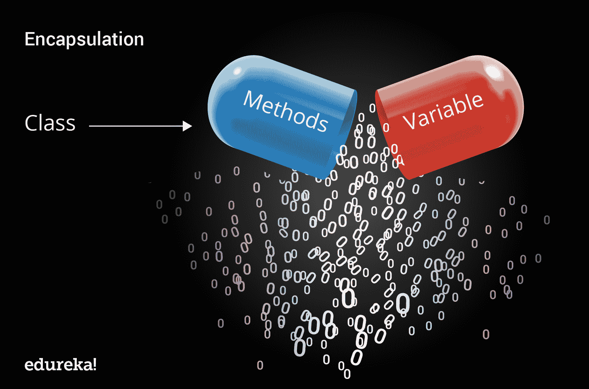

# Java 中的封装——如何掌握封装 OOPs？

> 原文：<https://www.edureka.co/blog/encapsulation-in-java/>

面向对象编程或更广为人知的 OOPs 是 Java 的主要支柱之一，它充分利用了其强大的功能和易用性。要成为一名专业的 Java 开发人员，你必须对各种各样的 [**Java OOPs 概念**](https://www.edureka.co/blog/object-oriented-programming/) 如[继承](https://www.edureka.co/blog/inheritance-in-java/)、[抽象](https://www.edureka.co/blog/java-abstraction/)、封装和多态有一个完美的控制。通过这篇文章，我将让你全面了解 OOPs 的一个最重要的概念，即 Java 中的封装，以及它是如何实现的。

以下是我将在本文中讨论的主题:

*   [封装介绍](#Introduction)
*   [为什么我们在 Java 中需要封装？](#NeedforEncapsulation)
*   [封装的好处](#Benefits)
*   [一个实时例子](#Real-time-example)

*你也可以浏览一下 [OOPs Concepts](https://www.edureka.co/blog/cheatsheets/java-oop-cheat-sheet/) 的录音，在录音中你可以通过例子详细理解主题。*

[//www.youtube.com/embed/7GwptabrYyk](//www.youtube.com/embed/7GwptabrYyk)

## **封装介绍**

封装是指将数据封装在一个单元中。它是绑定代码和它所操作的数据的机制。考虑封装的另一种方式是，它是一个保护屏障，防止数据被屏障外的代码访问。在这种情况下，[类](https://www.edureka.co/blog/java-tutorial/#obj)的变量或数据对任何其他类都是隐藏的，只能通过声明它们的类的任何成员函数来访问。

现在，让我们以医用胶囊为例，药物在胶囊内始终是安全的。同样，通过封装，一个类的方法和变量被很好地隐藏和安全。

Java 中的封装可以通过:实现

*   将类的变量声明为私有。
*   提供公共的 setter 和 getter 方法来修改和查看变量值。

现在，让我们看看代码，以便更好地理解封装:

```
public class Student {
private String name;
public String getName() {
return name;
}
public void setName(String name) {
this.name = name;
}
}
class Test{
public static void main(String[] args) {
Student s=new Student();
s.setName("Harry Potter");
System.out.println(s.getName());
}
}

```

正如你在上面的代码中看到的，我创建了一个 class Student，它有一个私有的[变量](https://www.edureka.co/blog/java-tutorial/#variables)名字**。**接下来，我创建了一个 getter 和 setter 来获取和设置学生的名字。在这些方法的帮助下，任何希望访问 name 变量的类都必须使用这些 getter 和 setter 方法。

现在让我们再看一个例子，深入理解封装。在本例中，Car 类有两个字段——name 和 topSpeed。这里，两者都被声明为 private，这意味着不能在类外部直接访问它们。我们有一些 getter 和 setter 方法，如 getName、setName、setTopSpeed 等。，并且它们被声明为公共的。这些方法对“外人”公开，可用于从 Car 对象中更改和检索数据。我们有一个方法来设置车辆的最高速度，有两个 getter 方法来检索最大速度值(MPH 或 KMHt)。所以基本上，这就是封装的作用——它隐藏了实现，给了我们想要的值。现在，让我们看看下面的代码。

```
package Edureka;     
public class Car {
private String name;
private double topSpeed;
public Car() {}
public String getName(){
return name; 
}
public void setName(String name){
this.name= name;
}
public void setTopSpeed(double speedMPH){
 topSpeed = speedMPH;
}
public double getTopSpeedMPH(){
return topSpeed;
}    
public double getTopSpeedKMH(){
return topSpeed*1.609344;   
}
}

```

这里，主程序创建一个具有给定名称的汽车对象，并使用 setter 方法存储该实例的最高速度。通过这样做，我们可以很容易地获得以英里/小时或 KMH 为单位的速度，而不用关心速度在汽车类中是如何转换的。

```
package Edureka;
public class Example{
public static void main(String args[])
Car car =new Car();
car.setName("Mustang GT 4.8-litre V8");
car.setTopSpeed(201);
System.out.println(car.getName()+ " top speed in MPH is " + car.getTopSpeedMPH());
System.out.println(car.getName() + " top speed in KMH is " + car.getTopSpeedKMH());

```

S o，这就是 Java 中封装的实现方式。现在，让我们进一步看看为什么我们需要封装。

## **为什么我们在 Java 中需要封装？**

封装在 Java 中是必不可少的，因为:

*   控制数据访问的方式
*   根据需求修改代码
*   帮助我们实现松散耦合
*   简化了我们的应用
*   它还允许你在不破坏程序中任何其他功能或代码的情况下修改部分代码

现在，让我们考虑一个说明封装必要性的小例子。

```
class Student {
int id;
String name;
}
public class Demo {
public static void main(String[] args) {
Student s = new Student();
s.id = 0;
s.name="";
s.name=null;
}
}

```

在上面的例子中，它包含两个实例变量作为访问修饰符。因此，同一个包中的任何类都可以通过创建该类的对象来分配和更改这些变量的值。因此，我们无法控制作为变量存储在 Student 类中的值。为了解决这个问题，我们封装了学生类。


因此，这些是描述封装需求的几个要点。现在，让我们看看封装的一些好处。

## **封装的好处**

现在我们已经了解了封装的基础知识，让我们深入到本文的最后一个主题，借助一个实时示例详细了解封装。

## **一个实时封装的例子**

让我们考虑一个电视例子，并理解内部实现细节是如何对外部类隐藏的。 基本上，在这个例子中，我们通过盖子向外界隐藏了内部代码数据，即电路。现在在 [Java](https://www.edureka.co/blog/java-tutorial/) 中，这可以在访问修饰符的帮助下实现。访问修饰符设置类、构造函数变量等的访问或级别。正如您在下面的代码中看到的，我使用了 private access 修饰符来限制类的访问级别。声明为 private 的变量只能在 Television 类中访问。

```
public class Television{
private double width;
private double height;
private double Screensize;
private int maxVolume;
print int volume;
private boolean power;
public Television(double width, double height, double screenSize)
{
this.width=width;
this.height=height;
this.screenSize=ScreenSize;
}
public double channelTuning(int channel){
switch(channel){
case1: return 34.56;
case2: return 54.89;
case3: return 73.89;
case1: return 94.98;
}return 0;
}
public int decreaseVolume(){
if(0<volume) volume --;
return volume;
}
public void powerSwitch(){
this.power=!power;
}
public int increaseVolume(){
if(maxVolume>volume) volume++;
return volume;
}
}
class test{
public static void main(String args[]){
Television t= new Television(11.5,7,9);
t.powerSwitch();
t.channelTuning(2);
t.decreaseVolume();
t.increaseVolume();
television.width=12; // Throws error as variable is private and cannot be accessed outside the class
}
}

```

在上面的例子中，我将所有的变量声明为私有，将方法、构造函数和类声明为公共。在这里，构造函数和方法可以在类外部访问。当我创建 一个电视类的对象 时，它可以访问该类中的方法和构造函数，而用私有访问修饰符声明的变量是隐藏的。这就是为什么当你试图访问上面例子中的 ***宽度变量*** 时，会抛出 错误 。这就是对其他类隐藏内部实现细节的方式。Java 就是这样实现封装的。

这就把我们带到了“Java 中的封装”这篇文章的结尾。希望，你发现它信息丰富，有助于增加你的知识价值。如果你希望了解更多关于 Java 的知识，可以参考 [**高级 Java 教程。**](https://www.edureka.co/blog/advanced-java-tutorial)

*既然你已经理解了“什么是 Java 中的封装”，那就来看看 Edureka 的 [**Java 认证课程**](https://www.edureka.co/java-j2ee-training-course)* *，edu reka 是一家值得信赖的在线学习公司，拥有遍布全球的 250，000 多名满意的学习者。Edureka 的 Java J2EE 和 SOA 培训和认证课程是为想成为 Java 开发人员的学生和专业人士设计的。该课程旨在为您提供 Java 编程的良好开端，并训练您掌握核心和高级 Java 概念以及各种 Java 框架，如 Hibernate & Spring。*

*有问题吗？请在“Java 封装”博客的评论部分提到它，我们会尽快回复您。*