# 2023 年你必须知道的顶级深度学习面试问题

> 原文：<https://www.edureka.co/blog/interview-questions/deep-learning-interview-questions/>

[深度学习](https://www.edureka.co/blog/what-is-deep-learning)是 2019-20 年最热门的话题之一，理由很充分。在工业中已经有了如此多的进步，其中机器或计算机程序实际上代替人类的时代已经到来。[人工智能](https://www.edureka.co/blog/what-is-artificial-intelligence)到 2020 年将创造 230 万个工作岗位，为了破解这些工作面试，我提出了一套深度学习面试问题。也可以去看看 Edureka 的[深度学习课程](https://www.edureka.co/ai-deep-learning-with-tensorflow)，更好的了解这个领域。我将本文分为两个部分:

*   [基础深度学习面试问题](#basic)
*   [进阶深度学习面试问题](#advance)

## 基础深度学习面试问题

**Q1。区分 AI、机器学习和深度学习。**

人工智能是一种使机器能够模仿人类行为的技术。

机器学习是人工智能技术的一个子集，它使用统计方法使机器能够随着经验而改进。


深度学习是 ML 的一个子集，它使得多层神经网络的计算成为可能。它使用神经网络来模拟类似人类的决策。

**Q2。你觉得深度学习比机器学习好吗？如果有，为什么？**

虽然传统的最大似然算法解决了我们的许多情况，但它们在处理高维数据时没有用，因为在高维数据中我们有大量的输入和输出。例如，在手写识别的情况下，我们有大量的输入，其中我们将有与不同类型的手写相关联的不同类型的输入。

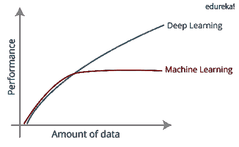

第二个主要挑战是告诉计算机它应该寻找哪些特征，这些特征将在预测结果中发挥重要作用，并在这样做的同时实现更好的准确性。

**Q3。什么是感知器？它是如何工作的？**

如果我们关注生物神经元的结构，它有用来接收输入的树突。这些输入在细胞体中相加，并通过轴突传递给下一个生物神经元，如下所示。


*   **树突:**接收来自其他神经元的信号
*   **单元格体:** 将所有输入相加
*   **轴突:** 它用来向其他细胞传递信号

类似地，感知器接收多个输入，应用各种变换和功能，并提供输出。感知器是用于二元分类的线性模型。它模拟了一个有一组输入的神经元，每个输入都有一个特定的权重。神经元对这些加权输入计算一些函数，并给出输出。

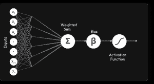

**Q4。** **权数和偏见的作用是什么？**

对于感知器来说，还可以有一个称为**偏差**的输入。虽然权重决定了分类器线的**斜率**，但偏差允许我们向左或向右移动线。通常偏差被视为另一个输入值为 x <sub>0 的加权输入。</sub>

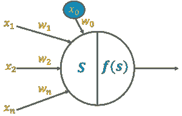

**Q5。** **有哪些激活功能？**

激活功能将输入转化为输出。激活函数通过计算加权和并进一步加上偏差来决定一个神经元是否应该被激活。激活函数的目的是将非线性引入神经元的输出。

可以有许多激活功能，如:

*   线性或恒等式
*   单位或二进制步长
*   乙状结肠或逻辑
*   双曲正切
*   热卢
*   Softmax

**Q6。** **解释感知器的学习。**

1.  初始化权重和阈值。
2.  提供输入并计算输出。
3.  更新权重。
4.  重复步骤 2 和 3


**Wj(t+1)–更新权重****Wj(t)–旧权重****d–期望输出****y–实际输出****x–输入**

**Q7。** **成本/损失函数的意义是什么？**

成本函数**是神经网络相对于给定训练样本和预期输出的准确度**的度量。它从整体上提供了神经网络的性能。在深度学习中，目标是最小化成本函数。为此，我们使用梯度下降的概念。

**Q8。** **什么是梯度下降？**

[梯度下降](https://en.wikipedia.org/wiki/Gradient_descent)是一种优化算法，用于通过沿梯度负值定义的最陡下降方向迭代移动来最小化某个函数。

**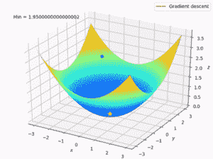**

**随机梯度下降:**仅使用单个训练样本计算梯度并更新参数。

**批量梯度下降:**计算整个数据集的梯度，每次迭代只执行一次更新。

**小批量梯度下降:**小批量梯度是随机梯度下降的变体，其中使用小批量样本而不是单个训练样本。这是最流行的优化算法之一。

**Q9。小批量梯度下降有什么好处？**

*   与随机梯度下降相比，这更有效。
*   寻找平坦极小值的推广。
*   小批量允许帮助近似整个训练集的梯度，这有助于我们避免局部最小值。


**Q10。使用梯度下降算法的步骤是什么？**

*   初始化随机权重和偏差。
*   通过网络传递输入并从输出层获取值。
*   计算实际值和预测值之间的误差。
*   转到造成误差的每个神经元，然后改变其各自的值以减小误差。
*   反复进行，直到找到网络的最佳权重。

**Q11。在 python 中创建渐变下降。**

```

params = [weights_hidden, weights_output, bias_hidden, bias_output]

def sgd(cost, params, lr=0.05):

grads = T.grad(cost=cost, wrt=params)
updates = []

for p, g in zip(params, grads):
updates.append([p, p - g * lr])

return updates

updates = sgd(cost, params)

```

**Q12。单层感知器有哪些缺点？**

嗯，有两个主要问题:

*   单层感知器无法对非线性可分离数据点进行分类。
*   单层感知器无法解决涉及大量参数的复杂问题

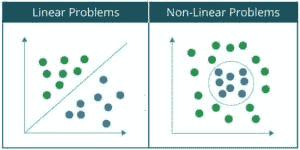

**Q13。什么是多层感知器**

多层感知器(MLP)是一种深度的人工神经网络。它由一个以上的感知器组成。它们由接收信号的输入层、对输入做出决策或预测的输出层以及这两层之间任意数量的隐藏层组成，这些隐藏层是 MLP 的真正计算引擎。

**Q14。多层感知器有哪些不同的部分？**

**输入节点**:输入节点向网络提供来自外界的信息，统称为“输入层”。任何输入节点都不执行任何计算——它们只是将信息传递给隐藏节点。

**隐藏节点:**隐藏节点执行计算并将信息从输入节点传输到输出节点。隐藏节点的集合形成了“隐藏层”。虽然网络只有一个输入图层和一个输出图层，但它可以有零个或多个隐藏图层。

**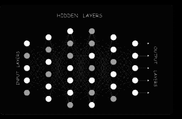**

**输出节点:**输出节点统称为“输出层”，负责计算和从网络向外界传递信息。

**Q15。什么是数据规范化，我们为什么需要它？**

数据标准化是非常重要的预处理步骤，用于重新调整值以适应特定范围，以确保反向传播过程中更好的收敛性。一般来说，它归结为减去每个数据点的平均值，然后除以其标准差。

这些是一些基本的深度学习面试问题。现在，让我们继续一些高级的。

## 预先面试问题

**Q16。深层网络和浅层网络哪个更好？为什么呢？**

无论是浅网络还是深网络，都能够逼近任何函数。但重要的是这个网络在获取结果方面有多精确。浅层网络只能处理少数特征，因为它无法提取更多特征。但是深度网络通过高效计算和对更多特征/参数的工作而深入。

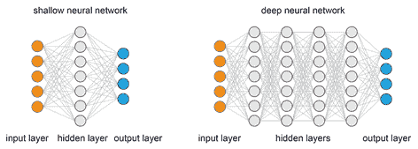

**Q17。为什么权重初始化在神经网络中很重要？**

重量初始化是非常重要的步骤之一。不好的权重初始化会阻止网络学习，但是好的权重初始化有助于给出更快的收敛和更好的总体误差。

偏差通常可以初始化为零。设置权重的规则是接近零，但不要太小。

**Q18。前馈神经网络和反向传播神经网络有什么区别？**

前馈神经网络是一种神经网络结构，其中连接是“前馈的”，即不形成循环。当你在输入层输入一些东西，它从输入层传到隐藏层，又从隐藏层传到输出层时，也使用术语“前馈”。

反向传播是由两个步骤组成的训练算法:

*   前馈值。
*   计算误差并将其传播回先前的层。

因此，准确地说，前向传播是反向传播算法的一部分，但在反向传播之前。

**Q19。什么是 hper 参数？举出几个用于任何神经网络的例子。**

超参数是决定网络结构的变量(例如:隐藏单元的数量)和决定如何训练网络的变量(例如:学习速率)。训练前设置超参数。

*   隐藏层数
*   网络权重初始化
*   激活功能
*   学习率
*   动力
*   时代数
*   批量

**Q20。解释与网络和培训相关的不同超参数。**

**网络超参数**

**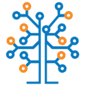**

**隐藏层数:**使用正则化技术的一层内的许多隐藏单元可以增加精确度。数量较少的单元可能会导致不合适。

**网络权重初始化:**理想情况下，根据各层上使用的激活函数，采用不同的权重初始化方案可能会更好。通常使用均匀分布。

**激活函数:**激活函数用于将非线性引入模型，允许深度学习模型学习非线性预测边界。

**训练超参数**

****

**学习率:**学习率定义了网络更新其参数的速度。低学习率会减慢学习过程，但会平滑收敛。较大的学习速率加快了学习速度，但可能不会收敛。

**动量:**动量有助于用前几步的知识知道下一步的方向。它有助于防止振荡。动量的典型选择在 0.5 到 0.9 之间。

**历元数:**历元数是训练时整个训练数据展示给网络的次数。增加历元数，直到验证精度开始下降，即使训练精度在增加(过拟合)。

**批量大小:**最小批量大小是在参数更新发生后给网络的子样本数量。批量大小的一个好的默认值可能是 32。也可以尝试 32、64、128、256 等等。

**Q21。什么是辍学？**

Dropout 是一种正则化技术，用于避免过度拟合，从而提高泛化能力。一般来说，我们应该使用 20%-50%的神经元的小丢弃值，其中 20%提供了一个好的起点。过低的概率影响最小，过高的值导致网络学习不足。

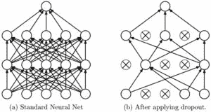

使用更大的网络。当在更大的网络上使用 dropout 时，您可能会获得更好的性能，从而为模型提供更多学习独立表示的机会。

**Q22。在训练神经网络时，您会注意到在开始的几个时期中，损失并没有减少。原因可能是什么？**

其原因可能是:

*   学习率低
*   正则化参数高
*   陷入局部最小值

**Q23。说出几个深度学习框架**

*   TensorFlow
*   咖啡
*   微软认知工具包/CNTK
*   Torch/PyTorch
*   MXNet
*   链条机
*   Keras

**Q24。张量是什么？**

张量只不过是深度学习中表示数据的事实。它们只是多维数组，允许你表示更高维的数据。一般来说，深度学习处理高维数据集，其中维度指的是数据集中存在的不同特征。

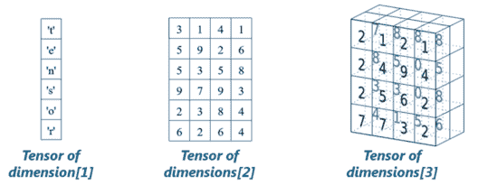

**Q25。列举几个 TensorFlow 的优点？**

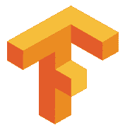

*   它具有平台灵活性
*   对于分布式计算，它很容易在 CPU 和 GPU 上进行训练。
*   TensorFlow 具有自动微分功能
*   它具有对线程、异步计算和队列的高级支持。
*   它是一个可定制的开源软件。

**Q26。什么是计算图？**

计算图是在图中作为节点排列的一系列张量流运算。每个节点接受零个或多个张量作为输入，并产生一个张量作为输出。

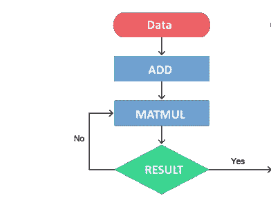

基本上，人们可以将计算图视为一种替代方式，将张量流程序中发生的数学计算概念化。分配给计算图的不同节点的操作可以并行执行，从而在计算方面提供更好的性能。

**Q27。什么是 CNN？**

卷积神经网络(CNN，或 ConvNet)是一类深度神经网络，最常用于分析视觉图像。与输入是矢量的神经网络不同，这里的输入是多通道图像。CNN 使用各种多层感知器，设计用于要求最少的预处理。

**Q28。解释 CNN 的不同层次。**

在卷积神经网络中，我们应该理解四个分层概念:

**卷积:**卷积层由一组独立的滤波器组成。所有这些滤波器都是随机初始化的，并成为我们的参数，这些参数随后将被网络学习。

**ReLu:** 该层与卷积层一起使用。

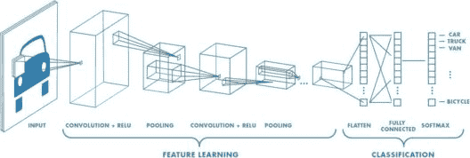

**池化:**其作用是逐步减少表示的空间大小，以减少网络中的参数和计算的数量。池图层独立操作每个要素地图。

**完全连接:**完全连接层中的神经元与前一层中的所有激活具有完全连接，如在常规神经网络中所见。因此，它们的激活可以通过矩阵乘法以及随后的偏置偏移来计算。

**Q29。什么是 RNN？**

递归网络是一种人工神经网络，用于识别数据序列中的模式，如文本、基因组、手写、口语、数字时间序列数据。递归神经网络使用**反向传播**算法进行训练，因为它们有**内部存储器**，RNN 能够记住关于它们接收到的输入的重要事情，这使它们能够非常精确地预测接下来会发生什么。

**Q30。训练 RNN 时会面临哪些问题？**

递归神经网络使用反向传播算法进行训练，但它适用于每个时间戳。它通常被称为通过时间 (BTT)的**反向传播。**

反向传播存在一些问题，例如:

*   消失梯度
*   爆炸梯度

**Q31。什么是消失渐变？这有什么危害？**

当我们进行反向传播时，随着我们在网络中不断向后移动，梯度会变得越来越小。这意味着与层级中较后层的神经元相比，较前层的神经元学习非常慢。

网络中的早期层非常重要，因为它们负责学习和检测简单模式，并且实际上是我们网络的构建模块。


显然，如果它们给出不正确和不准确的结果，那么我们怎么能期望下一层和整个网络良好地执行并产生准确的结果。训练过程耗时太长，模型的预测精度会下降。

**Q32。什么是爆炸梯度下降？**

当大的误差梯度累积并导致训练期间神经网络模型权重的非常大的更新时，爆炸梯度是一个问题。

当这些更新小且受控时，梯度下降过程工作得最好。当梯度的幅度累积时，可能会出现不稳定的网络，这可能会导致结果预测不佳，甚至导致模型报告任何有用的东西。

**Q33。解释 LSTM 的重要性。**

长短期记忆(LSTM)是一种用于深度学习领域的人工递归神经网络架构。与标准的前馈神经网络不同，LSTM 有反馈连接，使其成为“通用计算机”。它不仅可以处理单个数据点，还可以处理整个数据序列。

它们是一种特殊的递归神经网络，能够学习长期相关性。

**Q34。胶囊神经网络中的胶囊是什么？**

[胶囊](https://www.edureka.co/blog/capsule-networks/)是指定对象特征及其可能性的向量。这些特征可以是任何实例化参数，如位置、大小、方向、变形、速度、色调、纹理等等。

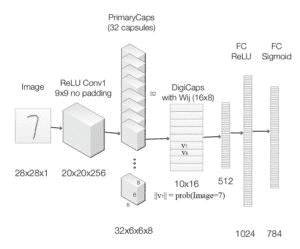

胶囊还可以指定其属性，如角度和大小，以便它可以表示相同的通用信息。现在，就像神经网络有多层神经元一样，胶囊网络也可以有多层胶囊。

现在，让我们继续这个深度学习面试问题，并转移到自动编码器和 RBM 部分。

**Q35。解释自动编码器及其用途。**

[自动编码器](https://www.edureka.co/blog/autoencoders-tutorial/)神经网络是一种无监督的机器学习算法，它应用反向传播，将目标值设置为等于输入。自动编码器用于将我们的输入缩减为更小的表示形式。如果有人需要原始数据，他们可以从压缩数据中重建它。


**Q36。在降维方面，Autoencoder 与 PCA 有何不同？**

*   自动编码器可以利用非线性激活函数和多层来学习非线性变换。
*   它不需要学习密集的层。它可以使用卷积层来学习视频、图像和系列数据哪个更好。
*   用自动编码器学习几个层比用 PCA 学习一个巨大的变换更有效。
*   自动编码器提供每一层的表示作为输出。
*   它可以利用来自另一个模型的预训练层来应用转移学习以增强编码器/解码器。


**Q37。给出一些可以应用自动编码器的真实例子。**

**图像着色:**自动编码器用于将任何黑白图片转换成彩色图像。根据图片中的内容，可以判断出应该是什么颜色。

**特征变化:**它只提取图像所需的特征，并通过去除任何噪声或不必要的干扰来生成输出。

**维数减少:**重建的图像与我们的输入相同，但是维数减少了。它有助于提供像素值减少的类似图像。

**去噪图像:**自动编码器看到的输入不是原始输入，而是随机破坏的版本。去噪自动编码器因此被训练来从有噪声的版本中重建原始输入。

**Q38。自动编码器有哪些不同的层次？**

自动编码器由三层组成:

*   编码器
*   密码
*   解码器


**Q39。解释自动编码器的架构。**

**编码器:**这部分网络将输入压缩成潜在空间表示。编码器层将输入图像编码为降维的压缩表示。压缩图像是原始图像的失真版本。

**代码:**这部分网络代表输入解码器的压缩输入。

**解码器:**该层将编码后的图像解码回原始维度。解码图像是原始图像的有损重建，并且是从潜在空间表示中重建的。

**Q40。autoencoder 的一个瓶颈是什么，为什么使用它？**

编码器和解码器之间的层，即。该代码也被称为瓶颈。这是一个设计良好的方法，用于确定观察数据的哪些方面是相关信息，哪些方面可以丢弃。


它通过平衡两个标准来做到这一点:

*   表示的紧密度，以可压缩性来衡量。
*   它保留了输入中的一些行为相关变量。

**Q41。自动编码器有什么变化吗？**

*   卷积自动编码器
*   稀疏自动编码器
*   深度自动编码器
*   收缩自动编码器

**Q42。什么是深度自动编码器？**

简单自动编码器的扩展是深度自动编码器。深度自动编码器的第一层用于原始输入中的一阶特征。第二层用于对应于一阶特征外观中的图案的二阶特征。深度自动编码器的更深层倾向于学习甚至更高阶的特征。

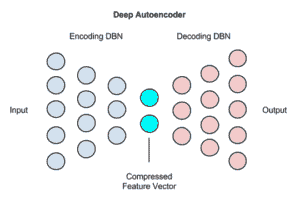

深度自动编码器由两个对称的深度信任网络组成:

*   前四或五个浅层代表网络的编码部分。
*   构成解码一半的第二组四或五层。

**Q43。什么是受限玻尔兹曼机？**

[受限玻尔兹曼机](https://www.edureka.co/blog/restricted-boltzmann-machine-tutorial/)是一种无向的图形模型，在近一段时间的深度学习框架中起着主要作用。这是一种算法，可用于降维、分类、回归、协同过滤、特征学习和主题建模。

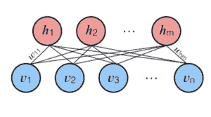

**Q44。RBM 与自动编码器有何不同？**

Autoencoder 是一个简单的 3 层神经网络，其中输出单元直接连接回输入单元。通常，隐藏单元的数量比可见单元的数量少得多。训练的任务是最小化误差或重构，即找到输入数据的最有效的紧凑表示。


RBM 也有类似的想法，但它使用具有特定分布的随机单元，而不是确定性分布。训练的任务是找出这两组变量实际上是如何相互联系的。

RBM 区别于其他自动编码器的一个方面是**它有两个偏差**。**隐藏偏差**帮助 RBM 在向前传球时产生激活，而**可见层的偏差**帮助 RBM 在向后传球时学习重建。

现在，进入这个“深度学习面试问题”系列的最后一个问题。

**Q45。深度学习有哪些局限性？**

*   深度学习通常需要大量的训练数据。
*   深度神经网络很容易被忽悠。
*   深度学习的成功纯粹是经验性的，深度学习算法被批评为无法解释的“黑箱”。
*   到目前为止，深度学习还没有与先前的知识很好地结合。

所以，到此为止，我们来结束这篇深度学习面试问题的文章。我希望这组问题足以解决任何深度学习面试，但如果你申请任何特定的工作，那么你也需要对该行业有良好的了解，因为这些工作大多是针对专家的。

*您还可以查看 Edureka 的 [**深度学习课程**](https://www.edureka.co/ai-deep-learning-with-tensorflow)* *，edu reka 是一家值得信赖的在线学习公司，拥有超过 250，000 名满意的学习者，遍布全球。该认证培训由行业专业人士根据行业要求&的需求进行策划。您将掌握 SoftMax 函数、Autoenc 或神经网络、受限玻尔兹曼机(RBM)等概念，并使用 Keras & TFLearn 等库。*

*有问题吗？请在评论区提到它，我们会给你回复。*