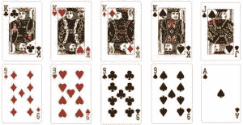

# 谷歌数据科学面试问题:破解它所需要知道的一切

> 原文：<https://www.edureka.co/blog/google-data-science-interview-questions/>

被像谷歌这样的全球知名公司聘用是很多人的梦想工作。他们拥有一些世界上最有才华的人工智能研究科学家、[数据工程师](https://www.edureka.co/blog/big-data-engineer-skills/)和[数据科学家](https://www.edureka.co/blog/who-is-a-data-scientist/)。谷歌**数据科学**面试问题在线来源不多，在那里找工作也不容易。报名参加 Edureka 的[Python 数据科学课程](https://www.edureka.co/data-science-python-certification-course)，提升您的职业生涯。

因此，我将在本文中讨论以下主题:

*   [工作描述及要求](#jd-requirements)
*   [谷歌数据科学面试流程](#interview-process)
*   [谷歌数据科学面试问题](#interview-questions)

## **工作描述及要求**

With an average salary of **$169,067**, including bonus. A Google Data Scientist’s Salary ranges from **$120,000 – $280,000**. With this high salary, you need to know the right requirements for the Job you are applying. Although the requirements vary from position to position, Below are some of the common ones:

**最低要求:**

*   数量学科硕士学位(统计学、运筹学、计算机科学)
*   2 年数据分析相关领域的工作经验
*   使用统计软件的经验(例如， [R](https://www.edureka.co/blog/r-tutorial/) 、 [Python](https://www.edureka.co/blog/python-tutorial/) 、MATLAB、Pandas)和
*   数据库语言经验(例如， [SQL](https://www.edureka.co/blog/mysql-tutorial/) )

**职责:**

*   处理大型复杂的数据集。解决困难的非常规分析问题，根据需要应用先进的分析方法
*   进行分析，包括数据收集和需求规格、处理、分析、持续交付和演示
*   反复构建分析管道并制作原型，以提供大规模洞察
*   开发全面的谷歌数据结构和度量知识，倡导产品开发所需的变革
*   跨职能互动，提出业务建议(例如，成本效益、预测、实验分析)
*   研究和开发分析、预测和优化方法，以提高谷歌面向用户的产品质量

## **谷歌数据科学面试流程**

Clearing the shortlist is itself a tough task, which entirely depends on your **CV, Cover Letter,** and **Experience**. Google [Data Science](https://www.edureka.co/blog/what-is-data-science/) Interview Questions are a mixture of Brainteasers and Technical Queries. Usually, the first process is Telephonic Interview.

### **电话采访:**

It consists of Questions mostly based on [**Probability**](https://www.edureka.co/blog/math-and-statistics-for-data-science/) (concrete and theoretical) and heavily based on [**Machine Learning**](https://www.edureka.co/blog/introduction-to-machine-learning/). The questions also vary based on the projects you have worked on.

*   **案例 1:** 访谈询问了特征提取技术、主成分分析(在项目中使用)、相关性分析、使用的一些分类技术(SVM、GBM、神经网络)。为什么不是逻辑回归，为什么是 GBM？-基本上是围绕类可分性的问题。

*   **案例二:**为什么要用特征选择？如果两个预测因子高度相关，对逻辑回归中的系数有什么影响？系数的置信区间是多少？

*   **案例 3:** 一张光盘在主轴上旋转，你不知道光盘旋转的方向。我们为您提供了一套 pin 码。您将如何使用图钉来描述光盘的旋转方式？

After the Telephonic Interviews, it’s the Face to Face and Coding Rounds. So, Let’s Discuss some of the most common Google Data Science Interview Questions. Although these questions may not be asked exactly as given below, I’ve tried to cover a lot of them.

## **谷歌数据科学面试问题**

These questions are not puzzlers, as Google has stopped asking those questions instead, they have similar questions which they call **Problem-Solving Questions**. A lot of Machine Learning Questions, all the way from generic to the practical ones are asked. Google [Data Science Interview Questions](https://www.edureka.co/blog/data-science-interview-questions/) basically covers the breadth of topics rather than Depth.**Q1.** You are at a Casino and have two dices to play with. You win $10 every time you roll a 5\. If you play till you win and then stop, what is the expected payout?**Q2.** You are about to get on a plane to London, you want to know whether you have to bring an umbrella or not. You call three of your random friends and as each one of them if it’s raining. The probability that your friend is telling the truth is 2/3 and the probability that they are playing a prank on you by lying is 1/3\. If all 3 of them tell that it is raining, then what is the probability that it is actually raining in London.**Q3.** How would add new [Facebook](https://www.facebook.com/) members to the database of members, and code their relationships to others in the database?**Q4.** How will you test that there is an increased probability of a user to stay active after 6 months given that a user has more friends now?**Q5.** You are given 40 cards with four different colors- 10 Green cards, 10 Red Cards, 10 Blue cards, and 10 Yellow cards. The cards of each color are numbered from one to ten. Two cards are picked at random. Find out the probability that the cards picked are not of the same number and same color.**Q6.** Create a program in a language of your choice to read a text file with various tweets. The output should be 2 text files-one that contains the list of all unique words among all tweets along with the count for repeated words and the second file should contain the medium number of unique words for all tweets.**Q7.** What will you do if removing missing values from a dataset cause bias?**Q8.** A disc is spinning on a spindle and you don’t know the direction in which way the disc is spinning. You are provided with a set of pins. How will you use the pins to describe in which way the disc is spinning?**Q9.** How will you design a recommendation engine for jobs?**Q10.** What kind of product do you want to build at Google?**Q11.** Cars are implanted with speed tracker so that the insurance companies can track about our driving state. Based on this new scheme what kind of business questions can be answered?**Q12.** How can you decide if one algorithm is better than the other?**Q13.** A box has 12 red cards and 12 black cards. Another box has 24 red cards and 24 black cards. You want to draw two cards at random from one of the two boxes, which box has a higher probability of getting cards of the same color and why?**Q14.** What is the difference between a bagged model and a boosted model?**Q15.** You are creating a report for user content uploads every month and observe a sudden increase in the number of upload for the month of January. The increase in uploads is, particularly in image uploads. What do you think will be the cause for this and how will you test this sudden spike?**Q16.** You own a clothing enterprise and want to improve your place in the market. How will you do it from the ground level?**Q17.** How will you decide which versions of the two of the Surge Pricing Algorithms is working better for any Aviation Company?**Q18.** What is the degree of freedom for lasso?**Q19.** What is the difference between an iterator, generator and list comprehension in Python?**Q20.** Given a set of webpages and changes on the website, how will you test the new website feature to determine if the change works positively?**Q21.** Given an MxN dimension matrix with each cell containing an alphabet, find if a string is contained in it or not.**Q22.** How will you build a caching system using an advanced data structure like hashmap?**Q23.** If you could get the dataset on any topic of interest, irrespective of the collection methods or resources then how would the dataset look like and what will you do with it?**Q24.** What are anomaly detection methods?**Q25.** How does caching work and how do you use it in Data science?So guys, with this we come to an end to this article. Google Data Science Interview Questions are mostly **scenario based** and require you do have **Problem Solving abilities** and moreover you need to know how to apply Data Science to these situations. I hope this will give you a perspective to be prepared for any Data Science Interview in the future. Be it Google, Microsoft, Apple or Uber. All the tech Giants ask similar types of Questions when it comes to Data Science as it is a vast and at the same time a new field.Check out this video to prepare for Data Science Interview.[https://www.youtube.com/embed/tTAieUcNHdY](https://www.youtube.com/embed/tTAieUcNHdY)***[Data Science Masters Program](https://www.edureka.co/masters-program/data-scientist-certification)** makes you proficient in the tools and systems used by Data Science Professionals. It includes training on Statistics, Data Science, Python, Apache Spark & Scala, Tensorflow and Tableau. The curriculum has been determined by extensive research on 5000+ job descriptions across the globe. If you have any queries, feel free to mention in the comment section below.*Also, If you are looking for online structured training in Data Science, edureka! has a specially curated [Data Science Course](https://www.edureka.co/executive-programs/advanced-program-data-science-course-iitg) that helps you gain expertise in Statistics, Data Wrangling, Exploratory Data Analysis, and Machine Learning Algorithms like K-Means Clustering, Decision Trees, Random Forest, and Naive Bayes. You’ll also learn the concepts of Time Series, Text Mining, and an introduction to Deep Learning. New batches for this course are starting soon!!