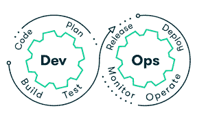
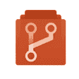
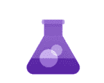
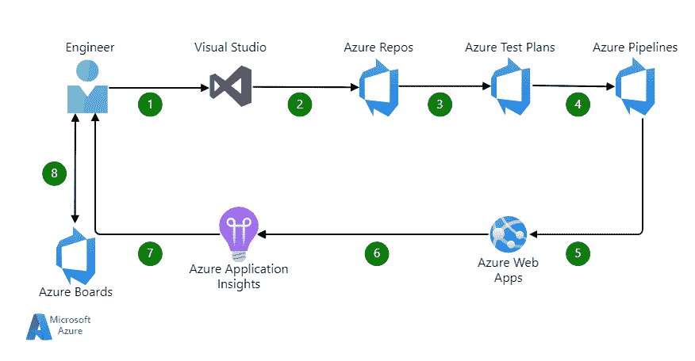
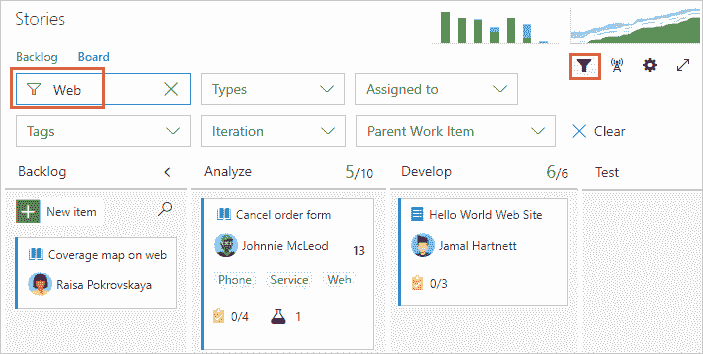
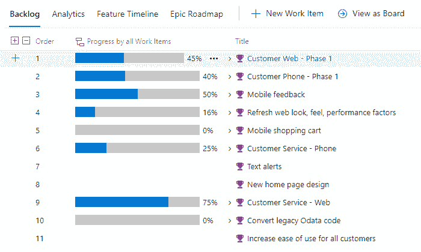

# Azure DevOps 教程:为什么要在 Azure 上使用 DevOps？

> 原文：<https://www.edureka.co/blog/azure-devops/>

DevOps 非常重视改善开发人员和系统管理员之间的沟通和信任。因此，公司能够更好地将技术项目与业务需求相匹配。整个团队开始理解所实现的变更通常是微小的和可逆的。

DevOps 被描绘成一个无尽的循环，包括以下步骤:计划、编码、构建、测试、发布、部署、操作、监控，然后回到计划，等等。

DevOps 是当前的需要，许多组织都希望采用这种方法来使他们的业务更好地运行。Azure 是领先的云服务提供商之一，支持一套强大的 **DevOps** 服务。这篇关于 Azure DevOps 的文章帮助你解开使用 Azure 的 DevOps 的实现。你可以通过 [Azure DevOps 课程](https://www.edureka.co/microsoft-azure-devops-solutions-training)了解更多。

我们将在这里讨论以下指针:

1.  [什么是 Azure？](#WhatisAzure?)
2.  [什么是 DevOps？](#WhatisDevOps?)
3.  [为什么要去找 Azure DevOps？](#Why)
4.  [Azure devo PS](#ComponentsofAzureDevOps)的组件
5.  [使用 Azure DevOps 创建 CI/CD 管道](#Pipeline)
6.  [Azure DevOps 最佳实践](#Best)

让我们开始吧，

## **什么是 Azure？**

提供不同服务来满足云计算需求的公司被称为云服务提供商。在各种云服务提供商或供应商中有 ***微软 Azure*** 。

[***微软 Azure***](https://www.edureka.co/blog/microsoft-azure-tutorial) 是由**微软的开发者和 IT 专业人士打造的云计算平台。**它让您能够通过其遍布全球的数据中心网络构建、部署和管理应用。

这些是微软 Azure 影响的一些核心服务领域。那些是:

*   计算
*   存储
*   联网
*   数据库
*   监控

现在让我们继续这个 Azure DevOps 博客来了解什么是 DevOps？

## **什么是 DevOps？**

根据定义，

DevOps 是整合开发人员和运营团队以提高协作和生产力的过程。这是通过自动化工作流和生产效率来持续测量应用程序性能实现的。

对于初学者来说，这个定义可能看起来模糊不清，因为这里有许多无法解释的术语，让我们先试着去理解它们。

更快的软件部署交付已经成为时代的需要。因为现在的软件市场是不稳定的，你需要保持更新，确保你交付最好的和最新的软件，这可以通过持续的交付和集成来实现。这就是软件开发人员和系统管理员的角色变得非常重要的地方。对微软 Azure 的进一步了解可以从 [Azure 认证](https://www.edureka.co/microsoft-certified-azure-solution-architect-certification-training)中获得。

软件开发人员是开发软件的人。他们必须确保软件具有以下参数:

*   新功能
*   安全升级
*   Bug 修复

然而，开发商必须考虑“上市时间”,时间限制迫使他重新调整其活动，如:

*   待定代码
*   旧代码
*   新产品
*   新功能

这是当产品投入生产环境时会发生的情况，它可能会出现一些不可预见的错误。这是因为在开发环境中编写的代码可能不同于生产环境。

现在让我们从运营商的角度来看同一个场景:

这个团队负责维护，以确保软件在生产环境中有适当的运行时间。随着软件开发需求的不断增长，管理员或操作员被迫并行管理许多服务器。

现在，用于管理早期数量的服务器的工具可能不足以管理数量不断增长的服务器。运营团队对代码做了一些小的修改，这样它就可以像在开发环境中一样很好地适应生产环境。因此，需要正确安排这些部署以避免延迟。

当代码被部署时，操作者的责任进一步增加，他们需要管理代码变更和错误(如果有的话)。有时，开发人员似乎把他们的责任强加给了运营方。这就是问题所在，如果这些团队能够合作，很多问题都会像他们一样得到解决:

*   可能会打破筒仓
*   分担责任
*   开始思维一致
*   团队合作

这就是 DevOps 所做的，它把这两个团队带到一个屋檐下。现在，我相信我们在本节开始时看到的定义更有意义。

现在让我们看看是什么让 Azure 非常适合使用 DevOps，又是什么让 Azure DevOps 成为一个好的选择？

## **为什么要去找蔚蓝 DevOps？**

我们都知道 Azure 是领先的云服务提供商，并且绝对是当前的需求。Azure 的以下特性确保 DevOps 以最佳方式实现:

#### **催化云发展**

现在，您可以更少地担心创建管道，专注于软件开发。无论是处理管道、创建新管道还是管理现有管道，Azure 都提供了端到端的解决方案，从而加快了软件开发的进程。

#### **更好的可靠性和持续集成**

现在，您不必担心管理安全性和基础设施，可以将更多精力放在开发创新解决方案上。有了 Azure 和它支持的 CI/CD，你可以像代码一样利用和使用基础设施，这些代码拥有像 Azure Resource manager 或 Terraform 这样的工具，这些工具可以帮助你创建可重复的部署，同时满足合规性标准。

#### **自由定制**

随着 Azure 为你的软件开发提供端到端的解决方案，你可以自由地使用你选择的工具，因为 Azure 很容易与市场上的大多数工具相结合，从而使定制和实验更容易。

以上原因使得 Azure 成为 DevOps 的高度兼容和首选。现在让我们来了解一下是什么让 Azure DevOps 成为一个很好的组合。

## **Azure devo PS的组件**

以下是 Azure DevOps 组件:

*   管道
*   电路板
*   神器
*   休息
*   测试计划

获得 [Azure 云工程师认证](https://www.edureka.co/masters-program/azure-cloud-engineer-certification-training)是深入了解 Azure 的最佳途径。让我们逐一了解:

#### **天蓝色管道**

那么什么是 Azure 管道呢？简而言之，它是一个由 Azure 平台支持的管道，在这里你可以不断地构建、测试和部署应用程序。

#### **湛蓝色棋盘**

如果你有多个团队在一个项目上工作，这些团队需要更好地沟通。Azure 板确保更好的工作跟踪。让您处理积压工作，并确保创建出色自定义报告。要了解更多信息，请立即查看我们的 [Azure DevOps 在线课程](https://www.edureka.co/microsoft-azure-devops-solutions-training)。

#### **天蓝色神器**

Azure 使你能够创建、托管以及在你的团队中共享包。Azure 中的构件确保您的管道完全集成了包管理。这可以通过简单的点击来实现。您还可以创建 Maven、npm 和 NuGet 包。在这里，团队规模并不重要。

#### **【蓝色休息】**

  把它想象成一个家或一个储存库。它为您提供无限的云托管的私有 Git 存储库。您可以将您的更改拉、推和提交到这些存储库中。

#### **天蓝色测试计划**

它为您提供了一个完整的工具包来执行端到端的手动和探索性测试，确保您的软件功能正常。

## **示例实现:使用 Azure DevOps 创建 CI/CD 管道**

这是一个为 CI/CD 创建渠道的架构设计提供建议的场景。下面的示例采用了一个两层的 web 应用程序，该应用程序通过一个持续集成和部署管道被部署到 **Azure DevOps** 和相关服务，如 App Service。利用这种策略可以让您专注于应用程序开发，而不是基础设施管理。

以下数据流是场景的一部分:

1.  开发人员对应用程序的源代码进行了更改。
2.  开发人员将 web 配置文件和应用程序代码添加到 Azure Repos 源代码库中。
3.  持续集成系统使用 Azure 测试计划来启动应用构建过程和执行单元测试。
4.  使用适合环境的配置变量，Azure Pipelines 的连续部署组件自动部署应用程序构件。
5.  工件通过管道发送到 App 服务。
6.  Application Insights 收集并检查有关应用性能、运行状况和使用情况的信息。
7.  应用程序信息由开发团队管理和监控。
8.  为了对 Azure Boards 的 bug 修复和新特性进行优先排序，团队参考了 backlog。

## **Azure DevOps 最佳实践**

以下最佳实践有助于最大限度地发挥 Azure DevOps 的功能。

#### **组织项目团队**

每个团队都可以使用 Azure Boards 提供的工具来计划和监控进度。它提供了特定于功能的团队，并为每个项目设置了默认团队。通过清楚地定义团队，每个项目团队可以在促进协作的同时独立运作。

#### **建立冲刺**

项目的 sprint 步调，通常是一到四周，由项目团队使用 sprint 来定义，sprint 是使用迭代路径建立的。发布管道层次结构与 sprints 兼容。每个 sprint 都是一个特定团队负责在指定的截止日期前完成的任务。企业应该建立整个团队都能遵守的现实的冲刺时间表，最少六次修改(例如，六个月的计划)。

#### **支持标签搜索和过滤**

项目团队可以应用特定的工作项标签，允许团队成员搜索工作项，并根据标签过滤公告板和积压工作。应通过标签提供一般使用说明。

这里是一个看板的图片，它显示了带有“web”标签的东西，这要感谢 Web 关键字过滤器。

形象: **蔚蓝**

组织应该制定政策，规定团队应该如何使用标签。这些标签有助于识别团队之间的相互依赖，并且可以促进过滤和报告。

#### 浏览功能板。

特性委员会审查开发运维团队和经理有办法评估项目的状态，并保证稳定的交付流。使用特性 backlog，您可以快速直观地跟踪变更。

这里有一个功能板的例子，它增加了“进行中”栏，以显示设计、开发和将功能部署到生产的许多阶段。

形象: **蔚蓝**

通过配置项目交付计划，多个团队可以使用交互板审查共享项目的特性。组织可以自定义功能板，以支持特定于团队的工作流。观众可以根据特征、特定的冲刺等缩小他们对标签项目的关注。使用过滤器功能。功能 backlog 的汇总列可以用来跟踪项目的整体开发。

## 利用现有工作管理系统将 **迁移** 或 **整合**

大量现有的工作管理解决方案可以与 Azure DevOps 工具链接:

这是关于 Azure 组件的。如果你想了解更多关于 Azure DevOps 的信息，并想知道如何开发 CI/CD 管道，那么你可以参考下面的视频:

## **Azure DevOps 教程|在 Azure 上开发 CI/ CD 管道| edu reka**

[https://www.youtube.com/embed/Ce08Sp9g_JI?rel=0&showinfo=0](https://www.youtube.com/embed/Ce08Sp9g_JI?rel=0&showinfo=0)*This Edureka “Azure DevOps” video will give you a thorough and insightful overview of Microsoft Azure and the DevOps approach and help you create a CI/CD pipeline using Microsoft Azure.*

伙计们，这就是我们关于 Azure DevOps 的这篇文章的结尾。同样，如果您对 AWS 感兴趣，并希望将您在 AWS DevOps 方面的专业知识提升到一个新的水平，并获得该领域的认证，那么您可能希望看看 Edureka 在 DevOps 举办的关于“AWS 认证 DevOps 工程师”的[专业证书课程，该课程专门帮助个人获得该领域的专业知识。](https://www.edureka.co/executive-programs/purdue-devops)

如果您有任何疑问，可以在下面的评论区提出，我们会尽快回复。