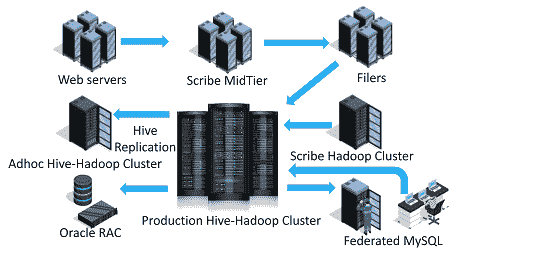
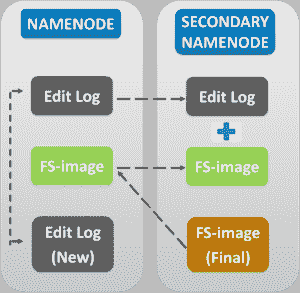
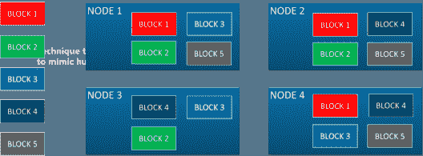
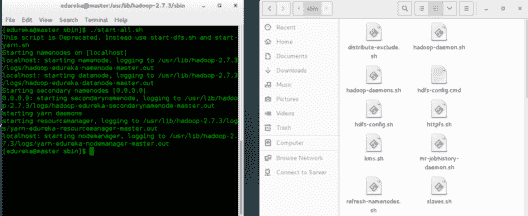
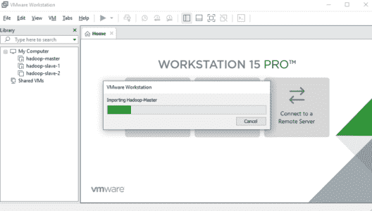
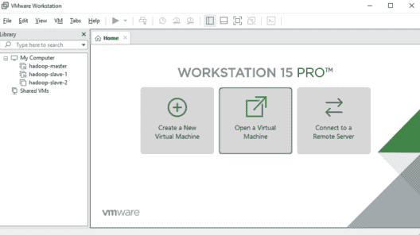
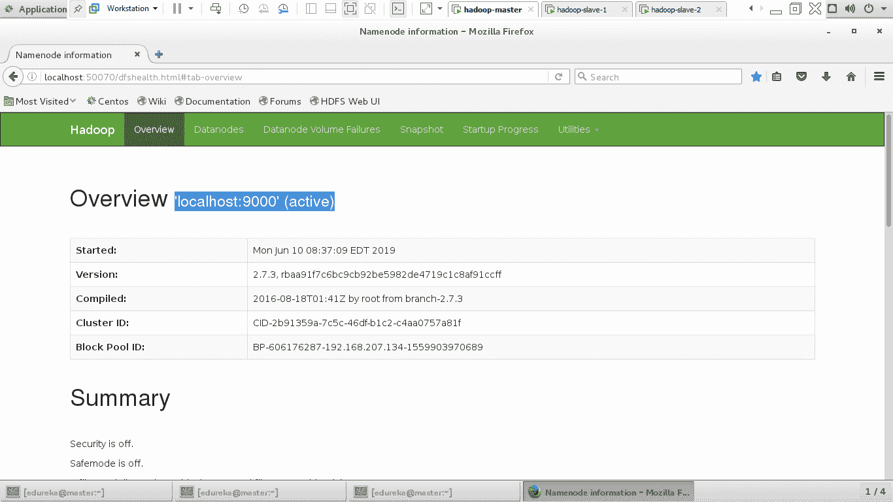
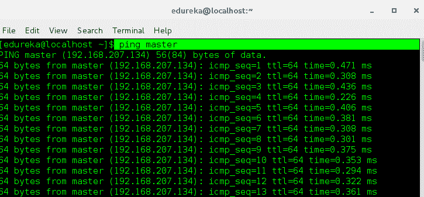
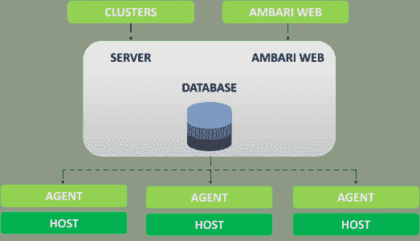
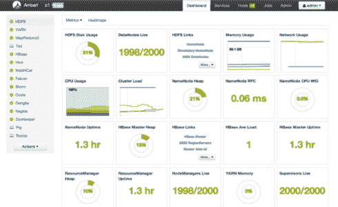

# Hadoop 集群:所有您需要知道的指南

> 原文：<https://www.edureka.co/blog/hadoop-clusters>

[**Hadoop 集群**](https://www.edureka.co/big-data-and-hadoop?gclid=EAIaIQobChMI-oO_oozh4gIVSAoqCh21HQAQEAAYAiAAEgJeVvD_BwE) ，一个非凡的计算系统，旨在**存储**，**优化**，**分析**Pb 级数据，具有惊人的**敏捷性**。在本文中，我将解释我们主题的重要概念，到本文结束时，您将能够自己建立一个 Hadoop 集群。

我把这篇文章的摘要排列如下:

*   [什么是 Hadoop 集群？](#hadoop-cluster)
*   [Hadoop 集群的优势](#advantages)
*   [脸书的 Hadoop 集群](#facebook)
*   [Hadoop 集群架构](#cluster-architecture)
*   [搭建 Hadoop 集群。](#set-up)
*   [Hadoop 集群管理系统](#ambari)

## **什么是 Hadoop 集群？**

在进入我们的话题之前，让我们先了解一下基本的**计算机** **集群**到底是什么。

一个**簇**基本上意味着它是一个**集合**。计算机集群也是相互连接的计算机的集合，这些计算机有足够的能力**相互通信**，并作为一个**单个** **单元**处理给定的任务。

同样，Hadoop 集群是一种特殊类型的计算集群，旨在执行大数据分析以及存储和管理大量数据。它是一个由**个商品** **个硬件**相互连接并作为一个**单个** **单元**共同工作的集合。

它基本上有一个**主人**和无数的**奴隶。**主人给奴隶分配任务，并指导奴隶执行任何特定的任务。

现在我们知道了什么是 Hadoop 集群，让我们了解一下它相对于其他类似数据处理单元的**优势**。

## **Hadoop 集群的优势**

一些主要的**优势**如下:

*   **可扩展**
*   **性价比**
*   **灵活**
*   **快**
*   **故障恢复能力**

**可扩展:** [**Hadoop**](https://www.edureka.co/blog/hadoop-tutorial/) 是一个漂亮的存储平台，具有无限的**可扩展性**。与 [**RDBMS**](https://www.edureka.co/blog/mysql-tutorial/) 相比，Hadoop 存储网络只需添加额外的商用硬件即可扩展。 **Hadoop** 可以在数千台计算机上运行**业务应用**并处理数 Pb 的数据。

**经济高效:**传统的数据存储单元有很多局限性，主要局限与**存储有关。Hadoop 集群**通过其分布式存储拓扑彻底克服了这一问题。存储不足可以通过向系统添加额外的存储单元来解决。

**灵活:**灵活是 **Hadoop 集群的主要优势。**Hadoop 集群可以处理任何类型的数据，无论是**结构化、半结构化**还是完全非结构化**。**这使得 Hadoop 能够直接处理来自社交媒体的多种类型的数据。

**快速:** Hadoop 集群可以在几分之一秒内处理数 Pb 的数据。这之所以成为可能，是因为 Hadoop 的高效数据 [**映射能力**](https://www.edureka.co/blog/mapreduce-tutorial/) 。数据处理工具在所有的**服务器**上总是可用的。即:**数据处理**工具在存储所需**数据**的同一单元上可用。

**故障恢复能力:Hadoop 集群中的数据丢失**是一个**神话。**在 Hadoop 集群中几乎不可能丢失数据，因为它遵循 [**数据复制**](https://www.edureka.co/blog/hdfs-tutorial) ，在**节点出现故障时充当备份存储单元。**

现在，让我们继续下一个话题，它与**脸书的 Hadoop 集群有关。**

## **脸书的 Hadoop 集群**

以下是关于脸书 Hadoop 集群的几个重要事实

*   自从 2004 年推出以来，**脸书**是**Hadoop 集群最大的**用户之一。
*   它被称为最强大的 **Hadoop 集群。**
*   它大约使用 **4000** 台机器，能够一起处理**百万千兆字节**。
*   **脸书**拥有**23.8 亿**数量的**活跃用户。**

为了管理如此庞大的网络，**脸书**使用分布式存储框架，数百万开发人员用多种语言编写 [**MapReduce**](https://www.edureka.co/blog/videos/mapreduce-tutorial/) 程序。它还使用了 [**SQL**](https://www.edureka.co/blog/mysql-tutorial/) ，从**数据入库**到**视频**和**图像** **分析，极大地改进了**搜索、日志处理、推荐系统**的流程。**

脸书通过鼓励所有可能的集群更新而日益发展。

****

**卡珊德拉和蜂巢**

**[Cassandra](https://www.youtube.com/watch?v=y-ZqjhvFUhc)** 被开发用于在 Hadoop 集群上执行查询，而 [**Hive**](https://www.edureka.co/blog/hive-tutorial/) 通过使用 **SQL** 的子集改进了 **Hadoop** 的**查询能力**。

今天，由于拥有超过 25 亿活跃用户的大量数据，脸书成为了世界上最大的公司之一。

**脸书 Hadoop 集群**的概况如上图所示。现在让我们转到 **Hadoop 集群的**架构**。**

## **Hadoop 集群架构**

Hadoop 的 [**架构** **由以下**组件组成:****](https://www.edureka.co/blog/introduction-of-hadoop-architecture/)

1.  **HDFS**
2.  **纱线**

**HDFS** 由以下部件组成:

**名称节点:名称节点**负责运行**主守护进程。**存储**元数据**。**名称节点**遇到客户端对数据的请求，然后将请求传输到存储实际数据的数据节点。它负责管理所有**数据节点的**健康**。**

**数据节点:数据节点**被称为名字节点的**从节点**，负责**存储**实际数据，并以**心跳的形式向名字节点更新**任务状态**和**健康状态**。**

**次名节点:****次名节点**实际上并不是**名节点**的备份，而是作为**缓冲区**，保存在中间进程中获得的对 **FS-image** 的最新更新，并更新到 **FinalFS-image。**

**纱线**由以下单元组成:

**节点管理器:**它是一个 **Java 实用程序**，作为一个独立于 **WebLogic Server** 的进程运行，允许您执行受管服务器的常见操作任务，而不管它相对于其**管理服务器的位置。**

**App Master:** 负责**资源** **管理器**和**节点管理器之间的资源协商。**

**容器:**它实际上是**资源管理器**分配的**资源**预留量的集合，用于完成**节点管理器分配的任务。**

现在，我们将了解一下 **Hadoop 集群架构**的概况，然后我们将了解一下**复制因子**和**机架感知算法**

**Hadoop** 中默认的**复制因子**为 **3** ，如上图所述，每个内存块复制 **3** 次**次**。

**机架感知算法**完全是关于**数据存储。**

它说**实际**数据的第一个**副本**必须位于**本地机架**上，其余的**副本**将存储在不同的**远程机架上。**

让我们看看下面的**图**以便更好地理解它。

至此，我们完成了**理论**部分，现在让我们进入**实践**部分，在这里我们将学习建立一个 **Hadoop** 集群，其中有**一个主服务器**和**两个从服务器。**

## **设置 Hadoop 集群。**

在开始使用 Hadoop 集群之前，我们需要确保满足设置 Hadoop 集群的先决条件。

先决条件如下:

*   [**厘斯**](https://wiki.centos.org/Download)
*   [**Java**](https://www.edureka.co/blog/java-tutorial/)
*   [**Hadoop**](https://www.edureka.co/blog/videos/hadoop-tutorial/)

万一你没有安装 Hadoop，那么你可以参考 [**Hadoop 安装博客。**](https://www.edureka.co/blog/setting-up-a-multi-node-cluster-in-hadoop-2.X) 我们按照以下步骤建立一个 **Hadoop 集群**，有一个**主**和两个**从。**

**第一步:[下载 VM 工作站](https://www.vmware.com/in/products/workstation-player.html)** **15** 并安装在你的**主机**上

**步骤 2:浏览您的文件系统**并选择您的主机系统中已有的**虚拟机 CentOS** 。

**第三步:**接受**条款和条件**，开始使用您的**虚拟 Linux 操作系统。**

**第四步:**按照相同的**程序**设置**从机**。一旦**虚拟操作系统**被加载，你的**工作站界面**看起来**如下图**。

**第五步:**启动你的**主**和所有的**从**，然后在所有机器上打开一个**新终端**，检查机器的 **IP 地址**。你可以使用下面的代码来检查你的 **IP 地址。**

**主机的 IP 地址**

**从机 1 的 IP 地址**

**从机 2 的 IP 地址**

**步骤 6:** 一旦你确定了你的机器的 **IP 地址**，下一步将是**将它们配置**为主和从**。**可以通过如下方式编辑主机来完成。

一旦**主**和**从**被设置，让我们启动所有的**守护进程**并启动本地主机来检查 **HDFS 网络用户界面。**

为了**启动**所有的**守护进程，**你必须从 **sbin 文件夹**中打开**终端**，如下图所示。sbin 文件夹的位置是:

**usr/lib/Hadoop-2 . 7 . 0/sbin**

一旦终端在 **sbin** 文件夹中打开，使用 **start-all.sh** 命令启动所有的**守护进程。**

一旦所有的**守护进程**被启动，让我们检查一下 **HDFS 网络用户界面。**

**步骤 7:** 现在让我们试着**与**主**和**从**通信**，向它们中的每一个发送 **ping** 。

**主机 ping 从机 1 和从机 2**

**从设备 1 pinging 主设备**

**从-2 查验主设备**

现在，我们已经完成了我们的**演示会议，**现在让我们了解一下**管理**一个 **Hadoop** **集群。**

## Ambari:Hadoop 集群管理系统

*   Hadoop 既是一个**命令行接口**，也是一个 **API。**
*   它不需要任何专门用于**管理**和**监控**设施的工具。
*   有一些**选项**可用，例如:
    1.  [**安巴里**](https://ambari.apache.org/)
    2.  [**HortonWorks**](https://hortonworks.com/)

**Ambari** 可以定义为一个**开源管理工具**，它在中扮演着**的关键**角色，跟踪**正在运行的应用**及其**状态**也就是我们所说的 **Apache Ambari。**基本上，它部署在 **Hadoop** **集群之上。**

遵循 Ambari 的**架构**

现在让我们看看典型的 **Ambari 用户界面**是什么样子的。

到此，我们来结束这篇文章**。**我希望我已经向您展示了一些关于 **Hadoop** 和 **Hadoop 集群**的知识，我希望您能够创建自己的 Hadoop 集群，并且能够自己管理它。

*现在，您已经了解了 Hadoop 集群及其特性，请查看 Edureka 提供的 **[Hadoop 培训](https://www.edureka.co/big-data-hadoop-training-certification)*** *，edu reka 是一家值得信赖的在线学习公司，拥有遍布全球的 250，000 多名满意的学习者。Edureka 大数据 Hadoop 认证培训课程使用零售、社交媒体、航空、旅游和金融领域的实时用例，帮助学员成为 HDFS、Yarn、MapReduce、Pig、Hive、HBase、Oozie、Flume 和 Sqoop 领域的专家。*