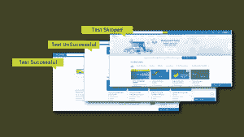
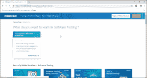
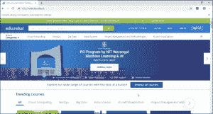
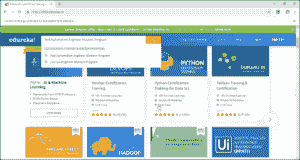

# 关于 Selenium 中的侦听器，您需要了解的一切

> 原文：<https://www.edureka.co/blog/listeners-in-selenium/>

当您在 Java 中使用多个函数时，您可能需要将数据从一个函数传递到另一个函数。类似地，当您试图测试多个网页时，您可能需要将数据从一个网页传递到另一个网页。Selenium 提供了各种与网页交互的功能。一种这样的交互是使用监听器完成的。通过[硒培训](https://www.edureka.co/selenium-certification-training)了解更多信息。

以下是我们将在博客中涉及的话题:

*   [什么是听众？【T2](#Whatarelisteners?)
*   [听众类型](#Types_of_listeners)

那么，让我们从了解 Selenium 中的侦听器开始，

**Selenium 中的监听器:什么是监听器？**

让我这样解释一下。听众基本上是那些有能力收听特定事件的人。它被定义为修改系统行为的接口。监听器允许定制报告和日志。



为了更好地了解听众如何在中工作，我们需要了解它的主要类型。那么，让我们在下一个主题中看看有哪些不同类型的听众。

## **硒中监听器:监听器类型**

Listeners mainly comprise of two types, namely

1.  网络驱动监听器
2.  测试监听器

所以，首先让我们了解一下什么是 WebDriver 监听器。

**监听器类型:WebDriver 监听器**

WebDriverEventListener 接口允许*实现*方法和类，如 *WebDriverEventListener* 和 *EventFiringWebDriver。*

我们来详细了解一下

***WebDriverEventListener***

*   这是一个包含一些预定义方法的接口。这些 Webdriver 事件有助于查看[***web driver***](https://www.edureka.co/blog/selenium-tutorial)触发的事件。
*   它在分析结果中起着重要的作用，如果我们遇到任何问题，它可以帮助我们调试。
*   它能够跟踪不同的事件，如“导航前”、“导航后”、“点击前”、“点击后”等等。

让我们看看如何在 Selenium WebDriver 脚本中实现监听器。

**第一步:**创建一个类“ *EventCapture* ”来实现 *WebDriverEventListener* 方法

```

package listeners;

public class EventCapture{

}

package listeners;

public class EventCapture implements WebDriverEventListener{

}

```

**第二步:**创建另一个类 *ListenerMainClass* 并编写脚本

**第三步:**在类 *ListenerMainClass* 中创建 *EventFiringWebDriver* 对象，并将 Driver 对象作为参数传递

```
 EventFiringWebDriver eventHandler = new EventFiringWebDriver(driver); 
```

**第四步:***listener main Class*下，创建一个类的对象 *EventCapture* 来实现 *WebDriverEventListener* 的所有方法向*EventFiringWebDriver*注册

```
EventCapture eCapture = new EventCapture();
```

现在让我们看看如何实现 WebDriver 事件监听器。

在这种情况下，我们将尝试自动化我们的官方网页*“edu reka . co”*以了解 WebDriver 事件监听器如何工作

*   首先，创建一个实现 WebDriverEventListener 的类 *EventCapture* 。
*   添加有助于轻松执行的不同方法。
*   afterChangeValueOf()方法在每次需要返回元素被改变或修改后的值时被调用
*   覆盖有助于从派生类的基类中调用函数的方法。

```

import org.openqa.selenium.By;
import org.openqa.selenium.WebDriver;
import org.openqa.selenium.WebElement;
import org.openqa.selenium.support.events.WebDriverEventListener;
//WebDriver Event Listeners
public class EventCapture implements WebDriverEventListener{

 public void afterChangeValueOf(WebElement arg0, WebDriver arg1) {
 // TODO Auto-generated method stub

 }

 @Override
 public void afterClickOn(WebElement arg0, WebDriver arg1) {
 // TODO Auto-generated method stub

 }

 @Override
 public void afterFindBy(By arg0, WebElement arg1, WebDriver arg2) {
 // TODO Auto-generated method stub

 }

 @Override
 public void afterNavigateBack(WebDriver arg0) {
 // TODO Auto-generated method stub

 }

 @Override
 public void afterNavigateForward(WebDriver arg0) {
 // TODO Auto-generated method stub

 }

 @Override
 public void afterNavigateTo(String arg0, WebDriver arg1) {
 // TODO Auto-generated method stub

 }

 public void beforeChangeValueOf(WebElement arg0, WebDriver arg1) {
 // TODO Auto-generated method stub

 }

 @Override
 public void beforeClickOn(WebElement arg0, WebDriver arg1) {
 // TODO Auto-generated method stub

 }

 @Override
 public void beforeFindBy(By arg0, WebElement arg1, WebDriver arg2) {
 // TODO Auto-generated method stub

 }

 @Override
 public void beforeNavigateBack(WebDriver arg0) {
 // TODO Auto-generated method stub

 }

 @Override
 public void beforeNavigateForward(WebDriver arg0) {
 // TODO Auto-generated method stub

 }

 @Override
 public void beforeNavigateRefresh(WebDriver arg0) {
 // TODO Auto-generated method stub

 }

 @Override
 public void beforeNavigateTo(String arg0, WebDriver arg1) {
 // TODO Auto-generated method stub

 }

 @Override
 public void onException(Throwable arg0, WebDriver arg1) {
 // TODO Auto-generated method stub

 }

@Override
public void afterAlertAccept(WebDriver arg0) {
	// TODO Auto-generated method stub

}

@Override
public void afterChangeValueOf(WebElement arg0, WebDriver arg1, CharSequence[] arg2) {
	// TODO Auto-generated method stub

}

@Override
public void beforeAlertAccept(WebDriver arg0) {
	// TODO Auto-generated method stub

}

@Override
public void beforeAlertDismiss(WebDriver arg0) {
	// TODO Auto-generated method stub

}

@Override
public void beforeChangeValueOf(WebElement arg0, WebDriver arg1, CharSequence[] arg2) {
	// TODO Auto-generated method stub

}

@Override
public void afterAlertDismiss(WebDriver arg0) {
	// TODO Auto-generated method stub

}

@Override
public void beforeScript(String arg0, WebDriver arg1) {
	// TODO Auto-generated method stub

}

@Override
public void afterNavigateRefresh(WebDriver arg0) {
	// TODO Auto-generated method stub

}

@Override
public void afterScript(String arg0, WebDriver arg1) {
	// TODO Auto-generated method stub

} 

}

```

一旦完成，我们需要一个主类来执行在 *EventCapture* 程序中声明的方法的动作。

*   用浏览器驱动实例化 WebDriver 实例，[***chrome driver***](https://www.edureka.co/blog/selenium-chromedriver-and-geckodriver/)
*   创建 *EventFiringWebDriver* 的一个对象，命名为*eventHandler*
*   声明 JavaScriptExecutor，它在执行 selenium 脚本时充当接口
*   创建事件的对象*捕获*并*注册*事件
*   获取网页的 URL:eventhandler . navigate()。to(" https://www . edu reka . co/blog/")；
*   使用 JavaScriptExecutor 在网页上执行滚动等操作
*   使用 [***元素定位器、***](https://www.edureka.co/blog/locators-in-selenium/)LinkText找到网页上的元素
*   使用 *EventFiringWebDriver* 的对象导航到一个新页面:eventHandler.navigate()。to(" https://www . edu reka . co/all-courses ")；
*   然后导航回第一页
*   使用命令 eventHandler.quit()退出驱动程序执行；
*   注销事件捕获的对象，*取消捕获*


```

import org.openqa.selenium.By;
import org.openqa.selenium.JavascriptExecutor;
import org.openqa.selenium.WebDriver;
import org.openqa.selenium.chrome.ChromeDriver;
import org.openqa.selenium.support.events.EventFiringWebDriver;

public class ListenerMainClass {

public static void main (String [] args) throws InterruptedException{
System.setProperty("webdriver.chrome.driver", "C:UsersVaishnaviDesktopChromechromedriver.exe");
WebDriver driver = new ChromeDriver();
JavascriptExecutor js = (JavascriptExecutor)driver;
EventFiringWebDriver eventHandler = new EventFiringWebDriver(driver);
EventCapture eCapture = new EventCapture();
//Registering with EventFiringWebDriver
//Register method allows to register our implementation of WebDriverEventListner to listen to the WebDriver events
eventHandler.register(eCapture);
//navigating to the webpage "www.edureka.co"
eventHandler.navigate().to("https://www.edureka.co/blog/");
js.executeScript("window.scrollBy(0,400)");
Thread.sleep(3000);
eventHandler.findElement(By.linkText("Software Testing")).click();
//navigating to the webpage "www.edureka.co/all-courses/"
eventHandler.navigate().to("https://www.edureka.co/all-courses");
//navigating back to the first page
eventHandler.navigate().back();
eventHandler.quit();
//Unregister allows to detach
eventHandler.unregister(eCapture);
System.out.println("End of Listners Class");
}
}

```

现在让我们看看这个程序的输出是什么。

首先，它会导航到网页 www.edureka.co/blog


接下来，向下滚动页面


然后搜索软件测试链接并点击链接



在此之后，暂停执行几秒钟，并导航回上一个网页


这是你需要知道的关于网络驱动监听器的一切

现在，让我们了解一下 TestNG 监听器中发生了什么

## **TestNG 监听器**

[***TestNG***](https://www.edureka.co/blog/selenium-webdriver-tutorial)可以在听者的帮助下听出我们所说的话。侦听器给了我们改变默认 TestNG 行为的灵活性。

*   TestNG 监听器正式称为 ITestListener，是 TestNG 中的一个接口。
*   一个普通的 Java 类实现 ITestListener 并覆盖所有写在里面的相应方法。
*   每种方法归结为一个事件各自的 [***硒项目***](https://www.edureka.co/blog/selenium-projects/)

现在让我们来理解几个有助于轻松执行的函数

**ITestListener** :这个函数首先调用 onStart()方法并运行脚本。以类似的方式，在一个 suite 完成执行后，它再次调用 onFinish()方法，并在测试前后进行调用。它有七种方法。 **OnStart** :测试开始时调用该方法。**OnTestSuccess**:此方法在任何测试成功时调用。**on test failure**:该方法在任何测试失败时调用。**onTestSkipped**:当测试被跳过时调用此方法**onTestFailedButWithinSuccessPercentage**:每次测试失败但在成功百分比内时调用此方法。**on finish**:该方法在所有测试执行完毕后调用。

了解了这一点，让我们来看看实现过程

既然这样，我们就测试一下我们的官网*edureka.co*

**步骤 1)** :创建实现‘ITestListener’的类‘listener test’。添加相应的方法，如 OnStart()、OnTestSuccess()等

**步骤 2)** :为流程自动化创建另一个类“测试用例”。 [***硒***](https://www.edureka.co/blog/selenium-webdriver-architecture/) 将执行这个‘测试用例’来成功运行测试脚本。

**步骤 3)** :接下来，在常规类中实现这个监听器，即“TestCases”。有一种方法可以连接到类和接口。这是通过使用监听器注释实现的。

```

import org.testng.ITestContext;
import org.testng.ITestListener;
import org.testng.ITestResult;

public class ListenerTest implements ITestListener
{

@Override
public void onFinish(ITestContext Result)
{

}

@Override
public void onStart(ITestContext Result)
{

}

@Override
public void onTestFailedButWithinSuccessPercentage(ITestResult Result)
{

}

// When Test case get failed, this method is called.
@Override
public void onTestFailure(ITestResult Result)
{
System.out.println("The name of the testcase failed is :"+Result.getName());
}

// When Test case get Skipped, this method is called.
@Override
public void onTestSkipped(ITestResult Result)
{
System.out.println("The name of the testcase Skipped is :"+Result.getName());
}

// When Test case get Started, this method is called.
@Override
public void onTestStart(ITestResult Result)
{
System.out.println(Result.getName()+" test case started");
}

// When Test case get passed, this method is called.
@Override
public void onTestSuccess(ITestResult Result)
{
System.out.println("The name of the testcase passed is :"+Result.getName());
}

}

```

**步骤 4):** 执行*测试用例*类。“ListenerTest”类中的所有方法都是根据它们的行为和注释为@Test 的方法自动调用的。

```
[java]
import org.openqa.selenium.By;
import org.openqa.selenium.JavascriptExecutor;
import org.openqa.selenium.WebDriver;
import org.openqa.selenium.chrome.ChromeDriver;
import org.testng.Assert;
import org.testng.annotations.Listeners;
import org.testng.annotations.Test;

@Listeners(ListenerTest.class)

public class TestCases {
public WebDriver driver;

//Test to pass as to verify listeners.
@Test
public void Login() throws Exception
{
System.setProperty("webdriver.chrome.driver", "C:UsersVaishnaviDownloadschromedriver_win32 (2)chromedriver.exe");
driver = new ChromeDriver();
driver.get("https://www.edureka.co/");
JavascriptExecutor js = (JavascriptExecutor) driver;
driver.manage().window().maximize();
driver.findElement(By.cssSelector("#search-inp")).sendKeys("Test Automation Engineer Masters Program");
driver.findElement(By.className("typeahead__button")).click();
js.executeScript("window.scrollBy(0,500)");
Thread.sleep(3000);
js.executeScript("window.scrollBy(0,700)");
Thread.sleep(4000);
js.executeScript("window.scrollBy(0,700)");
Thread.sleep(4000);
}

//Forcefully failed this test as verify listener.
@Test
public void TestToFail()
{
System.out.println("This method to test fail");
Assert.assertTrue(false);
}
}
[/java]
```

**步骤 5):** 验证输出。

首先，它会得到网页的网址

## ****

找到搜索框并发送文本

## ****

无法点击搜索图标。向下滚动网页

## ****

**Selenium 中的监听器|如何在 Selenium 中实现 testNG 监听器| Edureka**


[//www.youtube.com/embed/LnDhm9zFag4?rel=0&showinfo=0](//www.youtube.com/embed/LnDhm9zFag4?rel=0&showinfo=0)

这个关于“Selenium 中的听众”的视频帮助您了解 Selenium 如何提供帮助收听网页上发生的任何事件的功能。

现在让我们进入最后一个话题，即 WebDriver 监听器和 TestNG 监听器的主要区别是什么

【WebDriver 和 TestNG 监听器的区别

<caption> </caption>
| TestNG 监听器 | **WebDriver 监听器** |
| 用于生成测试报告。帮助捕捉屏幕截图。 | 执行类似 TestNG 监听器的工作，如登录和报告，但处理不同的事件 |

*至此，我们结束了这个“Selenium 中的听众”的博客。我希望你们喜欢这篇文章，并且理解 Selenium 中的侦听器是什么。*

*现在您已经了解了 TestNG 监听器和 WebDriver 监听器在 Selenium 中是如何工作的，请查看 Edureka 的 **[Selenium 认证课程](https://www.edureka.co/selenium-certification-training)** ，edu reka 是一家值得信赖的在线学习公司，在全球拥有超过 650，000 名满意的学习者。本课程旨在向您介绍完整的 Selenium 特性及其在软件测试中的重要性。有问题吗？请在“Selenium 中的听众”的评论部分提到它，我们会回复您。*

