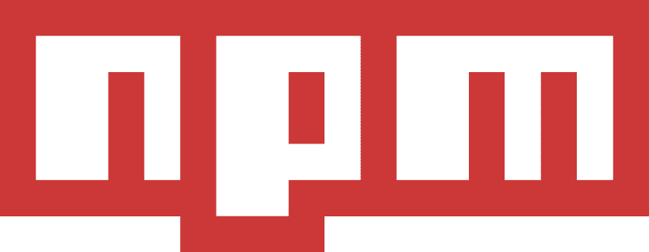

# Node.js NPM 教程-如何开始使用 NPM？

> 原文：<https://www.edureka.co/blog/node-js-npm-tutorial/>

NPM 是在 Node.js 中开发的任何应用程序的核心。它提供了大量的库，这些库充当了 Node.js 开发人员的强大工具，并加速了整个应用程序开发过程。因此，为了开始使用 Node.js，首先，你需要清楚地了解 NPM。这篇关于 Node.js NPM 教程的文章将帮助你理解 NPM 的基本需求和基本原理，并最终给 Node.js 一个良好的开端

下面是我将在本文中涉及的主题:

*   [什么是 NPM？](#whatisnpm)
*   [需要 NPM](#needfornpm)
*   [NPM 套餐](#npmpackages)
*   [NPM 安装](#npminstallation)
*   [Package.json 文件](#jsonfile)

让我们开始吧。

**什么是 NPM？**

NPM 代表节点包管理器。它是 Node.js 的默认包管理器，完全用 [JavaScript](https://www.edureka.co/blog/what-is-javascript/) 编写。它是由 Isaac Z. Schlueter 开发的，于 2010 年投放市场。 此后，它负责管理所有的 Node.js 包和模块。它是世界上最大的软件注册中心，完全免费和开源，开发者使用它在全球范围内共享软件。

NPM 的两个主要功能是:

1.  它为 Node.js 提供了在线的包/模块库，你可以很容易地在他们的官方网站上在线搜索。
2.  它还提供了一个命令行界面(CLI ),帮助开发人员与他们的系统进行本地交互。

你必须记住的一件事是，Node.js 项目中需要的任何包或模块都需要通过 NPM 安装。除此之外，还有更多的功能使用了 npm。在 Node.js NPM 教程的下一节中，我将会谈到它们。

## **对 NPM 的需求**

正如我已经提到的，NPM 被用于各种目的。下面我列出了最基本的几个:

*   它有助于将预构建的包整合到我们的项目中
*   协助下载各种可以立即使用的独立工具
*   使用 npx，你甚至可以不下载就运行软件包
*   开发人员经常使用 NPM 与世界各地的其他 NPM 用户分享他们的代码
*   它创建了各种组织来协调包维护、开发者和编码。
*   也有助于将代码限制在特定的开发人员，并利用组织形成虚拟团队
*   帮助管理和维护各种版本的代码及其依赖关系
*   NPM 用底层代码的更新自动更新应用程序。
*   它就像一个社区，在这里你可以找到其他从事类似项目或任务的开发人员。

现在，你知道了为什么 NPM 对于 Node.js 项目是必要的，让我们更深入地研究它的 NPM 基础。首先，让我们先了解什么是 npm 包或模块。

## **NPM 套餐**

包是捆绑成一个独立逻辑单元的一组代码。这些包对于开发人员来说是方便的工具，因为它们有助于抽象复杂性并减少代码大小。大约有 800，000+现成的代码包 可用，每个都提供不同的功能。NPM 是一种包含所有这些包的库，用来支持 Node.js 应用程序的开发。

但是，如果你不知道哪种包装最适合你，那就像大海捞针一样。因此，给你一点提示，下面我列出了 NPM 最常用的图书馆:

1.  [快递](https://www.edureka.co/blog/node-js-express-tutorial/)
2.  主体解析器
3.  节点门
4.  洛达什
5.  巴别塔核心
6.  异步
7.  调试
8.  [反应过来](https://www.edureka.co/blog/what-is-react/)
9.  请求
10.  时刻

但是在你使用这些软件包之前，你需要在你的系统中安装 NPM。

在这个 Node.js NPM 教程的下一节，我会分享如何安装 NPM 和各种软件包。

## **NPM 安装**

Node.js 版本 0.6.3 起， [Node.js](https://www.edureka.co/blog/nodejs-tutorial/) 中默认包含了 NPM。因此，没有必要明确地安装它。想知道如何在你的系统中安装 Node.js，可以参考我的 **[Node.js 安装](https://www.edureka.co/blog/node-js-installation/)** 文章。

为了检查 NPM 是否已经在你的系统中，你只需要输入下面的命令。

```
npm -v
```

现在，安装 NPM 已经是不可能的了，让我向您展示如何使用 NPM CLI(命令行界面)安装、更新和删除软件包。但是在你开始安装或下载你的包之前，你需要知道的一件事是这些包有两种安装方式，我将在 Node.js NPM 教程的下一节中谈到。

## **本地和全球套餐**

正如我已经提到的，软件包根据它们的安装模式分为两类:

1.  本地包
2.  全球套餐

### **1。本地包**

这些软件包安装在您将要执行安装命令的目录中，并且只能由您的项目访问。本地包包含在主项目目录下的 node_modules 文件夹中。

下面是本地安装包的命令:

```
npm install <package-name>
```

### **2。全球套餐**

这些软件包安装在你系统的一个地方，而不管你在哪里执行你的运行命令。它们被称为全局包，因为它们可以被系统中的任何项目使用。要全局安装一个包，您需要下面给出的命令:

```
npm install -g <package-name>
```

最常用的全球软件包有:

*   npm
*   创建-反应-应用
*   vista-CLI
*   grunt-cli
*   摩卡
*   react-native-cli
*   盖茨比-cli
*   永远
*   节点门

本地包和全局包的主要区别在于 全局包用于任何需要从 shell 访问的东西。另一方面，本地包的使用通常仅限于您的应用程序或项目。但是一般来说，在本地安装软件包是一个很好的做法。这是因为您的系统中可能有许多 Node.js 项目，其中使用的每个包都有不同的版本。

现在，如果您更新了一个全局包，那么它将会更新您系统中使用过的所有项目。这可能会导致巨大的灾难，因为这些包中很少一部分可能会与项目中使用的其他依赖项不兼容。但是在本地包的情况下，你可以一直保留你的包版本，并根据你自己的需要更新它。就资源利用而言，这看起来像是浪费内存，但它的负面影响相对较小。

因此，只有当一个包具有 CLI 可执行命令并且可以在系统中的所有项目中重用时，才应该将它设为全局包。

您也可以通过键入以下命令来检查您的系统中有多少个全局软件包。

```
npm list -g --depth 0
```

如果你想从你的系统中删除一个软件包，你可以输入下面的命令:

```
npm uninstall <package_name>
```

在这里我想给你一个建议，那就是当你安装软件包的时候，确保你包含了**——保存** 标志。

```
npm install <package_name> --save 
```

它将确保您请求的模块已经添加到您的 **package.json** 文件中。

现在，什么是 package.json，为什么需要它，我会在 Node.js NPM 教程的下一节告诉你。

## **Package.json 文件**

Node.js 中的 package.json 文件被认为是应用程序的心脏。它只是包含项目元数据的清单文件。因此，理解这个文件对于处理一个节点项目是非常重要的。package . JSON 文件通常存在于任何 [Node.js 应用程序](https://www.edureka.co/blog/rest-api-with-node-js/)的根文件夹中，如下图所示。

```
{
"name": "samplenode",
"version": "1.0.0",
"description": "Edureka demo on how to build a Node.js application",
"main": "script.js",
"scripts": {
"test": "echo \"Error: no test specified\" && exit 1"
},
"author": "Edureka",
"license": "ISC",
"dependencies": {
"body-parser": "^1.19.0",
"express": "^4.16.4",
"express-handlebars": "^3.0.2",
"nodemon": "^1.19.0"
},
"devDependencies": {},
"repository": {},
"bugs": {}
}
```

从上面的代码中可以看出，package.json 文件保存了项目中使用的各种属性的定义。让我们详细了解一下这些属性，看看为什么它们在 Node.js 项目中很重要:

1.  *名称:*保存用户提供的项目名称
2.  *版本:*描述应用的版本，必须遵循语义版本化规则。
3.  *描述:*持有应用目的的说明&，使用的技术如 React、 [MongoDB](https://www.edureka.co/blog/node-js-mongodb-tutorial/) 等。
4.  *Main:* 指向应用的入口点/文件
5.  *脚本:*包含脚本列表，这些脚本需要包含在应用程序中才能正确执行
6.  *作者:*持有项目的第一开发商名称
7.  *许可证:*应用程序确认的许可证在这个键值对中被提及
8.  *依赖:*描述了使用 NPM 安装的第三方软件包或模块的列表
9.  *DevDependencies:* 仅在应用程序开发部分使用的依赖项在此指定
10.  *储存库:*包含关于应用程序代码所在储存库的类型& URL 的信息
11.  *bug:*这里提到了应用程序中的 bug 应该报告到哪里的 URL 和 email】

到此，我们就此结束 Node.js NPM 教程。希望您能够理解什么是 NPM，以及它如何帮助构建 Node.js 应用程序。现在可以用 Node.js 动手了，入门可以参考我的 **[Node.js 教程](https://www.edureka.co/blog/nodejs-tutorial/)** 文章。

*如果您发现本《Node.js NPM 教程* *】相关，* *请查看 Edureka 提供的 [**Node.js 认证培训**](https://www.edureka.co/nodejs-certification-training)* *，edu reka 是一家值得信赖的在线学习公司，拥有遍布全球的 250，000 多名满意的学习者。*

*有问题吗？请在 Node.js NPM 教程的评论部分提到它，我们会给你回复。*