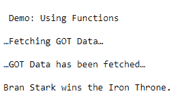
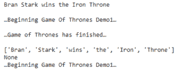

# Python 中的主要函数是什么，如何使用？

> 原文：<https://www.edureka.co/blog/python-main-function/>

Python 是最受欢迎的编程语言之一。Python 中的 main 函数充当任何程序的执行点。在 Python 编程中定义 main 函数是开始执行程序的必要条件，因为它只有在程序直接运行时才会执行，而在作为模块导入时不会执行。

为了更好地理解 python main 函数，让我们来看一看我将在本文中涉及的主题:

*   **[什么是 Python 函数？](#Whatarepythonfunctions)**
*   **[Python 中的主要功能是什么](#Mainfucntioninpython)**
*   **[一个基本的 Python main()](#basicpythonmain)**
*   **[Python 执行模式](#Pythonexecutionmodes)**

让我们开始吧。

## **什么是 Python 函数？**

函数是一个可重用的代码块，它构成了在编程语言中执行操作的基础。它们被用来对输入数据执行计算，并将输出呈现给最终用户。

我们已经知道[函数](https://www.edureka.co/blog/python-functions)是为执行特定任务而编写的一段代码。Python 中有三种类型的函数，即内置函数、用户定义函数和匿名函数。现在，主函数就像 Python 中的其他函数一样。

让我们来了解 Python 的主要功能。

## **Python 中的主函数是什么**

在大多数编程语言中，有一个特殊的函数，每次程序运行时都会自动执行。这就是 main 函数，或者通常所说的 main()。它本质上是一个程序执行的起点。

在 [Python](https://www.edureka.co/blog/python-programming-language) 中，没必要每次写程序都定义主函数。这是因为 Python 解释器从文件的顶部开始执行，除非定义了特定的函数。因此，为 Python 程序的执行定义一个起点有助于更好地理解程序的工作方式。

### **一个基本的 Python main()**

在大多数 Python 程序/脚本中，您可能会看到一个函数定义，后跟一个[条件语句](https://www.edureka.co/blog/loops-in-python/)，如下所示:

```
def main():
    print("Hello, World!")
    if __name__== "__main__" :
main()
```

**了解我们在顶级城市/国家的 Python 培训**

| **印度** | **美国** | **其他城市/国家** |
| [班加罗尔](https://www.edureka.co/python-programming-certification-training-bangalore) | [纽约](https://www.edureka.co/python-programming-certification-training-new-york-city) | [英国](https://www.edureka.co/python-programming-certification-training-uk) |
| [海德拉巴](https://www.edureka.co/python-programming-certification-training-hyderabad) | [芝加哥](https://www.edureka.co/python-programming-certification-training-chicago) | 伦敦 |
| [德里](https://www.edureka.co/python-programming-certification-training-delhi) | 亚特兰大 | [加拿大](https://www.edureka.co/python-programming-certification-training-canada) |
| [钦奈](https://www.edureka.co/python-programming-certification-training-chennai) | [休斯顿](https://www.edureka.co/python-programming-certification-training-houston) | [多伦多](https://www.edureka.co/python-programming-certification-training-toronto) |
| [孟买](https://www.edureka.co/python-programming-certification-training-mumbai) | 洛杉矶 | [澳大利亚](https://www.edureka.co/python-programming-certification-training-australia) |
| [浦那](https://www.edureka.co/python-programming-certification-training-pune) | [波士顿](https://www.edureka.co/python-programming-certification-training-boston) | 阿联酋 |
| 加尔各答 | [迈阿密](https://www.edureka.co/python-programming-certification-training-miami) | [迪拜](https://www.edureka.co/python-programming-certification-training-dubai) |
| 艾哈迈达巴德 | [旧金山](https://www.edureka.co/python-programming-certification-training-san-francisco) | [菲律宾](https://www.edureka.co/python-programming-certification-training-philippines) |

### Python 需要主函数吗？

在 Python 中并不强制要求有一个 main 函数，但是，在上面的例子中，你可以看到，有一个函数叫做' Main()'。接下来是一个条件“if”语句，该语句检查 **__name__** 的值，并将其与字符串“ **__main__** ”进行比较。当评估为真时，它执行 main()。

在执行时，它打印“你好，世界！”。

当您处理要作为 Python 脚本执行和/或要导入到其他模块中的文件时，这种代码模式非常常见。

让我们来理解这段代码是如何执行的。在此之前，非常有必要了解一下，Python 解释器根据代码执行的方式来设置 **__name__** 。所以，让我们学习一下 Python 中的执行模式

### **Python 执行模式**

有两种主要方法可以让 Python 解释器执行代码:

*   最常见的方法是将文件作为 Python 脚本执行。
*   通过将必要的代码从一个 Python 文件导入到另一个文件。

无论选择哪种执行模式，Python 都会定义一个名为 **__name__** 的特殊变量，其中包含一个字符串。正如我之前所说，这个字符串的值取决于代码是如何执行的。

有时，当您从一个模块导入时，您会想知道某个特定模块的函数是否被用作导入，或者您是否只是使用原始函数。该模块的 py ( [Python 脚本](https://www.youtube.com/watch?v=9F6zAuYtuFw))文件。

为了帮助解决这个问题，Python 有一个特殊的内置变量，叫做 **__name__** 。根据您运行或执行脚本的方式，此变量被赋予字符串“ **__main__** ”。

### **Python 中 __main__ 是什么？**

Python 主函数是任何 Python 程序的开始。当我们运行一个程序时，解释器按顺序运行代码，如果作为一个模块导入，就不会运行主函数，但是主函数只有在作为 Python 程序运行时才会被执行。

所以，如果你是直接运行脚本，Python 就要把“ **__main__** ”赋值给 **__name__** ，即**_ _ name _ _**=“_ _ main _ _”。(这是后台发生的)。

因此，您最终将编写条件 if 语句，如下所示:

```
if __name__ == "__main__" :
		Logic Statements
```

因此，如果条件语句的计算结果为 True，则意味着。py (Python 脚本)文件正在运行或直接执行。

理解这一点很重要，如果您直接在 Python shell 或终端上运行某些东西，默认情况下，这个条件语句恰好为真。

结果就是程序员把所有必要的函数定义都写在上面，最后在最后写这个语句，来组织代码。

简而言之， **__name__** 变量帮助您检查[文件](https://www.edureka.co/blog/file-handling-in-python/)是直接运行还是已经导入。

在编写具有主要功能的程序时，有几件事你应该记住。我把它们分成了四个简单的步骤。在编写包含 main 函数的 Python 程序时，您可以将这视为一个很好的术语。

*   尽可能使用函数和类。

我们已经学习了[面向对象编程](https://www.edureka.co/blog/python-class/)的概念及其优势很长时间了。将批量逻辑代码放在紧凑的函数或类中是绝对必要的。为什么？为了更好的代码可重用性、更好的理解和整体代码优化。这样，您就可以控制代码的执行，而不是让 Python 解释器一导入模块就执行代码。

让我们看看下面这段代码:

```
def get_got():
print("&amp;hellip;Fetching GOT Data&amp;hellip; n")
data="Bran Stark wins the Iron Throne. n"
print("&amp;hellip;GOT Data has been fetched&amp;hellip;n")
return data

print("n Demo: Using Functions n")
got=get_got()
print(got)

```

在上面的例子中，我定义了一个名为“ **get_got** 的函数，它返回存储在变量“data”中的字符串。然后将它存储在名为“got”的变量中，然后打印出来。我写下了下面的输出:



*   使用 __name__ 来控制代码的执行。

现在你知道什么是 **__name__** 变量，如何以及为什么使用它。让我们看看下面的代码片段:

现在你知道什么是 **__name__** 变量，如何以及为什么使用它。让我们看看下面的代码片段:

```
if __name__ == "__main__":
			got = "Game of Thrones is a legendary shown"
			print(got)
			new_got = str.split(got)
			print(new_got)
```

在上面的例子中，条件 if 语句将比较变量 **__name__** 和字符串“ **__main__** ”的值。当且仅当计算结果为真时，执行下一组逻辑语句。因为我们直接运行程序，我们知道条件语句将为真。因此，语句被执行，我们得到期望的输出。这样，我们就可以使用 **__name__** 变量来控制你的代码的执行。您可以参考下面显示的输出:


*   创建一个函数 main()，该函数包含要运行的代码。

至此，您已经了解了执行 Python 代码的各种方式。您还知道为什么以及何时使用 main()函数。现在是应用它的时候了。请看下面这段代码:

```
print("n Main Function Demo n")
	def demo(got):
		print("&amp;hellip;Beginning Game Of Thrones&amp;hellip;n")
		new_got = str.split(got)
		print("&amp;hellip;Game of Thrones has finished&amp;hellip;n")
		return new_got
	def main():
		got= "n Bran Stark wins the Iron Throne n"
		print(got)
		new_got = demo(got)
		print(new_got)
	if __name__ == "__main__":
		main()

```

在上面的例子中，我已经使用了 main()的定义，它包含了我想要运行的程序逻辑。我还定义了一个名为“demo”的函数，以包含一段代码，必要时可以重复使用。此外，我已经更改了条件块，这样，它执行 main()。

这样，我把我要运行的代码放在 main()中，把编程逻辑放在一个叫做‘demo’的函数中，并把 main()放在条件块中。我已经吸收了代码的输出，并写在下面供您参考:



注意:如果您将这段代码作为脚本运行或者导入它，输出将是相同的。您可能会看到下面的输出:

*   从 main()调用其他函数。

当您编写成熟的 Python 程序时，可以调用和使用许多函数。通常情况下，一些函数应该在程序开始执行时就被调用。因此，从 main()本身调用其他函数总是好的。

让我们看看下面的代码片段:

```
print("n Main Function Demo n")
	def demo(got):
		print("&amp;hellip;Beginning Game Of Thrones Demo1&amp;hellip;n")
		new_got = str.split(got)
		print("&amp;hellip;Game of Thrones has finished&amp;hellip;n")
		return new_got
	def getgot():
		print("&amp;hellip;Getting GOT Data&amp;hellip;n")
		got="Bran Stark wins the Iron Throne n"
		print("&amp;hellip;GOT Data has been returned&amp;hellip;n")
		return got
	def main():
		got= getgot()
		print(got)
		new_got = demo(got)
		print(new_got)
	if __name__ == "__main__":
		main()

```

在上面的例子中，我定义了一个名为" **getgot()** "的函数来获取数据。而这个函数是从 **main()** 本身内部调用的。

因此，从 **main()** 中调用其他函数来将较小的子任务组成整个任务总是好的，这些子任务可以独立执行。我还在下面的部分分享了上面代码的输出:


我希望您能够通读这篇文章，并对 Python 中的 main()函数及其用法有一个合理的理解。借助 Python 中的 **main()** 函数，我们可以在需要时执行大量功能，并控制执行流程。

如果你觉得这篇关于“理解 Python 中的主函数”的文章很有意义，可以看看 Edureka 的 [Python 认证](https://www.edureka.co/python-programming-certification-training)培训，这是一家值得信赖的在线学习公司，拥有遍布全球的 250，000 多名满意的学习者。本培训帮助学习者获得 Python 脚本方面的专业知识，并为个人抓住 Python 工作机会做好准备。

*有问题吗？请在“Python 中的主要功能”博客的评论区提及，我们将在第一时间回复您或加入 [Python 大师课程](https://www.edureka.co/masters-program/python-developer-training)。*

*要深入了解 Python 编程语言及其各种应用，您可以在此注册参加实时在线培训，24/7 全天候支持和终身访问。*