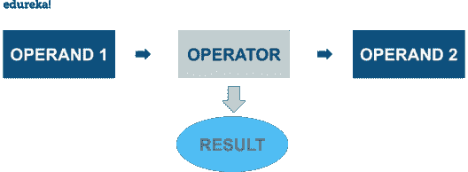
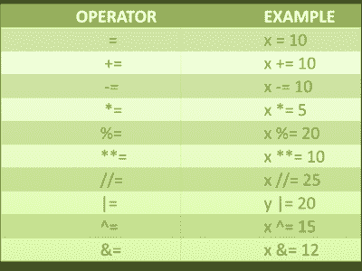
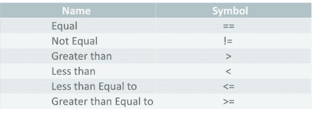
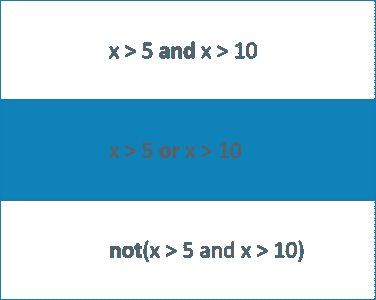

# Python 中的运算符——您需要知道的一切

> 原文：<https://www.edureka.co/blog/operators-in-python/>

Python 语言是最流行的编程语言之一。虽然学习 [python](https://www.edureka.co/data-science-python-certification-course) 看似简单，但在继续学习 python 的各种应用之前，必须掌握一些核心概念。python 中的运算符是 python 中的核心基本概念之一。这个博客将帮助你理解 python 中不同类型的操作符。以下是本博客涉及的主题:

*   [什么是算子？](#1)
*   [操作员类型](#2)
    *   [算术运算符](#3)
    *   [赋值运算符](#4)
    *   [比较运算符](#5)
    *   [逻辑运算符](#6)
    *   [会员操作符](#7)
    *   [身份符](#8)
    *   [按位运算符](#9)

## **什么是算子？**

python 中的运算符用于两个值或变量之间的运算。根据操作中使用的运算符类型，输出会有所不同。我们可以调用操作符作为特殊的符号或构造来操作操作数的值。假设您想要执行两个变量或值的加法，您可以使用加法运算符来执行此操作。操作数中的值可以是变量[或 python 中的任何数据类型](https://www.edureka.co/blog/videos/python-programming/)。



根据操作的类型，python 编程语言中有 7 种类型的运算符。

## **操作员类型**

1.  算术运算符
2.  赋值运算符
3.  比较运算符
4.  逻辑运算符
5.  隶属运算符
6.  身份运算符
7.  按位运算符

### **算术运算符**

算术运算符在 python 中用于执行算术运算。下面是算术运算符及其名称和符号。这些是我们在 python 中进行算术运算时使用的符号。

```
x = 10
y = 15
#addition
x + y
#subtraction
x - y
#multiplication
x * y
#division
x / y
#floor division
x // y
#modulus
x % y
#exponentiation
x ** y

```

### **赋值运算符**

赋值运算符用于给变量或 python 中的任何其他对象赋值。下面是 python 中的赋值操作符。



```

x = 10
x += 5
#it is same as x = x + 5
x -= 5
x *= 5
x /= 5
#similarly we can write all assignment operators like this.

```

### **比较运算符**

比较运算符用于比较两个值。下面是 python 中的比较运算符。



```

x = 5
y = 3

#equal
x == 5

#not equal
x != 5

#greater than
x > y

#less than
x < y 
#greater than or equal to 
x >= y

#less than or equal to
x <= y

```

### **逻辑运算符**

逻辑运算符用于比较两个[条件语句](https://www.edureka.co/blog/loops-in-python/)。下面是 python 中的逻辑运算符。



```

#logical and
5 > 3 and 5 > 4
#it will return true, since both statements are true.
5 > 3 or 5 < 2
#it will return true, since one of the statements is true.
not(5 > 2 and 5 < 3)
#it will return true, even when logical and will return false.

```

### **身份符**

恒等运算符比较两个对象。下面是我们在 python 中使用的标识操作符。


```

a = [10,20,30]
b = [10,20,30]
x = b
z = a
# is operator
x is a
#this will return false
x is z
#this will return true.
a is b
#this will return false, even though both have the same items in the list.
a is not b
#this will return true, since both are not same objects.

```

### **会员操作符**

成员运算符用于检查一个序列是否存在于一个对象中。下面是我们在 python 中的成员操作符。


```

a = [10,20,30,'edureka']
#in operator
'edureka' in a
#this will return true, since the item is present in the object.
'python' in a
#this will return false, since it is not present in a.
10 not in a
#this will return false, because it is there.
50 not in a
#this will return true, since there is no 50 in a.

```

### **按位运算符**

按位运算符比较二进制值。以下是 python 中的按位运算符。


```

#bitwise AND
10 & 12
#this will return 8
#bitwise OR
10 | 12
#this will return 14
#bitwise XOR
10 ^ 12
#this will return 6
#bitwise NOT
~ (10 & 12)
#this will return -9
#left shift
10 << 2 #this will return 40 
#right shift 
10 >> 2
#this will return 2

```

为了理解我们如何使用按位运算符得到结果，让我们来看看 10 和 12 的二进制等价形式。

二进制的 10 是 1010，二进制的 12 是 1100。在 1010 和 1100 之间进行 AND 运算时，如果两位都为 1，则该位将为 1。因此，当我们将其转换为十进制时，得到的二进制等效值将是 1000，也就是 8。

如果其中一位为 1，按位“或”运算符会将每一位设置为 1；如果只有一位为 1，按位“异或”运算符会将每一位设置为 1；按位“非”运算符会反转所有位。

在我们的例子中，当进行左移或右移时，比特将左移两个位置。因此，1010 将成为 101000，也就是 40。同样的，右移时 1010 会变成 10，也就是 2。

在这篇博客中，我们讨论了 python 中不同类型的操作符。这个主题是学习 [python 编程语言](https://www.edureka.co/blog/python-programming-language)的一个基本概念。这是 python 的一个核心概念，在转到 python 中的各种其他领域时是必要的。如果你正在寻找 python 编程的结构化学习方法，你可以报名参加 [Edureka 的 Python 认证项目](https://www.edureka.co/data-science-python-certification-course)，开始你的学习。

*如果你有任何疑问，请在评论区提出。我们会回复你的。*