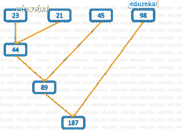

# 什么是 Lambda 函数，如何使用？

> 原文：<https://www.edureka.co/blog/python-lambda/>

名称是用来指代或称呼任何实体的约定。我们周围几乎所有的东西都有名字。编程的世界也与此一致。但是一定要给所有东西起名字吗？或者你能有一些只是“匿名”的东西吗？答案是，可以。 [Python](https://www.edureka.co/python?gclid=EAIaIQobChMI4NnDyPTM4gIVSiQrCh1XRQQtEAAYASAAEgJLrfD_BwE) 提供 Lambda 函数，也称为匿名函数，实际上是无名的。因此，让我们按照下面的顺序继续学习 Python 的这些“匿名之谜”。

*   [为什么需要 Python Lambda 函数？](#whyuselambda)
*   [什么是 Python Lambda 函数？](#whatarepythonlambdafunctions)
*   [Lambda 函数怎么写？](#howtowritelambdafunctions)
*   [匿名函数如何减少代码的大小？](#howdotheyreducecodesize)
*   [用户定义函数中的 Python Lambda 函数](#lambdawithinotherfunctions)
*   [如何在:](#lambdawithinpredefinedfunctions)中使用匿名函数
    *   [过滤器()](#filter)
    *   [地图()](#map)
    *   [reduce()](#reduce)

让我们开始吧:)

## **为什么要使用 Python Lambda 函数？**

匿名函数的主要用途是当你只需要某个函数一次的时候。它们可以在任何需要的地方创建。由于这个原因，Python Lambda 函数也被称为抛弃函数，它与其他预定义函数(如 filter()、map()等)一起使用。与普通的 [python 函数](https://www.edureka.co/blog/python-functions)相比，这些函数有助于减少代码行数。

为了证明这一点，让我们进一步学习 Python Lambda 函数。

## **什么是 Python Lambda 函数？**

Python Lambda 函数是没有任何名称的函数。它们也被称为匿名函数或无名函数。lambda 这个词不是一个名字，而是一个关键词。该关键字指定后面的函数是匿名的。

现在您已经知道这些匿名函数指的是什么，让我们进一步看看您如何编写这些 Python Lambda 函数。

## **如何用 Python 写 Lambda 函数？**

使用 lambda 运算符创建 Lambda 函数，其语法如下:

**语法:**

*λ参数:表达式*

Python **lambda 函数**可以有任意数量的参数，但它只需要**一个表达式。**输入或参数可以从 0 开始，直到任何极限。就像任何其他函数一样，没有输入的 lambda 函数也很好。因此，您可以拥有以下任何格式的 lambda 函数:

**举例:**

*λ:“指定用途”*

这里，lambda 函数不接受任何参数。

**举例:**

*λa<sub>1</sub>:指定使用 a<sub>1</sub>*

这里，lambda 接受一个输入，它是一个 <sub>1</sub> 。

同样，你可以有λa<sub>1</sub>，a <sub>2</sub> ，a <sub>3</sub> ..一个 <sub>n</sub> 。

让我们举几个例子来说明这一点:

**例 1:**

```

a = lambda x: x*x
print(a(3))

```

**输出:** 9

**例 2:**

```

a = lambda x,y: x*y
print(a(3,7))

```

**输出:** 21

如你所见，我在这里举了两个例子。第一个例子使用 lambda 函数，只有一个表达式，而第二个例子传递了两个参数。请注意，这两个函数都有一个表达式，后跟参数。因此，lambda 函数不能用在需要多行表达式的地方。

另一方面，普通的 python 函数可以在其函数定义中包含任意数量的语句。

## **匿名函数如何减少代码的大小？**

在比较需要的代码量之前，我们先把[正规函数](https://www.edureka.co/blog/python-functions)的语法写下来，和前面说的 lambda 函数的语法做个比较。

Python 中的任何普通函数都是使用 **def** 关键字定义的，如下所示:

**语法:**

*def function_name(参数):* *【语句】*

如您所见，lambda 函数所需的代码量比普通函数少得多。

现在让我们用普通函数重写我们之前举的例子。

**举例:**

```

def my_func(x):
    return x*x
print(my_func(3))

```

**输出:** 9

如您所见，在上面的例子中，我们需要 my_func 中的 return 语句来计算 3 的平方值。相反，lambda 函数不使用这个 return 语句，但是，匿名函数的主体与函数本身写在同一行，在冒号符号之后。因此，函数的大小小于 my_func 的大小。

然而，上述示例中的 lambda 函数是使用其他某个[变量](https://www.edureka.co/blog/python-tutorial/) a 调用的。这样做是因为这些函数是无名的，因此需要调用某个名称。但是，这一事实可能会令人困惑，当您实际上需要指定其他名称来调用这些函数时，为什么还要使用这些无名函数呢？当然，在给我的函数命名为 a 之后，它就不再是无名的了！对吗？

这是一个合理的问题，但关键是，这不是使用这些匿名函数的正确方式。

匿名函数最好用在其他高阶函数中，这些函数要么使用某个函数作为参数，要么返回一个函数作为输出。为了证明这一点，现在让我们进入下一个话题。

## **用户定义函数中的 Python Lambda 函数:**

如上所述，lambda 函数被用在其他函数中来标记最大的优势。

以下示例由 new_func 组成，它是一个普通的 python 函数，接受一个参数 x。然后将该参数添加到通过 lambda 函数提供的某个未知参数 y 中。

**举例:**

```

def new_func(x):
    return(lambda y: x+y)
t=new_func(3)
u=new_func(2)
print(t(3))
print(u(3))

```

**输出:**

6 5 如你所见，在上面的例子中，每当我们使用 new_func()时，new_func 中的 lambda 函数就会被调用。每次，我们都可以将不同的值传递给参数。 现在，您已经了解了如何在高阶函数中使用匿名函数，让我们继续了解它在 filter()、map()和 reduce()方法中最常见的用法。

## **如何在 filter()、map()和 reduce()中使用匿名函数:**

**过滤器()中的匿名函数:**

### **过滤器():**

filter()方法用于在另一个函数(作为参数传递)的帮助下过滤给定的 iterables(列表、集合等),以测试所有元素是真还是假。

该函数的语法是:

**语法:**

*过滤器(函数，可迭代)*

现在考虑下面的例子:

**举例:**

```

my_list = [2,3,4,5,6,7,8]
new_list = list(filter(lambda a: (a/3 == 2), my_list))
print(new_list)

```

**输出:**【6】

这里，my_list 是传递给过滤函数的可迭代值的列表。这个函数使用 lambda 函数来检查列表中是否有值，这些值等于 2 除以 3。输出由满足匿名函数中存在的表达式的列表组成。

### **地图():**

Python 中的 map()函数是一个将给定函数应用于所有 iterables 并返回新列表的函数。

**语法:**

*映射(函数，可迭代)*

让我们举一个例子来演示 lambda 函数在 map()函数中的用法:

**举例:**

```

my_list = [2,3,4,5,6,7,8]
new_list = list(map(lambda a: (a/3 != 2), li))
print(new_list)

```

**输出:**

[真实，真实，真实，真实，虚假，真实，真实]

上面的输出显示，每当 iterables 的值除以 3 后不等于 2 时，返回的结果应该是 True。因此，对于 my_list 中的所有元素，当条件变为 False 时，它返回 true，但值 6 除外。

### **reduce():**

reduce()函数用于将一些其他函数应用于作为参数传递给它的元素列表，并最终返回一个值。

该函数的语法如下:

**语法:**

*减少(功能，顺序)*

**举例:**

```

from functools import reduce
reduce(lambda a,b: a+b, [23,21,45,98])

```

下图描述了上述示例:



**输出:** 187

输出清楚地显示，列表中的所有元素都被不断地添加到最后的结果中。

至此，我们结束了这篇关于“Python Lambda”的文章。希望你清楚已经与你分享的一切。确保你尽可能多地练习，恢复你的经验。

*有问题吗？请在这个“Python Lambda”博客的评论部分提到它，我们会尽快回复您。*

*要深入了解 Python 及其各种应用，您可以注册参加实时 **[Python 在线培训](https://www.edureka.co/data-science-python-certification-course)** ，该培训提供全天候支持和终身访问。*