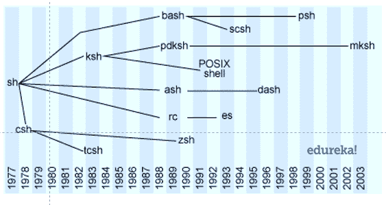
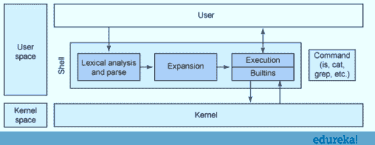

# 为什么需要不同的 Linux Shells？

> 原文：<https://www.edureka.co/blog/types-of-shells-in-linux/>

贝壳就像品牌。每个人都有自己最喜欢的，并虔诚地捍卫自己的选择，并且经常告诉你为什么应该换工作。Linux 中不同类型的 ***外壳可以提供不同的功能，但在它们的核心，它们基本上实现了几十年前开发的思想。***

因此，我们将从现代 shell 的简史开始，然后探索一些现在可用于 Linux 的有用的开源 shell，您可以自己决定 ***学习 Linux*** 有多大好处。

以下是本博客的讨论过程；【T2

*   [**进化而来的炮弹**](#evolutionofshells)
*   [**外壳的定义**](#definitionofshell)
*   [**外壳的基本架构**](#shellarchitecture)
*   [**Linux 中 5 种不同类型的 Shells，为什么要选择它们**](#differenttypesofshells)
    *   [**谍影重重**](#bash)
    *   [**TENEX C 壳**](#tcsh)
    *   [**科恩壳牌**](#ksh)
    *   [**Z 壳**](#zsh)
    *   [**方案外壳**](#scsh)

**进化而来的炮弹**

除了汤普森贝壳，我们开始看看现代贝壳。

**1977 年**

伯恩壳推出。Stephen Bourne 在贝尔实验室为 V7 UNIX 开发的 ***Bourne shell(sh)*** 至今仍是一个有用的 shell(在某些情况下，作为默认的根 shell)。Bourne shell 是在一个 ***ALGOL68 编译器*** 上工作后开发的，所以它的语法比其他 shell 更符合算法语言(ALGOL)的路线。源代码是用 c 语言开发的

《谍影重重》有两个主要目的:

*   执行操作系统的 [***UNIX/Linux 命令***](https://www.edureka.co/blog/linux-commands/) ，即 ***命令行解释器***
*   编写可以通过 shell 调用的可重用脚本，即 ***脚本***

除了取代 Thompson shell 之外，Bourne shell 还提供了许多其他优于其前身的优势，如控制流、循环和脚本变量，提供了一种更具功能性的语言来与操作系统交互。

shell 也允许你使用 shell 脚本作为过滤器，为处理信号提供集成支持，但是缺乏定义函数的能力。

它向世界介绍了我们今天使用的许多功能，比如命令替换和在脚本中嵌入保留的字符串文字的 HERE documents。

Bourne shell 导致了我们今天使用的许多 shell 的开发。

**1978 年**

***C shell(csh)*** 由 Bill Joy 开发，目标是实现一种类似于 C 编程语言的脚本语言。这是有用的，因为 C 是当时使用的主要语言，这也使得它更容易和更快地使用。

**1983 年**

由大卫·科恩开发的 ***科恩 Shell(ksh)*** 结合了伯恩 Shell 和 C Shell 的特点。它与 Bourne Shell 向后兼容。它包含了 C Shell 的一些特性，如作业控制、命令别名&命令历史。

也是在同一年，***TENEX C Shell(tcsh)***推出。它最初是 C Shell 的衍生物，但是增加了可编程的命令行完成和编辑功能。

**1989 年**

今天使用最广泛的 Shell 之一，***Bourne-Again Shell(bash)***是 Brian Fox 为 GNU 项目编写的，作为 Bourne Shell 的前软件替代。它展示了 Bourne shell 的所有特性，但是更加高效和易于使用。

它支持用于条件测试和迭代的文件名全球绑定、管道、命令替换和控制结构。

****

**现今**

许多 Shell 后来得到了发展，如 ***公共域 Korn Shell*** 、*Almquist Shell*和 ***可扩展 Shell*** 引入了适合不同需求的新特性和方言。

**外壳的定义**

Shell 是一个交互式环境，它为操作系统提供了一个接口。它按顺序收集您的输入，以实现特定的使用模型。

**外壳的基本架构**

假设的外壳所基于的基础架构并不复杂。基本架构非常类似于管道，在那里输入被分析和解析，符号被扩展。它使用了多种方法，如大括号、波浪号、变量和参数扩展和替换以及文件名生成。然后，使用 shell 内置命令或外部命令来执行命令。

**Linux 中不同类型的 Shells 以及为什么要选择它们**

每种贝壳都有自己的特色，适合寻找不同问题解决方案的人。您可以通过这些流行的 shells 各自执行相同任务的脚本(即 ***查找所有可执行文件*** )来了解它们之间的相似性或不相似性。

**1。谍影重重外壳**

Bash 代表 **Bourne Again Shell** ，它是当今许多 Linux 发行版的默认 Shell。它也是一个 sh 兼容的 shell，并在编程和交互使用方面提供了比 sh 更好的实用改进，包括:

*   命令行编辑
*   作业控制
*   无限制大小的命令历史
*   外壳函数和别名
*   无限大小的索引数组
*   从二进制到六十四进制的整数运算

**代码示例**

`*#!/bin/bash #find all executables*`

*T2`count=0`*

*`#Test arguments`**`if [ $#‑ne 1 ] ; then`**`echo "Usage is $0 <dir>"`**`exit 1`**`fi`*

*`#Ensure argument is a directory`**`if [ ! ‑d "$1" ] ; then`**`echo "$1 is not a directory."`**`exit 1`**`fi`*

*`#Iterate the directory, emit executable files`**`for filename in "$1"/∗`**`do`**`if [ ‑x "$filename" ] ; then`**`echo $filename`**`count=$((count+1))`**`fi`**`done`**`echo`*`echo "$count executable files found."`**

*T2`exit 0`*

如果您是 shell 脚本的新手，bash 首先是一种很好的语言。它是互动的和全面的。顾名思义，Bash 是 Bourne shell 的超集，您可以运行大多数 Bourne 脚本而无需修改它们。它是大学和学校教授给学习计算机科学的学生的语言。

**2。TENEX C Shell**

**Tcsh** 是增强的 **C** shell，它可以作为交互式登录 shell 和 shell 脚本命令处理器。

Tcsh 具有以下特点:

*   C like 语法
*   命令行编辑器
*   可编程字和文件名完成
*   拼写纠正
*   作业控制

**代码示例**

`*#!/bin/tcsh #finding all executable files*`

*T2`set count=0`*

*`#Testing arguments`**`if ($#argv != 1) then`**`echo "Usage is $0 <dir>"`**`exit 1`**`endif`*

*`#Ensuring each argument is a directory`**`if (! ‑d $1) then`**`echo "$1 is not a directory."`**`exit 1`**`endif`*

*`#Iterating the directory, printing executable files`**`foreach filename ($1/∗)`**`if (‑x $filename) then`**`echo $filename`**`@ count = $count + 1`**`endif`**`end`**`echo`*`echo "$count executable files found."`**

*T2`exit 0`*

如果您是 Unix 环境中的网络或系统管理员，您几乎肯定会遇到 C shell，因此至少对它有一些熟悉是有好处的。

**3。光辉壳牌**

**Ksh** 代表 **Korn shell** 由 **David G. Korn** 设计研发。它是一种完整、强大的高级编程语言，也是一种交互式命令语言，就像许多其他 Unix/GNU Linux shell 一样。

Korn shell 包含了其他 shell 的特性，并提供了一些现代脚本语言中的高级特性，例如；

**代码示例**

`*#!/usr/bin/ksh #finding all executable files*`

`*count=0*`

`*#Testing arguments*``*if [ $#‑ne 1 ] ; then*``*echo "Usage is $0 <dir>"*``*exit 1*`

`*#Ensuring each argument is a directory*``*if [ ! ‑d "$1" ] ; then*``*echo "$1 is not a directory."*``*exit 1*``*fi*``*#Iterating the directory, printing executable files*``*for filename in "$1"/∗*``*do*``*if [ ‑x "$filename" ] ; then*``*echo $filename*``*count=$((count+1))*``*fi*``*done*`

`*echo*`

`*exit 0*`

这个 Shell 是一种 Unix shell 编程语言，您可以交互地使用它来从命令行执行命令，或者以编程方式创建脚本来自动执行许多计算机维护和系统管理任务。

**4。z 壳**

**Zsh** 被设计成交互式的，它融合了其他 Unix/GNU Linux shell 的许多特性，如 **bash** 、 **tcsh、**和 **ksh** 。

就像其他可用的 shells 一样，它也是一种强大的脚本语言。虽然它有一些独特的功能，包括:

*   文件名生成
*   启动文件
*   登录/注销观看
*   结束语
*   概念指数
*   可变指数
*   功能指标
*   关键索引和更多您可以在手册页中找到的内容

**代码示例**

`*#!/bin/zsh #finding all executable files*`

`*set count=0*`

`*#Testing arguments*``*if ($#argv != 1) then*``*echo "Usage is $0 <dir>"*``*exit 1*`

`*#Ensuring each argument is a directory*``*if (! ‑d $1) then*``*echo "$1 is not a directory."*``*exit 1*``*endif*``*#Iterating the directory, printing executable files*``*foreach filename ($1/∗)*``*if (‑x $filename) then*``*echo $filename*``*@ count = $count + 1*``*endif*``*end*`

`*echo*`

`*exit 0*`

**5。方案外壳**

***Scheme shell(scsh)***是一个奇特的 shell，它提供了一个使用 ***Scheme*** 的脚本环境，是 ***Lisp 语言*** 的衍生物。 ***Pyshell*** 试图创建一个使用 [***Python 语言***](https://www.edureka.co/blog/python-tutorial/) 的类似脚本。

**代码示例**

*T2`#!/usr/bin/scsh ‑s !#`*

【T2`(define argc`*`(length command‑line‑arguments))`*

*`(define (write‑ln x)`**`(display x)`**`)`*

*`(define (showfiles dir)`**`(for‑each write‑ln`**`(with‑cwd dir`**`(filter file‑executable? (directory‑files "." #t)))))`*

*`(if (not (= argc 1))`**`(write‑ln "Usage is fae.scsh dir")`**`(showfiles (argv 1)))`*

该脚本可能看起来是外来的，但它实现了与目前提供的脚本相似的功能。这个脚本包括三个函数，并在最后包含了可直接执行的代码来测试参数计数。我想提醒大家注意一下***show files******函数*** ，它迭代一个列表， 调用 ***在列表的每个元素后写入-ln*** 。这个列表是通过迭代指定的目录并过滤可执行文件而生成的。

根据您的要求/口味，可以使用其他外壳。

You can refer to this video to know the different shells in Linux and how they’re run in this video;

## **Linux 中的不同 Shell | Bash vs C Shell vs Korn Shell | Linux 认证培训| Edureka**

[//www.youtube.com/embed/aLjFxiWP5uQ?rel=0&showinfo=0](//www.youtube.com/embed/aLjFxiWP5uQ?rel=0&showinfo=0)

*本视频讲述了不同 Linux shells 的起源和演变，并通过在终端上的演示，在三个最基本的 shell 之间画出了一条平行线。*

这些是 Linux 中不同类型的 shell，它们在问世 35 年后仍然保持不变——这是早期 shell 最初开发者的一个巨大证明。在一个不断自我改造的行业，最初的外壳一次又一次地被证明是巨大的。尽管经过多年的改进，shell 的基本概念仍然没有改变。

*如果你希望学习 Linux 管理并建立一个丰富多彩的职业生涯，那么就来看看我们的 [linux 管理课程](https://www.edureka.co/linux-admin)，它提供有讲师指导的现场培训和真实的项目经验。*