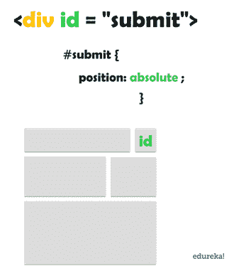
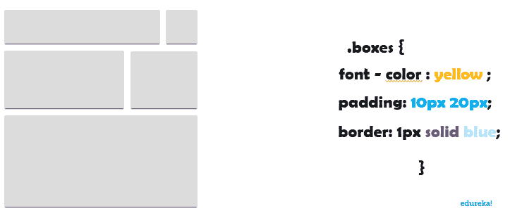

# 什么是 CSS？–互联网的时尚宣言

> 原文：<https://www.edureka.co/blog/what-is-css/>

任何使用过互联网的人都可能听说过–*HTML、CSS & JavaScript* 这三者。当 [HTML](https://www.edureka.co/blog/what-is-html/) 和 [JavaScript](https://www.edureka.co/blog/javascript-tutorial/) 分别处理网页的结构和动态元素时，CSS 则意味着网站的风格化。在这篇“什么是 CSS”的文章中，我们将简要了解这项技术，并对“它是如何工作的”有一个大致的了解

本博客涵盖了以下主题

1.  [CSS 简介](#intro-css)
2.  [CSS 如何级联？](#cascading-nature)
3.  [选择器](#selectors)
4.  [属性&值](#property-value)

## **什么是 CSS？**

CSS 代表级联样式表。CSS 是由万维网联盟(简称 W3C)提出并开发的技术。它的发布是为了帮助 web 开发人员从繁琐的内联样式过程中解脱出来，并使样式本身成为一个独立的实体。今天，如果你要下载一个功能网页的摘录，你会发现很多文件和文件夹，但三个主要元素是 HTML，CSS 和 JavaScript。简而言之，我将解释它们各自的功能。

1.  HTML–为网站提供结构。把它想象成你身体的骨架。
2.  **CSS**–风格。你穿的衣服，你穿的方式可以被认为是 CSS 的一个简单类比。
3.  **JavaScript**——让网页活起来。你在网站上看到的任何东西，从简单的按键动画到详细的游戏动画。那是 [JavaScript](https://www.edureka.co/blog/what-is-javascript/) 的工作。

CSS 发布之前，只有 HTML 和 JavaScript。开发人员将不得不坐下来为每个单独的元素设计样式，这不仅是乏味的，而且是一个麻烦的过程。今天，在 CSS 的帮助下，企业级网站可以在几个小时内完成样式化。这是由于 CSS 的级联性质。

所以让我们花一点时间来理解 CSS 是如何级联的。

## **CSS 如何级联？**

CSS 给网络开发和人们如何看待网站建设带来了一场革命。在 CSS 出现之前，元素的样式必须是内嵌的，或者样式是在 HTML 页面的 head 部分实现的。由于 CSS 的级联性质而改变。以下是 CSS 级联的三种主要方式:

1.  **元素**–相同的 CSS 样式可以应用于多个元素，以实现相同的样式。
2.  多种样式一个元素–多种样式可以应用于一个特定的 HTML 元素，以实现一种独特的样式。
3.  **相同的样式，多个页面**–相同的样式表可以应用于不同的 HTML 页面，从而非常快速地实现模板样式。

现在，让我们来看看 CSS 的一个非常重要的概念，选择器。

## **选择器**

顾名思义，选择器是一种针对特定的 [HTML](https://www.edureka.co/blog/what-is-html/) 元素进行样式化的方法。如果你精通 HTML，你会记得可以添加到任何 HTML 元素的两个特殊属性，即 **ID** 和**类**。借助这两个属性，CSS 可以针对特定的元素。

让我们来理解这两个选择器的基本原理:

**ID**——一个 ID 是*唯一的*。一个特定的 ID 只能分配给一个元素。当试图在单个元素上实现特定的样式时，使用 id。下面是如何使用 ID 的图示示例。

**类**——顾名思义，*类是一种针对 HTML 元素进行样式化的集合方式。*类不是唯一的，多个元素可以有相同的类。事实上，也可以将多个类添加到同一个元素中，以实现所需的样式和外观。下面是一个使用类的例子。现在我们知道了选择器是如何工作的，我想让你注意到在 HTML 页面上有很多种选择元素的方法。几乎不可能把它们都列出来，所以这里有一个[官方链接](https://developer.mozilla.org/en-US/docs/Web/CSS/CSS_Selectors)。

## **属性&值**

好了，我们已经了解了 CSS 如何在 HTML 页面上选择元素。在这一节中，我们将讨论 CSS 是如何编写的。下面是一个 CSS 代码的例子的图片。

所以如果你看上面的图片，你会注意到样式命令是写在一个*属性&值样式*中的。在上图中，属性是*字体颜色*，而值是*黄色。*CSS 语法还包含了一个分号形式的语句终止符**'；'。**然后将整个样式用花括号括起来，然后附加到选择器上(*)。方框*此处)。这将创建一个可以添加到样式表中的样式，然后应用于 HTML 页面。到处都是这样写 CSS 的。

现在，有很多属性，它们可以有很多值。几乎不可能在一篇文章中涵盖所有的问题，所以这里有一个链接，链接到[官方财产清单&值](https://developer.mozilla.org/en-US/docs/Web/CSS/Reference)。

这就把我们带到了这篇“什么是 CSS”博客的结尾。我希望你对什么是 CSS，为什么需要它，以及它是如何工作的有一个大致的了解。

如果你有兴趣学习更多关于网络开发的知识，可以看看 Edureka 的 **[网络开发认证培训](https://www.edureka.co/complete-web-developer)** 。 *Web 开发认证培训将帮助您学习如何使用 HTML5、CSS3、Twitter Bootstrap 3、jQuery 和 Google APIs 创建令人印象深刻的网站，并将其部署到亚马逊简单存储服务(S3)。*

如果你仍然感兴趣，如果你有任何问题，你可以在这个“什么是 CSS”博客的评论区发表，我们会尽快回复你。