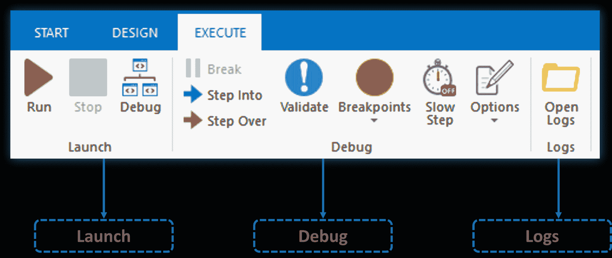
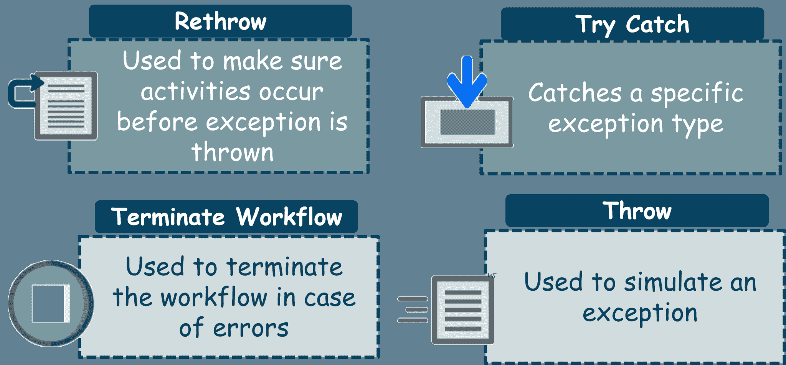
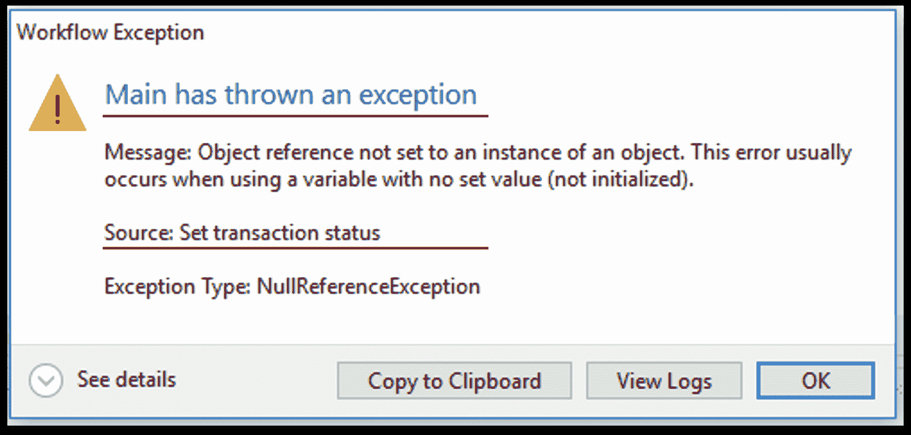
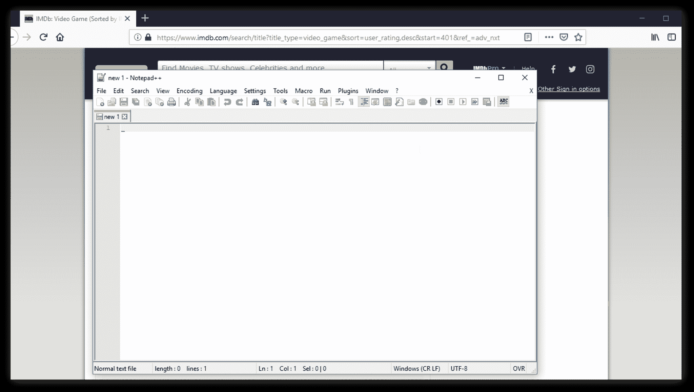

# UiPath 中的错误处理——调试错误和处理异常的入门指南

> 原文：<https://www.edureka.co/blog/error-handling-in-uipath/>

UiPath 是最流行的 **[RPA](https://www.edureka.co/blog/rpa-tutorial/)** 工具之一，用于 Windows 桌面自动化。它用于在没有人工干预的情况下自动执行重复性任务，该工具提供了活动的拖放功能，您一定已经在之前的 **[博客](https://www.edureka.co/blog/uipath-tutorial/)** 中学习过。在这篇关于 UiPath 中的错误处理的博客中，我将讲述如何在项目中处理错误的所有基础知识。

ui path 中的错误处理主要包括两个你需要了解的主题:

*   [调试](#Debugging)
*   [异常处理](#Exception%20Handling)

一旦你完成了以上两个主题，我们将讨论几个 [**技巧&窍门**](#tipsandtricks) ，这将使你意识到一些常见的错误，以及如何避免它们。

## **调试**

简单来说，调试就是从项目中识别和消除错误的过程。现在，要调试错误，您需要转到**执行**选项卡。执行选项卡有三个部分， [**启动**](#Launch) 部分， [**调试**](#Debug) 部分&日志 [**部分**](#Logs) 部分，如下图所示:

**图 1:** 执行 UiPath 中的 Tab-ui path 中的错误处理

让我来逐一解释每个部分的功能。

### **发射段:**

启动部分有 3 个选项:

**图 2:** 启动部分选项 UiPath 中的错误处理

正如你在上面的图像中看到的，当你只是想执行你的项目时，使用**运行**选项。因此，使用此选项，您将不会看到逐步执行，但会直接看到输出，如果它成功执行。**停止**按钮用于中途停止项目的执行，**调试**用于逐步调试错误。

### **调试段:**

调试部分有 5 个选项:

**图 3:** 调试部分选项 UiPath 中的错误处理

*   **步骤**用于一步步执行你的项目。所以，当你点击**进入**，它执行下一步，然后等待。
*   **验证**按钮用于验证您的项目，并检查您的项目是否有错误。因此，当您选择这个选项时，UiPath 将检查您的自动化是否有任何错误，如果有任何错误，它将向您返回错误。
*   **断点**是你要停止执行并开始逐步调试的点。断点按钮提供了两个选项:
    *   切换断点
    *   删除所有断点
*   放慢你的执行速度，这样你就能跟踪正在发生的事情。
*   **选项**提供各种高亮选项来高亮显示活动。因此，当您在调试项目时想要突出显示任何活动时，可以使用它。

### **日志段:**

日志部分只有一个选项，就是**打开日志**。

**打开日志**按钮让你在日志的帮助下调试程序。您可以从日志中检查您的值哪里出错了。

所以，这是关于调试人员的。让我们转到下一个话题，异常处理。

## **异常处理**

异常处理主要处理 UiPath 中各种活动的错误处理。错误处理活动提供了四个选项:重新抛出、终止工作流、抛出、尝试捕获。

*   当您希望在抛出异常之前发生活动时，可以使用 **Rethrow** 。
*   **终止**工作流用于在任务遇到错误时终止工作流。
*   **抛出**活动是当你想在执行前抛出错误的步骤时使用的。
*   **Try Catch** 活动用在你想测试一些东西并相应地处理异常的时候。因此，无论您想要测试什么，您都可以将其放在 **try** 部分下，然后如果出现任何错误，可以根据您对 catch 部分的输入，使用 **catch** 部分来处理它。除了 try-catch 之外，我们还有一个 **Finally** 部分，用于提及那些在执行了 try 和 catch 块之后必须执行的活动。

现在，你们知道了 UiPath 为处理错误提供的各种选项。这是一个好时机，让你知道人们常犯的错误，并学习如何解决它们。

**了解我们在顶级城市的 RPA 与 UiPath 认证课程**

| 印度 | 美国 | 其他热门城市 |
| [在海得拉巴的卢旺达爱国军训练](https://www.edureka.co/robotic-process-automation-training-hyderabad) | [达拉斯 RPA 球场](https://www.edureka.co/robotic-process-automation-training-dallas) | [德里 RPA 认证](https://www.edureka.co/robotic-process-automation-training-delhi) |
| [在班加罗尔的爱国军训练](https://www.edureka.co/robotic-process-automation-training-bangalore) | [夏洛特的 RPA 球场](https://www.edureka.co/robotic-process-automation-training-charlotte) | [孟买 RPA 认证](https://www.edureka.co/robotic-process-automation-training-mumbai) |
| [钦奈 RPA 认证](https://www.edureka.co/robotic-process-automation-training-chennai) | [纽约 RPA 课程](https://www.edureka.co/robotic-process-automation-training-new-york-city) | [浦那 RPA 认证](https://www.edureka.co/robotic-process-automation-training-pune) |

## **ui path 中的错误处理:提示&招数**

 **错误:** *当你没有命名活动时。* 

人们经常观察到，我们所有在 UiPath 上工作的人只是拖放活动，但没有人真正努力给活动命名。因此，没有人知道错误的来源，如下图所示。

**解:**

现在，要解决这类错误，最简单的解决方法是使用活动的名称。

一旦命名了活动，您将不会得到 Main 抛出异常的错误，但是您会看到 *XXXX(活动名称)*抛出了一个异常。

**错误:**当某个其他应用程序在主应用程序前面打开时。

有时，您可能会在系统上运行“n”个应用程序。但是，当您执行项目时，您忘记了确保自动化必须在其中完成的主应用程序是打开的，并且在此之前没有其他窗口/应用程序打开。

例如，如果我想从一个网站上抓取数据，如果我在前面打开了 Notepad++的话，那么 UiPath 将无法执行自动化。

**解:** 

为了避免这种错误，你有以下三种选择。

*   使主窗口/应用程序可见，并关闭所有其他窗口。
*   如果有任何点击动作，那么改变输入法，选择模拟点击。
*   您可以确保存在正确的选择器值，以便 UiPath 被定向到正确的窗口并执行自动化。

**错误:**有定时和同步问题时。

有时，您可能需要依赖其他应用程序来执行某些任务，而该应用程序可能需要一些时间来加载。在这种情况下，如果您没有提到等待时间，那么 UiPath 会认为应用程序没有运行/打开，并抛出一个异常。

**解:**

要处理这样的错误，在*超时毫秒*参数中提及等待的时间。默认情况下，该值为 30。

除此之外，如果你想处理同步问题，那么你有以下 3 个选择:

*   **元素存在活动**–该活动基于特定元素的存在返回真/假。所以，如果你只想确定一个元素是否存在，你可以使用这个。
*   **查找元素活动**–该活动将停止自动化，直到找到一个元素
*   **等待元素消失活动**–该活动等待元素消失后再继续。

与其他两个不同，元素 exists 活动不影响工作流的运行。

**错误:**当你的浏览器崩溃

有时，当您使用浏览器时，可能会出现浏览器崩溃的情况。在这种情况下，UiPath 将无法理解依赖关系，并将抛出一个无法加载/打开的异常。

**解:** 

为了解决这种错误，你可以使用一个**试抓**块。因此，您可以将浏览器部件放在 Try 部分，然后将消息框或任何其他活动放在 catch 部分。这样做了之后，你就可以在**最后的**街区提到必要的活动了。所以这些活动将在 Try-Catch 块之后执行。

**错误:**当你没有选择正确的活动

有时你可能会选择错误的活动。例如，如果您搜索“For each”活动，那么您将看到每个活动有三个选项可供选择。

**解:**

解决办法是根据你的需求选择合适的活动。要做到这一点，您需要理解每一个活动的功能。例如，如果您必须对数据表中的每一行执行一些操作，那么选择 **For-Each Row** 活动。否则，如果您想对每个项目执行一些动作，那么选择 **For-Each** 活动。

## **ui path 错误处理|调试&ui path 异常处理**

[https://www.youtube.com/embed/LrUjhn6axW8?rel=0&showinfo=0](https://www.youtube.com/embed/LrUjhn6axW8?rel=0&showinfo=0)

本视频将涵盖与 UiPath 项目中调试错误相关的所有概念。

如果你对学习机器人过程自动化有进一步的兴趣，这个博客系列会经常更新，请订阅。我们在 edureka！另外，使用 UiPath 提供 ***[RPA 认证。如果有兴趣转行 RPA，可以报名开始。](https://www.edureka.co/robotic-process-automation-training)***

另外，如果你想从事自动化方面的职业？你应该看看我们的 [RPA 开发者课程硕士项目](https://www.edureka.co/masters-program/rpa-developer-training)。 *培训课程包括现场讲师指导培训、行业用例、现场动手项目。这个培训项目将帮助你对 RPA 充满信心，并帮助你得到你一直想要的工作。*

*有问题吗？请在“UiPath 中的**错误处理”的评论部分提及，我会回复您。***