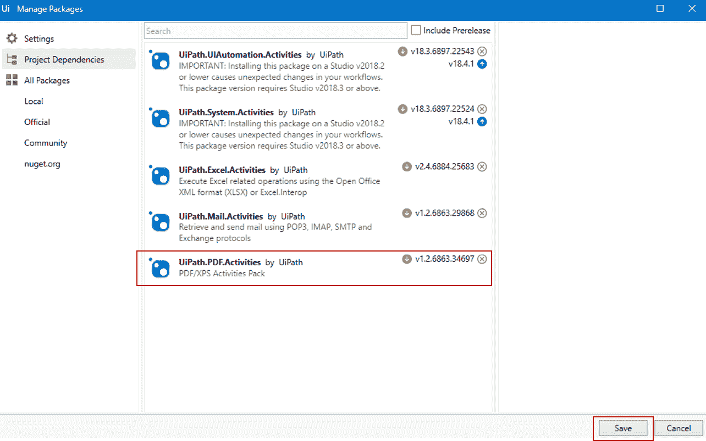
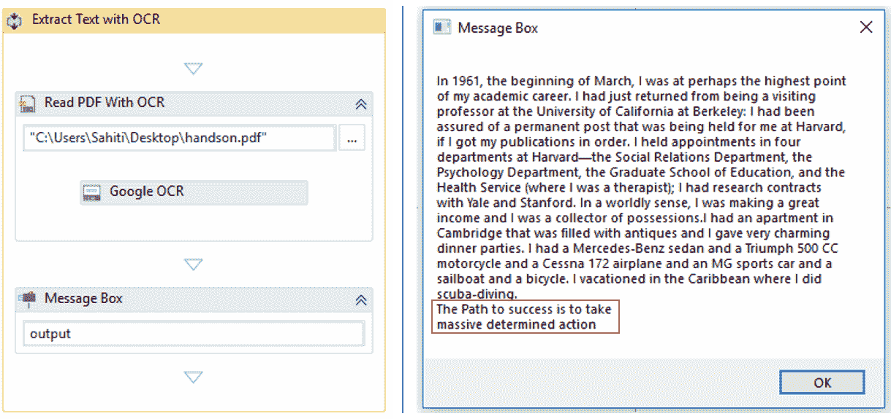
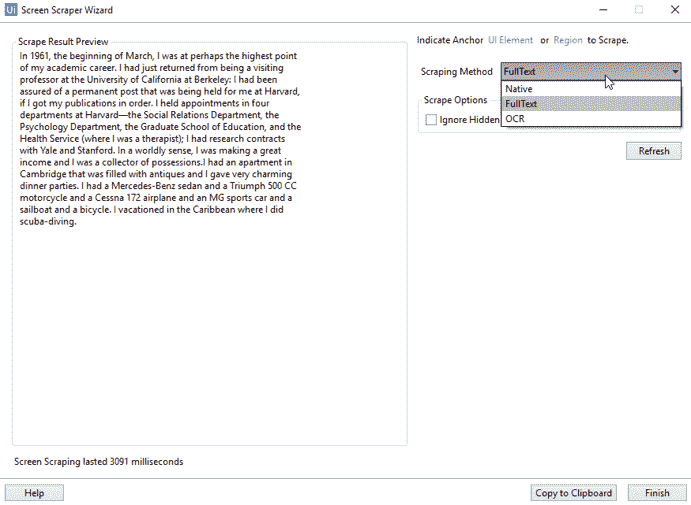
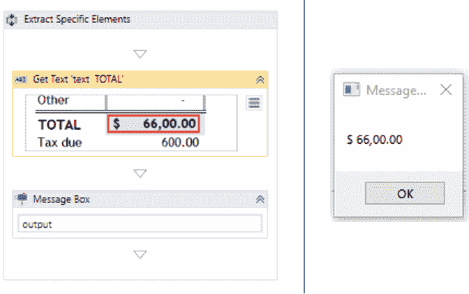
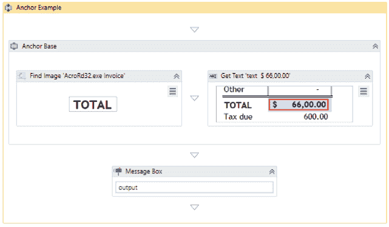

# UiPath PDF 数据提取–从 PDF 文档中提取文本

> 原文：<https://www.edureka.co/blog/uipath-pdf-data-extraction/>

**UiPath PDF 数据提取**

PDF 已经成为存储数据最可靠的格式之一。从高速增长的公司到小型企业，每个人都以这种格式存储各种数据。但是，想象一下，如果您必须从这些 PDF 文档中提取原始数据。有可能手动完成吗？嗯，简单的答案是否定的，因为这是一个相当乏味的任务，但是，如果你熟悉自动化中的某些服务，那么你可以很容易地自动化这个过程。

这个关于 UiPath PDF 数据提取的博客将向您简要介绍 [UiPath](https://www.edureka.co/robotic-process-automation-training) 提供的从 PDF 中提取数据的所有活动，无论是原生文本格式还是扫描图像。为了让你容易理解，我把这篇文章分成了以下两节:

*   [提取大文本](#Extracting%20Large%20Texts)
*   [提取特定元素](#Extracting%20Specific%20Elements)

让我们现在开始吧。

现在，在您真正开始提取数据之前，您需要确保的一件重要事情是您有 **UiPath。PDF.Activities** ，来自安装在您系统上的**管理包部分**。一旦你选择了软件包，点击保存，软件包将开始安装。请参考下面的快照。

  **图 1:** 管理包快照——ui path PDF 数据提取

在我们继续之前，如果你想学习使用 UiPath 从 pdf 中提取数据，你可以参考下面的视频。该视频将帮助您获得数据提取的实践经验。

## **UiPath PDF 数据提取| Edureka**

[https://www.youtube.com/embed/XwRunA11AKs?rel=0&info=0](https://www.youtube.com/embed/XwRunA11AKs?rel=0&info=0)

*本节关于 UiPath PDF 数据提取的课程将涵盖如何使用 UiPath 从 PDF 中提取数据的所有概念。*

现在，您已经知道必须安装哪个包，让我快速告诉您如何提取 PDF 文档中的大文本。

## **提取大型文本**

可能有这样的情况，我们有一个完全充满文本的文档，或者是文本和图像的混合。嗯，提取大文本属于这种类型的文档，其中文档只包含文本或文本和图像的混合。

UiPath 主要提供了两个选项来提取大型文本。这些活动是:

*   [阅读 PDF 文本活动](#Read%20PDF%20Text%20Activity)
*   [使用 OCR 活动阅读 PDF](#Read%20PDF%20with%20OCR%20Activity)

除了这些，我们还有[屏幕抓取向导](#Screen%20Scraping%20Wizard)。让我们从阅读 PDF 文本活动开始。

### **阅读 PDF 文本活动**

“读取 PDF”活动用于从只有*文本的 PDF 文件中提取数据。*因此，如果 PDF 中有图像，则该活动不是要选择的正确活动，因为它不会提取图像中存在的数据。

让我告诉你如何使用这个活动。但是，在此之前，你可以参考下面的快照，它展示了我将在这个博客中使用的示例 PDF 文件。在 PDF 文档中，上半部分是文本，引用部分是图像。

现在，我将创建一个序列，在这个序列中，我将提到必须从中提取数据的 PDF 目录，并且我将把输出写在一个消息框中。

***注意:** 你可以把输出写成任何格式的文件比如写文本文件，写行，写单元格活动等等。*

**第一步:**创建一个**序列**，如果您愿意，可以对其进行重命名。在这里，我把它重新命名为**摘录文字。**

**第二步:**拖拽**阅读 PDF 文本活动**。在活动中，提及要从中提取数据的 PDF 文档的路径。

**步骤 3:** 现在，在 **Read PDF Text Activity** 的**属性窗格**中，提及一个输出变量来查看输出。要设置输出变量，按下 **CTRL + K，**并给出一个名称。这里我已经提到作为**输出。**

**第四步:**之后，在序列中拖放一个消息框，然后在其中提到输出变量。

您的完整序列和输出应该分别如下面的快照所示。

  **图 2:** 带输出的读取 PDF 文本活动快照——ui path PDF 数据提取

在这里，您可以清楚地看到，我们图像中的文本没有被提取，只有样本 PDF 文档中的文本被提取。这就是你们如何使用阅读 PDF 文本活动。

现在，转到下一个活动，即使用 OCR 读取 PDF 活动。

### **用 OCR 活动读取 PDF**

使用 OCR 读取 PDF 活动用于从同时具有 ***文本和*** 图像的 PDF 文档中提取数据。因此，如果文档中除了文本之外还有任何图像，这个活动将从这些图像中提取数据并给出文本输出。

顾名思义，该活动使用光学字符识别来扫描 PDF 文档中的图像，并将所有文本作为变量输出。因此，它需要一个 ***OCR 引擎*** 。在 ***活动窗格***中，如果搜索 ***OCR 引擎*** ，会得到已安装引擎的列表。请参考右侧的快照。

现在，我将创建一个序列，在这个序列中，我将提到要从中提取数据的 PDF 目录，我将把输出写在一个消息框中。唯一的区别是，你会看到图像中的文本也被提取出来。

按照下面的步骤，创建自动提取图像中的文本。

**第一步:**创建一个**序列**，如果您愿意，可以对其进行重命名。在这里，我将其重命名为**用 OCR 提取文本。**

**第 2.1 步:**拖拽读取的带有 OCR 活动的 PDF。在活动中，提及要从中提取数据的 PDF 文档的路径。

**步骤 2.2:** 现在，搜索一个 OCR 引擎，根据安装的引擎拖放 OCR 引擎。这里我使用了**谷歌 OCR 引擎**。

**步骤 3:** 现在，在**的**属性窗格**中，使用 OCR 活动**读取 PDF，提及一个输出变量以查看输出。要设置输出变量，按下 **CTRL + K，**并给出一个名称。这里我已经提到作为**输出。**

**第四步:**之后，在序列中拖放一个消息框，然后在其中提到输出变量。

您的完整序列和输出应该分别如下面的快照所示。

  **图 2:**OCR 活动读取 PDF 并输出快照——ui path PDF 数据提取

在这里，您可以清楚地看到样本文档图像中的文本被提取出来。所以，这就是你如何使用阅读 PDF 的 OCR 活动。

好了，现在在我结束这一部分之前，让我提几个关于用 OCR 活动阅读 PDF 的要点

### **按键指针**

1.  在**阅读文本活动**和**用 OCR 阅读 PDF****活动**的**属性窗格**中，我们有一个参数叫做**范围**。该参数用于指定页码范围(1，所有，2-10 10-所有)，从中提取数据。

2.  上述两个活动都是**独立的，**也就是说，它们不需要打开其他应用程序。因此，即使您的 PDF 文档没有在屏幕上打开，这些活动也可以执行您的任务。

现在，除了上述活动之外，还有另一种提取数据的方式，即使用 ***设计页签内的 ***屏幕抓取向导*** 。***

## **屏幕抓取向导**

屏幕抓取向导是 UiPath 提供的一个功能，用于从许多平台抓取数据。

要使用此向导，您可以通过打开 PDF 文档来执行以下步骤。

**第一步:**点击**屏幕抓取图标**，选择 PDF 文档中您想要提取的部分。

**步骤 2:** 然后您将被重定向到屏幕截图向导，您可以在下面看到提取的文本。现在，在这里你可以选择**抓取方法(原生/全文/ OCR)** 。选择你想要的方法，点击**完成**。

** ** ** 图 3:**Screen Scraper 向导快照 UiPath PDF 数据提取

**第 3 步:**点击完成后，抓取向导将返回到您的序列。在这里**添加一个消息框**来查看输出，**提到输出变量**，这在返回序列中的**‘获取全文/获取 OCR 文本’活动**中提到。这里的变量名是‘AvlAvview’，我在消息框中提到过。

您的完整序列和输出应该类似于下面的快照。

**图 4:** 截图输出 UiPath PDF 数据提取

这里，您可以清楚地看到，样本文档图像中的文本与文档中的文本一起被提取出来。这就是如何使用 Screen Scraper 向导提取文本和图像。

现在，进入我们的下一部分，即 ***提取特定元素***

## **提取特定元素**

通过提取特定的元素，我的意思是可以有这样的情况，您想要提取特定的元素，比如从发票中提取总额，或者从简历中提取联系号码等等。

UiPath 主要提供了两个选项来提取大型文本。这些活动是:

*   [获取文本活动](#Get%20Text%20Activity)
*   [锚基地活动](#Anchor%20Base%20Activity)

### **获取文字活动**

这个活动简单地指向您想要提取的元素。使用这个活动，可以提取文本，并且可以使用输出变量。之后，您可以使用消息框或编写文本文件活动，并提及输出变量。

请参考下面的快照来检查序列和输出。在这里，我提取了 ***总金额*** ，然后将输出显示在一个 ***消息框*** 中。

  **图 5:** 获取文本活动和输出快照——ui path PDF 数据提取

这就是你如何使用获取文本动作。现在，进入我们的下一个活动，也就是基于锚的活动。

### **锚基活动**

基于锚的活动用于提取文本和图像。此活动由两个动作组成，因为它执行与另一个固定元素或锚点相关的动作。

因此，一个典型的基于锚点的活动通常有两个用在它下面的活动:

*   查找元素/查找图像活动
*   获取文本活动

#### **查找元素/查找图像活动**

查找元素/查找图像活动用于查找元素，即分别查找文本和图像。您可以根据需要使用这些活动。现在，由于 Anchor Base 活动是一个相对活动，您可以使用我之前提到的 Get Text 活动。

请参考下面的快照。这里我使用了***活动*** ，用 ***找到图片活动*** 和 ***得到文本活动*** 。在**查找图像活动**中，我选择了 Total，所以基本上会搜索 Total，然后在 Get Text 活动中，因为选择了值，所以会提取值。

  **图 6:** 锚点基础活动快照——ui path PDF 数据提取

同样，您也可以使用 Find Element 活动。

所以，伙计们！至此，我们结束了这篇关于 UiPath PDF 数据提取的博客。

我们在 edureka！还提供 ***[机器人过程自动化培训使用 UiPath](https://www.edureka.co/robotic-process-automation-training)*** 。如果你有兴趣把职业生涯转移到 [***RPA***](https://www.edureka.co/blog/robotic-process-automation/) ，你可以在这里报名[的课程，开始吧。](https://www.edureka.co/robotic-process-automation-training)

*有问题吗？请在这个 UiPath PDF 数据提取博客的评论部分提到它，我们会给你回复。*