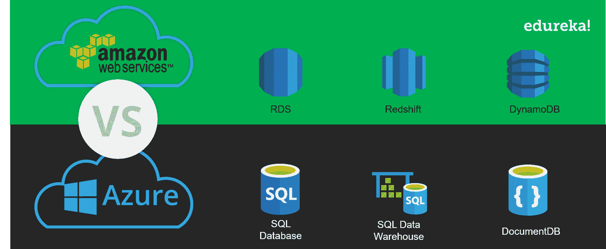

# AWS vs Azure:区别在哪里？

> 原文：<https://www.edureka.co/blog/aws-vs-azure/>

随着[云计算](https://www.edureka.co/blog/what-is-cloud-computing/)的全盛时期，各种云服务厂商竞相宣称在云领域的霸主地位。AWS 和 Azure 一直坚持不懈，并暂时占据了最高荣誉。然而，最困扰人们的问题是选择哪家云厂商？在这篇关于 AWS 与 Azure 的文章中，我们将比较这些云巨头，以帮助您找出更适合您的业务需求的产品。这将有助于你选择 [AWS 认证](https://www.edureka.co/aws-certification-training)或 [Azure 认证](https://www.edureka.co/microsoft-certified-azure-solution-architect-certification-training)中的一个，从职业角度来看，这两个认证在当前的云市场中具有巨大的价值。

我们将使用以下指标来比较这些服务提供商:

所以让我们从这篇 AWS vs Azure 的文章开始吧。

## **AWS vs Azure:通用特性**

该表根据一些一般特征对这些云巨头进行了充分的比较:

| **参数** | **AWS** | **蔚蓝色** |
| ***起始日期*** | Two thousand and six | Two thousand and ten |
| ***市场份额*** | 40% | thirty percent |
| ***开源*** | 对开源社区更加开放 | 对开源社区不太开放 |
| ***混合云*** | 这是一项正在进行的工作 | 在混合云市场表现出色 |
| ***领证*** | 提供更大的灵活性 | 赶上 AWS |
| ***Linux 生态系统*** | 对 Linux 的广泛支持 | 还在建设中 |
| ***加密等级*** | 高 | 低 |
| ***定价模式*** | 按小时收费 | 按分钟计费 |
| 柔韧性 | 更加灵活 | 灵活性较差 |
| ***用户界面*** | 用户友好且丰富的用户界面 | 不太直观 |

## **AWS vs Azure:简介**

AWS，即亚马逊网络服务，于 2006 年推出。它为云解决方案提供了 100 多种与数据库、基础设施管理、应用程序开发和网络安全相关的服务。亚马逊的子公司 AWS 在 16 个不同的地方设有办公室，数据中心遍布世界各地。客户可以通过全球的 AWS 服务器网络使用 AWS 服务。AWS 不是建立物理服务器，而是一种更便宜、更方便地购买大规模计算资源的方式。

Azure 或者微软 Azure 是 AWS 在云计算市场的竞争对手。Azure 于 2008 年推出，通过微软管理的服务器全球网络提供 600 多种服务。这些服务涉及 AI、ML、网络、存储、开发和虚拟机。

详细的，你甚至可以通过 [AWS 开发者培训](https://www.edureka.co/aws-developer-certification-training)查看 AWS 开发者的详细信息。

## **AWS vs Azure:优势**

### **AWS 的优势:**

AWS 有几个优点，使其成为企业和公司的热门选择。下面列出了一些好处:

*   **用户友好:**AWS 控制台易于使用。即使是初学者，也可以通过免费的 tier 帐户熟悉该平台，并开始探索。AWS 还有全面的文档，便于参考和更好地理解平台的服务和集成。
*   **安全性:**平台使用 IAM 或身份和访问管理，确保没有未经授权的用户可以访问平台。不仅如此，AWS 还有其他措施，如传输层安全证书，可以防止安全威胁。
*   **存储:**AWS 提供的高存储可用于备份数据和制作档案。AWS S3 存储桶以简单的方式负责数据存储。
*   **多区域备份:**由于 AWS 在世界各地都有数据中心，您的数据总是安全的。此外，还有一些区域可供用户存储实例和信息。这可以保护 it 免受意外故障和关键数据丢失的影响。

### **Azure 的优势:**

*   速度: Azure 快如闪电，因为它的数据中心遍布世界各地。因此，您可以通过升级服务计划和添加新功能来快速扩展现有基础架构。
*   **预建工具:** Azure 提供了节省部署时间的预建工具。因此，云架构师不需要从头开始创建。
*   端到端服务:微软 Azure 中的一切，从源代码控制到交付，都可以在单一环境中完成。这些服务的构建方式不会中断已经部署和运行的现有功能。

既然一般的比较已经过时，让我们来看看这两大巨头的一些定价数据。

## **定价**

Azure 和 [AWS 定价](https://www.edureka.co/blog/aws-pricing/)模式都提供按需付费结构。AWS 按小时收费，而 Azure 按分钟收费。当谈到短期订阅计划时，Azure 给你更多的灵活性。在某些服务的情况下，当架构开始扩展时，Azure 往往比 AWS 更贵。

## **计算服务**

这篇 AWS vs Azure 文章的下一个暂停是计算参数。当谈到云计算时，计算或计算服务是核心服务之一，这是可以理解的，因为我们在术语云计算中有“计算”一词。获得云计算专业知识的最佳方式是通过 AWS 云认证。

随着大量数据的产生，总是需要更快的处理方法。计算服务确保您可以在几分钟内生成实例，并在需要时立即扩展实例。AWS 和 Azure 都有满足这些需求的服务。你甚至可以通过 [AWS 云迁移课程](https://www.edureka.co/migrating-to-aws)了解迁移到 AWS 的细节。

AWS 有 [EC2](https://www.edureka.co/blog/ec2-aws-tutorial-elastic-compute-cloud/) 、[弹性豆茎](https://www.edureka.co/blog/aws-elastic-beanstalk/)、 [AWS Lambda](https://www.edureka.co/blog/aws-lambda-tutorial) 、ECS 等服务。Azure 也有类似的服务，如 Azure 虚拟机、应用服务、Azure 功能和容器服务等。所以很明显，这些服务是相当齐头并进的。

然而，当你比较成本时， **azure 实例往往会随着大小的增加而变得更加昂贵**。当你考虑一个拥有 256GB 内存和 64vPCU 的实例时，AWS 将收取你 3.20 美元/小时，而 Azure 将收取大约 6.76 美元/小时。

现在我们已经解决了计算问题，下一个大问题是存储这些数据，让我来解释一下。

## **仓储服务**

AWS 和 Azure 都提供长期运行且可靠的存储服务。AWS 有类似于[AWS S3](https://www.edureka.co/blog/s3-aws-amazon-simple-storage-service/)EBS 和[冰川](https://www.youtube.com/watch?v=HcYutDorr2Q)的服务，而 [Azure 存储服务](https://www.edureka.co/blog/azure-storage-tutorial/)有 Blob 存储、磁盘存储和标准存档。

 AWS S3 确保跨区域的高可用性和自动复制。对于 AWS 中的临时存储，每当实例启动和停止时，它就开始工作。在终止时，它提供类似于硬盘的块存储，可以附加到任何 EC2 实例或保持独立。

对于 Azure，它使用临时存储和页面 blobs 作为虚拟机卷。Azure 有一个块存储选项，作为 AWS 中 S3 的对应项。此外，Azure 还在他们的存储中提供了两种类型，冷存储和热存储。

这是关于存储服务的，现在让我们看看这两者在数据库服务方面的表现。

## **数据库服务**

如今生成的数据有不同的格式，因此保存这些数据的数据库也需要发展。AWS 和 Azure 都提供不同的数据库服务来处理结构化和非结构化数据。

如果你在寻找耐用性，AWS 有 [Amazon RDS](https://www.edureka.co/blog/rds-aws-tutorial/) ，而 Azure 有 Azure SQL Server 数据库。亚马逊 RDS 支持不同的数据库引擎，如 MariaDB、亚马逊 Aurora、MySQL、微软 SQL、PostgreSQL 和 Oracle，而说到 Azure，SQL Server 数据库顾名思义是基于 SQL 的。

当你考虑界面时，Azure 有一个更友好或更平滑的界面，而 AWS 提供了更多实例的更好的配置。可以看出，这两种工具都有值得夸耀的特点。如果我们要谈论这些服务的覆盖范围，它们与分析和大数据服务相当。AWS 有 [EMR](https://www.edureka.co/community/20202/how-to-launch-and-configure-an-emr-cluster-using-boto) 而 Azure 有同样的 HD 洞察力。 Azure 还提供 Cortana 智能套件，附带 [Hadoop](https://www.edureka.co/blog/hadoop-ecosystem) 、 [Spark](https://www.edureka.co/blog/spark-streaming/) 、Storm 和 [HBase](https://www.edureka.co/blog/hbase-architecture/) 。

在成熟度方面，AWS 尤其为大数据提供了更成熟的环境。

通过钦奈的 Azure 培训了解更多关于 Azure 的信息。

**网络服务**

亚马逊虚拟专用云(VPC)支持在云保护伞下创建隔离网络。这使用户能够创建子网、路由表、私有 IP 地址范围和网络网关。

微软 Azure 虚拟网络作为 VPC 的翻版，让你做 VPC 做的所有事情。两家供应商都有将内部数据中心扩展到云和防火墙选项的解决方案。

你可以通过以下关于 AWS 和 Azure 的视频更好地理解——学习哪一个

[https://www.youtube.com/embed/a67hzSr0Szw](https://www.youtube.com/embed/a67hzSr0Szw)

## **容器和编排支持**

我们已经确定 AWS 提供更成熟的大数据和分析产品。它拥有各种服务，涵盖物联网、移动应用开发或根据需要创建计算环境等领域。他们也为 Docker 提供支持。

微软在这方面是平等的，可能会更进一步，因为它通过 Azure HDInsight 等服务提供 Hadoop 支持。Azure 认为 Windows Server 2016 为 Windows 容器和 Hyper-V 容器提供了与 Docker 的集成。 平台也运行 Windows 或 Linux 容器。

这篇“AWS vs Azure”文章的最后一点是合规性，让我们试着去理解它，

## **顺从**

亚马逊与政府机构有着良好的关系，确保提供更好的政府云产品。它们还提供了强大的安全措施，确保个人用户在访问云时的适当访问，当公司处理敏感数据时，这一因素至关重要。

微软提供 50 多种兼容产品。一些著名的包括 ITAR，DISA，HIPAA，CJIS，FIPS。谈到安全性，它与 AWS 并驾齐驱。

## **AWS vs Azure:哪个更好？**

AWS 和 Azure 提供类似的服务，但基于多种因素，它们仍然有所不同。让我们来讨论一些不同之处:

### **开源社区**

微软 Azure 正处于成为一个更加用户友好的开源社区的阶段。这也是为什么 AWS 凭借其易于理解的文档和社区在市场上更受欢迎。

### **存储**

AWS 提供了高度可用的存储解决方案，它可以跨多个区域自动备份数据。每当实例启动时，AWS 中的临时存储就开始运行，一旦实例终止，临时存储就停止运行。它还提供块存储，如果需要，可以附加到 EC2 实例或单独保存。

### **ML 型号**

AWS 和 Azure 都有机器学习模型。然而，Azure studio 不像亚马逊的 Sagemaker 那样深入复杂的数据工程。

### **与云市场的兼容性**

AWS 仍在过渡，以便与混合云市场更加兼容。Azure 在这一领域更加成熟，因为它提供了扩展到内部数据中心之外的功能。其服务始终与私有云和公共服务相连接。

### **许可和许可证移动性**

Azure 和 AWS 都确保他们的客户在许可方面没有任何问题。客户只需要为他们使用的服务付费。在 Microsoft Azure 中，如果您已经购买了他们的服务，则有资格获得许可证移动性。

## **最终得分**

如上所述，两种云平台都显示出强大的能力，很难选出一个明显的赢家。Azure 在混合云和与微软的产品堆栈集成方面非常棒，而 AWS 则有更多的灵活性和额外的功能。这在很大程度上取决于您或您的组织的需求。所以要明智选择。要了解更多关于 Azure 的信息，请在线加入我们的 Azure 课程。此外，如果你希望掌握 Azure 和 DevOps 的原理，并致力于与商业世界有重大关联的分步任务，行业专业人士开发了 [Azure DevOps 认证](https://www.edureka.co/microsoft-azure-devops-solutions-training) 课程大纲。完成培训课程后，你可以申请全球薪酬最高的跨国公司顶级职位之一。

这就把我们带到了这篇关于“AWS 与 Azure”的文章的结尾，如果你希望在这些平台中的任何一个平台上运用你的知识，那么你可能想要看一看 Pune 的 [AWS 培训，以帮助你在该领域实现卓越。快乐学习。](https://www.edureka.co/aws-certification-training-pune)