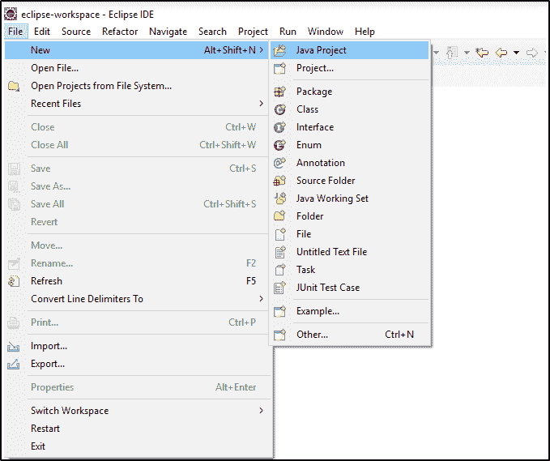
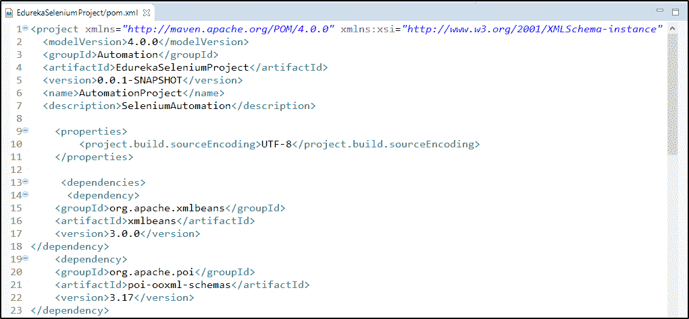
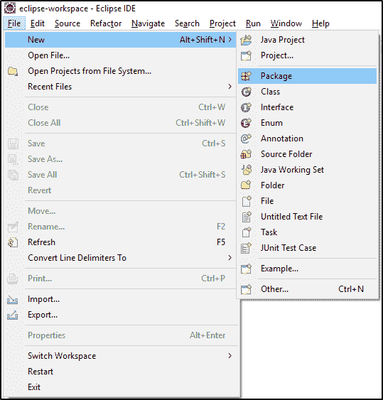

# 了解如何构建和执行 Selenium 项目

> 原文：<https://www.edureka.co/blog/selenium-projects/>

在之前关于 Selenium 的文章中，我们已经介绍了测试的基础知识，如 [Selenium IDE](https://www.edureka.co/blog/selenium-ide) 、 [Locators](https://www.edureka.co/blog/locators-in-selenium/) 、 [Waits](https://www.edureka.co/blog/waits-in-selenium/) 、 [Selenium Grid](https://www.edureka.co/blog/selenium-grid-tutorial) 、 [TestNG](https://www.edureka.co/blog/selenium-webdriver-tutorial) 等。在这篇“Selenium 项目”文章中，我将演示如何实现上述概念并牢牢掌握它们。当然，这将有助于测试你的项目分析、开发和处理技能。

以下是我将在本文中讨论的话题:

*   [硒简介](#IntroductiontoSelenium)
*   [硒项目](#SeleniumProjects)
    *   [自动化教育网](#AutomatingEdurekaWebsite)
    *   [机票预订申请](#FlightBookingApplication)
*   [硒案例分析](#SeleniumCasestudies)
    *   [企业管理系统](#EnterpriseManagementSystem)
    *   [体能数据自动化框架](#AutomationframeworkforPhysicalfitnessdata)

*您还可以在 [Selenium 培训](https://www.edureka.co/selenium-certification-training)中观看 Selenium 认证专家录制的 Selenium 项目，您可以通过示例详细了解这些主题。*

[https://www.youtube.com/embed/zaUeLghRDsM?rel=0&controls=0&showinfo=0](https://www.youtube.com/embed/zaUeLghRDsM?rel=0&controls=0&showinfo=0)

## **硒简介**


当涉及到在网络浏览器上进行自动化测试时，Selenium 是首选的工具。使用 Selenium，只能测试 web 应用程序。任何桌面(软件)应用程序或移动应用程序都不能使用 Selenium 进行测试。写功能测试用例很有帮助。它还提供了 n 个测试用例的可靠性能，显然是 web 应用程序最合适的自动化工具。

现在让我们深入研究这篇文章，看看有哪些有趣的项目可以帮助您了解更多关于 Selenium 的知识。

## **硒项目**

增加你对硒元素的了解的唯一方法就是做一些现实生活中的项目。在本文中，我将讨论两个重要的项目和一些案例研究。

让我们从我们的第一个项目开始。

## **自动化教育网**

***问题陈述 1:*** 考虑一个已经注册了 edureka 门户的候选人想要更新门户中所有可用的个人详细信息和职业兴趣。现在的任务是编写一个 Selenium 脚本来做同样的事情，并探索 edureka 门户。

*步骤:*

1.  登录到[爱德华卡](https://www.edureka.co)
2.  导航至“我的个人资料”
3.  更新职业和个人信息
4.  浏览博客并导航至主页
5.  退出门户

注意:在进行本练习时，请确保您已从 Edureka 的网站注销。

**解**

现在让我们看一下代码，以便更好地理解这一点。

```
package edureka;
import java.util.concurrent.TimeUnit;
import org.junit.AfterClass;
import org.openqa.selenium.By;
import org.openqa.selenium.Keys;
import org.openqa.selenium.WebDriver;
import org.openqa.selenium.chrome.ChromeDriver;
import org.openqa.selenium.interactions.Actions;
import org.openqa.selenium.support.ui.ExpectedConditions;
import org.openqa.selenium.support.ui.Select;
import org.openqa.selenium.support.ui.WebDriverWait;
import org.testng.annotations.AfterTest;
import org.testng.annotations.Test;
public class HandlingAllControls {
static WebDriver driver;
@Test( priority = 0)
public void EdurekaProfile() throws InterruptedException{
System.setProperty("webdriver.chrome.driver","C:Selenium-java-edurekachromedriver_win32chromedriver.exe");
driver = new ChromeDriver();
//Put a Implicit wait, this means that any search for elements on the page could take the time the implicit wait is set for before throwing exception
driver.manage().timeouts().implicitlyWait(15, TimeUnit.SECONDS);
//Launch the Edureka Website
driver.get("https://www.edureka.co/");
try {
Thread.sleep(1000);
} catch (InterruptedException e) {
e.printStackTrace();
}
driver.findElement(By.linkText("Log In")).click();
try {
Thread.sleep(1000);
} catch (InterruptedException e) {
e.printStackTrace();
}
Actions actions = new Actions(driver);
actions.moveToElement(driver.findElement(By.id("si_popup_email")));
Thread.sleep(2000);
actions.click();
actions.sendKeys("TestingEdureka@gmail.com");
Thread.sleep(2000);
actions.build().perform();
actions.moveToElement(driver.findElement(By.id("si_popup_passwd")));
Thread.sleep(2000);
actions.click();
actions.sendKeys("12345678");
Thread.sleep(2000);
actions.build().perform();
actions.moveToElement(driver.findElement(By.xpath("//button[@class='clik_btn_log btn-block']")));
Thread.sleep(2000);
actions.click();
actions.build().perform();
driver.findElement(By.xpath("//a[@class='dropdown-toggle trackButton']//img[@class='img30']")).click();
Thread.sleep(2000);
driver.findElement(By.xpath("//ul[@class='dropdown-menu user-menu profile-xs hidden-sm hidden-xs']//a[@class='giTrackElementHeader'][contains(text(),'My Profile')]")).click();
Thread.sleep(2000);
WebDriverWait waitElement = new WebDriverWait(driver,20);
waitElement.until(ExpectedConditions.visibilityOfElementLocated(By.xpath("//li[@class='active']//a[@data-toggle='tab'][contains(text(),'My Profile')]")));
driver.findElement(By.xpath("//li[@class='active']//a[@data-toggle='tab'][contains(text(),'My Profile')]")).click();
String Pagetitle = driver.getTitle();
driver.findElement(By.xpath("//div[@class='personal-details']//i[@class='icon-pr-edit']")).click();
Thread.sleep(2000);
driver.findElement(By.xpath("//input[@placeholder='Name']")).sendKeys("Edureka");
Thread.sleep(2000);
System.out.println("b");driver.navigate().to("https://learning.edureka.co/my-profile");
Thread.sleep(2000);
System.out.println("a");
System.out.println("abc");
driver.navigate().to("https://learning.edureka.co/onboarding/careerinterests");
Thread.sleep(3000);
Select dropdownCurrentJob = new Select(driver.findElement(By.xpath("//select[@name='interestedJob']")));
Thread.sleep(2000);
dropdownCurrentJob.selectByVisibleText("Software Testing");
Thread.sleep(2000);
Select dropdownEmployementType = new Select(driver.findElement(By.xpath("//select[@name='elementType']")));
Thread.sleep(2000);dropdownEmployementType.selectByVisibleText("Both");
Select dropdownCTC = new Select(driver.findElement(By.xpath("//select[@name='lastDrawnSalary']")));
Thread.sleep(2000);
dropdownCTC.selectByVisibleText("Not applicable");
driver.findElement(By.xpath("//label[contains(text(),'Yes')]")).click();
Thread.sleep(2000);
driver.findElement(By.name("preferredCity")).sendKeys("Mumbai");
Thread.sleep(2000);
driver.findElement(By.xpath("//button[@type='submit']")).click();
Thread.sleep(2000);
driver.navigate().to("https://learning.edureka.co/");
Thread.sleep(2000);
driver.findElement(By.xpath("//span[@class='user_name']")).click();
Thread.sleep(2000);
driver.findElement(By.xpath("//a[contains(text(),'Log Out')]")).click();
Thread.sleep(2000);
System.out.println("a");
try {Thread.sleep(2000);
} catch (InterruptedException e) {
e.printStackTrace();
}
}
}

```

因此，当你执行上述程序时，Chrome 驱动程序将启动谷歌 Chrome，导航至 edureka.co 网站[，输入登录用户名和密码。之后，它会浏览我的个人资料，更新个人和职业信息，然后注销账户。因此，在](https://www.edureka.co)[硒](https://www.edureka.co/blog/selenium-tutorial)的帮助下，一切都将自动化。

现在让我们来了解下一个项目。

## **自动化机票预订申请**

***问题陈述 2:*** 让我们考虑这个特殊的项目，我们将尝试自动化预订航班的过程。让我们看看如何使用硒来完成。

让我们将这个过程分成不同的步骤，以便更好地理解项目的运作。

*步骤:*

1.  我们将从初始化浏览器驱动程序开始，然后登录网页
2.  根据用户需求查找航班
3.  选择航班并预订
4.  抓取确认页面的截图

现在让我们来看看创建这个项目的步骤。

**解**

**Step 1: Create a Java Project**

转到文件- >转到新建- >其他- > Maven 项目新建一个 Java 项目。下图描述了同样的情况。

****

**第二步:将依赖项添加到 pom.xml 文件**

****

**第三步:创建包**

在 src/main/java 文件夹和 src/test/java 文件夹下创建包，并开始编写代码。

###  **步骤 4:编写代码运行测试用例**

如果您希望了解详细的解决方案和完整的项目，可以查看这篇关于 ***[Selenium Maven 项目与 Eclipse](https://www.edureka.co/blog/create-selenium-maven-project/)*** 的文章。

因此，这一切都是为了实现航班预订应用程序的自动化。现在让我们更深入地研究这篇文章，了解几个重要的 Selenium 实时案例研究。

## **硒案例分析**

### **案例分析 1:企业管理系统**


**客户端**:信息技术服务提供商 **行业** : IT **解决方案提供商** : Mindfire 解决方案 **技术:** Selenium 3.1、Eclipse、 [Java](https://www.edureka.co/blog/java-tutorial/) 、Ant

**情况**

*企业管理系统*是一个包含许多模块的复杂应用程序。客户及其客户组织使用该应用程序的各种模块进行企业沟通、项目管理、客户和销售渠道管理、人力资源管理、会计、知识学习管理、内部社交网络等。

**挑战**

有大量的测试案例来检查应用程序的功能和工作流程。对于客户来说，对应用程序中的任何变化进行手动测试变得越来越困难和昂贵。因此，需要自动化测试工作，这需要非常有效和高效。

**解**

**步骤 1:** 在对应用程序和各种自动化工具进行全面分析后，Selenium 似乎是功能和回归测试的最佳工具，它非常适合客户的需求。

**步骤 2:** 接下来，解决方案提供商检查应用程序，了解其功能和工作流程，并准备自动化计划。

第三步:之后，他们设计了一个高级混合框架，使得脚本非常容易运行，即使对于非技术用户也是如此。此外，开发了足够多的脚本集，以便在应用程序发生变化时简单运行。

**第四步:**这不仅节省了资金，而且自动化脚本运行时间更短，同时还生成了非常易读和易懂的 HTML 报告。

**第五步:**这些 HTML 报告显示诸如通过/失败结果、脚本执行时间、屏幕截图等信息。，分别针对每个测试用例以及测试步骤。这些结果也可以通过脚本自动通过电子邮件发送给任意数量的人。

### **案例分析二:自动化体质数据**

在本案例研究中，我们的客户由一组专家提供培训、营养和理疗项目。他们利用与健身器集成的软件，根据以前的锻炼、每周锻炼挑战和会员目标为用户提供推荐的训练锻炼。

客户希望为他们的应用程序实现一个功能测试自动化框架，以便在新版本发布时执行回归测试。

**挑战**

功能测试自动化框架必须支持 Google Chrome 网络浏览器。他们需要以这样的方式实现框架，使得脚本维护保持在最低限度。

**策略**

基本上，框架的解决方案提供商利用 Selenium WebDriver 来自动化业务交易。RTTS(解决方案提供商)利用页面对象设计模式来帮助最小化应用程序经历 UI 更改时所需的维护。

**解**

实现的自动化框架是 100%开源的，组件如下:

*   [月食](https://www.edureka.co/blog/selenium-installation/)
*   Java
*   硒
*   JUnit
*   阿帕奇蚂蚁
*   颠覆

**步骤 1:** 一旦框架就位，就利用页面对象设计模式为应用程序中的每个页面创建类。页面对象类为测试人员提供了与每个页面交互的接口。

**第二步:**然后通过调用页面对象类的方法来创建测试脚本，这些方法执行特定的事务，例如作为注册用户登录、创建新用户、创建锻炼等。所有工作都被提交给 Subversion 存储库进行版本控制。

**第三步:**由于 Selenium WebDriver 缺乏任何内置的日志记录机制，所以使用了一个定制的解决方案，使用开源 Java API JExcel 将日志记录到 excel 文件中。执行的每个命令和验证都被记录下来。这实际上提供了测试脚本失败的详细视图，以及导致失败的执行步骤。

**第 4 步:**一旦框架就位并创建了几个测试脚本，就向客户的员工提供关于 Selenium 2 用法的培训。

**第五步:**培训之后，QA 测试人员开始为遇到的任何问题创建测试脚本。

**第六步:**在编写脚本的时候，大部分问题是由于在应用程序中大量使用 AJAX 造成的。由于 AJAX 只会更新应用程序的一部分，而不是整个页面，因此 [Selenium WebDriver](https://www.edureka.co/blog/selenium-webdriver-tutorial) 测试脚本执行命令的速度比 AJAX 更新 UI 的速度要快。Selenium Waits expected conditions 类用于在执行下一个 Selenium WebDriver 命令之前等待满足某些条件，如可见性。

**第 7 步:**现在，在执行一个测试套件之后，生成报告。为了创建报告，Apache Ant 用于执行 JUnit 测试并生成 JUnit 报告。该报告显示了失败和通过的测试数量的指标。还可以深入查看报告，以显示每个故障的附加信息以及导致故障发生的原因。

**第八步:**最后，用支持不同浏览器版本的不同操作系统的虚拟机建立一个本地服务器。因此，虚拟机将提供一个使用 Selenium 网格执行全面回归测试的环境。

**好处**

通过选择开源框架，不需要花费任何成本就可以获得建立框架所需的组件。 实施 Selenium 网格还节省了额外的成本。最初，客户选择利用第三方公司来执行 Selenium WebDriver 测试脚本。使用第三方公司的成本是**149 美元/月**，并且对可以执行的测试数量有限制。有了 [Selenium Grid](https://www.edureka.co/blog/selenium-grid-tutorial) ，客户端现在能够运行 [Selenium WebDriver](https://www.edureka.co/blog/selenium-webdriver-tutorial) 测试脚本，没有任何限制或费用。

我希望你对这些真实案例研究感兴趣。至此，我们结束了关于 Selenium 项目的文章。*我希望你们喜欢这篇文章，并增加你们知识的价值。*

*如果您希望学习 Selenium 并在测试领域建立自己的事业，那么请在这里查看我们的交互式在线直播 **[Selenium 认证培训](https://www.edureka.co/selenium-certification-training)** ，它将为您提供全天候支持，在整个学习期间为您提供指导。*

*有问题吗？请在 Selenium 项目文章的评论部分提到它，我们将会回复您。*