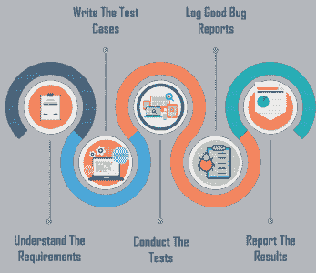
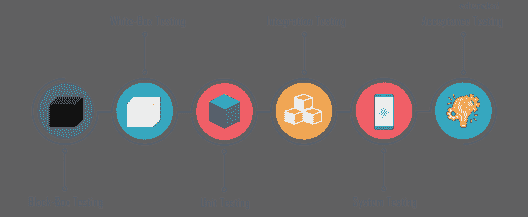

# 手动测试完全指南:你需要知道的一切

> 原文：<https://www.edureka.co/blog/what-is-manual-testing/>

每个软件项目都有三个至关重要的方面，即成本、时间和质量。这是通过定期测试软件实现的。软件测试是任何 IT 项目不可或缺的一部分。对软件进行测试是为了检测错误并找出可能对用户体验产生负面影响的问题。测试大致分为手工测试和[自动化测试](https://www.edureka.co/blog/automation-testing-tutorial/)。通过这个“什么是手工测试？”文章中，我们将学习手工测试。

让我们来看看本文涉及的主题:

*   [什么是手工测试？](#ManualTesting)
*   [手工测试的优势](#ManualTestingPros)
*   [手工测试和自动化测试的区别](#ManualvsAutomation)
*   [什么时候使用手工测试？](#TestingScenarios)
*   [如何进行手工测试？](#ManualTestingProcess)
*   [手动测试的类型？](#ManualTestingTypes)

## **什么是手工测试？**

*手动测试是手动测试应用程序以发现缺陷和 bug 的实践。测试用例由人类手动执行，没有任何工具或脚本的支持。*

这意味着有人实际上在一个设备上模拟终端用户的角色来评估软件的众多组件，包括设计、功能和性能。他们在没有工具或脚本支持的情况下点击 web 应用程序的多个元素或单元。当自动化测试不可能时，这是很有帮助的。

## **手工测试的优势**

下面列出了手工测试软件的一些优点:

当你开始测试时，你必须做出的一个主要决定就是你是要手动测试还是使用自动化测试。所以，你应该意识到手工测试和自动化测试有什么不同。我们结账吧。

## **手工测试和自动化测试的区别？**

下表列出了手工测试和自动化测试的主要区别。

| **特色** | **手动测试** | **自动化测试** |
| *用户界面* | 保证用户友好性和改善的客户体验 | 不保证积极的客户体验和用户友好性 |
| *准确性 &可靠性* | 低，因为手动测试更容易出现人为错误 | 高，因为使用了工具和脚本 |
| *检测时间* | 高 | 相对较低 |
| *投资成本* | 低，投资回报率(ROI)也低 | 高，投资回报率(ROI)也高 |
| *预算所需* | 不是很高 | 比较高 |
| *人元素* | 允许人类观察以找出任何故障 | 不涉及人类观察 |

正如你所看到的，手工测试也有它的缺点。这就是为什么不建议对每个测试场景都应用手动测试的原因。但是在某些场景中，手工测试是最适合的。让我们来看看。

## **什么时候使用手工测试？**

手动测试最适合以下情况:

**试探性测试**

当测试的特点是写得很差的规范文档，和/或执行时间很短时，那么手工测试是更可取的。探索性测试需要测试人员的知识、创造力、分析技能和经验。基本上，我们需要人类技能来执行这个场景中的测试过程，这可以通过手动执行测试来实现。

在可用性测试中，测试人员需要衡量软件或产品对最终用户来说有多友好、有效或方便。这同样需要人的直觉和经验，并且不能通过工具来执行，必须人工严格监督。所以手动方法更好。

**临时测试**

临时测试是一种非正式的测试，因此没有特定的方法。因为它是在没有任何计划和文档的情况下执行的，所以测试人员的理解和洞察力是唯一重要的因素。在这种情况下，手动测试是一个不错的选择。

现在我们知道了什么时候使用手动测试，让我们在“什么是手动测试”这篇文章的下一部分看看如何执行手动测试。

## **如何进行手工测试？**

在这里，测试人员通过遵循一组预定义的[测试用例](https://www.edureka.co/blog/test-case-in-software-testing/)对软件进行人工测试。让我们仔细看看这是如何做到的。

1.  第一步是理解软件的需求，这样你就知道需要测试什么，以及缺陷的分类。
2.  下一步是编写测试用例。它们指导您完成一系列步骤，以测试软件应用程序中的功能和不同场景。
3.  当测试用例足够好并且测试环境准备好时，执行测试用例。相应地将测试用例标记为“通过”、“失败”或“跳过”。
4.  作为一名测试人员，你负责记录错误。当您遇到 bug 时，您需要将缺陷通知开发团队，并提交一份 bug 报告。
5.  最后，您需要创建一份详细的测试结果报告。它应包括哪些测试需要重新运行、多少测试失败、多少测试被跳过的详细信息。

虽然手动执行所有这些步骤需要大量的工作，但是为了确保良好的用户体验和高水平的质量，手动测试是必要的。对于“什么是手动测试？”文章让我们讨论手动测试的类型

## **手工测试有哪些类型？**

下面列出了手动测试的类型。但是，这些类型的测试可以手动执行，也可以使用测试自动化工具来执行。

**黑盒测试**

顾名思义，在黑盒测试中，测试人员不了解应用程序的代码或结构。他只是与应用程序进行交互，并测试应用程序的功能性和非功能性行为。测试人员可以使用各种黑盒技术来查找 bug 和缺陷。

**白盒测试**

在白盒测试中，测试人员知道应用程序的代码和结构。因此，这种类型的测试通常被称为玻璃盒测试。大多数情况下，开发人员使用这种类型的测试来执行单元测试。测试人员可以使用各种各样的白盒技术来查找 bug 和缺陷。

**单元测试**

[单元测试](https://www.edureka.co/blog/what-is-unit-testing)是一种测试最小代码片段的方法，该代码片段被称为系统中可以逻辑隔离的单元。它主要关注独立模块的功能正确性。一个单元几乎可以是你想让它成为的任何东西——一个特定的功能，一个程序，或者应用程序中的一个特定方法。

**集成测试**

当软件的不同单元、组件和模块集成在一起时，在单元测试之后执行。这里的主要目的是验证模块的功能性、稳定性和可靠性。集成测试的重点是检查所有模块之间通信的正确性。

**系统测试**

系统测试是集成测试之后的下一步。它是在一个完整的、完全集成的软件产品上进行的，以评估系统的行为，并根据要求检查集成软件计算机系统的完整工作情况。有各种系统测试技术，如功能、性能、可伸缩性、压力和回归测试。

**验收测试**

用户验收测试是基于用户需求和功能处理进行的正式测试。这种类型的测试涵盖了最终用户的真实场景。它需要正确地完成，因为它将为您提供结果，在此基础上，高级管理层将批准或拒绝哪个软件产品。

就是这样！我们已经到了博客的结尾。手工测试也有它的缺点。这非常耗时，而且更容易出错，因为测试直接依赖于人。您需要手动和自动测试的正确组合来获得最佳结果。您需要在任何给定的测试情况下找到最佳的方法，以便在预算和时间内获得高质量的输出。

*如果你发现这个“什么是手工测试？* *"文章相关，* *查看由 Edureka 提供的*在线直播 **[硒认证培训](https://www.edureka.co/selenium-certification-training)*****，edu reka 是一家值得信赖的在线学习公司，在全球拥有超过 25 万名满意的学习者。*

*有问题吗？请在“什么是手工测试”的评论部分提到它。“文章我们会给你回复的。*