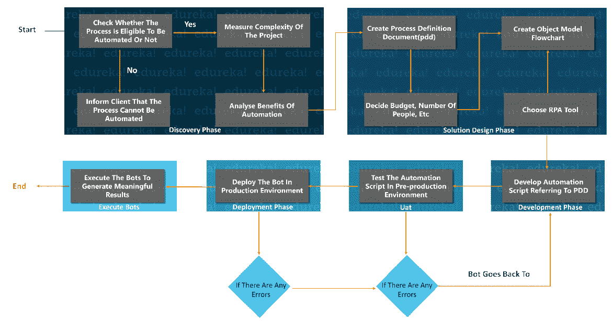

# RPA 生命周期—您需要了解的关于 Bot 开发不同阶段的所有信息

> 原文：<https://www.edureka.co/blog/rpa-lifecycle>

[机器人流程自动化](https://www.edureka.co/blog/what-is-robotic-process-automation/)在今天的市场上已经不是什么新鲜词了。随着数百家跨国公司使用这项技术来实现业务流程自动化，这无疑增加了对 [RPA 熟练专业人员](https://www.edureka.co/robotic-process-automation-training)的需求。好吧，知道了这个事实，肯定会提出一个关于“机器人是如何构建的”的问题。在这篇关于 RPA 生命周期的文章中，我将讨论 bot 开发的不同阶段。

本文将涵盖以下主题:

*   [什么是机器人过程自动化？](#What%20is%20Robotic%20Process%20Automation)
*   [RPA 的生命周期](#Lifecycle%20of%20RPA)
    *   [发现阶段](#Discovery%20Phase)
    *   [方案设计阶段](#Solution%20Design%20Phase)
    *   [发展阶段](#Development%20Phase)
    *   UAT
    *   [部署阶段](#Deployment%20Phase)
    *   [执行僵尸程序](#Execute%20Bots)

在我谈论 RPA 生命周期阶段之前，让我告诉你什么是 RPA？

## 什么是机器人过程自动化？

在机器人/软件的帮助下自动化工作流程以减少人工参与的过程被称为 [**机器人流程自动化。**](https://www.edureka.co/blog/rpa-tutorial/)

在这里，你主要需要了解三个术语:*机器人、过程*和*自动化。*让我给你逐一解释这些术语。

*   **机器人:**模仿人类行为的实体称为机器人。
*   **过程:**导致有意义活动的一系列步骤。比如泡茶的过程或者你喜欢的菜等等。
*   **自动化:**任何由机器人完成的没有人为干预的过程。

如果我们将所有术语总结在一起，那么，在没有任何人类干预的情况下，模仿人类的行动来执行一系列步骤，从而导致有意义的活动，这被称为 [**机器人过程自动化**。](https://www.edureka.co/blog/robotic-process-automation/)

现在，您已经知道什么是 RPA，让我们深入探讨本文的主题，即 RPA 生命周期。

## **RPA 生命周期**

RPA 生命周期主要有 5 个阶段和一个附加阶段，即执行构建的 bot。参考下图。

### **发现阶段**

在这个阶段，流程架构师分析客户的需求。基于客户给出的需求，决定该过程是否可以自动化。如果流程可以自动化，那么就分析流程的复杂性。最后，自动化带来的好处被写了下来。

在发现阶段之后，下一个阶段是解决方案设计阶段。那么，让我们讨论同样的问题。

### **方案设计阶段**

在这个阶段，设计自动化任务的解决方案或步骤。技术架构师与流程架构师合作制定流程定义文档(PDD ),其中包含每个流程/步骤的详细信息。

一旦分析了所有客户需求并制定了流程定义文档，下一步就是确定项目的一些需求，如预算、花费的时间、参与项目的人数等等。

然后，你必须创建一个对象模型图或流程图来理解流程。在此的帮助下，您将能够理解哪个步骤必须自动化，以及它的需求是什么。

在你创建流程图之后，你必须选择一个 [RPA 工具](https://www.edureka.co/blog/rpa-tools-list-and-comparison/)来自动化你的任务，然后，你就可以开始开发机器人了。

所以，下一个阶段是发展阶段。

### **发展阶段**

开发阶段是自动化开发人员在所选 RPA 工具中创建自动化脚本的阶段。该工具可以是市场上出现的大量工具中的任何一种，但是，当今市场上排名前三的工具是 [UiPath](https://www.edureka.co/blog/uipath-tutorial/) 、[蓝棱镜](https://www.edureka.co/blog/rpa-blue-prism/)、&、 Automation Anywhere 。此外，自动化脚本是通过引用先前创建的过程定义文档来创建的。根据要自动化的任务或所需自动化的种类，可能需要也可能不需要编码；但是，有大量的场景你根本不需要编码。

现在，一旦你的机器人被开发出来，下一步就是测试开发出来的机器人。

### **【UAT】(用户验收测试)**

在 RPA 生命周期的这一阶段，开发的机器人由[测试](https://www.edureka.co/blog/software-testing-tutorial/)团队或开发团队本身进行测试。该机器人在生产前环境中进行测试，以测试用户如何使用该机器人来自动执行特定任务。如果测试成功，那么它将进入下一阶段，但是，如果测试失败，那么机器人将返回到开发阶段，在该阶段中发现的错误将被纠正并再次测试。

成功测试您的机器人后，RPA 生命周期的下一个阶段是部署阶段。

### **部署&维护阶段**

在开发和测试一个机器人之后，该机器人被部署到生产环境中。现在，一旦部署了机器人，用户就可以使用它了。但是，如果机器人有任何问题，那么它会返回到开发&测试团队来解决问题。

嗯，这些是 RPA 生命周期的主要阶段。

现在，最后的阶段是执行机器人。

### **执行僵尸程序**

在这个阶段，机器人被执行，然后被检查以产生有意义的结果。所以，朋友们，我们就此结束这篇文章。为了帮助你理解构建一个 bot 的流程，你可以参考下图:

如果您希望进一步了解 RPA 生命周期，我建议您观看下面这段有趣的视频。

## RPA 生命周期|机器人流程自动化教程| RPA 培训| Edureka

[https://www.youtube.com/embed/MsHqN-uJWqc?rel=0&showinfo=0](https://www.youtube.com/embed/MsHqN-uJWqc?rel=0&showinfo=0)

这段关于 RPA 生命周期的视频将通过一个示例帮助您了解构建机器人的不同阶段。

*现在您已经了解了 RPA 的生命周期，请查看由 Edureka 提供的使用 UiPath 的 **[RPA 培训](https://www.edureka.co/robotic-process-automation-training)** & **[RPA 培训使用 Automation Anywhere](https://www.edureka.co/automation-anywhere-certification-training)** ，edu reka 是一家值得信赖的在线学习公司，拥有遍布全球的 250，000 多名满意的学习者。这两个认证将分别帮助你深入了解 UiPath 和 Automation Anywhere。*

*有问题吗？请在“RPA 生命周期”的评论部分提及此事，我们会尽快回复您。*