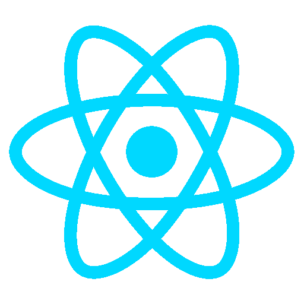

# flutter vs React Native——你应该学哪个？

> 原文：<https://www.edureka.co/blog/flutter-vs-react-native/>

移动应用行业经历了一次重大的分叉——[Android](https://www.edureka.co/blog/android-tutorial/)和 [iOS](https://www.edureka.co/blog/swift-tutorial) 。完美和强大的移动应用程序增加参与度，保持业务蓬勃发展。如今，公司正试图通过采用跨平台的方法来开发移动应用程序来节省资源。在这篇博客中，我将比较跨平台移动应用市场上最热门的两个框架，即 ***Flutter 和 React Native*** 。

本博客涵盖了以下主题

*   [什么是颤振？](#what-is-flutter)
*   [什么是 React Native？](#what-is-react-native)
*   [颤振 vs 反应原生](#language)
    *   [编程语言](#language)
    *   [安装](#installation)
    *   [文档](#documentation)
    *   [架构](#architecture)
    *   [特性和 API](#features)
    *   [开发人员生产力](#developer-productivity)
    *   [社区支持](#community)
    *   [测试](#testing)
    *   [发布自动化支持](#release-automation)
    *   [CI/CD 支持](#devops-support)

| **颤动** | **反应原生** |
| 使用飞镖 | 使用 JavaScript |
| 安装需要额外的步骤，例如设置路径 | 通过 NPM 轻松安装 |
| 详细且易于遵循的文档 | 文档缺少大量重要信息 |
| 完整独立的架构 | 体系结构依赖于桥，导致性能低下 |
| 丰富的特性和 API 拥有你需要的一切 | 高度依赖第三方库 |
| 生产力随着复杂性而降低 | 鼓励开发人员的生产力 |
| 比 React 小的社区 | 庞大而活跃的社区 |
| 通过模块内置测试支持 | 测试是通过第三方应用程序完成的 |
| 发布自动化被很好地记录 | 发布自动化也依赖于第三方应用程序 |
| 内置 CI/CD 支持 | 可以通过第三方设置 |

## **什么是颤振？**

Flutter 是 Google 对上面讨论的跨平台开发问题的回应。谷歌多年来一直在为 Flutter 的开发投入资源，直到 2017 年在上海的主题演讲中向公众发布。

Flutter 可以用来快速高效地创建 iOS 和 Android 的移动应用程序。说服一些开发人员转向 Flutter 的主要因素是该项目将有一个单一的代码库。尽管只有一个代码库，但 Flutter 框架提供了足够的灵活性来包容两个平台的差异。

如果你想了解更多关于颤振的知识，你可以看看我的[颤振教程](https://www.youtube.com/watch?v=9XMt2hChbRo)。

## **什么是 React Native？**

## ****

React Native 是另一个跨平台的移动应用开发框架。它比 Flutter 存在的时间更长，因此也有更大的社区。React Native 是由一位名叫乔丹·沃克的软件开发人员创建的，他是脸书的一名雇员。他的主要灵感来自 XHP，一个 PHP 的 HTML 组件框架。它最初是在 2011 年的脸书新闻订阅上实现的，后来在 Instagram 应用程序上也实现了。

既然我们对这两个框架的传承和用法有了一个简单的概念，让我们开始两者之间的战斗:Flutter vs React Native。

## **Flutter vs React 本地编程语言**

Flutter 是基于谷歌开发的 Dart 语言构建的。这种语言被认为是开发人员社区中的一个利基，但绝不是一种难懂的语言。如果你有任何关于[面向对象编程](https://www.edureka.co/blog/object-oriented-programming/)的经验，那么学习 Dart 将是一件轻而易举的事情。在[官方文档](https://dart.dev/guides)中可以很容易地找到完整的指南和示例。 React Native 则使用 *JavaScript 作为其基础语言*。多年来， [JavaScript](https://www.edureka.co/blog/what-is-javascript/) 因其简单的学习曲线和广泛的使用而广受欢迎。如果有人精通 JavaScript，他们可以开始使用 React Native 开发应用程序，而不用浪费太多时间来熟悉这个框架。

因此，我们可以说，就编程语言而言，React Native 是重点，因为与 Dart 和 Flutter 相比，它更容易进入。

****

## **颤振与反作用本地安装**

在比较两个框架时，安装是很重要的一部分。安装应该很容易，没有复杂的配置过程。以上，整个安装过程应该在官方文档中有很好的记录。 Flutter 可以通过从各自的 *[官方页面](https://flutter.dev/docs/get-started/install)* 下载各自平台的二进制文件，然后设置几个路径变量来安装。同时，React Native 可以使用 *NPM* 轻松下载。具有 JavaScript 背景的开发人员会发现让 React 原生运行起来非常简单。在 MacOS 方面，React Native 必须使用 *HomeBrew* 下载。

Flutter 和 React 都缺乏针对特定操作系统的本机包管理器的一行程序安装，但是 Flutter 安装似乎需要额外的步骤来将二进制文件添加到 PATH 并从源代码下载。因此，我的观点又回到了本土。

****

## **颤振与自然反应——文档**

在开始一个项目之前，有许多必要的步骤，包括配置使用中的框架及其外围需求。这可能包括一些琐碎的任务，比如为正确的语法高亮设置一个 IDE。如果没有适当的文档，即使像这样的琐碎任务也会变得非常难以理解。

Flutter 用一个结构良好、详细且易于理解的文档弥补了它作为框架和开发专用语言的不足。如果一个人虔诚地遵循文件，没有石头会被留下。《入门指南》提供了关于 ide 设置、项目配置等复杂的说明。Flutter 还有一个基于命令行的工具，名为 *Flutter Docto* r，它通过显示已经安装的内容以及仍然需要安装的元素来指导用户完成整个配置和设置过程。 React Native，在结构化文档方面甚至比不上旋舞。将'*初学者指南*'与两者进行比较，我们发现 React Native 对开发人员知道多少做了很多假设，因此似乎缺乏必要的信息。例如，这里几乎没有关于 Xcode 命令行工具的信息。文档直接跳转到创建新项目的步骤。

****

## **颤动 vs 反应本地架构**

当对开发框架的选择做出明智的决定时，一个重要的标准总是架构。拥有架构的工作知识通常有助于执行项目可能需要的定制调整。除此之外，架构应该是独立的，也就是说，它不应该太依赖第三方服务来作为一个整体。

Flutter 使用 Dart 框架，其中内置了大部分组件。因此，它的规模更大，并且通常不需要桥来与本机模块通信。Dart 框架使用 *Skia C++引擎*，它拥有所有的协议、组合和通道。颤振引擎的架构在他们的 [GitHub Wiki](https://github.com/flutter/engine/wiki) 中有详细的解释。简而言之，Flutter 引擎本身就具备了 app 开发所需的一切。 React Native 架构严重依赖 *JS 运行时环境架构*，也称为 *JavaScript Bridge。*JavaScript 代码在运行时编译成本机代码。React Native 采用了来自脸书的  [通量](https://facebook.github.io/flux/) 架构。有一篇关于 **React Native** 核心架构的详细文章。简而言之，React Native 使用 JavaScript 桥与本机模块通信。

Flutter engine 在框架本身中有大部分原生组件，它并不总是需要一个桥来与原生组件通信。然而，React Native 使用 JavaScript 桥与本机模块通信，这导致了较差的性能。

****

## **Flutter vs React Native–特性和 API 组件**

选择跨平台的方法来开发应用程序会有一些妥协，*最大的妥协是不能直接访问本机特性，如蓝牙、各种传感器等。大多数跨平台框架都提供了补充 API，这些 API 提供了对这些特性的访问。 在 Flutter 的情况下，它的 API 富含访问这些原生特性所需的一切。该框架捆绑了 UI 渲染组件、设备 API 访问、导航、测试、状态管理和库加载。如果你碰巧选择了 flutter 作为你对框架的选择，那么你会在 Flutter 本身找到你需要的一切，而不需要依赖第三方应用。*

React Native 提供了最基本的特性和 API 组件。使用 React Native，开发者只需提供 UI 渲染和设备访问模块。对于原生特性，React Native 严重依赖第三方库和模块。这显然使 Flutter 在特性和 API 方面成为赢家。

## **Flutter vs React Native-Developer 生产力**

选择的框架应该总是鼓励开发人员多产。这确保了在规定的时间内交付高质量的应用程序。

Flutter 是一个相对较新的框架。因此，虽然简单的东西几乎可以在短时间内完成，但随着应用程序变得越来越复杂，对一些开发人员来说，跟上进度就成了一件乏味的工作。如果开发人员不习惯 Dart，他/她可能不得不花大量时间研究和学习如何实现他想要的东西。 另一方面，React Native 是基于 JavaScript 的，因此从可用的资源中茁壮成长。此外，由于 JavaScript 相当容易学习，任何可能需要实现的新特性都可以很容易地学习并快速实现。

因此，如果您关注的是开发人员的工作效率，那么 React Native 是一个不错的选择。

****

## **Flutter vs React Native–社区支持**

一个活跃的社区意味着更快的错误报告，更有创造性的功能建议，最重要的是，一个解决复杂问题的好机会。 Flutter 是两个框架中较新的一个，显然比 React Native 有更小的社区。然而，Flutter 社区正在经历巨大的增长。在谷歌这样的公司的支持下，Flutter 也赢得了许多人的信任，可以在他们的项目中实现它。此时此刻，React Native 肯定有一个更加多样化的社区，甚至可以举办国际会议。不过，如果有足够的时间，我认为 Flutter 也会出现一个同样繁荣和活跃的社区。

****

## **颤振与自然反应–测试**

对一个应用程序的各个方面进行适当的测试，对于它的成功是必不可少的。如果一个框架带有内置的测试模块和库，那么这项工作就很容易编排，并且可以高效地执行。 Flutter，作为两者之外的功能丰富的框架，也附带了测试模块。这有助于[单元测试](https://www.edureka.co/blog/what-is-unit-testing)、小部件测试以及[集成测试](https://www.edureka.co/blog/what-is-integration-testing-a-simple-guide-on-how-to-perform-integration-testing/)。除此之外，这些模块的用法在[文档](https://flutter.dev/docs/testing)中有清晰的解释。在测试方面，React Native 并没有那么宽泛。它通过 JavaScript 框架提供了一些单元测试功能，快照测试可以使用 Jest 之类的工具来完成。对于其他类型的测试，使用 React Native 构建的应用程序严重依赖于第三方应用程序，如 [Appium](https://www.edureka.co/blog/appium-tutorial/) 。

因此，如果您的应用程序的测试是一个主要关注点，那么 Flutter 会方便得多。

## **Flutter vs React Native–发布自动化支持**

将原生应用发布到各自的应用商店门户 Android 的 Play Store 和 iOS 的 App Store 是一个繁琐的过程。对于跨平台的应用程序，这可能会成为一项艰巨的任务，自动化过程可能会有很大的帮助。

Flutter 拥有强大的命令行界面。我们可以通过使用命令行工具并遵循 Flutter 文档中的说明来创建应用程序的二进制文件，以构建和发布 [Android](https://flutter.io/android-release/) 和 [iOS](https://flutter.io/ios-release/) 应用程序。最重要的是，Flutter 已经正式记录了与[浪子](https://flutter.io/fastlane-cd/)的部署过程。 React Native，Native(哈哈)不支持任何种类的发布自动化。在他们的文档中找到的过程是完全手动的。然而，像浪子这样的第三方应用程序可以用来自动化构建和发布过程。

## **颤振与反应本地–CI/CD 支持**

DevOps 周期带来了应用程序发布和维护方式的重大变化，从而使它们符合行业标准。DevOps 周期中的一个重要过程是持续集成/持续交付，简称为 [CI/CD](https://www.edureka.co/blog/ci-cd-pipeline/) 。

Flutter 有一个关于 [持续集成和测试](https://flutter.io/testing/#continuous-integration-and-testing) 的部分，其中包括外部资源的链接。然而，Flutter 丰富的命令行界面允许我们轻松地设置 CI/CD。 React Native 没有任何关于设置 CI/CD 的官方文档。但是，有一些文章描述了 React 本机应用程序的 CI/CD。

React Native 和 Flutter 各有利弊，但 Flutter 在这场比赛中胜出。许多行业专家实际上已经预测到，Flutter 将带来移动应用开发行业的一场革命。鉴于我们对各种参数进行的比较，我们可以得出结论，预测很有可能成为现实。我们所要做的就是等待和观察！

如果你对这个博客有任何疑问，欢迎在这个“Flutter vs React Native”博客的评论区发表评论，我们会尽快回复你。还有，欢迎分享你同意和不同意我观点的地方。

*如果你想接受 React 的培训，并希望自己开发有趣的 UI，那么就去看看 Edureka 的 [**React 课程**](https://www.edureka.co/reactjs-redux-certification-training) **或 [Web 开发认证](https://www.edureka.co/masters-program/web-developer-training)** 培训，edu reka 是一家值得信赖的在线学习公司，在全球拥有超过 250，000 名满意的学习者。*