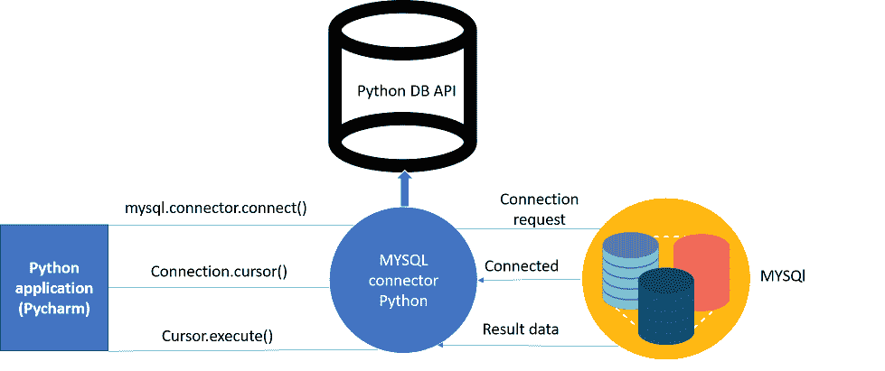
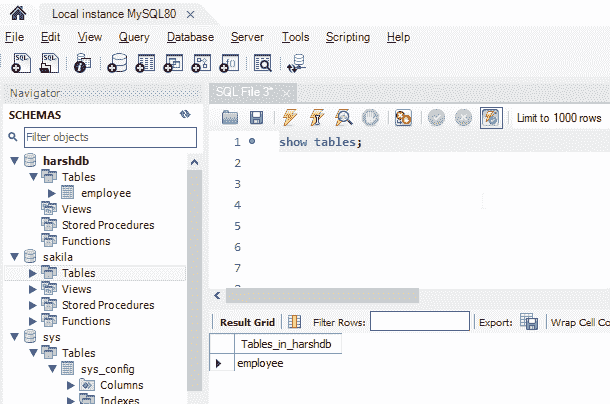
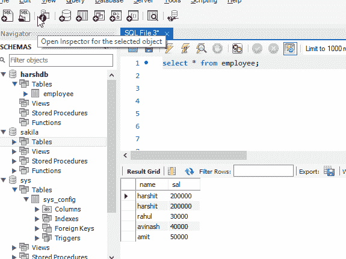
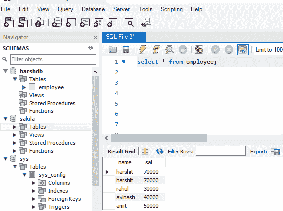
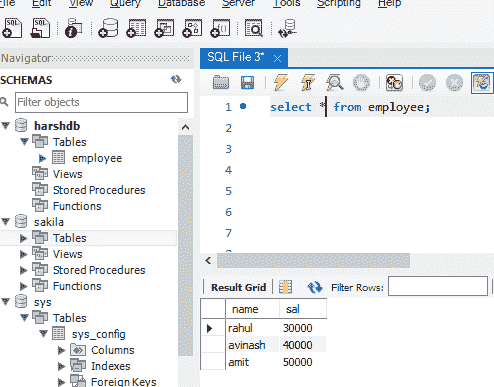

# Python 数据库连接:知道如何连接数据库

> 原文：<https://www.edureka.co/blog/python-database-connection/>

数据库对于存储和处理数据至关重要，即使您考虑像 Python 这样强大的编程语言。有没有想过这一大堆数据是存储在哪里或者从哪里获取的？在这篇关于“Python 数据库连接”的文章中，我将讨论同样的内容，并带您详细了解以下几个方面。

我们开始吧:)

## **什么是数据库？**

数据库基本上是结构化数据的集合，可以很容易地以各种方式进行检索、管理和访问。最简单的数据库形式之一是文本数据库。关系数据库是最流行的数据库系统，包括以下内容:

*   关系型数据库
*   Oracle 数据库
*   SQL server
*   赛贝斯
*   Informix
*   IBM db2
*   nosql

在所有这些数据库中， [**MySQL**](https://www.edureka.co/blog/what-is-mysql/) 是最容易上手的数据库之一。让我向你详细介绍一下。

## **什么是 MySQLdb？**

MySQLdb 是一个开源的免费关系数据库管理系统，使用结构化查询语言。现在这里最重要的问题之一是“什么是 SQL？”

SQL(结构化查询语言)是关系数据库的标准语言，允许用户对数据进行各种操作，如操作、创建、删除等。简而言之，SQL 允许您对数据做任何事情。

让我们继续深入 Python 数据库连接，您将学习如何连接数据库。

## **Python 如何连接数据库？**

将 Python 与数据库连接起来非常简单。参考下图，该图说明了 Python 与数据库的连接，其中连接请求如何发送到 MySQL connector Python，如何从数据库接受连接请求，以及如何使用结果数据执行游标。



在连接到 MySQL 数据库之前，请确保您的计算机上安装了 MySQL 安装程序。它提供了一套全面的工具，有助于安装包含以下组件的 MySQL:

要下载 MySQL 安装程序，请浏览下面的视频，该视频讲述了安装 MySQL 时需要遵循的各个步骤。

**如何在 Windows10 上安装 MySQL？|爱德华卡**


[https://www.youtube.com/embed/GIRcpjg-3Eg?rel=0&showinfo=0](https://www.youtube.com/embed/GIRcpjg-3Eg?rel=0&showinfo=0)

本视频讨论了在 Windows 上安装 MySQL 时需要遵循的各个步骤。

在继续之前，您应该确保您的计算机上安装了 MySQL db。参考下面的命令在命令提示符和 pycharm 中安装 MySQL:

### **使用画中画:**

#### 命令:

pip 安装 mysql 连接器

### **使用 Pycharm**

### **命令:**

```
import mysql.connector 
```

### **输出:**

C:UsersHarshit _ kantpycharmprojectstest 1 venvscriptpython . exe C:/Users/harsh it _ Kant/PycharmProjects/test1/venv/python-d b-conn . py

进程结束，退出代码为 0

在本文中，我们继续讨论 Python 数据库连接，让我们看看连接到数据库所需的参数:

*   **用户名-** 它只是你用来运行 MySQL 服务器的用户名，默认用户名是 *root。*
*   **密码-** 密码是用户在安装 MySQL 数据库时给出的。我在这里给出的密码是“密码 123”
*   **主机名-** 这基本上是运行 MySQL 的服务器名或 IP 地址，如果是“本地主机”，那么你的 IP 地址就是 127.0.0.0

我将从编码的角度展示 python 与 MySQL 数据库的连接。

### **举例:**

```
import mysql.connector

mydb=mysql.connector.connect(host="localhost",user="root",passwd="password123") // I have used 'host','username','password'

print(mydb)
```

### **输出:**

C:UsersHarshit _ kantpycharmprojectstest 1 venvscriptpython . exe C:/Users/Harshit _ Kant/PycharmProjects/test1/venv/python-d b-conn . py<MySQL . connector . connection _ cext。CMySQLConnection 对象位于 0x000001606D7BD6A0 >

进程结束，退出代码为 0

**说明:**这里的‘mydb’只是一个实例。从输出中，您可以清楚地看到它已经连接到数据库。

接下来，在 Python 数据库连接中，您将学习如何创建数据库。

## **创建数据库:**

一旦建立了数据库连接，您就可以创建自己的数据库了，它将作为 python 和 MySQL 服务器之间的桥梁。

让我们看看它的实现部分。

### **举例:**

```
import mysql.connector

mydb=mysql.connector.connect(host="localhost",user="root",passwd="password123")
mycursor=mydb.cursor()
mycursor.execute("create database harshdb")
```

**输出:**

c:/Users/harsh it _ Kant/PycharmProjects/test1/venv/python-d b-conn . py

进程结束，退出代码为 0

**说明:**

*   在上面的程序中，我使用了 cursor，它基本上是一个用于与整个 MySQL 服务器通信的对象，通过它我可以创建自己的数据库。
*   您可以从输出中看到，我创建的名为“harshdb”的数据库是自定义的，因为您可以为您的数据库指定任何名称。

如果您想查看 MySQL 服务器中的数据库，可以在 pycharm 中实现以下代码:

### **举例:**

```
import mysql.connector

mydb=mysql.connector.connect(host="localhost",user="root",passwd="password123")
mycursor=mydb.cursor()
mycursor.execute("show databases")

for db in mycursor:
print(db)
```

### **输出:**

C:UsersHarshit _ kantpycharmprojectstest 1 venvscriptpython . exe C:/Users/Harshit _ Kant/PycharmProjects/test1/venv/python-d b-conn . py(' harshdb '，) ('information_schema '，) ('mysql '，) ('performance_schema '，) ('sakila '，) ('sys '，)【T6(' world '，)

进程结束，退出代码为 0

**说明:**

*   通过实现上面写的代码，我试着显示了 MySQL 服务器中存在的所有数据库。

现在您已经创建了您的数据库，让我们通过在其中进行一些操作来深入研究 Python 数据库连接的一个最重要的方面。让我们详细了解一下这一点。

## **数据库操作【CRUD】:**

程序员可以使用数据库和 SQL 执行许多操作，以便对数据库编程和 [MySQL 有充分的了解。](https://www.edureka.co/blog/mysql-tutorial/)

我在下面演示了 CRUD 操作

*   **Create**–这是一条 SQL 语句，用于在表中创建一条记录，也可以说是用于创建一个表。
*   **Read-** 用于从数据库中提取有用的信息。
*   **Update-** 这个特定的 SQL 语句用于更新表中的记录或更新表。
*   **Delete-** 顾名思义，该命令用于删除表格。

让我们从编码的角度来详细看看每个方面。

### **创建操作**:

```
import mysql.connector

mydb=mysql.connector.connect(host="localhost",user="root",passwd="password123",database=harshdb)

mycursor=mydb.cursor()

mycursor.execute("create table employee(name varchar(250),sal int(20))") 
```

**输出:**

C:UsersHarshit _ kantpycharmprojectstest 1 venvscriptpython . exe C:/Users/harsh it _ Kant/PycharmProjects/test1/venv/python-d b-conn . py

进程结束，退出代码为 0

**说明:**

*   在上面给出的程序中，我创建了一个“雇员”表。
*   employee 表有两个字段“姓名”和“销售”。
*   这里，用于访问 harshdb 的用户 id 是“root ”,密码是“password123”。

下面给出的屏幕截图显示了表“雇员”，并返回字段“姓名”和“萨尔”。


为了查看我创建的表格，请参考下面的 [python](https://www.edureka.co/blog/python-tutorial/) 代码

```
import mysql.connector

mydb=mysql.connector.connect(host="localhost",user="root",passwd="password123",database="harshdb")
mycursor=mydb.cursor()
mycursor.execute("show tables")

for tb in mycursor:
    print(tb)
```

#### **输出:**

C:UsersHarshit _ kantpycharmprojectstest 1 venvscriptpython . exe C:/Users/harsh it _ Kant/PycharmProjects/test1/venv/python-d b-conn . py(' employee '，)

进程结束，退出代码为 0

下面给出的截图显示了我创建的表“雇员”。

**截图:**



现在您已经看到了如何创建表，让我们看看用户如何从中获取值。

### **读取操作:**

这种特殊的操作发生在不同的阶段。为此，第一步是填充表。

**代码:**

```
import mysql.connector

mydb=mysql.connector.connect(host="localhost",user="root",passwd="password123",database="harshdb")
mycursor=mydb.cursor()

sqlformula = "Insert into employee(name,sal) values(%s,%s)"//'values has placeholders

employees = [("harshit",200000),("rahul", 30000),("avinash", 40000),("amit", 50000),]//Created an array of emplpoyees

mycursor.executemany(sqlformula, employees)//Passing the data

mydb.commit()//SQL statement used for saving the changes

```

**输出:**

C:UsersHarshit _ kantpycharmprojectstest 1 venvscriptpython . exe C:/Users/harsh it _ Kant/PycharmProjects/test1/venv/python-d b-conn . py

进程结束，退出代码为 0

在上面的代码中，我通过用 [Python](https://www.edureka.co/blog/python-programming-language) 编写 SQL 语句，使用一个雇员数组来填充数据。下面的数据库截图将显示这些变化

 这里，在创建数组时，记录中使用了两次‘harsh it’。

**阶段 2:** 在这个阶段，我们将使用“select”SQL 语句，在这里将进行实际的读取操作。

*   **fetchall()**–这个函数从最后执行的语句中获取所有数据。
*   **fetchone()-** 这个特殊的语句从最后执行的语句中取出一个数据。

**代码:**

```
import mysql.connector

mydb=mysql.connector.connect(host="localhost",user="root",passwd="password123",database="harshdb")
mycursor=mydb.cursor()

mycursor.execute("select * from employee")

myresult = mycursor.fetchall()

for row in myresult:
    print(row)

```

**输出:**

('哈什特'，200000) ('哈什特'，200000) ('拉胡尔'，30000) ('阿维纳什'，40000) ('阿米特'，50000)

进程结束，退出代码为 0

**解释:**在上面的代码中，我们使用了函数‘fetchall()’。它从最后执行的语句中获取所有数据。

下面给出的是数据库的截图。


#### **代码:**

```
import mysql.connector

mydb=mysql.connector.connect(host="localhost",user="root",passwd="password123",database="harshdb")
mycursor=mydb.cursor()

mycursor.execute("select name from employee")//selecting the field i want data to be fetched from

myresult = mycursor.fetchone()

for row in myresult:
    print(row)
```

#### **输出:**

C:UsersHarshit _ kantpycharmprojectstest 1 venvscriptpython . exe C:/Users/harsh it _ Kant/PycharmProjects/test1/venv/python-d b-conn . pyharsh it

进程结束，退出代码为 0

**解释:**在上面的代码中，我使用了函数“fetchone()”，它基本上从最后执行的语句中获取一个数据。

以上都是关于“读取操作”的，让我们深入了解一下更新操作。

### **更新操作:**

这个 SQL 语句用于更新表中的记录。让我们实现代码，看看变化是如何发生的。

#### **代码:**

```
import mysql.connector

mydb=mysql.connector.connect(host="localhost",user="root",passwd="password123",database="harshdb")
mycursor=mydb.cursor()

sql = "Update employee SET sal = 70000 WHERE name = 'harshit'"

mycursor.execute(sql)

mydb.commit()
```

#### **输出:**

C:UsersHarshit _ kantpycharmprojectstest 1 venvscriptpython . exe C:/Users/harsh it _ Kant/PycharmProjects/test1/venv/python-d b-conn . py

进程结束，退出代码为 0

**解释:**我们已经在上面给出的代码中更新了记录 harshit 的行“sal”。下面给出的截图会给你一个清晰的画面。

**截图:**



可以清楚地看到，记录“harshit”的“sal”行被更新为 70000。

这都是关于更新操作的，继续阅读“Python 数据库连接”文章，我们将看到最后一个操作是“删除”。

### **删除操作:**

顾名思义，删除操作用于从表中删除记录。让我们从编码的角度来理解它。

#### **代码:**

```
import mysql.connector

mydb=mysql.connector.connect(host="localhost",user="root",passwd="password123",database="harshdb")
mycursor=mydb.cursor()

sql = "DELETE FROM employee  WHERE name = 'harshit'"

mycursor.execute(sql)

mydb.commit()
```

#### **输出:**

C:UsersHarshit _ kantpycharmprojectstest 1 venvscriptpython . exe C:/Users/harsh it _ Kant/PycharmProjects/test1/venv/python-d b-conn . py

进程结束，退出代码为 0

**解释:**在上面的代码中，我删除了一个记录‘harsh it ’,因为它重复了两次。

下面给出的截图会给你一个更好的画面。

从截图中可以清楚地看到,“harshit”已被删除。嗯，您可以从删除操作本身进行另一组操作，比如删除 salary。我只提到了两个字段，所以对记录的操作是有限的，但是您可以在同一个表“employee”或您创建的任何其他表下创建更多的字段。

这就把我们带到了“Python 数据库连接”这篇文章的结尾。我希望你清楚所有与数据库相关的概念，MYSQL db，python 中的数据库操作。确保你尽可能多的练习，恢复你的经验。

有问题吗？请在“Python 数据库连接”博客的评论部分提到它，我们会尽快回复您。要深入了解 Python 及其各种应用，您可以*立即*注册我们的实时 [Python 课程](https://www.edureka.co/python-programming-certification-training)培训，该培训提供全天候支持和终身访问。