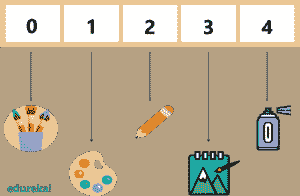

# JavaScript 中的拼接数组:你只需要知道数组。Splice()方法

> 原文：<https://www.edureka.co/blog/javascript-array-splice-method/>

[web 开发](https://www.edureka.co/masters-program/full-stack-developer-training) 或者说 Web 编程催生了动态 Web 应用。随着网络的兴起，JavaScript 已经成为当今世界 **最重要的语言** 之一。 本**JavaScript 中拼接数组**文章 将带您深入 JavaScript 中的数组方法，顺序如下:

*   [JavaScript 简介](#javascript)
*   [如何在 JavaScript 中拼接数组？](#splicearray)
*   [拼接()方法:示例](#splicemethodexample)

## **JavaScript 简介**

[Javascript](https://www.edureka.co/javascript-jquery-training) 是一种跨平台的轻量级编程语言。它不是一种编译语言，但它是一种翻译语言。通过翻译语言的方式负责将 javascript 代码转换成网络浏览器。


JavaScript 用于创建交互式网站，其中非活动网站意味着它是客户端验证的。它主要用于:

*   **动态下拉菜单**
*   **显示日期和时间**
*   **弹出窗口**
*   **显示时钟**

来自<u>JavaScript</u>数组中的各种方法，这些方法不同地执行各种不同的功能，其中一个方法是 **splice()数组方法**。

## **如何在 JavaScript 中拼接数组？**

JavaScript 中的 Splice array 是一种在数组中添加或删除项目的方法。 通过增加新元素或者从数组中删除旧元素来改变数组内容的方法。



*   Splice()数组方法改变数组的原始内容。
*   它非常适合阵列管理。
*   这个调用的方法将有助于改变数组的内容。

**拼接数组语法如下:**

```
array.splice(index,howmany, item1,..............,item x)

```

该方法接受各种参数，如:

*   ***指数 :***

Index 是一个整数值，表示需要在哪个位置添加元素/项目，或者从哪个位置删除元素/项目。拼接数组中每次都需要 。****

*   ***多少个 :***

多少表示应该从数组中移除多少个项目。如果设置为 0，则不会删除任何元素/项目。多少是可选的参数值。

*   ***第 1 项，……，x 项:***

该参数表示要添加到数组中的新项目。它也是一个可选参数，就像有多少个参数一样。

声明拼接数组的另一种方式是:

```

var arrDeletedItems = array.splice(start, deleteCount,item1,item2, ...,item n)

```

*   ***开始:***

Index/start 执行相同的功能，即需要在哪个位置添加元素/项目或从哪个位置移除元素/项目，并且在 splice()方法语法中总是需要。

*   ***删除-计数:***

Delete-count 也执行类似的功能，就像上述 systax 中的多少，即从数组中删除多少项。这是可选的参数值。

*   ***第一项，…..**物品编号:T3*

第一项，…..第 n 项参数表示与上述相同的功能。它也是删除语法中的可选参数。

## **拼接()方法:示例**

**例 1**

从索引 2 中删除 0(零)个元素，并插入“鼓”

**输入:**

```

var myFish = ['pen', 'paper', 'stone', 'pencil'];
var removed = myFish.splice(2, 0, 'drum');
// myFish is ["pen", "paper", "drum", "stone", "pencil"] 
// removed is [], no elements removed

```

**输出:**

```
Pen, paper, drum, stone, pencil
```

**例 2**

从索引 2 中删除 0(零)个元素，并插入“鼓”和“吉他”

**输入:**

```
var myFish = ['pen', 'paper', 'stone', 'pencil'];
var removed = myFish.splice(2, 0, 'drum', 'guitar');
// myFish is ["pen", "paper", "drum", "guitar", "stone", "pencil"]                                                    
//removed is [], no elements removed

```

**输出:**

```
pen,paper,drum, guitar, stone , pencil
```

**例 3**

从索引 3 中删除 1 个元素

**输入:**

```
var myFish = ['pen', 'paper', 'drum', 'stone', 'pencil'];
var removed = myFish.splice(3, 1);
// removed is ["stone"]
// myFish is ["pen", "paper”, "stone", "pencil"]

```

**输出:**

```
Pen, paper , stone , pencil
```

**例 4**

从索引 2 中删除 1 个元素，并插入“小号”

**输入:**

```
var myFish = ['angel', 'clown', 'drum', 'sturgeon'];
var removed = myFish.splice(2, 1, 'trumpet');
// myFish is ["angel", "clown", "trumpet", "sturgeon"]
// removed is ["drum"]

```

**输出:**

```
Angel, clown, trumpet, sturgeon
```

**例 5**

从索引 0 中删除 2 个元素，并插入“钢笔”“鹦鹉”“墨水”

**输入:**

```
var myFish = ['angel', 'clown', 'trumpet', 'sturgeon'];
var removed = myFish.splice(0, 2, 'pen', 'parrot', 'ink');
// myFish is ["pen", "parrot", "ink", "trumpet", "sturgeon"] 
// removed is ["angel", "clown"]

```

**输出:**

```
Pen, parrot, ink, trumpet, sturgeon
```

**例 6:**

从索引 2 中删除 2 个元素

**输入:**

```
var myFish = ['parrot', 'anemone', 'blue', 'trumpet', 'sturgeon'];
var removed = myFish.splice(myFish.length - 3, 2);
// myFish is ["parrot", "anemone", "sturgeon"] 
// removed is ["blue", "trumpet"]

```

**输出:**

```
Parrot, anemone, sturgeon
```

**例 7**

从 2 个索引中删除 1 个元素

**输入:**

```

var myFish = ['angel', 'clown', 'mandarin', 'sturgeon'];
var removed = myFish.splice(-2, 1);
// myFish is ["angel", "clown", "sturgeon"] 
// removed is ["mandarin"]

```

**输出:**

```
Angel, clown, sturgeon
```

**例 8**

移除索引 2 之后的所有元素

**输入:**

```

var myFish = ['angel', 'clown', 'mandarin', 'sturgeon'];
var removed = myFish.splice(2);
// myFish is ["angel", "clown"]
// removed is ["mandarin", "sturgeon"]

```

**输出:**

```
Angel, clown
```

这些是在 javascript 中使用拼接数组的不同方式。现在让我们来看一个例子:

```

<!DOCTYPE html>
<html>
<body>
<p>Click the button to remove two elements from the array.</p>
<button onclick="myFunction()">Try it</button>
<p id="demo"></p>
<script>
var fruits = ["Banana", "Orange", "Apple", "Mango", "Kiwi"];
document.getElementById("demo").innerHTML = fruits;
function myFunction()
 {
  fruits.splice(2, 2);
  document.getElementById("demo").innerHTML = fruits;
}
</script>
</body>
</html>

```

**输出:**

```
Banana, Orange, Kiwi
```

上面的代码是删除两个元素的示例，其中 fruit.splice(2，2)删除了索引 2 之后的两个元素，因为它删除了索引 2 之后的 apple 和 mango，并更改了输出中显示的数组。您还可以从数组中的任何位置移除/添加元素/项目，这可以给出完全不同的新数组的输出

让我们来看看另一个**例子**:

```

<!DOCTYPE html>
<html>
<body>
<p>Click the button to add and remove elements.</p>
<button onclick="myFunction()">Try it</button>
<p id="demo"></p> 
<script>
var fruits = ["Banana", "Orange", "Apple", "Mango"];
document.getElementById("demo").innerHTML = fruits;
function myFunction() 
{
  fruits.splice(2, 1, "Lemon", "Kiwi");
  document.getElementById("demo").innerHTML = fruits;
}
</script>
</body>
</html>

```

**输出:**

```
Banana, Orange, Lemon, Kiwi, Mango
```

上面的代码是 splice()方法的另一个示例，其中显示了两个新元素的添加。在 index 2 之后添加了两个新元素，这意味着在 banana 和 orange 之后，并给出一个新的数组作为输出。

说到这里，我们的文章就到此为止了。我希望您理解了 JavaScript 中拼接数组方法的用法。

*既然你已经了解了 JavaScript 数组方法，那就去看看 Edureka 的 **[Web 开发认证培训](https://www.edureka.co/complete-web-developer)** 。* *Web 开发认证培训将帮助您学习如何使用 HTML5、CSS3、Twitter Bootstrap 3、jQuery 和 Google APIs 创建令人印象深刻的网站，并将其部署到亚马逊简单存储服务(S3)。*

*有问题吗？请在“JavaScript 中的拼接数组”的评论部分提到它，我们会回复您。*