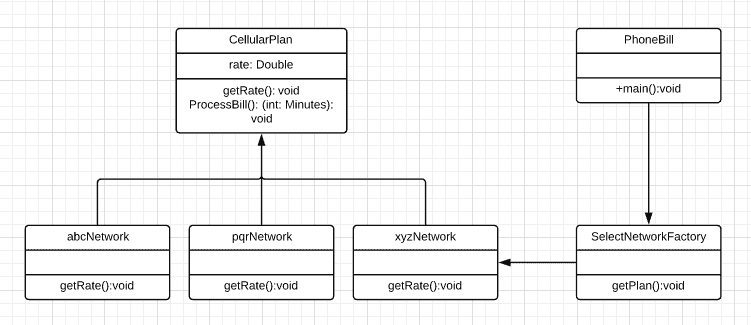
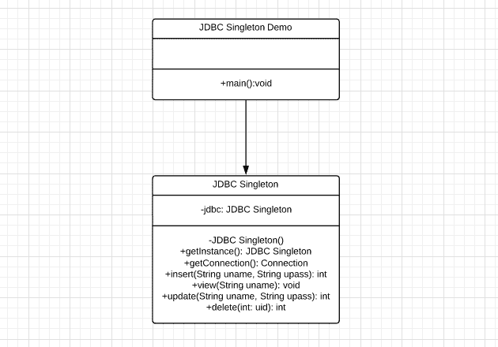
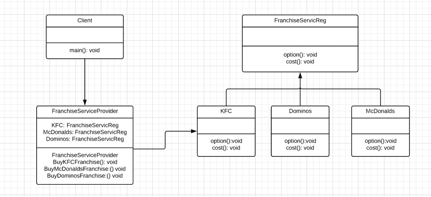
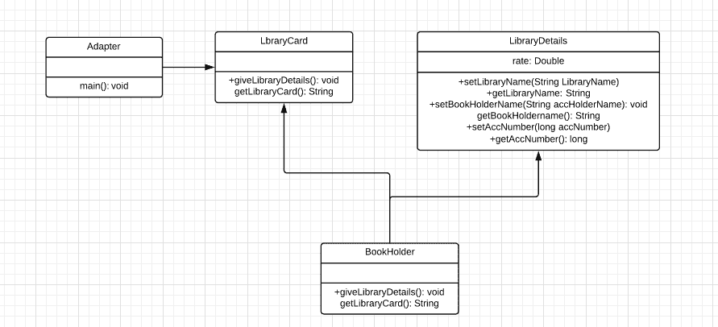
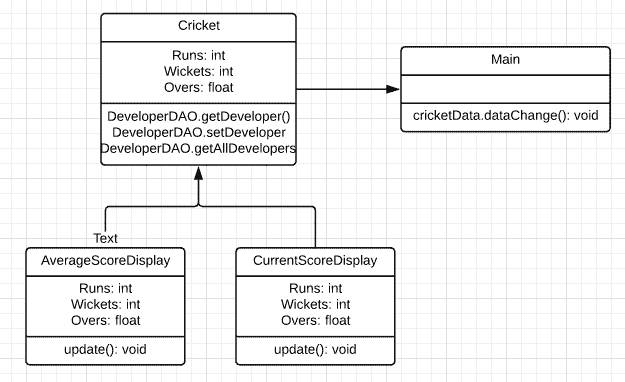

# 您需要了解的重要 Java 设计模式

> 原文：<https://www.edureka.co/blog/java-design-patterns/>

**设计模式** 是软件设计中常规问题的通用解决方案。每一个 **模式** 都充当一个**蓝图**，允许定制解决软件模块开发期间任何代码中给定的设计问题。我已经将这篇文章的摘要排列如下:

*   为什么我们需要设计模式？
*   什么是设计模式？
*   [设计模式的结构](#structure)
*   [设计模式的类型](#type)
    *   [创意设计模式](#create)
    *   [结构设计模式](#struct)
    *   [行为设计模式](#behave)
    *   [JEE 设计图案](#jee)
*   [设计模式概述](#over)

## 为什么我们需要设计模式？

一个**设计模式**系统地命名、激励和解释一个通用设计，它解决了面向对象系统中一个重复出现的设计问题。**设计模式**需要代表在 软件开发中遵循和采用的一些最佳实践。


## 什么是设计模式？

软件设计模式可以定义为一个**软件模板**或一个描述，以解决在设计软件应用程序或软件框架时出现在多个实例中的问题。

设计模式的功劳归于**四人组。** *Erich Gamma，Richard Helm，Ralph Johnson* 和 *John Vlissides* 是 Java 设计模式一书的作者。


## **设计模式的结构**

任何设计模式的结构都被认为是高度组织化的**。**它们通常以**模板**的形式被记录，这样，用户可以**直观地识别**问题，并基于**类**和**对象之间的**关系**立即找到问题的解决方案。**设计模式的原作者描述的设计模式模板如下:

| **期限** | **描述** |
| **图案名称** | 用一个简短但富有表现力的名称来描述模式的本质。 |
| **意图** | 描述模式的作用 |
| **亦称** | 列出该模式的任何同义词 |
| **动机** | 提供了一个问题示例并描述了解决方案 |
| **适用性** | 列出了该模式适用的情况 |
| **结构** | 描述模式的类和对象的图表集 |
| **参与者** | 描述参与设计的类和对象 |
|  | 描述参与者的协作及其职责。 |
| **后果** | 描述模式中存在的力量和好处 |

## **设计模式的类型**

典型地，Java 设计模式被分成四类，每一类又被进一步分类如下:

****

*   **创造设计模式**与创造对象的方法有关。
*   **结构设计模式**处理构成更大结构的类和对象的组合。
*   **行为设计模式**与对象之间的责任和交互有关。
*   JEE 设计模式关注于为基于 Java EE 的软件应用和框架提供解决方案。

在课程开始的过程中，创造性的设计模式是首选。创造性的设计模式进一步分类如下:

1.  **[工厂模式](#fact) **
2.  **抽象工厂模式**
3.  **[单例模式](#single)**
4.  **原型图案**
5.  **构建器模式。**
6.  **对象池模式**

让我们实际讨论一些重要的创造性 Java 设计模式。

**工厂设计模式:**遵循“*的原则，定义一个接口或抽象类来创建一个对象，但让子类决定实例化哪个类***。**工厂方法模式也被称为  **虚拟构造器。**

**优点:**

*   它被设计成允许所有子类选择对象的类型以便创建它们。

**举例:**我们有三个**蜂窝网络计划**，描述了每分钟的通话费用。这里我们有三个不同的网络，即 **abcNetwork、pqrNetwork、**和 **xyzNetwork** 以及它们的*每分钟收费*。让我们找出每个网络中特定分钟数的费用。

**UML 图:**

//蜂窝计划

```

package FactoryDesignPattern;

abstract class cellularplan {
         protected double rate;
         abstract void getRate();
         public void processBill(int minutes){
                System.out.println(minutes*rate);
         }
}

```

//ABC 网络

```

package FactoryDesignPattern;

public class abcNetwork extends cellularplan{
       public void getRate(){
              rate=1.50;
      }
}

```

//pqrNetwork

```

package FactoryDesignPattern;

public class pqrNetwork extends cellularplan{
        public void getRate(){
               rate=1.75;
        }
}

```

//xyzNetwork

```
package FactoryDesignPattern;

public class xyzNetwork extends cellularplan{
       public void getRate(){
            rate=1.50;
       }
}

```

//选择网络工厂

```

package FactoryDesignPattern;

public class SelectNetworkFactory {
     public cellularplan getPlan(String planType){
          if(planType == null){
                  return null;
          }
          if(planType.equalsIgnoreCase("abcNetwork")) {
                  return new abcNetwork();
          }
          else if(planType.equalsIgnoreCase("xyzNetwork")){
                  return new xyzNetwork();
          }
          else if(planType.equalsIgnoreCase("pqrNetwork")) {
                  return new pqrNetwork();
          }
     return null;
     }
}

```

//PhoneBill

```
package FactoryDesignPattern;
import java.io.*;

public class phoneBill {
      public static void main(String args[])throws IOException{
            SelectNetworkFactory planFactory = new SelectNetworkFactory();
            System.out.print("Enter the name of network for which the bill will be generated: ");
            BufferedReader br=new BufferedReader(new InputStreamReader(System.in));
            String networkName=br.readLine();
            System.out.print("Enter the number of minutes for bill will be calculated: ");
            int minutes=Integer.parseInt(br.readLine());
            cellularplan p = planFactory.getPlan(networkName);
            System.out.print("Bill amount for "+networkName+" of "+minutes+" units is: ");
            p.getRate();
            p.processBill(minutes);
      }
}

```

**输出**:

`Enter the name of network for which the bill will be generated: abcNetwork``Enter the number of minutes for bill will be calculated: 35`

**单例设计模式:**遵循*“定义一个只有一个实例的类，并提供对它的全局访问点*”。该类必须确保只创建一个**单实例**，并且所有其他类都可以使用一个**单对象**。

**优点:**

*   它被设计用来节省内存。
*   不是在每个请求上都创建对象，而是重用一个**单实例**。

例:我们有一个 **MySQL** 数据库。让我们使用一个对象实例将数据插入数据库。这里，我们对数据库执行 4 种不同的操作，所有这些操作都使用一个**单个** **对象实例。**


**UML**图:



```
package Singleton;

import java.io.BufferedReader;
import java.io.IOException;
import java.io.InputStreamReader;
import java.sql.Connection;
import java.sql.DriverManager;
import java.sql.PreparedStatement;
import java.sql.ResultSet;
import java.sql.SQLException;

class JDBCSingleton {
      private static JDBCSingleton jdbc;
      private JDBCSingleton() { }
      public static JDBCSingleton getInstance() {
             if (jdbc==null){
                    jdbc=new JDBCSingleton();
             }
             return jdbc;
      }
      private static Connection getConnection()throws ClassNotFoundException, SQLException{
             Connection con=null;
             Class.forName("com.mysql.cj.jdbc.Driver");
             con= DriverManager.getConnection("jdbc:mysql://localhost:3306/edureka?serverTimezone=Asia/Calcutta", "root", "");
             return con;
      }
      public int insert(String name, String pass, String id) throws SQLException{
              Connection c=null;
              PreparedStatement ps=null;
              int recordCounter=0;
      try {
                    c=this.getConnection();
                    ps=c.prepareStatement("insert into employee(uid,uname,upassword)values(?,?,?)");
                    ps.setString(1, id);
                    ps.setString(2, name);
                    ps.setString(3, pass);
                    recordCounter=ps.executeUpdate(); 
      } 
      catch (Exception e) { 
                    e.printStackTrace(); 
      } 
      finally{
                    if (ps!=null){
                             ps.close();
                    }
                    if(c!=null){
                             c.close();
                    }
      }
      return recordCounter;
}

public void view(String name) throws SQLException{
      Connection con = null;
      PreparedStatement ps = null;
      ResultSet rs = null;
      try {
                   con=this.getConnection();
                   ps=con.prepareStatement("select * from employee where uname=?");
                   ps.setString(1, name);
                   rs=ps.executeQuery();
                   while (rs.next()) {
                            System.out.println("Name= "+rs.getString(2)+"t"+"Paasword= "+rs.getString(3));
            }
      } 
      catch (Exception e) { 
             System.out.println(e);
            }
      finally{
            if(rs!=null){
                   rs.close();
            }
            if (ps!=null){
                   ps.close();
            }
            if(con!=null){
                   con.close();
            }
       }
}
public int update(String name, String password) throws SQLException {
       Connection c=null;
       PreparedStatement ps=null;
       int recordCounter=0;
       try {
                  c=this.getConnection();
                  ps=c.prepareStatement(" update employee set upassword=? where uname='"+name+"' ");
                  ps.setString(1, password);
                  recordCounter=ps.executeUpdate();
             } 
       catch (Exception e) { 
                  e.printStackTrace(); 
             } 
       finally{
                  if (ps!=null){
                         ps.close();
                   }
                  if(c!=null){
                         c.close();
                   }
             }
       return recordCounter;
}
public int delete(int userid) throws SQLException{
       Connection c=null;
       PreparedStatement ps=null;
       int recordCounter=0;
       try {
                   c=this.getConnection();
                   ps=c.prepareStatement(" delete from employee where uid='"+userid+"' ");
                   recordCounter=ps.executeUpdate();
          }
          catch (Exception e) { 
                   e.printStackTrace(); 
          }
         finally{
                  if (ps!=null){
                         ps.close();
                  }
                  if(c!=null){
                         c.close();
                  }
          }
        return recordCounter;
     }
}

```

```
package Singleton;

import java.io.BufferedReader;
import java.io.IOException;
import java.io.InputStreamReader;
import java.sql.Connection;
import java.sql.DriverManager;
import java.sql.PreparedStatement;
import java.sql.ResultSet;
import java.sql.SQLException;
class JDBCSingletonDemo{
static int count=1;
static int choice;
public static void main(String[] args) throws IOException {
          JDBCSingleton jdbc= JDBCSingleton.getInstance();
          BufferedReader br=new BufferedReader(new InputStreamReader(System.in));
          do{
                   System.out.println("DATABASE OPERATIONS");
                   System.out.println(" --------------------- ");
                   System.out.println(" 1\. Insertion ");
                   System.out.println(" 2\. View ");
                   System.out.println(" 3\. Delete ");
                   System.out.println(" 4\. Update ");
                   System.out.println(" 5\. Exit ");
                   System.out.print("n");
                   System.out.print("Please enter the choice what you want to perform in the database: ");
                   String input=br.readLine();
                   if(input != null) {
                           choice=Integer.parseInt(input);
                   }
          else{
                   return;
                 } 
          switch(choice) {
                   case 1:{ 
                                System.out.print("Enter the username you want to insert data into the database: ");
                                String username=br.readLine();
                                System.out.print("Enter the password you want to insert data into the database: ");
                                String password=br.readLine();
                                System.out.print("Enter the ID you want to insert data into the database: ");
                                String eid=br.readLine();
                                try {
                                       int i= jdbc.insert(username, password, eid);
                                       if (i>0) {
                                                System.out.println((count++) + " Data has been inserted successfully");
                                            }
                                       else{
                                                System.out.println("Data has not been inserted ");
                                            }
                                       } catch (Exception e) {
                                               System.out.println(e);
                                             }
                                       System.out.println("Press Enter key to continue...");
                                       br.readLine();
                              }
                              break;
                   case 2:{
                                System.out.print("Enter the username : ");
                                String username=br.readLine();
                                try {
                                       jdbc.view(username);
                                } 
                                catch (Exception e) {
                                       System.out.println(e);
                                }
                                System.out.println("Press Enter key to continue...");
                                br.readLine();
                              }
                              break;
                  case 3:{
                               System.out.print("Enter the userid, you want to delete: ");
                               int userid=Integer.parseInt(br.readLine());
                               try {
                                      int i= jdbc.delete(userid);
                                      if (i>0) {
                                                System.out.println((count++) + " Data has been deleted successfully");
                                      }
                                      else{
                                               System.out.println("Data has not been deleted");
                                             }
                                      } 
                                      catch (Exception e) {
                                               System.out.println(e);
                                      }
                                      System.out.println("Press Enter key to continue...");
                                      br.readLine();
                               }
                               break;
                   case 4:{
                                System.out.print("Enter the username, you want to update: ");
                                String username=br.readLine();
                                System.out.print("Enter the new password ");
                                String password=br.readLine();
                                try {
                                      int i= jdbc.update(username, password);
                                      if (i>0) {
                                               System.out.println((count++) + " Data has been updated successfully");
                                             }
                                } 
                                catch (Exception e) {
                                      System.out.println(e);
                                      }
                                       System.out.println("Press Enter key to continue...");
                                       br.readLine();
                                }
                                break;
                   default: return;
              } 
         } while (choice!=5);
     }
}

```

**输出**:

`DATABASE OPERATIONS` `---------------------` `1\. Insertion` `2\. View` `3\. Delete` `5\. Exit`

`Please enter the choice what you want to perform in the database: 1``Enter the username you want to insert data into the database: Ravi``Enter the password you want to insert data into the database: 1234``Enter the ID you want to insert data into the database: 1011``1 Data has been inserted successfully`

**结构设计模式**处理构成更大结构的类和对象的**组合**。他们通过识别**类**和**对象之间的**关系**来简化结构。**结构设计模式进一步分类如下:

1.  **[立面图案](#facade)**
2.  **桥接模式**
3.  **复合图案**
4.  **装饰图案**
5.  **[适配器模式](#adapt)**
6.  **飞锤模式**
7.  **代理模式**
8.  **过滤模式**

让我们实际讨论一些重要的结构化 Java 设计模式。

**Facade 设计模式**:描述了一个**的高层**接口，使得子系统更容易使用。每一个**抽象工厂** 都是一个门面设计模式。

**优点:**

*   它保护最终用户免受复杂子系统组件的影响。

**示例:**现在，让我们使用**门面设计模式**来找出您希望购买的特许经营权的成本。

****

**UML 图:**

//专营权

```

package FacadeDesignPattern;

public interface Franchise {
      public void Option();
      public void Cost();
}

```

//肯德基

```

public class KFC implements Franchise {
        public void Option() {
               System.out.println("KFC");
        }
public void Cost() {
        System.out.println("Rs 1,00,00,000");
        }
}

```

//麦当劳

```

package FacadeDesignPattern;

public class McDonalds implements Franchise {
       public void Option() {
             System.out.println("McDonalds");
       }
public void Cost() {
             System.out.println("Rs 90,00,000");
       }
}

```

//骨牌

```

package FacadeDesignPattern;

public class Dominos implements Franchise {
       public void Option() {
            System.out.println("Dominos");
       }
public void Cost() {
            System.out.println("Rs 80,00,000");
       }
}

```

//特许权服务注册

```

package FacadeDesignPattern;

public class FranchiseServiceReg {
       private Franchise KFC;
       private Franchise McDonalds;
       private Franchise Dominos;
       public FranchiseServiceReg(){
              KFC = new KFC();
              McDonalds = new McDonalds();
              Dominos = new Dominos();
       }
       public void BuyKFCFranchise(){
              KFC.Option();
              KFC.Cost();
       } 
       public void BuyMcDonaldsFranchise(){
              McDonalds.Option();
              McDonalds.Cost();
       }
       public void BuyDominosFranchise(){
              Dominos.Option();
              Dominos.Cost();
       }
}

```

//客户端

```

package FacadeDesignPattern;
import java.io.BufferedReader;
import java.io.IOException;
import java.io.InputStreamReader;

public class Client {
         private static int choice;
         public static void main(String args[]) throws NumberFormatException, IOException{
                   do{
                              System.out.print("Welcome to Franchise Service Registration...!n");
                              System.out.print(" 1\. KFC n");
                              System.out.print(" 2\. McDonalds n");
                              System.out.print(" 3\. Dominos n");
                              System.out.print(" 4\. EXIT n");
                              System.out.print("Please Enter your Franchise Option Number: ");
                   BufferedReader br=new BufferedReader(new InputStreamReader(System.in));
                   choice=Integer.parseInt(br.readLine());
                   FranchiseServiceReg sp=new FranchiseServiceReg();

         switch (choice) {
                   case 1: {
                           sp.BuyKFCFranchise();
                   }
                   break;
                  case 2: {
                          sp.BuyMcDonaldsFranchise();
                  }
                  break;
                   case 3: {
                          sp.BuyDominosFranchise();
                  }
                  break;
                  default: {
                          System.out.println("Please Check the input and try again");
                  }
          return;
          }

       }while(choice!=4);
    }
}

```

**输出**:

`Welcome to Franchise Service Registration...!` `1\. KFC` `2\. McDonalds` `3\. Dominos` `4\. EXIT` `Please Enter your Franchise Option Number: 1``KFC``Rs 1,00,00,000`

**适配器设计模式**:在使用具有**不同接口的类的服务时，根据客户需求提供**接口**。**适配器模式也被称为**包装器。**

**优点:**

*   它旨在使两个或更多以前不兼容的对象能够**彼此交互**。

**示例:**这是一个简单的**借书证**示例，旨在向图书馆的新用户发放**借书证**，其中包括所有详细信息，如*图书持有者 ID、账号* r 等等。让我们使用**适配器设计模式来执行。**

****

**UML 图:**

//适配器

```

package AdapterDesignPattern;

public class Adapter {
       public static void main(String args[]){
             LibraryCard targetInterface=new BookHolder();
             targetInterface.giveLibraryDetails();
             System.out.print(targetInterface.getLibraryCard());
        }
}

```

//夹书人

```

package AdapterDesignPattern;
import java.io.BufferedReader;
import java.io.InputStreamReader;

public class BookHolder extends LibraryDetails implements LibraryCard{
          public void giveLibraryDetails(){
          try{
                    BufferedReader br=new BufferedReader(new InputStreamReader(System.in));
                    System.out.print("Enter the Library account holder name :");
                    String readername=br.readLine();
                    System.out.print("n");
                    System.out.print("Enter the account number of the library:");
                    long accno=Long.parseLong(br.readLine());
                    System.out.print("n");
                    System.out.print("Enter the Library name :");
                    String libraryname=br.readLine();
                    setAccHolderName(readername);
                    setAccNumber(accno);
                    setLibraryName(libraryname);
          }
          catch(Exception e){
                    e.printStackTrace();
          }
     }
     public String getLibraryCard() {
          long accno=getAccNumber();
          String accholdername=getAccHolderName();
          String lname=getLibraryName();
          return ("The Account number "+accno+" of "+accholdername+" in "+lname+ " Library is valid and authenticated for issuing the Library card. ");
      }
}

```

//图书馆卡

```

package AdapterDesignPattern;

public interface LibraryCard {
      public void giveLibraryDetails();
      public String getLibraryCard();
}

```

//库详细信息

```

package AdapterDesignPattern;

public class LibraryDetails {
      private String LibraryName;
      private String BookHolderName;
      private long BookHolderID;
      public String getLibraryName() {
             return LibraryName;
       }
       public void setLibraryName(String LibraryName) {
             this.LibraryName = LibraryName;
       }
       public String getAccHolderName() {
             return BookHolderName;
       }
       public void setAccHolderName(String BookHolderName) {
             this.BookHolderName = BookHolderName;
       }
       public long getAccNumber() {
             return BookHolderID;
       }
       public void setAccNumber(long BookHolderID) {
             this.BookHolderID = BookHolderID;
       }
}

```

**输出**:

`Enter the Library account holder name :Ravi`

`Enter the account number of the library:12012`

`Enter the Library name :MG Library`

**行为设计模式**关注对象之间的责任和**交互**。这些设计模式确保对象是**松散耦合的，**然而，可以很容易地相互通信。行为设计模式进一步分类如下:

1.  **责任链模式**
2.  **[策略模式](#strategy)**
3.  **解释器模式**
4.  **迭代器模式**
5.  **调解器模式**
6.  **纪念图案**
7.  **[命令模式](#command)**
8.  **状态模式**
9.  **[观察者模式](#observe)**
10.  **模板图案**
11.  **访客模式**

让我们实际讨论一些重要的行为设计模式。

**策略设计模式**:定义了一族**功能**和**封装**每一个，并使它们**可互换。**策略模式也称为**策略。**

**优点:**

*   它旨在提供子类的替代品。

我们将考虑一个简单的**计算器的例子。**我们需要执行五种不同的操作。我们将把所有这五个操作封装到 Calculator 类中，并使用**策略设计模式执行程序。**

****

**UML 图:**

//计算器

```

package StrategyDesignPattern;

public interface Calculator {
       public float calculation(float a, float b);
}

```

//添加

```

package StrategyDesignPattern;

public class add implements Calculator{
       public float calculation(float a, float b) {
              return a+b;
       }
}

```

//Sub

```

package StrategyDesignPattern;

public class sub implements Calculator{
       public float calculation(float a, float b) {
             return a-b;
      }
}

```

//Mul

```

package StrategyDesignPattern;

public class mul implements Calculator{
       public float calculation(float a, float b) {
             return a*b;
       }
}

```

//Div

```

package StrategyDesignPattern;

public class div implements Calculator{
      public float calculation(float a, float b) {
            return a/b;
      }
}

```

//Mod

```

package StrategyDesignPattern;

public class mod implements Calculator{
        public float calculation(float a, float b) {
              return a%b;
        }
}

```

//查询

```

package StrategyDesignPattern;

public class Query {
      private Calculator calci;
      public Query(Calculator calci){
               this.calci = calci;
      }
      public float executeStrategy(float num1, float num2){
               return calci.calculation(num1, num2);
      }
}

```

//策略

```

package StrategyDesignPattern;
import java.io.BufferedReader;
import java.io.IOException;
import java.io.InputStreamReader;

public class Strategy {
         public static void main(String[] args) throws NumberFormatException, IOException {
                  BufferedReader br=new BufferedReader(new InputStreamReader(System.in));
                  System.out.print("Enter the first value: ");
                  float value1=Float.parseFloat(br.readLine());
                  System.out.print("Enter the second value: ");
                  float value2=Float.parseFloat(br.readLine());
                  Query query = new Query(new add());
                  System.out.println("Addition = " + query.executeStrategy(value1, value2));
                  query = new Query(new sub());
                  System.out.println("Subtraction = " + query.executeStrategy(value1, value2));
                  query = new Query(new mul());
                  System.out.println("Multiplication = " + query.executeStrategy(value1, value2));
                  query = new Query(new div());
                  System.out.println("Multiplication = " + query.executeStrategy(value1, value2));
                  query = new Query(new mod());
                  System.out.println("Multiplication = " + query.executeStrategy(value1, value2));
        }
}

```

**输出**:

`Enter the first value: 10``Enter the second value: 2``Addition = 12.0``Subtraction = 8.0``Multiplication = 20.0``Multiplication = 0.0`

**命令设计模式**:它**将一个对象下的**请求封装成一个命令，并传递给 **invoker 对象。** Invoker 对象寻找能够处理该命令的适当对象，并将该命令传递给相应的对象，该对象执行该命令。也称为**动作**或**事务。**

**优点:**

*   它将**调用**操作的对象与**实际执行操作的对象分开。**

**示例:**这个示例演示了一个简单的命令执行周期，其中用户需要展示**打开** **和**关闭**他家中的各种电子设备，如**灯泡**和**立体声播放器。**他通过一个叫做**简单遥控器的**调用器**对象调用命令。****

****

**UML 图:**

//命令

```

package CommandDesignPattern;

interface Command {
       public void execute();
}

```

//灯光

```

package CommandDesignPattern;

class Light {
       public void on() {
             System.out.println("Light is on");
       }
public void off() {
       System.out.println("Light is off");
       }
}

```

//LightOnCommand

```

package CommandDesignPattern;

class LightOnCommand implements Command {
         Light light;
         public LightOnCommand(Light light) {
                 this.light = light;
         }
         public void execute() {
                 light.on();
         }
}

```

//LightOffCommand

```

package CommandDesignPattern;

class LightOffCommand implements Command {
       Light light;
       public LightOffCommand(Light light) {
              this.light = light;
       }
       public void execute() {
              light.off();
       }
}

```

//立体声

```

package CommandDesignPattern;

class Stereo {
       public void on() {
              System.out.println("Stereo is on");
       }
       public void off() {
              System.out.println("Stereo is off");
       }
       public void setCD() {
              System.out.println("Stereo is set " + "for CD input");
       }
       public void setDVD() {
             System.out.println("Stereo is set" + " for DVD input");
       }
       public void setRadio() {
             System.out.println("Stereo is set" + " for Radio");
       }
       public void setVolume(int volume) {
             System.out.println("Stereo volume set" + " to " + volume);
       }
}

```

//StereoOffCommand

```

package CommandDesignPattern;

class StereoOffCommand implements Command {
      Stereo stereo;
      public StereoOffCommand(Stereo stereo) {
             this.stereo = stereo;
      }
      public void execute() {
             stereo.off();
      }
}

```

//stereoconwithccommand

```

package CommandDesignPattern;

class StereoOnWithCDCommand implements Command {
         Stereo stereo;
         public StereoOnWithCDCommand(Stereo stereo) {
               this.stereo = stereo;
         }
         public void execute() {
               stereo.on();
               stereo.setCD();
               stereo.setVolume(11);
         }
}

```

//SimpleRemoteControl

```

package CommandDesignPattern;

class SimpleRemoteControl {
       Command slot;
       public SimpleRemoteControl() {
       }
       public void setCommand(Command command) {
               slot = command;
       }
       public void buttonWasPressed() {
               slot.execute();
       }
}

```

//RemoteControlTest

```

package CommandDesignPattern;

class RemoteControlTest {
        public static void main(String[] args) {
               SimpleRemoteControl remote = new SimpleRemoteControl();
               Light light = new Light();
               Stereo stereo = new Stereo();
               remote.setCommand(new LightOnCommand(light));
               remote.buttonWasPressed();
               remote.setCommand(new StereoOnWithCDCommand(stereo));
               remote.buttonWasPressed();
               remote.setCommand(new StereoOffCommand(stereo));
               remote.buttonWasPressed();
       }
}

```

**输出**:

`Light is on``Stereo is on``Stereo is set for CD input``Stereo volume set to 11`

**观察者设计模式**:定义了一个**一对一的**依赖关系，这样当一个对象改变状态时，它所有的依赖对象都会得到通知并自动更新。纪念品模式也被称为**依赖者**或**发布-订阅。**

**优点:**

*   它说明了**对象**和**观察者之间的耦合。**
*   它支持**广播式**通信。

**示例:**我们将使用**观察者**设计模式来执行一个程序，以显示一场板球比赛的**当前平均**得分和**当前可预测的**得分。

****

**UML 图:**

//蟋蟀数据

```

package ObserverDesignPattern;

class CricketData{
       int runs, wickets;
       float overs;
       CurrentScoreDisplay currentScoreDisplay;
       AverageScoreDisplay averageScoreDisplay;
       public CricketData(CurrentScoreDisplay currentScoreDisplay, AverageScoreDisplay averageScoreDisplay){
              this.currentScoreDisplay = currentScoreDisplay;
              this.averageScoreDisplay = averageScoreDisplay;
       }
       private int getLatestRuns(){
              return 90;
       }
       private int getLatestWickets(){
              return 2;
       }
       private float getLatestOvers(){
             return (float)10.2;
       }
       public void dataChanged(){
             runs = getLatestRuns();
             wickets = getLatestWickets();
             overs = getLatestOvers();
             currentScoreDisplay.update(runs,wickets,overs);
             averageScoreDisplay.update(runs,wickets,overs);
       }
}

```

//平均分数显示

```

package ObserverDesignPattern;

class AverageScoreDisplay{
        private float runRate;
        private int predictedScore;
        public void update(int runs, int wickets, float overs){
                this.runRate = (float)runs/overs;
                this.predictedScore = (int) (this.runRate * 50);
                display();
        }
        public void display(){
                System.out.println("nAverage Score Display:n" + "Average Run Rate: " + runRate + "nPredictable Score: " + predictedScore);
        }
}

```

//当前分数显示

```

package ObserverDesignPattern;

class CurrentScoreDisplay{
     private int runs, wickets;
     private float overs;
     public void update(int runs,int wickets,float overs){
            this.runs = runs;
            this.wickets = wickets;
            this.overs = overs;
            display();
     }
public void display(){
            System.out.println("nCurrent Score Display: n" + "Current Runs: " + runs +"nWickets Lost:" + wickets + "nOvers Played: " + overs );
     }
}

```

//Main

```

package ObserverDesignPattern;

class Main{
        public static void main(String args[]){
               AverageScoreDisplay averageScoreDisplay = new AverageScoreDisplay();
               CurrentScoreDisplay currentScoreDisplay = new CurrentScoreDisplay();
               CricketData cricketData = new CricketData(currentScoreDisplay, averageScoreDisplay);
               cricketData.dataChanged();
        }
}

```

**输出**:

`Current Score Display:` `Current Runs: 90` `Wickets Lost:2`

`Average Score Display:``Average Run Rate: 8.823529`

**JEE 设计模式**关注于为基于 **Java EE 的**软件应用和框架提供解决方案。这些图案在**春天被广泛使用。** JEE 设计模式进一步分类如下:

1.  **[MVC 设计模式](#mvc) **
2.  **依赖注入模式**
3.  **[刀图案](#dao)**
4.  **业务委托模式**
5.  **拦截过滤模式**
6.  **服务定位器模式**
7.  **传送对象图案**

让我们实际讨论一些重要的 JEE 设计模式。

**MVC 设计模式** : MVC 设计模式定义如下:

*   **模型** 基本上是应用程序中使用的所有对象的蓝图。

*   **视图** 用于表示位于模型中的信息和数据的表示方面。

*   **控制器** 控制并充当模型和视图。它们充当模型和视图之间的连接。控制器能够实例化、更新和删除模型。他们加载信息，然后将数据发送到视图，呈现给最终用户。

**优点:**

*   它支持一个模型的**多视图**。

**示例:**我们将使用 **MVC 设计**模式来设置和打印学校学生的数据。

** UML 图:**

 //MVC 模式

```

package MVCDesignPattern;

public class MVCPattern {
public static void main(String[] args){
              Student model = retriveStudentFromDatabase();
              StudentView view = new StudentView();
              StudentController controller = new StudentController(model, view);
              controller.updateView();
              controller.setStudentName("Sandeep Shukla");
              controller.updateView();
       }
       private static Student retriveStudentFromDatabase(){
              Student student = new Student();
              student.setName("Karan Kumar");
              student.setRollNo("21CSE987");
              return student;
       }
}

```

//学生

```

package MVCDesignPattern;

public class Student {
      private String rollNo;
      private String name;
      public String getRollNo(){
            return rollNo;
      }
      public void setRollNo(String rollNo){
            this.rollNo = rollNo;
      }
      public String getName(){
            return name;
      }
      public void setName(String name){
           this.name = name;
      }
}

//StudentController

package MVCDesignPattern;

public class StudentController {
       private Student model;
       private StudentView view;
       public StudentController(Student model, StudentView view){
              this.model = model;
              this.view = view;
       }
       public void setStudentName(String name){
              model.setName(name);
       }
       public String getStudentName(){
              return model.getName();
       }
       public void setStudentRollNo(String rollNo){
             model.setRollNo(rollNo);
       }
       public String getStudentRollNo(){
             return model.getRollNo();
       }
       public void updateView(){
             view.printStudentDetails(model.getName(), model.getRollNo());
       }
}

```

//学生视图

```

package MVCDesignPattern;

public class StudentView {
        public void printStudentDetails(String studentName, String studentRollNo){
               System.out.println("Student: ");
               System.out.println("Name: " + studentName);
               System.out.println("Roll No: " + studentRollNo);
        }
}

```

**输出**:

`Student:` `Name: Karan Kumar``Roll No: 21CSE987``Student:` `Name: Sandeep Shukla`

**DAO 设计模式** : DAO 是一种模式，其中对象专用于与**数据层的通信。**这些对象实例化**“会话工厂”**并处理与数据库通信背后的所有逻辑。

**优点:**

*   它使用常见的调用来检索对象。

**示例:**我们将使用 **DAO 设计模式展示某 IT 公司的开发人员详情。**

** UML 图:**

//开发者

```

package Dao;

import java.util.List;
import java.util.ArrayList;
import java.util.List;

class Developer{
       private String name;
       private int DeveloperId;
       Developer(String name, int DeveloperId){
               this.name = name;
               this.DeveloperId = DeveloperId;
       }
       public String getName(){
               return name;
       }
       public void setName(String name){
               this.name = name;
       }
       public int getDeveloperId(){
               return DeveloperId;
       }
       public void setDeveloperId(int DeveloperId){
               this.DeveloperId = DeveloperId;
       }
}

```

//开发者道

```

package Dao;

interface DeveloperDao{
          public List<Developer> getAllDevelopers();
          public Developer getDeveloper(int DeveloperId);
          public void updateDeveloper(Developer Developer);
          public void deleteDeveloper(Developer Developer);
}

```

//DeveloperDaoImpl

```

package Dao;

class DeveloperDaoImpl implements DeveloperDao{
       List<Developer> Developers;
       public DeveloperDaoImpl(){
              Developers = new ArrayList<Developer>();
              Developer Developer1 = new Developer("Kiran",101011);
              Developer Developer2 = new Developer("Vikrant",124122);
              Developers.add(Developer1);
              Developers.add(Developer2);
        }
        public void deleteDeveloper(Developer Developer){
              Developers.remove(Developer.getDeveloperId());
              System.out.println("DeveloperId " + Developer.getDeveloperId() + ", deleted from database");
        }
        public List<Developer> getAllDevelopers(){
              return Developers;
        }
        public Developer getDeveloper(int DeveloperId){
              return Developers.get(DeveloperId);
        }
        public void updateDeveloper(Developer Developer){
              Developers.get(Developer.getDeveloperId()).setName(Developer.getName());
              System.out.println("DeveloperId " + Developer.getDeveloperId() + ", updated in the database");
        }
}

```

//daopattendemo

```

package Dao;

class DaoPatternDemo{
          public static void main(String[] args){
                 DeveloperDao DeveloperDao = new DeveloperDaoImpl();
                 for (Developer Developer : DeveloperDao.getAllDevelopers()){
                       System.out.println("DeveloperId : " + Developer.getDeveloperId() + ", Name : " + Developer.getName());
                 }
                 Developer Developer =DeveloperDao.getAllDevelopers().get(0);
                 Developer.setName("Lokesh");
                 DeveloperDao.updateDeveloper(Developer);
                 DeveloperDao.getDeveloper(0);
                 System.out.println("DeveloperId : " + Developer.getDeveloperId() + ", Name : " + Developer.getName());
          }
}

```

**输出**:

`DeveloperId : 0, Name : Kushagra` `DeveloperId : 1, Name : Vikram` `DeveloperId 0, updated in the database`

## **设计模式概述**

*   Java 设计模式被设计成在多个项目中可重用。
*   他们提供的解决方案有助于轻松定义**系统架构**。
*   设计模式能够捕捉软件工程经验。
*   它们为应用程序的设计提供了透明性。
*   设计模式由**专家开发者**提供，证明这些是经过验证的**久经考验的**解决方案。
*   Java 设计模式为**系统架构**提供了**清晰度**，并提供了构建**更好系统的可能性。**

到此，我们来结束这篇文章。我希望您已经通过一些实时示例理解了 Java 设计模式、它们的类型、重要性以及它们的实现。

*既然您已经了解了 Java 设计模式的基础知识，请查看 Edureka 的  [**Java 在线培训**](https://www.edureka.co/java-j2ee-training-course)* *】，edu reka 是一家值得信赖的在线学习公司，拥有遍布全球的 250，000 多名满意的学习者。Edureka 的 Java J2EE 和 SOA 培训和认证课程是为想成为 Java 开发人员的学生和专业人士设计的。该课程旨在让您在 Java 编程方面有一个良好的开端，并训练您掌握核心和高级 Java 概念以及各种 Java 框架，如 Hibernate&[Spring](https://spring.io/projects/spring-framework)。*

有问题要问我们吗？在“Java 设计模式”博客的评论部分提到它，我们会尽快回复您。