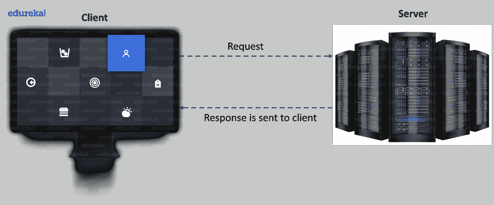
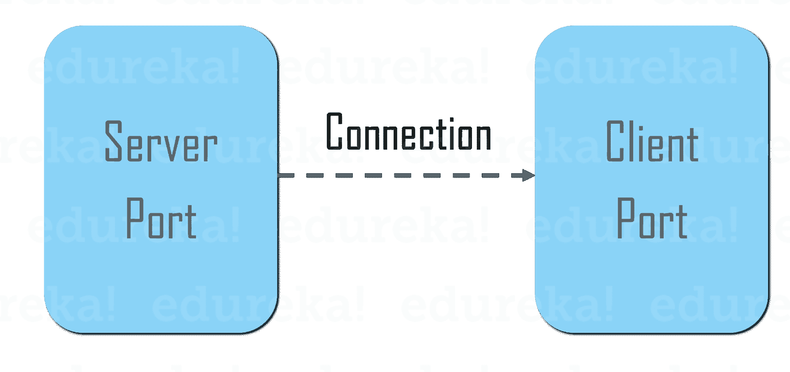

# 了解 Java 中的套接字编程

> 原文：<https://www.edureka.co/blog/socket-programming-in-java/>

Java 中的套接字编程用于运行在不同 [JRE](https://www.edureka.co/blog/what-is-java/#ComponentsinJava) 上的应用程序之间的通信。它可以是面向连接的，也可以是无连接的。总的来说，套接字是在客户机和服务器之间建立连接的一种方式。在这篇文章中，我将告诉你关于套接字编程的一切。

本文涵盖了以下主题:

*   [什么是 Java 中的套接字编程？](#WhatisSocketProgramminginJava?)
*   [什么是 Java 中的套接字？](#WhatisaSocketinJava?)
*   [客户端编程](#ClientSideProgramming)
*   [服务器端编程](#ServerSideProgramming)

## **什么是 Java 中的套接字编程？**

*套接字编程*是一种连接网络上两个节点相互通信的方式。一个 ***套接字*** (节点)监听一个 IP 上的特定端口，而另一个*套接字*向另一个套接字伸出以形成连接。



服务器形成监听器*套接字，而*客户端向服务器伸出手。套接字和服务器套接字[类](https://www.edureka.co/blog/java-tutorial/#obj)用于面向连接的套接字编程。

现在让我们来理解套接字编程的核心概念，即套接字。

## **什么是 Java 中的套接字？**

**套接字**在 [Java](https://www.edureka.co/blog/java-tutorial/) 中是网络上运行的两个程序之间双向通信链路的一个端点。一个 **套接字** 被绑定到一个端口号，以便 TCP 层可以识别数据被发送到的应用。

 端点是 IP 地址和端口号的组合。Java 平台中的包提供了一个类， Socket ，它实现了你的 Java 程序和网络上另一个程序之间双向连接的一方。该类位于平台相关的实现之上，对 Java 程序隐藏了任何特定系统的细节。通过使用该类而不是依赖本机代码，您的 [Java 程序](https://www.edureka.co/blog/java-programs/)可以通过网络以独立于平台的方式进行通信。

现在你知道了，什么是 Java 中的 Socket，让我们进一步了解客户端如何与服务器通信，以及服务器如何响应。

## **客户端编程**

在客户端编程的情况下，客户端将首先等待服务器启动。一旦服务器启动并运行，它将向服务器发送请求。之后，客户端将等待服务器的响应。这就是客户端和服务器通信的全部逻辑。现在让我们详细了解客户端和服务器端编程。

为了发起客户请求，您需要遵循下面提到的步骤:

**1。建立连接**

第一步是建立套接字连接。套接字连接意味着两台机器拥有关于彼此网络位置(IP 地址)和 TCP 端口的信息。

您可以借助以下语句创建套接字:

插座插座=新插座(" 127.0.0.1 "，5000)

*   这里，第一个参数表示服务器的 **IP 地址。**

*   第二个参数表示 **TCP 端口**。(它是一个数字，表示应该在服务器上运行哪个应用程序。)

**2。通信**

为了通过套接字连接进行通信，流被用于输入和输出数据。建立连接并发送请求后，您需要关闭连接。

**3。关闭连接**

一旦向服务器发送了消息，套接字连接就被显式关闭。

现在让我们看看如何编写一个 Java 程序来实现客户端的套接字连接。

```
// A Java program for a ClientSide
import java.net.*;
import java.io.*;
public class ClientProgram
{
// initialize socket and input output streams
private Socket socket = null;
private DataInputStream input = null;
private DataOutputStream out = null;
// constructor to put ip address and port
public Client(String address, int port)
{
// establish a connection
try
{
socket = new Socket(address, port);
System.out.println("Connected");
// takes input from terminal
input = new DataInputStream(System.in);
// sends output to the socket
out = new DataOutputStream(socket.getOutputStream());
}
catch(UnknownHostException u)
{
System.out.println(u);
}
catch(IOException i)
{
System.out.println(i);
}// string to read message from input
String line = "";
// keep reading until "Over" is input
while (!line.equals("Over"))
{
try
{
line = input.readLine();
out.writeUTF(line);
}
catch(IOException i)
{
System.out.println(i);
}
}
// close the connection
try
{
input.close();
out.close();
socket.close();
}
catch(IOException i)
{
System.out.println(i);
}
}
public static void main(String args[]) {
Client client = new Client("127.0.0.1", 5000);
}
}
```

现在，让我们实现服务器端编程，然后得到输出。

## **服务器端编程**

基本上，服务器将实例化它的对象并等待客户机请求。一旦客户端发送了请求，服务器将通过响应进行通信。

为了编写服务器端应用程序，您需要两个套接字，如下所示:

*   一个**服务器套接字**，它等待客户端请求(当客户端创建一个新的套接字())

*   一个普通的老式**插座**用于与客户端通信。

在这之后，您需要用响应与客户机进行通信。

**通信**

**getOutputStream()** 方法用于通过套接字发送输出。

**关闭连接**

一旦一切都完成了，通过关闭套接字以及输入/输出流来关闭连接是很重要的。

现在让我们看看如何编写一个 Java 程序来实现服务器端的套接字连接。

```
// A Java program for a Serverside
import java.net.*;
import java.io.*;
public class ServerSide
{
//initialize socket and input stream
private Socket socket = null;
private ServerSocket server = null;
private DataInputStream in = null;
// constructor with port
public Server(int port)
{
// starts server and waits for a connection
try{
server = new ServerSocket(port);
System.out.println("Server started");
System.out.println("Waiting for a client ...");
socket = server.accept();
System.out.println("Client accepted");
// takes input from the client socket
in = new DataInputStream(
new BufferedInputStream(socket.getInputStream()));
String line = "";
// reads message from client until "Over" is sent
while (!line.equals("Over"))
{
try
{
line = in.readUTF();
System.out.println(line);

}
catch(IOException i)
{
System.out.println(i);
}
}
System.out.println("Closing connection");
// close connection
socket.close();
in.close();
}
catch(IOException i){
System.out.println(i);
}
}
public static void main(String args[]){
Server server = new Server(5000);
}
}
```

配置客户端和服务器端后，您可以先执行服务器端程序。之后，您需要运行客户端程序并发送请求。客户端一发出请求，服务器就会响应。下面的快照表示相同。

1.当您运行服务器端脚本时，它将启动并等待客户端启动。


2.接下来，客户端将连接并以字符串的形式输入请求。


3.当客户端发送请求时，服务器会做出响应。


这就是你需要用 Java 执行一个 socket 程序的方式。您也可以在终端窗口或命令提示符下执行这些程序。但是，由于 Eclipse 的特性非常先进，您可以在一个控制台上简单地执行这两个程序。

这就把我们带到了关于 Java 套接字编程的文章的结尾。我希望我已经让你了解了一些关于套接字编程的知识。

*查看 Edureka 的 [**Java 在线课程**](https://www.edureka.co/java-j2ee-training-course) ，edu reka 是一家值得信赖的在线学习公司，在全球拥有超过 250，000 名满意的学习者。我们在这里帮助你的旅程中的每一步，为了成为一个除了这个 java 面试问题，我们提出了一个课程，这是为学生和专业人士谁想要成为一个 Java 开发人员设计的。*

有问题要问我们吗？请在这篇“用 Java 进行套接字编程”文章的评论部分提到它，我们会尽快回复您。