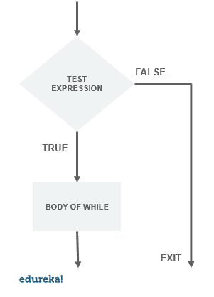

# Python 中的 While 循环:您需要知道的一切

> 原文：<https://www.edureka.co/blog/while-loop-in-python/>

python 中的循环是优化代码以执行多条语句的有效方法。如果某个特定的代码必须执行多次，用户可以将它放入一个循环中执行多次迭代，以获得所需的输出。它节省了大量的精力，也降低了代码的复杂性。在这篇博客中，我们将通过各种例子来讨论 python 中 while 循环的概念。以下是本博客讨论的主题:

*   [什么是 While 循环？](#whileloop)
*   [控制流程](#flow)
*   [While 循环中的 Python 控制语句](#controlstatement)
*   [While 用条件语句循环](#conditionalstatement)
*   [无限 While 循环](#infinite)
*   [嵌套 While 循环](#nestedwhile)

## **什么是 While 循环？**

python 中的 while 循环用于迭代一段代码或语句，只要测试表达式为真。在 while 循环的情况下，用户事先不知道将要进行多少次迭代。看看 python 中 while 循环的语法。

```

while (test expression):

# statements in the while block

```

## **控制流**

## ****

执行开始并检查测试表达式是否为真，当测试表达式为真时，它进入 while 循环并执行 while 循环中的语句。一旦测试表达式为 false，执行就会跳过 while 循环，并转到程序中的下一条语句。

为了控制循环中的流，可以在 while 循环中使用各种控制语句，如 break 和 continue。让我们看看如何在 while 循环中使用这些控制语句。

## **Python 控制语句中的 While 循环**

**中断语句:**

python 中的 Break 语句用于跳过遇到它的块的整个执行过程。一旦在循环中遇到 break 语句，执行就会跳过剩余的迭代并移出循环。

```
i = 1
while i <= 5 :
     print(i)
     if i == 4:
        break
     i = i+1

```

```
Output: 1
2
3
4
```

一旦 x 的值变为 4，执行将跳过剩余的迭代。为了理解它如何影响执行，让我们再举一个 continue 语句的例子。

**继续语句**

Continue 用于跳过循环中的当前迭代。一旦在循环中遇到 continue，就会跳过当前迭代，但仍会执行剩余的迭代。

```
i = 1
while i <=5 :
      if i == 4:
         i = i+1
         continue
      else:
         print(i)
         i = i+1

```

```
Output: 1
2
3
5
```

一旦在循环中遇到 continue 语句，就跳过当前迭代，循环执行剩余的迭代。

## While 用条件语句循环

条件语句也有逻辑条件作为测试表达式，用于 python 中的决策。为了理解 while 循环中条件语句的使用，让我们举一个例子。

```
num =int(input('enter a number'))
while num >= 0:
       if num == 0:
          print('equal to zero')
       elif num > 0:
          print('greater than zero')
       else:
         print('enter a valid number')
       break

```

这是一个我们在程序中使用条件 if 和 else 语句的简单例子。对于更复杂的决策问题，我们可以在 while 循环中使用条件语句，其中测试表达式将在开始时声明。

## **无限 While 循环**

无限 while 循环执行无限次，这意味着理论上执行永远不会停止。这可能令人惊讶，但它也有自己的优点和缺点。

例如，如果我们不为测试表达式中的变量指定一个增量运算符[的话，循环将永远不会停止，这意味着它将执行无限次。](https://www.edureka.co/blog/operators-in-python/)

```
i = 4
while i > 0:
   print(' i am an infinite while loop')

```

这个程序将运行无限次迭代，除非我们按 ctrl+c 或者在循环中放一个控制语句。

## **嵌套 While 循环**

如果一个 while 循环由另一个 while 循环组成，我们可以称之为嵌套 while 循环。嵌套 while 循环中的循环次数没有特别的限制。它可能会根据用户的要求或在程序中声明的次数持续运行。

为了理解这一点，让我们看一个例子:

```
i = 1
j = 5
while i < 6:
    while j > 0:
     print(i,j)
     j = j -1
     i = i + 1

```

```
Output: 1 5
2 4
3 3
4 2
5 1
```

在这个例子中，我们有两个[变量](https://www.edureka.co/blog/variables-and-data-types-in-python/) i 和 j，它们用在不同的测试表达式中。这是使用嵌套循环的典型例子。

让我们再举一个使用条件和控制语句的例子。

```

i = 'edureka'
j = 1
while j > 0:
    for x in i:
       print(j , x)
       j = j + 1
    if x == 'a':
    break

```

```
Output: 1 e
2 d
3 u
4 r
5 e
6 k
7 a
```

在本文中，我们通过各种例子讨论了 python 中 while 循环的概念。当我们有一个可以在循环开始时测试的测试表达式时，While 循环起着重要的作用。例如——对银行数据使用 while 循环，只有满足测试表达式(在这种情况下可以是任何统计值)时，我们才会继续。 [Python 编程语言](https://www.edureka.co/blog/introduction-to-python/)因其易访问性，使基本概念的工作变得容易。要掌握你的技能，报名参加 Edureka 的 [python 认证项目](https://www.edureka.co/data-science-python-certification-course)，开始你的学习。

*有什么问题吗？在评论区提到它们。我们会尽快回复你。*