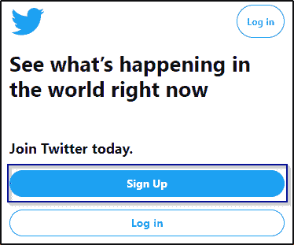
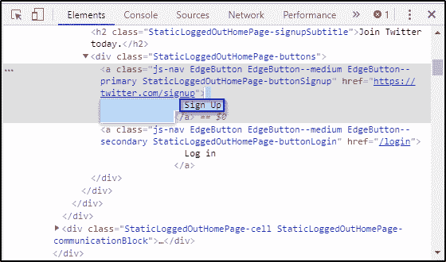

# 如何在 Selenium 中使用链接文本？

> 原文：<https://www.edureka.co/blog/link-text-in-selenium/>

[Selenium 中的定位器](https://www.edureka.co/blog/locators-in-selenium/)用于惟一地标识 web 页面上的 web 元素。像 [Id](https://www.edureka.co/blog/locators-in-selenium/#Idlocator) 、 [name](https://www.edureka.co/blog/locators-in-selenium/#Namelocator) 、 [CSS 选择器、](https://www.edureka.co/blog/css-selectors-in-selenium/) [XPath](https://www.edureka.co/blog/xpath-in-selenium/) 等各种定位器服务于不同的目的。为了定位网页上的特定按钮或链接，我们使用链接文本定位器。在本文中，您将看到在 [Selenium](https://www.edureka.co/blog/selenium-tutorial) 中使用链接文本来定位元素。

本文涵盖以下主题:

*   [Selenium 中的链接文本](#LinkTextlocatorinSelenium)
*   [部分链接文本定位器](#PartialLinkTextLocator)

我们开始吧！

## **Selenium 中的链接文本**

一个*链接文本*用于识别网页上的超链接。可以借助一个*主播标签* ( < a >)来确定。为了在网页上创建超链接，你可以使用锚标签，后跟[链接文本](https://www.edureka.co/blog/locators-in-selenium/#LinkText&PartialLinkText)。

现在，让我们借助一个例子来检查一下 **linkText locator** 。假设您想要定位“*注册”*链接，如下图所示。你会怎么做？

让我带你经历这些步骤。



在检查“注册*”*按钮时，您可以注意到它以下面代码片段中的锚标记开始。但是，这个锚标记没有任何名称和 Id 属性。在这种情况下，您可以使用 **linkText** 定位器。



要了解更多关于自动化测试的知识，请在线加入我们的[自动化测试课程](https://www.edureka.co/masters-program/automation-testing-engineer-training)。此外，如果你希望掌握自动化测试的原则，并致力于对商业世界有重要意义的分步任务，行业专业人士开发了自动化测试大纲。

在上面的代码片段中，它由一个名为  *【注册】*的文本组成。我将利用该文本，并使用一个*链接文本*来编写我的代码，如下所示。

```
package Edureka;
import java.util.concurrent.TimeUnit;
import org.openqa.selenium.By;
import org.openqa.selenium.chrome.ChromeDriver;
public class Locators {
public static void main(String[] args) {

//Configuring chrome driver
System.setProperty("webdriver.chrome.driver", "C:Selenium-java-edurekachromedriver_win32chromedriver.exe");
WebDriver driver = new ChromeDriver();

//maximizing the window and deleting cookies
driver.manage().window().maximize();
driver.manage().deleteAllCookies();
//Assigning page timeout and implicit wait
driver.manage().timeouts().pageLoadTimeout(40, TimeUnit.SECONDS);
driver.manage().timeouts().implicitlyWait(30, TimeUnit.SECONDS);
//navigating through the particular website
driver.get("https://twitter.com/");
driver.findElement(By.linkText("Sign Up")).click(); //linkText locator for links
}
}
```

当你运行上面的 [Java](https://www.edureka.co/blog/java-tutorial/) 程序， [***chrome 驱动***](https://www.edureka.co/blog/selenium-chromedriver-and-geckodriver/) 就会启动谷歌 chrome，重定向到 twitter 主页，点击“注册”按钮，导航到下一页。您可以参考下面的输出快照:


这就是它的工作原理。现在让我们进一步看看如何在部分链接文本的帮助下定位一个元素。

## **部分链接文本定位器**

在某些情况下，您可能需要通过 *linkText* 元素中的部分文本来查找链接。在这种情况下，可以使用  *局部链接文本* 来定位元素。我们举同样的例子，试着定位一下。我将选择*“注册”*链接。现在，我不再粘贴全文，而是将它作为  *符号*给出。所以，我的代码看起来像这样:

```
driver.get("https://twitter.com/");
driver.findElement(By.partialLinkText("Sign")).click(); //partiallinkText locator for links
```

现在，当你运行上面的代码时，它会被重定向到“**注册***”*页面，如上图输出的快照所示，但不同的是，你是用部分值来定位链接的。我希望这能让你清楚地了解 [selenium](https://www.edureka.co/blog/what-is-selenium/) 中的 **linkText** 和**partial inktext**定位器是如何工作的。

#### **注:**

假设有多个具有相同文本值的链接。看看下面的快照，它有两个同名的按钮。


在这里，两者的 ***登录链接服务于*** 同样的目的。但是，您希望找到第一次登录。你会怎么做？在这种情况下，不能使用 linkText 或 partialLinkText，但是可以使用其他定位器，比如 XPath 或 CSS 选择器。如果您想知道如何使用 XPath 和 CSS 选择器识别和定位 web 元素，您可以查看 Selenium 和 [CSS 选择器](https://www.edureka.co/blog/css-selectors-in-selenium/)中关于 **[XPath 的文章。](https://www.edureka.co/blog/xpath-in-selenium/)**

至此，我们结束了这篇关于 [Selenium](https://www.edureka.co/blog/selenium-webdriver-architecture/) 中链接文本的文章。希望对你有帮助，让你的知识增值。

*如果您希望学习 [Selenium](http://seleniumhq.org) 并在测试领域建立职业生涯，那么请查看我们的交互式在线直播 **[Selenium 认证](https://www.edureka.co/selenium-certification-training)** ，它提供 24*7 支持，在整个学习期间为您提供指导。*

*有问题吗？请在“Selenium 中的链接文本”文章的评论部分提到它，我们将会回复您。*