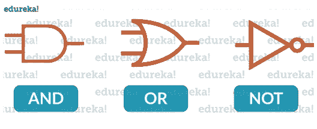

# Java 及其类型中的运算符有哪些？

> 原文：<https://www.edureka.co/blog/operators-in-java/>

运算符是可以操作操作数值的结构。考虑表达式 2 + 3 = 5，这里 2 和 3 是**操作数**，而+被称为**操作符**。在这篇关于 **[Java](https://www.edureka.co/blog/java-tutorial/)** 操作符的文章中，的目标是让您获得开始使用 Java 操作符所需的专业知识。

Java 支持以下类型的运算符:

*   [算术运算符](#arithmeticoperators)
*   [赋值运算符](#assignmentoperators)
*   [逻辑运算符](#logicaloperators)
*   [关系运算符](#relationaloperators)
*   [一元运算符](#unaryoperators)
*   [按位运算符](#bitwiseoperators)
*   [三元运算符](#ternaryoperators)
*   [移位操作符](#shiftoperators)

让我们逐一关注这些操作符。

## **Java 中的算术运算符**

算术运算符用于执行数学运算，如加、减等。假设下表中 A = 10，B = 20。

| 操作员 | 描述 | 例子 |
| +加法 | 将运算符两边的值相加 | A+B=30 |
| –减法 | 用左手运算符减去右手运算符 | A-B=-10 |
| *乘法 | 将运算符两边的值相乘 | A*B=200 |
| /分部 | 用右手运算符除左手操作数 | A/B=0 |
| %模量 | 将左操作数除以右操作数，并返回余数 | A%B=0 |

考虑下面的例子:

```
package Edureka;

public class ArithmeticOperators {
	  public static void main(String[] args) {
		    int A = 10;
		    int B = 20;
		    System.out.println(A + B);
		    System.out.println(A - B);
		    System.out.println(A * B);
		    System.out.println(A / B);
		    System.out.println(A % B);
		  }

}

```

**输出:**

30 -10 200 0 10

## **Java 中的赋值运算符**

一个 *赋值运算符* 是一个 *运算符* 用于 *给* 一个变量赋值。假设下表中 A = 10，B = 20。

| **操作员** | **描述** | **例子** |
| = | 将右侧操作数的值分配给左侧操作数 | c = a + b |
| += | 它将右操作数与左操作数相加，并将结果赋给左操作数 | c += a |
| -= | 它从左操作数中减去右操作数，并将结果赋给左操作数 | c -= a |
| *= | 它将右操作数与左操作数相乘，并将结果赋给左操作数 | c *= a |
| /= | 它将左操作数除以右操作数，并将结果赋给左操作数 | c /= a |
| %= | 它使用两个操作数取模，并将结果赋给左操作数 | c %= a |
| = | 对运算符执行指数(幂)计算，并将值赋给左操作数 | ^= a |

考虑下面的例子:

```
package Edureka;

public class JavaOperators {
	  public static void main(String[] args) {
		    int a = 10;
		    int b=20;
		    int c;
		    System.out.println(c = a); // Output =10
		    System.out.println(b += a);// Output=30
		    System.out.println(b -= a);// Output=20
		    System.out.println(b *= a);// Output=200
		    System.out.println(b /= a);// Output=2
		    System.out.println(b %= a);// Output=0
		    System.out.println(b ^= a);// Output=0
		  }

}
```

继续学习 Java 操作符教程，让我们看看什么是比较操作符。

## **Java 中的关系运算符**

这些运算符比较两边的值，并决定它们之间的关系。假设 A = 10，B = 20。

| 操作员 | 描述 | 例子 |
| == | 如果两个操作数的值相等，则条件为真。 | (A == B)不成立 |
| ！= | 如果两个操作数的值不相等，则条件为真。 | (答！= B)为真 |
| > | 如果左操作数的值大于右操作数的值，则条件为真。 | (a > b)不正确 |
| < | 如果左操作数的值小于右操作数的值，则条件为真。 | (a < b)为真 |
| >= | 如果左操作数的值大于或等于右操作数的值，则条件为真。 | (a >= b)不成立 |
| <= | 如果左操作数的值小于或等于右操作数的值，则条件为真。 | (a < = b)为真 |

考虑下面的例子:

```
package Edureka;

public class JavaOperators {
	  public static void main(String[] args) {
		    int a = 10;
		    int b=20;
		    System.out.println(a == b); // returns false because 10 is not equal to 20
		    System.out.println(a != b); // returns true because 10 is not equal to 20
		    System.out.println(a > b); // returns false 
		    System.out.println(a < b); // returns true 
                    System.out.println(a >= b); // returns false
		    System.out.println(a <= b); // returns true 
		  }

}

```

接下来，让我们关注一下 [Java](https://www.edureka.co/blog/what-is-java/) 中的逻辑运算符。

## **Java 中的逻辑运算符**

以下是 Java 中的逻辑运算符:



| **操作员** | **描述** | **例子** |
| &&(和) | 如果两个操作数都为真，则为真 | a<10 && a<20 |
| &#124;&#124;(或) | 如果任一操作数为真，则为真 | a<10 &#124;&#124; a<20 |
| ！(不是) | 如果操作数为假，则为真(对操作数进行补码) | ！(x<10&a<20) |

考虑下面的例子:

```
package Edureka;

public class JavaOperators {
	  public static void main(String[] args) {
		    int a = 10;
		System.out.println(a<10 & a<20);  //returns false
		System.out.println(a<10 || a<20); //returns true
		System.out.println(!(a<10 &  a<20)); //returns true
		  }  
}

```

现在让我们看看 Java 中的一元运算符。

## **Java 中的一元运算符**

一元运算符需要一个操作数，用于增加一个值、减少一个值或取反一个值。

| **操作员** | **描述** | **例子** |
| ++ | 将值增加 1。有后增量和前增量运算符 | a++和++a |
| — | 将值减 1。有后递减和前递减运算符 | a-或-a |
| ！ | 反转布尔值 | ！a |

考虑下面的例子:

```
package Edureka;

public class JavaOperators {
	  public static void main(String[] args) {
		    int a = 10;
		    boolean b=true;
        System.out.println(a++);  //returns 11
        System.out.println(++a);  
        System.out.println(a--);  
        System.out.println(--a);  
        System.out.println(!b); // returns false
		  }  
}

```

接下来，让我们来理解 Java 中的按位运算符

## **Java 中的按位运算符**

位运算直接操作**位**。在所有的计算机中，数字都是用比特，一系列的 0 和 1 来表示的。事实上，计算机中几乎所有的东西都是用比特来表示的。假设下表中 A = 10，B = 20。

| **操作员** | **描述** | **例子** |
| &(和) | 逐位返回输入的和 | 甲&乙 |
| &#124;(或) | 返回输入值的或 | a&#124;b |
| ^(异或) | 返回输入值的异或 | a^b |
| ~(补码) | 返回一的补码。(所有位反转) | ~a |

考虑下面的例子:

```
package Edureka;

public class JavaOperators {
	  public static void main(String[] args) {
		    int a = 58; //111010
		    int b=13; //1101
        System.out.println(a&b);  //returns 8 = 1000
        System.out.println(a|b);  //63=111111
        System.out.println(a^b);  //55=11011
        System.out.println(~a);  //-59
		  }  
}

```

接下来，让我们关注 Java 中的三元运算符

## **Java 中的三元运算符**

三元运算符是一个条件运算符，它在执行比较和[条件](https://www.edureka.co/blog/java-tutorial/#control)时减少代码长度。此方法是使用 if-else 和嵌套 if-else 语句的替代方法。该运算符的执行顺序是从左到右。

**语法:**

```
(Condition) ? (Statement1) : (Statement2);
```

*   **条件:** 返回布尔值的待求值表达式。
*   **语句 1:** 是条件为真状态时要执行的语句。
*   **语句 2:** 是条件导致假状态时要执行的语句。

考虑下面的例子:

```
package Edureka;

public class JavaOperators {
	  public static void main(String[] args) {
		  int a = 20, b = 10, c = 30, res; 
		res = ((a > b) ? (a > c)? a: c: (b > c)? b: c); 
		System.out.println("Max of three numbers = "+ res); 
		} 
}

```

**输出**–三个数字的最大值= 30

前进到最后一个 java 操作符，让我们理解 Java 中的移位操作符。

## **Java 中的移位运算符**

移位运算符用于左移或右移一个数的位，从而对该数进行乘法或除法运算。移位运算符有三种不同的类型，分别是左移位运算符()< <、有符号右移位运算符(> >)和无符号右移位运算符(> > >)。

**语法:**

```
 number shift_op number_of_places_to_shift;
```

考虑下面的例子:

```
package Edureka;

public class JavaOperators {
	  public static void main(String[] args) {
		    int a=58; 
        System.out.println(a<<2); //232=11101000 
        System.out.println(a>>2);  //returns 14=1110
        System.out.println(a>>>2); //returns 14
		  }  
}

```

至此，我们结束了这篇关于不同 Java 操作符的文章。我希望这篇文章对你有所帮助。

查看 Edureka 提供的 [**Java 课程**](https://www.edureka.co/java-j2ee-training-course) 培训，edu reka 是一家值得信赖的在线学习公司，在全球拥有超过 250，000 名满意的学习者。我们在这里帮助你的旅程中的每一步，为了成为一个除了这个 java 面试问题，我们提出了一个课程，这是为学生和专业人士谁想要成为一个 Java 开发人员设计的。

有问题吗？请在这篇“Java 中的操作符”文章的评论部分提到它，我们会尽快回复您。