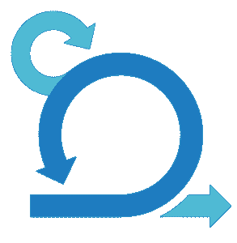
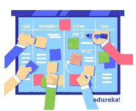
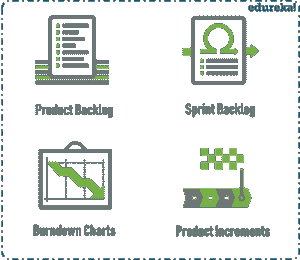
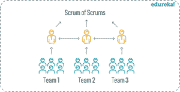
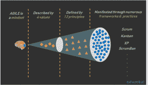
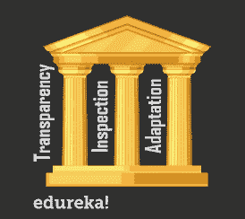

# 2019 年你需要知道的 50 大 Scrum 大师面试问题

> 原文：<https://www.edureka.co/blog/scrum-master-interview-questions/>

Scrum 框架正迅速成为对采用敏捷哲学感兴趣的团队的首选框架。鉴于 Scrum 框架名气的增长，这种增长也推动了对 [Scrum Master 认证](https://www.edureka.co/certified-scum-master-certification-training)的空前需求也就不足为奇了。

这里有 50 个 scrum 大师面试问题，可以帮助你离你梦想的 scrum 大师工作更近一步。

让我们从 Scrum 大师面试问题中最常见的问题开始。

**Q1\.** [What is Agile? Explain Agile in 2 min](#agile)**Q2. **[When to use Agile Model? Is it suitable in all situations?](#agile-uses)**Q3\.** [State some major principles of agile.](#agile-principles)**Q4.** [What is Scrum? How is it different from waterfall model?](#scrum)**Q5\.** [What is Scrum Sprint? What is the ideal duration for a Sprint?](#sprint)**Q6\.** [What are the different roles involved in the Scrum Framework?](#scrum-roles)**Q7\.** [What are the most important components of Agile?](#agile-components)**Q8\.** [What is the role of a scrum master?](#scrummaster)**Q9. **[What are the responsibilities of a Scrum Master?](#scrum-master-responsibilities)

**Q10。**[scrum 中的故事点是什么？怎么算的？](#story-point)

为了更好地理解，我将 Scrum Master 面试的其余问题分成了以下几个部分:

*   [技术 Scrum 高手面试题](#TechQuestions)
    *   [初级 Scrum 大师面试问题](#BaiscQuestions)
    *   [进阶等级 Scrum 大师面试问题](#AdvancedQuestions)
*   [基于比较的 Scrum Master 面试问题](#ComparisionQuestions)
*   [基于真实场景的 Scrum 大师面试问题](#RealWorldQuestions)

我们从第一节 Scrum Master 面试问题开始。

## **技术 Scrum 高手面试问题**

这个类别下的问题都是基于敏捷、Scrum 框架和 Scrum Master 相关的技术问题。基本上，通过问这些问题，你是在测试这个领域的学科知识和专业技能。

### **初级 Scrum 大师面试问题**

scrum 大师面试问题的这一部分将涵盖你在参加 Scrum 工作面试时可能遇到的所有基本问题。

**Q1。什么是敏捷？用 2 分钟解释敏捷。**

这是一个棘手且有争议的问题，因为敏捷的定义还没有达成共识。敏捷是框架吗？敏捷是方法论吗？

*敏捷* *是一种* *的思维模式，一种哲学，更像是一种思维方式，一种在开发产品时关注沟通、团队思维、内在动机、授权、创新、流程和价值创造的运动* *。*

**Q2。** **什么时候使用敏捷模式？是否适合所有情况？**

像敏捷这样的灵活模型可以用于以下情况:

*   在开发周期之间需要实现新的变化
*   从事复杂和更大的项目
*   有长期目标，没有对要求的限制
*   必须迅速将产品推向市场
*   在整个开发周期中经常会有变化
*   没有时间和预算的限制

**Q3。陈述敏捷的一些主要原则。**

敏捷的关键原则包括:

*   客户满意度
*   面对面的交流
*   连续反馈
*   快速响应变化
*   可持续发展
*   自组织
*   连续改进
*   集体团队工作

**Q4。** **什么是 Scrum？和瀑布模型有什么不同？**

Scrum 是一个轻量级的[敏捷框架，](https://www.edureka.co/blog/importance-of-agile-pmi-acp/)，人们可以在其中解决复杂的适应性问题，同时富有成效和创造性地交付尽可能高价值的产品。

它在以下方面不同于瀑布模型:

*   反馈是在早期阶段收到的
*   最大限度地降低应对变化的风险
*   重点是协作开发
*   增加投资回报
*   允许回滚更改

**Q5。什么是 Scrum Sprint？短跑的理想持续时间是多少？**

这是一个在 scrum 大师面试中非常常见的问题。Sprint 是 scrum 方法论中一个有规律的、重复的工作周期，在此期间工作被完成并准备好接受评审。通常，scrum sprint 的持续时间取决于项目的规模和参与项目的人数。平均来说，短跑的持续时间大约是 4 周。

**Q6。Scrum 框架中包含哪些不同的角色？**

scrum 中涉及的三个[角色](https://www.edureka.co/blog/what-is-scrum/#ScrumTeam)如下:

*   **产品负责人** 负责团队应该完成的工作。产品负责人的主要作用是 ***激励团队实现*** 的目标和项目的愿景。
*   **Scrum Master**确保所有的  ***团队成员遵循 Scrum 的理论、规则和实践**。* 他们确保 Scrum 团队拥有完成工作所需的一切，比如清除阻碍进度的路障、组织会议、处理挑战和瓶颈
*   **开发团队(Scrum Team)** 是  一个自组织和跨职能的团队， ***一起工作交付产品*** 。Scrum 开发团队可以自由地组织和管理他们自己的工作，以最大化团队的有效性和效率。

**Q7。敏捷最重要的组成部分是什么？**

构成敏捷的最重要的组成部分是:

*   每天进行的站立会议
*   班级职责和合作者卡片
*   时间框任务板
*   进行迭代开发的迭代计划会议
*   TDD(测试驱动开发)，持续集成，定期代码评审，结对编程，自动化构建等。

**Q8。scrum 大师的角色是什么？**

你应该这样处理一个 Scrum Master 面试问题:Scrum Master是团队的常驻协调员，负责帮助所有团队成员遵循 Scrum 的理论、规则和实践。他们确保 Scrum 团队拥有完成工作所需的一切，比如清除阻碍进展的路障，组织会议，处理挑战和瓶颈。

**Q9。****Scrum 大师的职责是什么？**

Scrum Master 以不同的方式服务于*产品负责人、开发团队*和*组织*。scrum 大师最重要的职责包括:

*   确保参与项目的每个人都理解项目的目标和范围
*   消除阻碍&可能减缓团队进展的障碍
*   指导团队和产品负责人提高他们实践的有效性
*   做出改变以提高 scrum 团队的生产力
*   在被要求和需要的时候促进 Scrum 活动
*   帮助利益相关者和员工理解 scrum 经验理论

**Q10。****scrum 中的故事点是什么？怎么算的？**

稀松布的每一个特征都是一个故事。故事点是 scrum 团队用来确定实现一个给定故事的难度的任意度量。

**Q11。****scrum 中的 Stroy 板是什么？**

Scrum 的一个重要原则是透明的理念。这就是为什么让整个团队都能看到东西是非常重要的。这其中的一个重要因素是**故事板**。它是一个软件项目进度的可视化表示，一般有四栏，分别是*、【待办】、【进行中】、【测试】、*、*、【完成】、*。

**Q12。Scrum 中的日常单口相声是什么？这些会议需要什么？**

**每日争论，** 一个也被称为单口相声，是一个  ***15 分钟的每日会议*** 在这里团队有机会达成一致，并为接下来的 24 小时制定策略。本次会议讨论的三个主要问题是:

*   自上次会议以来，你完成了什么？
*   你计划在下次会议前完成什么？
*   有什么阻碍你工作的障碍吗？

**Q13。****Scrum 流程的三大神器是什么？**

工件只是在开发产品时提供项目细节的物理记录。 [Scrum 神器](https://www.edureka.co/blog/what-is-scrum/#ScrumArtifacts)包括:

*   产品积压——概述最终产品需要的任务和每个需求的文档
*   sprint Backlog——列出了产品待办事项中需要在 sprint 中处理的所有项目
*   产品增量——在一次冲刺中完成的产品工作的总和，加上之前冲刺中完成的所有工作

还有另一个称为燃尽图的工件，将在下面的问题中讨论。

**Q14。Scrum 中的用户故事是什么？好的用户故事是怎样的？**

用户故事是敏捷软件开发中使用的工具，它代表了一个团队在 sprint 中可以交付的一小部分商业价值。基本上，它创建了用户需求的简化描述。用户故事分三个阶段逐步定义:

*   我们为谁而建，用户是谁？—作为 ***<类型的用户>***
*   我们在建设什么，意图是什么？—我想要 ***<一些目标或目的>***
*   我们为什么要构建它，它为用户带来了什么价值。？—使 ***<受益，值>***

**Q15。****scrum 中有哪些烧完和烧完的图表？**

燃尽图和燃尽图用于跟踪项目的进展。燃尽图说明了已完成的工作量，而燃尽图说明了完成一个项目所需的剩余工作量。请记住，工作是根据用户故事而不是时间来衡量的。

**Q16。scrum 燃尽图包括什么？**

燃尽图用于跟踪冲刺状态，它们说明了完成一个项目的剩余工作量。此外，他们将突出显示他们看到冗余的区域。因此，燃尽图包括:

*   显示工作日的 x 轴
*   显示剩余工作的 y 轴
*   作为指导方针的理想努力
*   努力的实际进展

**Q17。提及召开 Sprint 回顾会议的目的是什么？**

在 ***冲刺回顾*** 期间，团队讨论  ***哪些做对了，哪些做错了，如何改进*** 。他们决定如何解决问题，并创建一个改进计划，在下一个 sprint 期间实施。

**Q18。列举一些流行的敏捷框架。除了 scrum，你还知道其他敏捷方法吗？**

当你被问到这类问题时，如果你没有使用过任何其他框架，你可以只说出几个你可能听说过的。其他基于敏捷的框架有:

*   看板法
*   测试驱动开发
*   特性驱动开发
*   极限编程
*   透明的
*   精益软件开发

**Q19。敏捷中的术语速度是什么？如何衡量？**

速度预测敏捷在一次冲刺中能完成多少工作，以及完成一个项目需要多少时间。这个数字是通过将最后一个 sprint 的故事中的所有故事点相加得到的。

**Q20。Scrum 中的发布候选是什么？**

Scrum 中的发布候选是软件的一个构建或版本，已经准备好了，可以发布到产品中。此外，诸如用户验收测试(UAT)之类的测试可以在该版本的产品上执行。

**Q21。解释什么是 scrum 中的 scrum。**

这是一个经常被问到的 scrum master 面试问题。例如，假设有一个活动项目，有七个团队在一起工作。每个团队的成员人数也是 7 人，负责领导他们自己的 scrum 会议。但是，为了协调和沟通不同的团队，他们需要组织一个单独的 scrum 会议。这个会议被称为 scrum 的 scrum。每个团队的负责人参加会议，讨论他们的工作和进展。

**Q22。列出一些你听说过的流行的项目管理工具。**

项目管理中使用的一些流行工具是 Rally Software，Version One，XPlanner，EasyBacklog Agilefant，以及许多其他工具。

### **高级水平 Scrum 大师面试问题**

**Q23。你知道敏捷宣言吗？简单解释一下。**

敏捷宣言是一个由 4 个关键价值观和 12 个原则组成的声明，它们构成了敏捷的核心。敏捷有多种形式。敏捷的每一个子集都以不同的方式应用了这四个价值和 12 个原则，但是它们都依赖于它们来指导高质量、可工作软件的开发和交付。

**Q24。你能说出敏捷宣言中提到的敏捷软件开发的四个价值吗？**

敏捷宣言中陈述的四个核心价值观是:

*   过程和工具之上的个人和交互
*   综合文档之上的工作软件
*   合同谈判中的客户协作
*   响应变化而不是遵循计划

**Q25。什么是经验过程控制？scrum 的基础是什么？**

经验过程控制是 Scrum 的核心原则，依赖于三个主要的理念:*透明、检查和适应。使用经验过程控制，你既不能确定产品的范围，也不能确定如何构建产品的过程。相反，您可以在短周期内创建一个可运输的小产品，检查您创建它的内容和方式，并调整产品和构建它的方式，使用内置的透明机制来实现清晰的检查。*

**Q26。你对 Scrum 中的障碍了解多少？举例说明可能的障碍。**

障碍是 scrum 团队面临的阻碍或问题，它会减缓他们的工作进度。出现这种情况的原因有很多，如下所列:

*   资源缺失或团队成员生病
*   技术、操作、组织问题
*   缺乏管理支持系统
*   商业问题
*   天气、战争等外部问题
*   缺乏技能或知识
*   缺少项目资源

作为后续问题，可能会问你如何消除你提到的任何障碍。

**Q27。一个优秀的敏捷测试人员应该具备哪些素质？**

每个敏捷测试人员都应该具备的一些基本技能是:

*   要求熟悉敏捷的核心概念和原则
*   应具备优秀的沟通技巧，与团队和客户进行交流
*   能够根据不断变化的需求设定任务的优先级
*   应该能够正确理解需求
*   正确理解因需求变化而导致的项目风险

**Q28。** **举出一些不建议使用 scrum 的场景？**

并不是每个关于 Scrum 的故事都是成功的。Scrum 也可能失败。在以下情况下，不建议使用 scrum:

*   需求没有太大的变化
*   你正与庞大的团队一起工作，或者有更多的责任
*   组织不愿意适应 scrum 框架
*   经常需要响应，比 sprint 允许的更快

**Q29。** **你持有敏捷认证吗？你为什么选择这个认证？**

如果你没有任何证书，这种问题可能会显得很尴尬。在这种情况下，保持冷静，让面试官知道你将来是否打算接受面试。如果是，那么说明你为什么有这个证书。供您参考，以下是一些组织通常会考虑的认证:

*   敏捷认证从业者
*   敏捷 Scrum 大师
*   认证 Scrum 大师
*   PSM(职业 Scrum Master)
*   安全 Agilist

**Q30。** **你是认证的 scrum 大师吗？**

如果你没有认证，他们问你这个问题，不要慌！自信地回答你是否有 scrum master 认证。如果你是一个认证的 scrum master，只需要分享你的认证细节，比如认证类型，获得的分数，以及通过的年份。以防你没有资格强调你在特定领域的经验，并让面试官知道你是否打算在未来参加面试。

**Q31。有人建议过使用瀑布而不是 Scrum 吗？如果是，请解释时间。**

当您的需求简单、定义明确、完全理解、可预测，并且在项目完成之前不会发生变化时，您可能会选择瀑布模型。

**查看我们在顶级城市的 CSM 认证培训**

| 印度 | 美国 | 其他国家 |
| [在海德拉巴的 CSM 培训](https://www.edureka.co/certified-scrum-master-certification-training-hyderabad) | [亚特兰大的 CSM 培训](https://www.edureka.co/certified-scrum-master-certification-training-atlanta) | [伦敦 CSM 培训](https://www.edureka.co/certified-scrum-master-certification-training-london) |
| [班加罗尔的 CSM 培训](https://www.edureka.co/certified-scrum-master-certification-training-bangalore) | [波士顿的 CSM 培训](https://www.edureka.co/certified-scrum-master-certification-training-boston) | [澳大利亚 CSM 培训](https://www.edureka.co/certified-scrum-master-certification-training-australia) |
| [钦奈 CSM 培训](https://www.edureka.co/certified-scrum-master-certification-training-chennai) | [纽约 CSM 培训](https://www.edureka.co/certified-scrum-master-certification-training-new-york-city) | [新加坡 CSM 培训](https://www.edureka.co/certified-scrum-master-certification-training-singapore) |

**Q32。使用 scrum 有什么弊端？**

在这种情况下使用 scrum 会带来如下问题:

*   经常需要对每日 scrum 会议进行回顾
*   所有团队成员都缺乏成熟和奉献精神
*   对于 scrum 大师来说，计划和构建一个缺乏明确目标的项目将是一项棘手的工作
*   产品的不确定性、频繁的变更和频繁的产品交付

## **基于比较的 Scrum Master 面试问题**

**Q33。** **敏捷开发模型与瀑布模型** **有何不同？**

下面给出敏捷和瀑布之间的一些主要区别

*   在瀑布模型中，工作是按顺序进行的，也就是说，前一个阶段必须在开始下一个阶段之前结束，而在敏捷模型中，所有的阶段都是在每次迭代中完成的。
*   来自最终用户的反馈是在较晚的阶段(开发周期的末尾)收到的，而在敏捷中，反馈是在整个开发周期中不断收到的
*   在瀑布模型中，需求应该在开始开发活动之前最终确定。在敏捷中，变化在所有阶段都是受欢迎的，因此，它是灵活的
*   在瀑布模型中，进度是以完成的百分比来衡量的，而在敏捷模型中，进度是以工作软件来衡量的
*   在瀑布模型中，决策或控制权掌握在项目经理手中，而在敏捷模型中，驱动项目的是自我激励和自我组织的团队

**Q34。敏捷和 Scrum 一样吗？**

***敏捷**是一套基于  **敏捷宣言中所表达的价值观和原则的方法和实践。**而* *Scrum 是一个处理[角色](https://www.edureka.co/blog/what-is-scrum/#ScrumTeam)、[事件](https://www.edureka.co/blog/what-is-scrum/#ScrumEvents)、[工件](https://www.edureka.co/blog/what-is-scrum/#ScrumArtifacts)以及实现**敏捷思维的规则/指南的框架。*** 下表列出了 [Scrum &敏捷](https://www.edureka.co/blog/scrum-vs-agile/)的主要区别。

| ***特征*** | ***敏捷*** | ***Scrum*** |
| ***性质&范围*** | 敏捷是一种心态和一套原则 | Scrum 是一个实现敏捷原则的框架 |
| ***策划*** | 计划发生在三个层次上:发布计划、迭代计划和日常计划 | 团队完成当前的冲刺活动后，计划下一次冲刺 |
| ***灵活多变*** | 敏捷非常灵活，因此能够快速适应变化 | 僵化的框架&没有太多频繁变化的空间 |
| ***设计&执行*** | 敏捷执行非常简单，通常是以前没有做过的事情 | 致力于尝试新的和创造性的想法，产生简洁和聪明的结果 |
| ***监控过程*** | 需要详细的跟踪&它发生在整个设计的每个里程碑之后 | 监控发生在某些特征的编译之后，而不是在每个设计之后 |
| ***领导角色*** | 领导者对团队完成(或未完成)的工作负责 | 没有“团队领导”，相反，它培养了一个多功能和自组织的团队 |
| ***通讯方式*** | 有效的沟通方式是团队内部定期的面对面交流 | 根据时间表，每天/每周进行沟通 |
| ***预计时间&交货*** | 首要任务是通过提供有价值的软件的持续交付来满足客户 | 在每次冲刺后，向客户交付构建以获得他们的反馈 |
| ***客户反馈*** | 鼓励业务用户在各种流程中定期反馈 | 定期的反馈来自最终用户，但是以一种更有序的方式，比如在每次冲刺之后 |

**Q35。史诗、用户故事&任务有什么区别？**

*   epic——它是一组相关的用户故事
*   用户故事——它们定义了真正的业务先决条件，并且是由业务所有者形成的
*   任务——为了完成业务需求，开发团队创建任务

**Q36。****Scrum 中的冲刺和迭代有什么区别？**

*   ***迭代*** 是通用敏捷方法中用来定义单一开发周期的术语。这是迭代和增量开发过程中非常常见的术语
*   ***Sprint*** 用于定义一个开发周期或称为 Scrum 的专门敏捷方法中的迭代步骤。Sprint 是 scrum 特有的，并不是所有形式的迭代都是 sprint

**Q37。冲刺计划会议&和冲刺回顾会议有什么区别？**

*   ***冲刺计划会议*** 是所有 scrum 角色讨论团队优先特性和产品待办事项的会议
*   ***sprint 回顾会议*** 是所有 scrum 角色讨论 sprint 好的部分、不好的部分以及 sprint 改进的会议

**Q38。scrum 和其他迭代模型有什么不同？**

Scrum 不仅仅是一个迭代模型，它也是一个渐进的迭代模型。敏捷的其他流行子集包括看板、XP、精益、FDD 等。

## **基于真实场景的 Scrum 大师面试问题**

**Q39。如果你要向高级管理人员介绍 scrum，你会怎么做？**

这是一个有意的开放性问题，意在鼓励讨论。首先，把自己当成组织的一份子。用简单的术语解释 scrum，如果需要的话，你甚至可以谈论如何创建一个学习型组织，这个组织准备好承担风险并尝试实验，以便为它的客户确定最好的产品。这个问题没有具体答案/

**Q40。一个好的 Scrum 高手应该具备哪些素质？要成为一名优秀的 scrum 大师，你需要什么样的人？**

下面列出了一个优秀的 scrum 大师应该具备的一些品质:

*   ***有影响力:*** Scrum master 应该能够在组织层面战略性地激励各种团队和利益相关者。
*   ***协作:***scrum master 必须鼓励团队内部的自组织，鼓励团队成员做出重要决策，提高他们在项目上的协作。
*   ***善于观察:*** Scrum Master 是团队成员和推动者，所以，他/她应该是一个好的倾听者，关注项目团队面临的挑战
*   ***领导力:*** 除了敏锐的观察力，scrum 大师还应该拥有强大的领导能力，并激励团队中的其他人去领导和实现他们的目标
*   ***博学:*** 除了解决障碍，scrum master 还防止潜在的问题。这要求 scrum master 对产品和规则有绝对的了解

**Q41。** **服务型领导是什么意思，scrum master 如何适合作为服务型领导？**

服务型领导是关于合作、信任、同理心和道德地使用权力。Scrum master 通常被称为 Scrum 团队的仆人领导。

作为一个仆人——领导者，scrum master 负责:

*   将 Scrum 设置成一个服务过程，而不是命令过程
*   引导开发团队走向自组织
*   保护团队免受干扰和外部威胁
*   帮助团队发现、消除和防止障碍
*   带领团队度过健康的冲突和争论

这样一来，scrum master 既是一个仆人，也是一个领导者。

**Q42。你正处于冲刺阶段，突然产品负责人提出了一个新的需求，你会怎么做？**

这个问题没有固定答案。你可以用你认为对的方式回答。例如，如果有人问我这个问题，我会说“将需求添加到产品 backlog 中，并在下一个 sprint 中根据优先级考虑它。如果优先级真的很高，在与相关人员和利益相关者就这样做所涉及的风险进行沟通之后，尝试将其包括在当前的 sprint 中。

**Q43。Scrum 团队的一名成员不想参加 sprint 计划会议，认为会议是浪费时间。你如何处理这种态度？**

作为一个 scrum 大师，你需要知道你的团队的状态。所以，如果你的一个团队成员认为开会是浪费时间，那么你应该知道他/她为什么会采取这样的行为。由于 scrum 团队通常规模较小，所以团队的每个成员都非常重要。作为 Scrum Master，你应该通过问一些开放式的问题来找出不参加会议的原因，从而尝试与团队成员单独交谈。尝试说服他/她为什么会议是 scrum 框架的重要部分。

如果问题仍未解决，您可以安排与他的报告经理会面，讨论这一问题，并寻找帮助该团队成员的方法。

**Q44。Scrum Master 在日常 Scrum 的主要原因是什么？**

Scrum master 不需要亲自参加每日的 Scrum，他只需要确保开发团队成员的参与没有失败。如果他/她参加会议，他/她应该:

*   指导开发团队实现他们的 scrum 目标
*   激励和鼓励他们
*   帮助团队同步他们的工作
*   让他们理解 scrum 的角色、实践和理论

**Q45。你的团队挑选了合理的行动项目，但是后来没有交付。你如何处理这个？**

作为一个 scrum 大师，你需要跟进来解决这个问题。找出根本原因，看看问题是由于外部因素还是内部因素。如果是因为外部因素，你需要解决并消除原因。团队可以在稍后的冲刺阶段赶上进度。如果没有外部障碍，问题很可能是由于团队内部的动机、态度或个人问题。在这种情况下，你需要鼓励负责的团队成员做正确的事情，克服问题。

**Q46。你如何在多个 scrum 团队之间进行协调？**

处理多个团队的方式取决于这些团队的规模和耦合度，有各种框架可以帮助你，比如:

*   安全扩展的敏捷框架
*   较小规模的 Scrum
*   SoS——Scrum 的 Scrum。

**Q47。如何衡量敏捷在你的团队和组织中是否有效？**

有几个迹象可以帮助你判断敏捷是否适合你和你的组织:

*   提高团队的速度和绩效的持续改进
*   软件质量的提高
*   更少的技术债务，更少的错误，更好的可维护性
*   利益相关者更多地参与敏捷会议
*   工作软件的频繁交付(几周而不是几个月)

**Q48。敏捷宣言的价值观之一是“以人为本”。执行“过程”的 Scrum master 角色不是一个矛盾吗？**

理解强制执行的确切含义及其界限是非常重要的。执行并不意味着强迫团队遵循过程，而是意味着将 Scrum 的核心原则付诸实践，以帮助团队取得成功。Scrum Master，团队的促进者，帮助团队实现目标。此外，他将试图展示采用这些过程的好处，并帮助团队理解 scrum 过程，这就像展示正确的道路，但如果他们想走或不想走，这完全取决于团队。

**Q49。万一你在测试冲刺的最后一天收到一个故事，你发现有缺陷，你会怎么做？你能把这个故事标上“完成”吗？**

只有当一个故事完全开发完成，通过了 QA 测试，满足了验收标准，并且有资格进入生产时，它才被认为是“完成”了。因此，如果你收到的故事通过了所有这些条件，那么你可以把它添加到“完成”列表中。万一，如果有缺陷，故事是部分完成的，而不是完全完成的，你将不得不把它溢出到下一个 sprint。

**Q50。你的团队经常不能满足承诺，并且它的表现速度是不稳定的。可能的原因是什么？**

这个问题基本上解决了各种问题。有许多可能的因素结合在一起使得团队的速度不稳定，例如:

*   正在雇佣新的团队成员
*   团队成员正在离开
*   团队中的资历级别引发了一些问题
*   在未知的领域工作
*   使用遗留代码，可能没有文档记录
*   意外的技术债务
*   许多假期和病假

***嗯，就是这样！我们已经到了测试自动化面试问题文章的结尾。***

希望这个“ *Scrum Master 面试问题**”***列出的问题能帮你破解面试。快乐学习！

*有问题吗？请在这篇“Scrum 大师面试问题”* *文章的评论区提出来，我们会尽快回复你。或者，查看由 Edureka 提供的 [CSM 培训](https://www.edureka.co/certified-scrum-master-certification-training)并获得认证！*