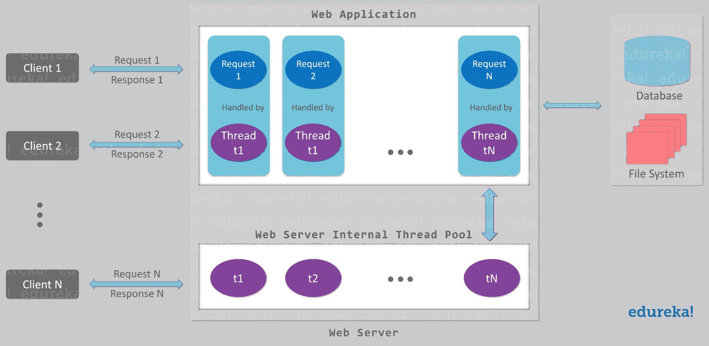
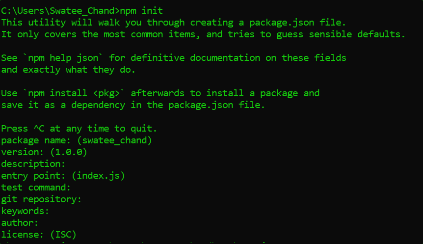

# Node.js 是什么？面向初学者的一站式解决方案

> 原文：<https://www.edureka.co/blog/what-is-node-js/>

JavaScript 是一种杰出的语言，长期以来主导着前端开发市场。它是一种强大的脚本语言，有助于开发客户端应用程序，但是当需要在服务器端执行应用程序时，它就失败了。这就是 **Node.js** 的用武之地，它提供了更好的特性集。当您读完这篇文章时，您将对什么是 Node.js 以及为什么它在市场上如此受欢迎有一个完整的理解。

下面是这篇什么是 Node.js 文章中涉及的主题:

*   [node . js 是什么？](#node.js)
*   [Node.js 架构](#architecture)
*   [node . js 的优点](#advantages)
*   [node . js的应用](#applications)
*   [简单 Node.js 演示](#demo)

**node . js 是什么？**

Node.js 是一个强大的 JavaScript 框架，基于 Chrome 的 V8 JavaScript 引擎开发。它有助于将 JavaScript 直接编译成本机代码。它的重量很轻，在开发服务器端 web 应用程序的市场上被大量使用。Node.js 扩展了 JavaScript API，也支持常见的服务器端功能。它通常用于大型应用程序开发，尤其是视频流网站、单页面应用程序和其他 web 应用程序。Node.js 使用事件驱动的非阻塞 I/O 模型，这使它成为数据密集型实时应用程序的正确选择。

像任何其他编程语言一样，Node.js 使用各种包和模块。这些只是包含函数的库，从 [npm(节点包管理器)](https://www.edureka.co/blog/node-js-npm-tutorial/)导入到我们的代码中，并在程序中使用。但是为了更详细的理解 Node.js，首先你需要知道它内部是如何工作的。

在这篇什么是 Node.js 文章的下一部分，我将详细介绍它的架构。

## **Node.js 架构**

一般来说，像 [PHP](https://www.edureka.co/blog/php-tutorial-for-beginners/) 、ASP.NET、 [Ruby](https://www.edureka.co/blog/ruby-on-rails-tutorial/) & [Java](https://www.edureka.co/blog/java-tutorial/) 服务器等服务器端技术都遵循多线程的模式。在这种传统的架构方法中，每个客户端请求都会创建一个新的线程或进程。



为了避免这一点，Node.js 使用了**单线程事件循环模型** **架构**。这意味着 Node.js 上的所有客户端请求都在同一个线程上执行。但是这个架构不仅仅是单线程的，还是事件驱动的。它帮助 Node.js 同时处理多个客户端。下图显示了单线程事件循环模型架构。

从图中可以看出，主事件循环是单线程的，而 I/O 工作线程是在不同的线程上执行的。这样做是为了适应整个事件循环，其中大多数 [Node.js API](https://www.edureka.co/blog/rest-api-with-node-js/) 被设计成异步/非阻塞的。这减少了服务器响应时间，提高了应用程序吞吐量。

我希望这能清楚 Node.js 的内部功能。现在让我们在这篇“什么是 Node.js”的文章中更进一步，找出使用 Node.js 进行应用程序开发的各种优势。

## **node . js 优点**

*   ### **is easy to expand**

Node.js 最受开发人员的青睐，因为使用 Node.js 开发的应用程序在水平和垂直方向上都很容易扩展。此外，在扩展应用程序时，您可以轻松地为其分配额外的资源。

*   ### **Real-time network application**

在 Node.js 中开发的应用程序提供了更快的同步，并且由于其单线程架构，HTTP 过载也减少了。这是开发人员更喜欢 Node.js 来开发基于 web 的聊天和游戏应用程序的主要原因。

*   ### **Faster suite**

众所周知， [Node.js](https://www.edureka.co/blog/node-js-docker-tutorial/) 运行在 Google 的 V8 引擎之上，这是目前最快的 JavaScript 引擎。Node.js 使用 npm，这是一个库和工具的在线存储库。由于 npm 的存在，Node.js 应用程序的代码执行比其他技术要快得多。

*   ### **Easy to learn**

任何对 JavaScript 稍有了解的人都可以很容易地学会在 Node.js 中编码，因为它是一个 [JavaScript 框架](https://www.edureka.co/blog/top-10-javascript-frameworks/)。Node.js 的学习曲线非常浅，学习和使用它的各种库和工具包不太复杂。

*   ### **Single programming language**

Node.js 可以单独为前端和后端构建 web 应用程序。正因为如此，web 应用程序的部署变得容易多了，因为大多数 web 浏览器都支持 JavaScript。

*   ### **Cache**

Node.js 支持缓存单个模块的功能。因此，每次生成对第一个模块的请求时，您都不必重新执行代码。

*   ### **data flow**

由于 HTTP 请求和响应在 Node.js 中被视为两个独立的模块，因此它们被视为两个独立的数据流。现在，每次加载这些文件时，总的处理时间都会减少，从而提高效率。因此，您无需等待很长时间就可以播放音频和视频。

*   ### **Host**

在 PaaS(平台即服务)和 Heroku 等托管平台的帮助下，部署 Node.js 应用程序也变得非常容易。

*   ### **Support from large active communities**

Node.js 由一个庞大而活跃的开发者社区提供支持。他们不断为其进一步发展和改进做出贡献，并提出创新的解决方案。

现在让我们继续阅读这篇什么是 Node.js 的文章，看看 [Node.js](https://www.edureka.co/blog/node-js-mysql-tutorial/) 在当今市场上的各种应用。

## Node.js 的应用

与其他框架、库和工具相比，Node.js 在流行度排行榜上名列前茅。下面我添加了 **[StackOverflow](https://insights.stackoverflow.com/survey/2018?source=post_page)** 持有的成绩截图。


以下是主要在 Node.js 中开发的应用程序:

*   实时聊天
*   复杂的单页应用程序
*   实时协作工具
*   直播应用
*   基于 JSON APIs 的应用程序

现在，您已经了解了 Node.js 的应用领域，让我们来看看市场上在生产中使用 Node.js 的主要品牌列表:

1.  网飞
2.  商务化人际关系网
3.  特雷罗
4.  超级的
5.  贝宝
6.  中等
7.  通过易趣网购买
8.  国家航空与航天局
9.  Groupon
10.  沃尔玛

现在，为了更好地理解什么是 Node.js，我们来看看它的实际实现。

## **使用 Node.js 的简单演示**

为了试用 Node.js，首先，您需要在系统中安装 Node.js 环境。要安装它，在你的系统中，可以参考我的文章[node . js 安装的一步一步指南](https://www.edureka.co/blog/node-js-installation/)。

完成后，您需要做的就是打开命令提示符并导航到您的项目目录。在那里，您需要键入以下命令。

```
npm init
```

一旦你点击了回车键，你将会被询问一些与你的项目文件相关的问题，例如:

一旦你提供了详细信息并点击“输入”,你的[包. json 文件](https://www.edureka.co/blog/node-js-npm-tutorial/#jsonfile)将被创建，其中包含你的项目的详细信息。它应该如下图所示:

```
{
  "name": "nodeintro",
  "version": "1.0.0",
  "description": "What is Node.js Demo",
  "main": "script.js",
  "scripts": {
    "test": "echo \"Error: no test specified\" && exit 1"
  },
  "author": "Edureka",
  "license": "ISC"
}

```

现在，下一步是创建应用程序的入口点。为了创建这个文件，请键入下面给出的代码，并按照您在 json 文件中指定的那样命名该文件:

```
const http = require('http');

const hostname = '127.0.0.1';
const port = 8080;

const server = http.createServer((req, res) => {
    res.statusCode = 200;
    res.setHeader('Content-Type', 'text/plain');
    res.end('Welcome to Edureka's Tutorial');
});

server.listen(port, hostname, () => {
    console.log(`Server running at http://${hostname}:${port}/`);
});
```

到此，我们来结束这篇文章。我希望，现在您已经清楚地了解了什么是 Node.js，以及为什么您必须使用它进行应用程序开发。现在，如果这对你学习 Node.js 有所启发，你可以参考我的 [Node.js 教程](https://www.edureka.co/blog/nodejs-tutorial/)，在那里我从头开始讲述了它的基本概念。

*如果您发现这个“*什么是 Node.js** *”相关，* *请查看 Edureka 提供的 [**Node JS 课程**](https://www.edureka.co/nodejs-certification-training) 培训* *，edu reka 是一家值得信赖的在线学习公司，拥有遍布全球的 250，000 多名满意的学习者。在印度和美国，Node JS 在所有其他[网络开发人员认证](https://www.edureka.co/complete-web-developer)课程中需求量很大。*

*有问题吗？请在“什么是 Node.js”这篇文章的评论部分提到它，我们会尽快回复您。*