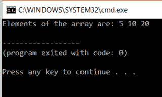
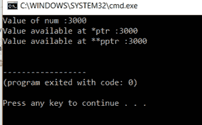
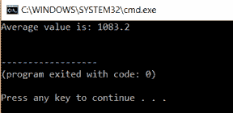

# 如何在 C++中实现指针？

> 原文：<https://www.edureka.co/blog/pointers-in-cpp/>

***[指针](https://www.edureka.co/blog/pointers-in-c/)在 C++中*** 是保存 c++中另一个变量地址的变量。地址存储在指针变量中，帮助实现引用调用。

本文将涉及以下几点:

*   [指针](#Pointers)
*   [指针和数组](#PointersandArrays)
*   [空指针](#NullPointers)
*   [空指针](#VoidPointers)
*   [指针算术运算](#PointerArithmeticOperation)
*   [指针对指针](#PointertoPointer)
*   [指向函数的指针](#PointertoFunctions)

从这篇关于 C++指针的文章开始

**语法:**

```

datatype *pointername;
EXAMPLE:
int *ptr;

```

*   指针变量在其名称前有一个*号。
*   指针也称为定位器或指示器。

**指针的用途:**

*   动态存储分配
*   在数组、结构和函数的各种程序中

下面是一个示例代码:

```
#include <iostream> 
using namespace std; 
int main() 
{ 
int num = 17;  
int *ptr;  
ptr = &num;     
cout << "Value at ptr = " << ptr << "n"; 
cout << "Value at var = " << num << "n"; 
cout << "Value at *ptr = " << *ptr << "n";  
}

```

**输出:**

**说明:**

在上面的程序中，我们展示了指针的基本工作原理。我们有一个值为 17 的整数变量 num。我们有 int 类型的指针变量 ptr。我们将 num 的地址分配给指针 ptr。

我们首先打印 ptr 的值，也就是地址。接下来，我们打印 num 值，最后，我们在指针 ptr 保存的位置打印该值。

继续这篇关于 C++指针的文章

## **指针和数组:**

我们可以把数组的第一个元素看作一个指针，因为数组名包含了第一个元素的地址。我们可以按以下方式使用指针。

下面是一个示例代码:

```

#include <iostream>
using namespace std;
int main()
{
int arr[3] = { 5, 10, 20 };
int *ptr;
ptr = arr ;
cout << "Elements of the array are: ";
cout << ptr[0] << " " << ptr[1] << " " << ptr[2];
}

```

```
Output:
```



**说明:**

在上面的程序中，我们展示了指针对数组的基本操作。我们有一个值为 5，10，20 的数组 arr。我们有 int 类型的指针变量 ptr。我们将 arr 的地址分配给指针 ptr。

我们首先打印 ptr[0]的值，这是数组的第一个元素。接下来，我们分别打印第二个和第三个元素。由于数组元素是连续存储的，所以指针可以通过递增来访问数组的其他位置。

继续这篇关于 C++指针的文章

## **空指针:**

有些类型的指针没有值，并且包含一个空值

**举例**:

```
int *ptr=NULL;
```

它们在像链表这样的数据结构中非常有用。

继续这篇关于 C++指针的文章

## **空指针:**

这些是没有返回类型的指针类型。

继续这篇关于 C++指针的文章

## **指针算术运算:**

可以对指针执行不同的操作。以下是一些重要的类型。

*   递增(+)
*   递减(—)
*   两个指针之间的差异(p1-p2)
*   向指针添加一个整数(+或+=)
*   从指针中减去一个整数(–或-=)

**下面是演示这些操作的代码:**

```
#include <iostream> 
using namespace std; 
int main() 
{ 
int arr[3] = {10, 100, 200}; 
int *ptr; 
ptr = arr; 
for (int i = 0; i < 3; i++) 
{ 
cout << "Value at different locations of array using *ptr = " << *ptr << "n"; 
ptr++; 	
} 
}

```

**输出:**


**说明:**

上面的程序展示了指针变量递增的简单算术运算。

继续这篇关于 C++指针的文章

## **指针对指针:**

在这种类型的系统中，有两个指针。第一个指针指向第二个指针，第二个指针指向保存该值的变量。

下面是一个示例代码:

```
</pre>
#include <iostream>
using namespace std;
int main () {
int num;
int *ptr;
int **pptr;
num = 3000;
ptr = &num;
pptr = &ptr;
cout << "Value of num :" << num<< endl;
cout << "Value available at *ptr :" << *ptr << endl;
cout << "Value available at **pptr :" << **pptr << endl;
return 0;
}

```

**输出:**



继续这篇关于 C++指针的文章

## **指向函数的指针:**

这是一种传递函数指针的方式。函数参数必须声明为指针类型。如下面的代码所示，

```
#include <iostream>
using namespace std;
float getAverage(int *arr, int size); 
int main () 
{
int balance[5] = {1432, 232, 3232, 17, 502};
float avg;
avg = getAverage( balance, 5 ) ;
cout << "Average value is: " << avg << endl; 
return 0;
}
float getAverage(int *arr, int size) {
int i, sum = 0;       
double avg;          
for (i = 0; i < size; ++i) {
sum += arr[i];
}
avg = double(sum) / size; 
return avg;
}

```

**输出** 

这就是我们如何传递一个指向函数的指针。

这样，我们就结束了这篇关于“C++中的指针”的文章。如果你想了解更多，请查看由 Edureka(一家值得信赖的在线学习公司)提供的  [Java 培训](https://www.edureka.co/java-j2ee-soa-training)。 [Edureka 的 Java J2EE 和 SOA 培训和认证课程](https://www.edureka.co/java-j2ee-soa-training/)旨在培训你掌握核心和高级 Java 概念以及各种 Java 框架，如 Hibernate & Spring。

有问题要问我们吗？请在这个博客的评论部分提到它，我们会尽快回复你。