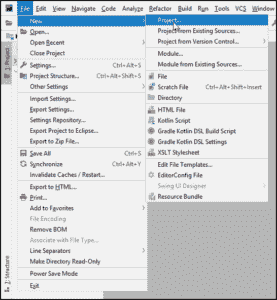
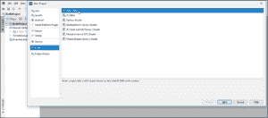
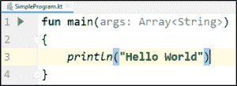

# 从头开始学习 Kotlin 编程语言

> 原文：<https://www.edureka.co/blog/kotlin-programming-language/>

自从官方认定 Kotlin 编程语言是 [*Android 开发*](https://www.edureka.co/android-development-certification-course) 的首选语言之一后，一气呵成拿下了 [*Java*](https://www.edureka.co/blog/what-is-java/) 。如果你是 Kotlin 新手，并且渴望学习这种超级酷的编程语言，这篇文章将帮助你走出困境。

我将按以下顺序讨论这些主题:

*   [什么是 Kotlin，为什么要学习 Kotlin？](#What_is_Kotlin_and_Why_should_you_learn_Kotlin?)
*   [科特林安装](#Kotlin_Installation)
*   [科特林基础知识](#Kotlin_Fundamentals)
    *   [类和对象](#Classes_and_Objects)
    *   [变量声明](#Variables_declaration)
    *   [范围](#Ranges)
    *   [控制流语句](#Control_flow_statements)
    *   [功能](#Functions)
*   [例外](#Exceptions)

我们开始吧！

**什么是 Kotlin，为什么要学习 Kotlin？**

2011 年，一家非常著名的软件公司 **JetBrains (** 原名 IntelliJ Software)推出了 Kotlin，作为 JVM 的一种新语言。

Kotlin 是一种跨平台、静态类型的通用编程语言，这意味着它在编译时而不是运行时执行  类型检查。广泛用于开发 Android 应用。如果你有了 *[什么是 Java，](https://www.edureka.co/blog/what-is-java/)* 的基础知识，你马上就能学会科特林。

看看这个 Kotlin 教程视频，我们的 Kotlin 专家正在解释什么是 Kotlin，开始学习 Kotlin。

**科特林初学者教程|从零开始学科特林**


[//www.youtube.com/embed/y1ikxe24zjs?rel=0&showinfo=0](//www.youtube.com/embed/y1ikxe24zjs?rel=0&showinfo=0)

自从谷歌宣布 Kotlin 作为 Android 开发的官方语言以来，kot Lin 越来越受欢迎。现在，如果我说，Java 有复杂的程序，而 Kotlin 是它的替代品呢？你会同意吗？你必须这么做。

让我告诉你为什么。

**为什么要学科特林？**

考虑用 Java 写 10-15 行代码，用 Kotlin 写 3-4 行代码。你喜欢哪一个？爪哇还是科特林？绝对是科特林对吗？是的。这是因为，

*   Kotlin 减少了 Java 中样板代码的数量。这些只不过是必须包含在许多地方的代码段，很少或没有改动。

Kotlin 科特林使用起来非常安全。所谓安全，我的意思是，Kotlin 编程语言减少了程序执行过程中出现的*nullpointerexexceptions*。

Kotlin 是可互操作的。这意味着，e 现有的 Java 代码可以从Kotlin中自然调用，也可以从 Java 中流畅地使用Kotlin代码。

全球众多公司都在采用这种方法，这也会给你留下深刻的印象。


现在您已经了解了什么是 Kotlin 以及 Kotlin 为什么重要，让我们快速地看一下安装过程。

要使用任何编程语言，您都需要一个 IDE 来编写代码并运行它们。在 Kotlin 编程语言的情况下，您可以在 Eclipse、IntelliJ、Android Studio 上工作，也可以考虑使用独立的编译器。但是由于 IntelliJ 也是 JetBrains 的产品，所以最好使用 IntelliJ 与 Kotlin 一起工作。

所以，我将解释如何在你的系统上安装 IntelliJ，并帮助你们用 Kotlin 编写一个简单的程序。

**科特林安装**

**设置环境**

按照步骤完成 IntelliJ 安装。


下载社区版并打开文件。

一旦你打开 IntelliJ，你会被问几个问题，比如，你想在 ie 上做什么类型的项目。Java 或 Kotlin 或其他编程语言。它要求您选择目标文件夹并输入项目名称，然后单击 Run Community Edition of IntelliJ。你就快到了！

IntelliJ workspace 非常方便。你可以在屏幕上找到快捷方式，在这个平台上工作时也有很多可以尝试的地方。

首先，让我们创建一个新的 Kotlin 文件。

进入文件->点击新建->选择项目



接下来，选择 Kotlin 和 JVM。



接下来，点击完成，然后它就完成了。

得到了一个新的 Kotlin 项目，现在让我们编写一个简单的 Hello World 程序。

为了创建一个新的 Kotlin 文件，右击 src 文件夹并点击 new Kotlin File/class。

让我们用科特林语言写第一个程序。



现在让我解释一下这是如何工作的。

**I 行:** 函数被称为 Kotlin 程序的构建块。Kotlin 中的所有函数都以关键字 ***fun*** 开头，后跟一个函数名*(**main**)*，一个零个或多个逗号分隔的参数列表，一个可选的返回类型，以及一个主体。main()函数接受一个参数，一个字符串数组。

**III 行**:***println()***用于在输出屏幕上显示消息(输入)。

**注意:**可以直接使用 *println()* 打印到标准输出。而在 Java 中，你需要使用 *System.out.println()。*

现在，让我们继续前进，了解科特林的基本原理。

**科特林基本面**

在面向对象的编程语言中，首先要做的是知道如何创建一个类和一个对象，那么，让我们看看如何在 Kotlin 编程语言中创建一个类和一个对象。

**类和对象**

Kotlin 既支持[面向对象编程](https://www.edureka.co/blog/object-oriented-programming/) (OOP)，也支持函数式编程。面向对象编程是基于实时的  [*对象* 和  *类*](https://www.edureka.co/blog/java-objects-and-classes/) 。Kotlin 还支持 OOP 语言的支柱，如封装、继承和多态。

**科特林类**

Kotlin 类类似于 Java *[类](https://www.edureka.co/blog/java-objects-and-classes/)。使用关键字  class 声明 Kotlin 类。Kotlin 类有一个指定其类型参数、构造函数等的类头。和用花括号括起来的类体。*

**语法:**

```
class className{   // Class Header
// Prooerty
// Member function
}
```

**科特林物体**

对象被认为是具有状态和行为的实时实体或逻辑实体，其中状态表示对象的值，行为表示对象的功能。

对象基本上是用来访问类的属性和成员函数的。Kotlin 允许创建一个类的多个对象。

**创建一个对象**

Kotlin 对象分两步创建，第一步是创建一个引用，然后创建一个对象。

```
var obj = Classname()
```

这和 Java 不一样吧？您可以使用关键字 **New** 实例化该对象，Kotlin 中没有使用这个关键字。

**变量声明**

一旦你理解了如何创建一个类和一个对象，另一个要知道的主要事情是如何在 Kotlin 中声明一个变量。

变量实际上指的是用来存储数据的内存位置。现在，让我们看看如何在 Kotlin 中声明一个变量。

Kotlin 变量是使用关键字**var**T5**val**声明的。

```
var xyz ="Edureka"
val abc = 20
```

你可能会有这样的问题，为什么要用 var 和 val 作为变量？让我来帮你们。

这里，变量 xyz 是字符串类型，变量 abc 是 Int 类型。Kotlin 编译器通过初始化表达式知道这一点。这在编程中称为类型推断。您也可以像这样显式指定类型:

```
 var xyz : String ="Edureka"
val abc : Int = 20
```

这就是在 Kotlin 编程语言中声明变量的方法。

接下来，让我们了解范围。

**范围**

借助 Kotlin 中的这些范围，您可以通过指定起始值和结束值来轻松创建一个序列列表。

Kotlin 范围被定义为从起始值到结束值的间隔。使用运算符  **创建范围表达式。。)** 依次是**中的  **！在**中。这些值在定义的范围内。**

让我们看看如何创建一个范围。

*   声明一个变量并指定开始和结束间隔。

```
var AtoZ = 'A'..'Z'
```

你也可以用数字来代替字母。

```
var 1to9 =1..9
```

在 Kotlin 中使用控制流语句时，这将非常有用。

现在，如果您想以相反的顺序获得序列，您可以使用一个名为 DownTo()的方法

```
var Reverse = 9 DownTo 1 
```

这有助于以相反的顺序获得序列。

现在让我们继续，理解 Kotlin 中的控制流语句。

**控制流语句**

控制流语句主要由 **if、when、if-else、for 循环、while 循环、do-while 循环、jump 语句组成。**

下面我们来详细了解一下。

**科特林‘if’表达式**

在 Kotlin 中，  **if** 是返回值的表达式。它用于控制程序结构的流程。

**语法:**

```
if(condation){

//code statement

}
```

示例:

```
fun main(args: Array<String>) {
val num1 = 5
val num2 =10
val result = if (num1 > num2) {
"$num1 is greater than $num2"
} else
{
"$num1 is smaller than $num2"
}
println(result)
}
```

输出:5 小于 10

**注**:如果表达式只有一条语句，可以去掉 **if-else** 体的花括号。

你也可以用 if 作为表达式。

```
fun main(args: Array<String>)
{
var num1 : Int = 4
var num2 : Int = 6
var result: Int = 0
result = if (num1>num2)
num1
else
num2
println(result)
}
```

产出:6

**为循环**

Kotlin **for** 循环用于多次迭代程序的一部分。它遍历数组、范围、集合等等。Kotlin 的 for 循环相当于 C、C++、C#等语言中每个循环的**。**

**语法**:

```
for (item in collection){
//body of loop
}
```

```
fun main(args : Array<String>) {
val Course= arrayOf(2,4,5,8,9)
for(item in Course){
println(item)
}
}
```

输出:

2 4 5 8 9

**在科特林的时候**

在 Kotlin 中， **when** 是返回值的条件表达式。这个 when 表达式是对 Java 中 *[switch 语句](https://www.edureka.co/blog/switch-case-in-java/)* 的替换。

**语法:**

```
when(expression)
{
case value
//statement
break
case value n 
//statement
break
default
}
```

**Example**:

```
fun main(args: Array<String>){
var number = 4
var num= when(number) {
1 -> "One"
2 -> "Two"
3 -> "Three"
4 -> "Four"
5 -> "Five"
else -> "invalid number"
}
println("The number is: $num")
}
```

**输出:**

数字是:4

**while 循环**

**while 循环** 也用于多次迭代程序的一部分。循环执行代码块，直到条件为真。Kotlin 的 while 循环类似于 Java 的 while 循环。

**语法**:

```
while(condition){
//body
}
```

**举例:**

```
fun main(args: Array<String>){
var i = 1
while (i<=3){
println(i)
i++
}
}
```

**输出**:

1 2 3

### **do-while**

除了一个关键区别之外，  **do-while** 循环与  **while** 循环类似。一个*do-while*循环首先执行  **do** 块的主体，然后检查 while 的条件。

**语法:**

```
do{
//body of do block
}
while(condition);
```

**举例:**

```
fun main(args: Array<String>){
var i = 1
do {
println(i)
i++
}
while (i<=3);
}
```

**输出:**

1 2 3

现在你们已经知道了控制流语句是如何工作的，让我们来看看 Kotlin 函数。

**科特林函数**

**功能**基本上是指一组执行特定任务的相关代码块。函数用于将程序分成不同的子模块。

在 Kotlin 中，函数是使用关键字 **fun 来声明的。**

```
fun (x: Int): Int {
return 2 * x
}
```

这就是在 Kotlin 中声明函数的方法。

现在我们来讨论 Lambda 函数。

**λ函数**

Kotlin 函数被称为一级，这意味着它们可以存储在变量和数据结构中，作为参数传递给其他高阶函数并从其返回。什么是 lambda 函数？

Lambda 函数是没有名字的函数。

**举例**:

```
fun main(args: Array<String>)
{
val myLambda : (Int) -> Unit ={ p :Int -> println(p)}
addNumber(3,6,myLambda)
}

fun addNumber(a:Int, b:Int, myLambda: (Int) -> Unit)
{
val add = a+b
myLambda(add)
}
```

**输出:** 9

**异常情况**

异常用于指示代码执行过程中的问题。异常处理也称为解决可能发生的异常的能力。如果你不处理任何发生的异常，我们的程序将会突然停止执行，从而使你的应用程序立即崩溃。

在 Java 中，有两种异常:检查的和未检查的。但是，Kotlin 支持未检查的异常。

**未检查的异常**

这些是由于代码中的缺陷而引发的异常。它们是 RuntimeException 超类的直接或间接子类。

*   当你把一个数除以零时抛出。
*   ArrayIndexOutOfBoundExceptions:当使用非法索引访问数组时抛出。
*   SecurityException:这是由安全管理器引发的，表示存在安全违规。
*   NullPointerException:当调用空对象的方法或属性时抛出。

说到这里，我们来结束这篇关于“ *Kotlin 编程语言*”的文章。我希望你们清楚讨论的主题。

*现在你已经浏览了我们的 Kotlin 编程语言博客，你可以查看一下 Edureka 的  [Android App 开发认证培训](https://www.edureka.co/android-development-certification-course)* *有问题要问我们吗？请在 Kotlin 编程语言博客部分的评论中提到它，我们将会回复您。*