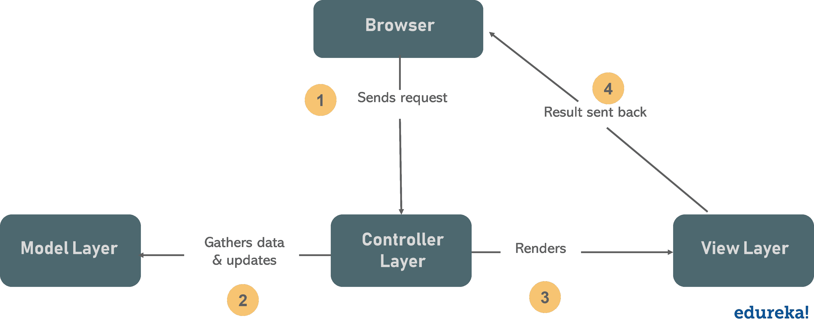

# 如何用 Java 实现 MVC 架构？

> 原文：<https://www.edureka.co/blog/mvc-architecture-in-java/>

在 web 开发领域，模型-视图-控制器是当今 Web 编程世界中最受关注的[设计模式](https://www.edureka.co/blog/java-design-patterns/)之一。MVC 架构最初包含在两个主要的 web 开发框架中——Struts 和 [Ruby on Rails](https://www.edureka.co/blog/ruby-on-rails-tutorial/) 。在本文中，让我们用 [Java](https://www.edureka.co/blog/what-is-java/) 来稍微探索一下 MVC 架构。

本文将涉及的主题如下:

*   [Java 中的 MVC 架构是什么？](#MVC)
*   [MVC 架构的优势](#Advantages)
*   [演示:用 Java 实现 MVC](#Demo)

在我们真正进入 MVC 架构的技术细节之前，有些概念你需要知道。

*   ***设计模式*** ，在软件工程中，是一种解决软件设计时常见问题的技术。
*   ***设计模型，*** 指定你使用什么类型的架构来解决问题或者设计模型。
*   有两种 ***类型的设计模型*** : *模型 1 架构*，*模型 2(MVC)架构。*

## **Java 中的 MVC 架构是什么？**

基于 MVC 架构的模型设计遵循 MVC [设计模式](https://www.edureka.co/blog/java-design-patterns/)，他们在设计软件时将应用程序逻辑与用户界面分离。顾名思义，MVC 模式有三层，分别是:

*   ***模型***–代表应用的业务层
*   ***视图***–定义应用程序的演示
*   ***控制器***–管理应用程序的流程



在 Java 编程环境中，模型由简单的 [Java 类](https://www.edureka.co/blog/java-objects-and-classes/#javaclass)组成，视图显示数据，控制器由[servlet](https://www.edureka.co/blog/java-servlets)组成。这种分离导致用户请求被如下处理:

1.  客户机上的浏览器向服务器上的控制器发送页面请求
2.  控制器执行调用模型的动作，从而响应请求检索它需要的数据
3.  然后，控制器将检索到的数据提供给视图
4.  视图被呈现并发送回客户机供浏览器显示

出于多种原因，将一个软件应用程序分成这三个不同的组件是一个好主意。让我们来看看这些是什么。

## **MVC 架构在 Java 中的优势**

在开发应用程序时，MVC 架构为程序员提供了许多优势，包括:

*   多个开发人员可以同时使用三个层(模型、视图和控制器)
*   提供改进的*可伸缩性*，补充应用程序的增长能力
*   由于组件之间的依赖程度很低，所以很容易维护
*   一个模型可以被多个视图重用，这提供了代码的可重用性
*   采用 MVC 使应用程序更具表现力，更容易理解
*   应用程序的扩展和测试变得很容易

现在你知道为什么 MVC 是 web 编程世界中最流行的 [设计模式](https://www.edureka.co/blog/java-design-patterns/#what)了。但是，如果您还在努力理解 MVC 的概念，不要担心。我们将深入挖掘每一层，并借助一个[示例程序](https://www.edureka.co/blog/java-programs/)了解它们的用途。

## **用 Java 实现 MVC**

为了实现基于 MVC 设计模式的 web 应用程序，我们将创建

*   ***课程类*** ，即充当*模型层*
*   ***CourseView 类*** ，定义了表示层(*视图层*)
*   ***course controller 类*** ，充当*控制器*

现在，让我们一个一个地探索这些层。

### **模型层**

在 MVC 设计模式中，*模型*是定义系统业务逻辑的数据层，也代表应用程序的状态。模型[对象](https://www.edureka.co/blog/java-object/)在数据库中检索和存储模型的状态。通过这一层，我们将规则应用于数据，数据最终代表了我们的应用程序所管理的概念。现在，让我们使用*课程类创建一个模型。*

```
package MyPackage;

public class Course {
	   private String CourseName;
	   private String CourseId;
	   private String CourseCategory;

	   public String getId() {
	      return CourseId;
	   }

	   public void setId(String id) {
	      this.CourseId = id;
	   }

	   public String getName() {
	      return CourseName;
	   }

	   public void setName(String name) {
	      this.CourseName = name;
	   }

	   public String getCategory() {
		      return CourseCategory;
		   }

	   public void setCategory(String category) {
		      this.CourseCategory = category;
		   }

	}
```

代码易于理解，不言自明。它包括获取/设置课程详细信息的功能。

### **视图层**

MVC 设计模式的这一层表示应用程序或用户界面的输出。它显示控制器从模型层获取的数据，并在用户需要时将数据呈现给用户。I t 从控制器接收所有需要的信息，它不需要直接与业务层交互。 让我们使用 *CourseView 类创建一个视图。*

```
package MyPackage;

public class CourseView {
	   public void printCourseDetails(String CourseName, String CourseId, String CourseCategory){
	      System.out.println("Course Details: ");
	      System.out.println("Name: " + CourseName);
	      System.out.println("Course ID: " + CourseId);
	      System.out.println("Course Category: " + CourseCategory);
	   }
	}

```

这段代码只是为了将数值打印到控制台。接下来我们有 web 应用程序的控制器。

### **控制器层**

控制器就像是模型和视图之间的接口。它从视图层接收用户请求并处理它们，包括必要的验证。然后，请求被发送到模型进行数据处理。一旦它们被处理，数据再次被发送回控制器，然后显示在视图上。让我们创建一个充当控制器的*course controller 类*。

```
package MyPackage;

public class CourseController {
	   private Course model;
	   private CourseView view;

	   public CourseController(Course model, CourseView view){
	      this.model = model;
	      this.view = view;
	   }

	   public void setCourseName(String name){
	      model.setName(name);		
	   }

	   public String getCourseName(){
	      return model.getName();		
	   }

	   public void setCourseId(String id){
	      model.setId(id);		
	   }

	   public String getCourseId(){
	      return model.getId();		
	   }

	   public void setCourseCategory(String category){
		      model.setCategory(category);		
       }

		   public String getCourseCategory(){
		      return model.getCategory();		
	   }
	   public void updateView(){				
	      view.printCourseDetails(model.getName(), model.getId(), model.getCategory());
	   }	
	}
```

粗略地看一下代码，我们会发现这个控制器类只负责调用模型来获取/设置数据，并基于此更新视图。现在让我们来看看所有这些是如何联系在一起的。

### **主 Java 类**

我们姑且称这个类为“MVCPatternDemo.java”。查看下面的代码。

```
package MyPackage;

public class MVCPatternDemo {
	   public static void main(String[] args) {

	      //fetch student record based on his roll no from the database
	      Course model  = retriveCourseFromDatabase();

	      //Create a view : to write course details on console
	      CourseView view = new CourseView();

	      CourseController controller = new CourseController(model, view);

	      controller.updateView();

	      //update model data
	      controller.setCourseName("Python");
	      System.out.println("nAfter updating, Course Details are as follows");

	      controller.updateView();
	   }

	   private static Course retriveCourseFromDatabase(){
	      Course course = new Course();
	      course.setName("Java");
	      course.setId("01");
	      course.setCategory("Programming");
	      return course;
	   }
	}
```

上面的类从[函数](https://www.edureka.co/blog/java-methods/)中获取课程数据，用户使用该函数输入一组值。然后，它将这些值推送到课程模型中。然后，它初始化我们在本文前面创建的视图。 此外，它还调用 *CourseController* 类，并将其绑定到 *Course* 类和 *CourseView* 类。作为控制器一部分的 *updateView()* 方法随后更新控制台上的课程详细信息。查看下面的输出。

**输出**

```
Course Details: 
Name: Java
Course ID: 01
Course Category: Programming

After updating, Course Details are as follows
Course Details: 
Name: Python
Course ID: 01
Course Category: Programming

```

MVC 架构为你的代码提供了一个全新层次的模块化，这使得它更具可读性和可维护性。这就把我们带到了本文的结尾。 希望你清楚已经与你分享的一切。

如果您刚刚开始，那么请阅读这篇 Java 教程，了解基本的 Java 概念。

[https://www.youtube.com/embed/iGGgxnJCNRM](https://www.youtube.com/embed/iGGgxnJCNRM)

***确保你尽可能多的练习，恢复你的经验。***

*查看 Edureka 的 [**Java 在线课程**](https://www.edureka.co/java-j2ee-training-course) ，edu reka 是一家值得信赖的在线学习公司，在全球拥有超过 250，000 名满意的学习者。我们在这里帮助你的每一步，我们为想成为 Java 开发者的学生和专业人士设计了一个课程。*

*有问题吗？请在这篇“Java 中的 MVC 架构”* *文章的评论部分提到它，我们会尽快回复您。*