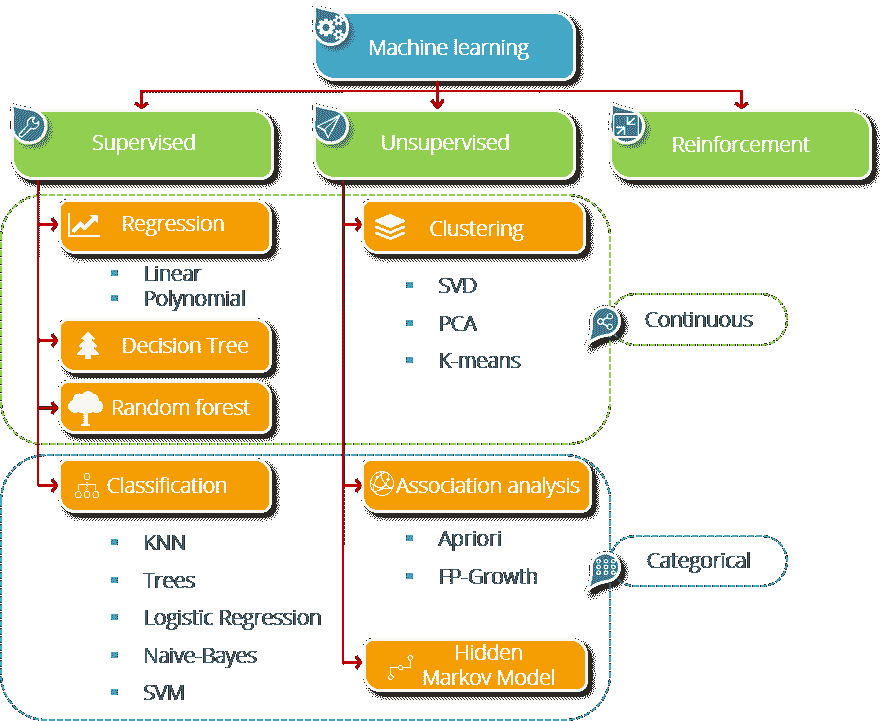
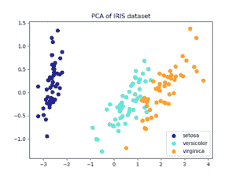
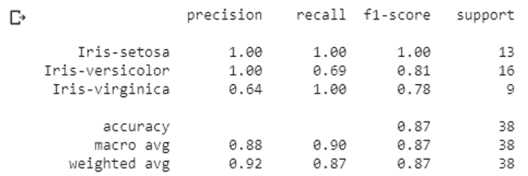

# 用 Python 构建第一个机器学习分类器

> 原文：<https://www.edureka.co/blog/machine-learning-classifier/>

机器学习是现在的流行语。一些不可思议的事情正在机器学习的帮助下完成。从成为我们的*私人助理*，到决定我们的*旅行路线*，帮助我们购物，帮助我们经营我们的企业，到照顾我们的*健康和健康，*机器学习在如此基础的层面上融入了我们的日常生活，以至于大多数时候我们甚至没有意识到我们正在依赖它。在本文中，我们将遵循初学者的方法，用 Python 实现标准的机器学习分类器。

*   [**机器学习概述**](#overview)
*   [**机器学习分类器的模板**](#template)
*   [**机器学习分类问题**](#problem)

## **机器学习概述**

机器学习是一个概念，它允许机器从例子和经验中学习，并且不需要显式编程。因此，你要做的不是编写代码，而是向通用算法提供数据，算法/机器根据给定的数据构建逻辑。


机器学习涉及机器做出决策、评估其行动结果以及改善其行为以连续获得更好结果的能力。

学习过程以三种主要方式进行

*   监督学习
*   无监督学习
*   强化学习



## **机器学习分类器的模板**

名为 scikit-learn 的 Python 库中提供了非常方便的机器学习工具，访问和应用非常简单。

使用以下命令通过命令提示符安装 scikit-learn:

```

pip install -U scikit-learn

```

如果您是 anaconda 用户，您可以在 anaconda 提示符下使用:

```

conda install scikit-learn

```

安装需要在您的系统上预先安装 NumPy 和 SciPy 软件包。

**预处理:**任何基于机器学习的数据分析，第一步也是最必要的一步就是预处理部分。数据的正确表示和清理对于 ML 模型的良好训练和发挥其潜力是绝对必要的。

**步骤 1**–导入必要的库

```

import numpy as np
import pandas as pd
import matplotlib.pyplot as plt

```

**步骤 2**–导入数据集

```

dataset = pd.read_csv(<pathtofile>)

```

然后，我们将数据集分成自变量和因变量。自变量是输入数据，因变量是输出数据。

```

X=dataset.iloc[<range of rows and input columns>].values
y=dataset.iloc[<range of rows and output column>].values

```

**步骤 3**–处理缺失数据

数据集可能包含空白值或空值，这可能会导致我们的结果出错。因此，我们需要处理这样的条目。一种常见的做法是用一个公共值替换空值，比如该列中的平均值或最频繁出现的值。

```

from sklearn.preprocessing import Imputer
imputer=Imputer(missing_values="NaN", strategy="mean", axis=0)
imputer=imputer.fit(X[<range of rows and columns>])
X[<range of rows and columns>]=imputer.transform(X[<range of rows and columns>])

```

**第 4 步**–将分类变量转换为数值变量

```

from sklearn.preprocessing import LabelEncoder
le_X=LabelEncoder()
X[<range of rows and columns>]=le_X.fit_transform(X[<range of rows and columns>])
labelencoder_y = LabelEncoder()
y = labelencoder_y.fit_transform(y)

```

现在，在编码之后，机器可能会假设数字数据是编码列的等级。因此，为了提供相等的权重，我们必须使用 OneHotEncoder 类将数字转换为一个热点向量。

```

from sklearn.preprocessing import OneHotEncoder
oneHE=OneHotEncoder(categorical_features=[<range of rows and columns>])
X=oneHE.fit_transform(X).toarray()

```

**步骤 5**–执行缩放

这一步是处理因变量比例不匹配而产生的差异。因此，我们将它们都缩放到相同的范围，以便它们在输入到模型中时获得相同的权重。为此，我们使用 StandardScaler 类的一个对象。

```

from sklearn.preprocessing import StandardScaler
sc_X=StandardScaler()
X=sc_X.fit_transform(X)

```

**步骤 6**–将数据集分成训练和测试数据

作为预处理的最后一步，需要将数据集分为训练集和测试集。训练-测试分割的标准比率为 75%-25%。我们可以根据需要修改。train_test_split()函数可以为我们做这件事。

```

from sklearn.model_selection import train_test_split
X_train,X_test,y_train,y_test=train_test_split(X,y,test_size=0.25)

```

**建模:**这一步其实挺简单的。一旦我们决定了对数据应用哪个模型，我们就可以创建一个相应类的对象，并使该对象适合我们的训练集，将 X_train 作为输入，y_train 作为输出。

```

from sklearn.<class module> import <model class>
classifier = <model class>(<parameters>)
classifier.fit(X_train, y_train)

```

模型现在已经训练好了，准备好了。我们现在可以将我们的模型应用于测试集，并找到预测的输出。

```

y_pred = classifier.predict(X_test)

```

**查看结果:**分类器的性能可以通过准确度、精确度、召回率和 f1 值等参数来评估。可以使用一种称为 classification_report()的方法来查看这些值。t 也可以被看作是一个混淆矩阵，帮助我们知道哪一类数据中有多少被正确分类。

```

from sklearn.metrics import confusion_matrix
cm = confusion_matrix(y_test, y_pred)
print(cm)

from sklearn.metrics import classification_report
target_names = [<list of class names>]
print(classification_report(y_test, y_pred, target_names=target_names))

```

## **机器学习分类器问题**

我们将使用非常流行和简单的鸢尾数据集，包含 3 类花的尺寸——鸢尾-刚毛鸢尾、鸢尾-杂色鸢尾和鸢尾-海滨鸢尾。数据集中有 150 个条目。



```

# Importing the libraries
import numpy as np
import matplotlib.pyplot as plt
import pandas as pd

# Importing the dataset
dataset = pd.read_csv('iris.csv')

```

现在让我们来看看数据集。

```

dataset.head()

```


我们有 4 个自变量(不包括 Id)，即第 1-4 列，第 5 列是因变量。所以我们可以把它们分开。

```

X = dataset.iloc[:, 1:5].values
y = dataset.iloc[:, 5].values

```

现在，我们可以将数据集分为训练和测试两部分。

```

# Splitting the dataset into the Training set and Test set
from sklearn.model_selection import train_test_split
X_train, X_test, y_train, y_test = train_test_split(X, y, test_size = 0.25)

```

现在，我们将对数据集应用逻辑回归分类器。

```

# Building and training the model
from sklearn.linear_model import LogisticRegression
classifier = LogisticRegression()
classifier.fit(X_train, y_train)

# Predicting the Test set results
y_pred = classifier.predict(X_test)

```

最后一步是分析训练好的模型的性能。

```

# Making the Confusion Matrix
from sklearn.metrics import confusion_matrix
cm = confusion_matrix(y_test, y_pred)
print(cm)

```


这向我们表明，模型正确预测了第一类的 13 个条目、第二类的 11 个条目和第三类的 9 个条目。

```

# Generating accuracy, precision, recall and f1-score
from sklearn.metrics import classification_report
target_names = ['Iris-setosa','Iris-versicolor','Iris-virginica']
print(classification_report(y_test, y_pred, target_names=target_names))

```



该报告显示了模型在我们的测试集上的精度、召回率、f1 值和准确度值，该测试集包含 38 个条目(占数据集的 25%)。

*祝贺您，您已经成功地用 Python 创建并实现了您的第一个机器学习分类器！要深入了解 Python 及其各种应用程序，您可以注册参加现场 [Python 机器学习](https://www.edureka.co/machine-learning-certification-training)培训，该培训提供全天候支持和终身访问。*

通过我们与瓦朗加尔国家技术学院 E & ICT 学院合作的人工智能和机器学习研究生项目，保持技术领先。这门[人工智能课程](https://www.edureka.co/executive-programs/machine-learning-and-ai)旨在提供最好的结果。