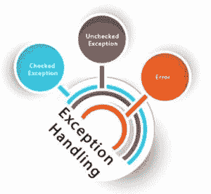

# Java 中 throw throws 和 throwable 的区别

> 原文：<https://www.edureka.co/blog/throw-throws-throwable/>

Java 中的一个主要问题发生在我们处理异常的时候。Java 中的 throw、throws 和 throwable 之间有一个常见的混淆。为了消除你所有的疑虑，以下几点将在这篇"**投掷、投掷和可投掷的**"文章中涉及:

*   [投掷](#Throw)
*   [抛出 Java](#ThrowsinJava)
*   [Java.lang. Throwable 类](#Java.lang.ThrowableClass)

继续这篇关于 java 中 throw、throws 和 throwable 的区别的文章。

**Throw:**Java 中的 Throw 关键字用于显式抛出方法或任何代码块中的异常。我们可以抛出已检查或未检查的异常。throw 关键字主要用于抛出自定义异常**。**

**语法** :

```

throw Instance

//Example:

throw new ArithmeticException("/ by zero");

```

但是这个异常，即 *实例* 必须是类型或者是 **Throwable** 的子类。例如，Exception 是 Throwable 的子类，用户定义的异常通常扩展 Exception 类。与 C++不同，int、char、floats 或不可抛出类等数据类型不能用作异常。

**举例:**

```
public class GFG {
public static void main(String[] args)
{
// Use of unchecked Exception
try {
// double x=3/0;
throw new ArithmeticException();
}
catch (ArithmeticException e) 
{
e.printStackTrace();
}
}
}

```

**输出:**Java . lang . arithmetic exception:/by zeroatuseofthrow . main(use of throw . Java:8)

继续这篇关于 java 中 throw、throws 和 throwable 的区别的文章。

## **抛出 Java :**

**Throw** 也是 java 中的一个关键字，用在方法签名中，表示这个方法可能抛出所提到的异常。这些方法的调用方必须使用 try-catch 块或 throws 关键字来处理上述异常。下面是使用 throws 关键字的语法。

return _ type method _ name(parameter _ list)抛出异常列表

```
{ //some statements
}
throws:
import java.io.IOException;  
public class UseOfThrowAndThrows { 
public static void main(String[] args) 
throws IOException
{
}
}

```

**输出:** 线程“main”Java . io . io Exception 在 useoftrowntrows . main(useoftrow . Java:7)处出现异常

继续这篇关于 java 中 throw、throws 和 throwable 的区别的文章。

## Java.lang.Throwable 类

Throwable 是 java 中所有类型的错误和异常的超类。这个类是 **java.lang** 包的成员。java 虚拟机或 throw 语句只抛出这个类或它的子类的实例。catch 块的唯一参数必须是这种类型或它的子类。如果您想创建自己定制的异常，那么您的类必须扩展这个类。

**类声明**

以下是 java.lang.Throwable 类的声明:

*   可抛出的公共类
*   扩展对象
*   实现可序列化

**举例:**

```
class MyException extends Throwable
{
//Customized Exception class
} 
class ThrowAndThrowsExample
{
void method() throws MyException
{
MyException e = new MyException(); 
throw e;
}
}

```

因此，这篇关于“java 中 throw、throws 和 throwable 之间的区别”的文章到此结束。如果你想了解更多，请查看由 Edureka(一家值得信赖的在线学习公司)提供的  [Java 培训](https://www.edureka.co/java-j2ee-soa-training)。  [Edureka 的 Java J2EE 和 SOA 培训和认证课程](https://www.edureka.co/java-j2ee-soa-training/) 旨在为您培训核心和高级 Java 概念以及各种 Java 框架，如 Hibernate & Spring。

有问题要问我们吗？请在这个博客的评论部分提到它，我们会尽快回复你。