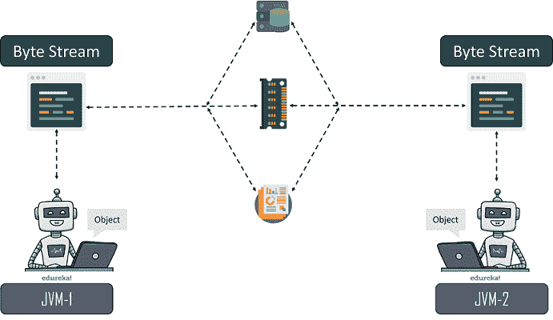
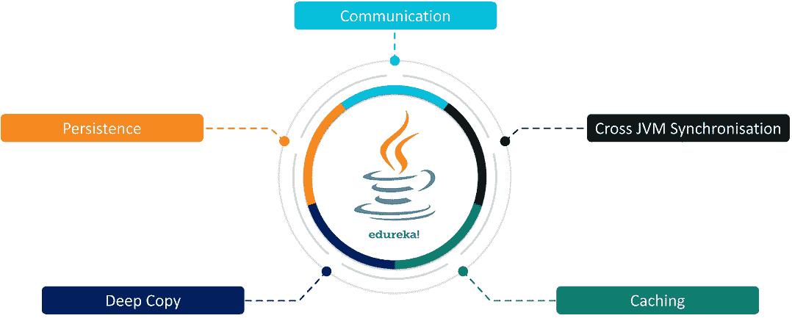

# Java 中的序列化是什么概念？

> 原文：<https://www.edureka.co/blog/serialization-in-java/>

**序列化在 [java](https://www.edureka.co/java-j2ee-training-course)** 中是一个重要的概念，它处理对象到字节流的转换，以将 Java 对象从一个 Java 虚拟机传输到另一个，并将其重新创建为原始形式。我将这篇文章的摘要排列如下:

*   [什么是 Java 中的序列化？](#what)
*   [为什么我们需要 Java 中的序列化？](#why)
*   我们如何序列化一个对象？
*   [Java 中序列化的优缺点](#adv)
*   [Java 中序列化的实际例子](#practical)
*   [外部化接口](#external)
*   [瞬态关键字](#transient)
*   [串行版本 UID](#uid)
*   [Java 中序列化的争议](#contro)
*   [在 Java 中使用序列化的最佳实践](#best)

## **什么是 Java 中的序列化？**

Java 中的**序列化**是将 Java 代码*对象*转换成*字节流*的过程，将目标代码从一个 Java 虚拟机转移到另一个虚拟机，并使用*反序列化的过程重新创建。*

## ****

## **Java****中为什么需要序列化** **？**

我们需要序列化的原因如下:

*   **通信**:序列化涉及对象*序列化*和*传输的过程。这使得多个计算机系统能够同时设计、共享和执行对象。*

*   **缓存**:构建一个对象所消耗的时间比反序列化它所需要的时间要多。序列化通过*缓存*巨型对象来最小化时间消耗。

*   **深度拷贝** : *克隆*过程通过使用序列化变得简单。通过将对象序列化为*字节数组*，然后反序列化，可以获得对象的精确*副本*。

*   **跨** **JVM 同步:**序列化的主要优势是它跨不同的 JVM 工作，这些 JVM 可能运行在不同的*架构*或*操作系统*

*   **持久性:**任何对象的状态都可以通过对其应用序列化来直接存储，并存储在一个*数据库*中，以便以后可以*检索。*

## ****

## 我们如何序列化一个对象？

一个 **Java 对象**是**可序列化的**当且仅当它的类或者它的任何父类实现了 **java** 中的一个。 **io** 。**可序列化的**接口或其子接口，**Java . io . externalizable .**

在序列化过程中，我们将对象的状态转换成字节流，这样它就可以从一个 JVM 转移到另一个 JVM，并将字节流还原成原始对象。

//接口

```
package Serial1;

import java.io.Serializable;
public class Employee implements Serializable{
       private static final long serialVersionUID = 1L; //Serial Version UID
       int id;
       String name;
       public Employee(int id, String name) {
             this.id = id;
             this.name = name; 
       }
}

```

//序列化

```
package Serial1;

import java.io.*;
class Persist{
       public static void main(String args[]){
               try{
                      Employee emp1 =new Employee(20110,"John");
                      Employee emp2 =new Employee(22110,"Jerry");
                      Employee emp3 =new Employee(20120,"Sam");
                      FileOutputStream fout=new FileOutputStream("output.txt");
                      ObjectOutputStream out=new ObjectOutputStream(fout);
                      out.writeObject(emp1);
                      out.writeObject(emp2);
                      out.writeObject(emp3);
                      out.flush();
                      out.close();
                      System.out.println("Serialization and Deserialization is been successfully executed");
               }
               catch(Exception e){
                      System.out.println(e);}
               }
}

```

输出:

`Serialization and Deserialization is been successfully executed`

**反序列化**:这是序列化的逆向过程，在接收端重新创建来自发送方的对象的序列化字节流。

//反序列化

```
package Serial1;

import java.io.*;
class Depersist{
      public static void main(String args[]){
            try{
                  ObjectInputStream in=new ObjectInputStream(new FileInputStream("output.txt"));
                  Employee e1=(Employee)in.readObject();
                  Employee e2=(Employee)in.readObject();
                  Employee e3=(Employee)in.readObject();
                  System.out.println(e1.id+" "+e1.name);
                  System.out.println(e2.id+" "+e2.name);
                  System.out.println(e3.id+" "+e3.name);
                  in.close();
            }
            catch(Exception e){
                  System.out.println(e);}
            }
}

```

输出:

`20110 John`

## ****

`20120 Sam`

## **Java 中序列化的优缺点**

**优点:**


*   序列化过程是一个*内置的*特性，不需要第三方软件来执行序列化
*   序列化程序被证明是简单的和容易理解的

*   序列化过程是通用的，不同背景的开发者都熟悉它

*   它易于使用并且*易于定制*

*   序列化数据流*支持加密、压缩、认证*和*安全 Java 计算*

*   有很多*关键技术*依赖于序列化。

**缺点:**


*   对象在反序列化时变得*脆弱*，并且它们不一定能被有效地反序列化。

*   序列化时声明的瞬态变量会创建内存空间，但不会调用构造函数，这将导致瞬态变量初始化失败，从而导致标准 Java 流的*变化。*

*   就内存利用而言，序列化的过程*效率低下*。

*   串行化不优选用于需要*并发访问*而不需要*第三方 API*的应用，因为串行化本身不提供任何转换控制机制。

*   序列化过程无法提供*细粒度控制*来访问对象。

## **Java 中序列化的实际例子**

*   [使用继承的串行化](#inheritance)
*   [使用静态成员序列化](#static)
*   [XML 文档的序列化](https://www.edureka.co/blog/serialization-of-java-objects-to-xml-using-xmlencoder-decoder/)

**使用继承的串行化**

如果超类是可序列化的，那么，默认情况下，它的子类也是可序列化的。

在这种情况下，如果*超类*正在实现**可序列化接口**，那么*子类*默认是可序列化的

```
package SerializationInheritance;
import java.io.FileInputStream;
import java.io.FileOutputStream;
import java.io.ObjectInputStream;
import java.io.ObjectOutputStream;
import java.io.Serializable;

class A implements Serializable{
        int i;
        public A(int i){
                this.i = i;
        }
}
class B extends A{
         int j;
         public B(int i, int j){
                super(i);
                this.j = j;
         }
}
public class Test{
          public static void main(String[] args)throws Exception{
                  B b1 = new B(200,400);
                  System.out.println("i = " + b1.i);
                  System.out.println("j = " + b1.j);
                  FileOutputStream fos = new FileOutputStream("abc.ser");
                  ObjectOutputStream oos = new ObjectOutputStream(fos);
                  oos.writeObject(b1);
                  oos.close();
                  fos.close();
                  System.out.println("The object has been serialized");
                  FileInputStream fis = new FileInputStream("abc.ser");
                  ObjectInputStream ois = new ObjectInputStream(fis);
                  B b2 = (B)ois.readObject();
                  ois.close();
                  fis.close();
                  System.out.println("The object has been deserialized");
                  System.out.println("i = " + b2.i);
                  System.out.println("j = " + b2.j);
          }
}

```

输出:

`j = 20``The object has been serialized``The object has been deserialized``i = 200`

案例 2:如果子类实现了 Serializable 接口，即使超类没有实现 Serializable 接口，子类也可以被序列化。

在这种情况下，如果*超类*没有实现*可序列化接口*，那么*子类*的对象可以通过在子类中实现可序列化接口来手动序列化。

```

package SerializationInheritance;

import java.io.FileInputStream;
import java.io.FileOutputStream;
import java.io.ObjectInputStream;
import java.io.ObjectOutputStream;
import java.io.Serializable;;

class superclass {
      int i;
      public superclass(int i) {
           this.i = i;
      }
      public superclass() {
           i = 50;
           System.out.println("Superclass constructor called");
     }
}
class subclass extends superclass implements Serializable {
      int j;
      public subclass(int i, int j) {
            super(i);
            this.j = j;
      }
}
public class test2 {
      public static void main(String[] args) throws Exception {
            subclass b1 = new subclass(10, 20);
            System.out.println("i = " + b1.i);
            System.out.println("j = " + b1.j);
            FileOutputStream fos = new FileOutputStream("output.ser");
            ObjectOutputStream oos = new ObjectOutputStream(fos);
            oos.writeObject(b1);
            oos.close();
            fos.close();
            System.out.println("The object has been serialized");
            FileInputStream fis = new FileInputStream("output.ser");
            ObjectInputStream ois = new ObjectInputStream(fis);
            subclass b2 = (subclass) ois.readObject();
            ois.close();
            fis.close();
            System.out.println("The object has been deserialized");
            System.out.println("i = " + b2.i);
            System.out.println("j = " + b2.j);
      }
}

```

`The object has been serialized``Superclass constructor called``The object has been deserialized``i = 50`

案例 3:如果超类是可序列化的，但是我们不需要子类被序列化。

在这种情况下，可以通过在子类中实现和 *readObject()* 方法来防止子类的序列化，并且需要从这些方法中抛出*NotSerializableException*。

```
package SerializationInheritance;

import java.io.FileInputStream;
import java.io.FileOutputStream;
import java.io.IOException;
import java.io.NotSerializableException;
import java.io.ObjectInputStream;
import java.io.ObjectOutputStream;
import java.io.Serializable;

class Parent implements Serializable {
       int i;
       public Parent(int i) {
             this.i = i;
       }
}

class child extends Parent {
        int j;
        public child(int i, int j) {
               super(i);
               this.j = j;
        }
        private void writeObject(ObjectOutputStream out) throws IOException {
               throw new NotSerializableException();
        }
        private void readObject(ObjectInputStream in) throws IOException {
               throw new NotSerializableException();
        }
}

public class test3 {
        public static void main(String[] args) throws Exception {
               child b1 = new child(100, 200);
               System.out.println("i = " + b1.i);
               System.out.println("j = " + b1.j);
               FileOutputStream fos = new FileOutputStream("abc.ser");
               ObjectOutputStream oos = new ObjectOutputStream(fos);
               oos.writeObject(b1);
               oos.close();
               fos.close();
               System.out.println("Object has been serialized");
               FileInputStream fis = new FileInputStream("abc.ser");
               ObjectInputStream ois = new ObjectInputStream(fis);
               child b2 = (child) ois.readObject();
               ois.close();
               fis.close();
               System.out.println("Object has been deserialized");
               System.out.println("i = " + b2.i);
               System.out.println("j = " + b2.j);
       }
}

```

输出:

`i = 100``j = 200``Exception in thread "main" java.io.NotSerializableException``at SerializationInheritance.child.writeObject(test3.java:48)`

**使用静态成员的序列化**

静态成员字段的序列化在序列化过程中被忽略。序列化与对象的最新状态相关。因此，只有与类的特定实例相关联的数据被序列化，而不是静态成员字段。

```
package stati;
import java.io.*;
class StaticSerial implements Serializable{
      static int i =100; 
      public static void main(String... ar){
      StaticSerial ob= new StaticSerial();
      System.out.println("At the time of Serialization, static member has value : " + i);
      try{
             FileOutputStream fos= new FileOutputStream("F:File.ser"); 
             ObjectOutputStream oos= new ObjectOutputStream(fos);
             oos.writeObject(ob); 
             oos.close();
             i=99; 
             FileInputStream fis= new FileInputStream("F:File.ser"); 
             ObjectInputStream ois= new ObjectInputStream(fis);
             ob=(StaticSerial)ois.readObject();
             ois.close();
             System.out.println("After Deserialization, static member has value : "+ i);
      }
      catch(Exception e){
            System.out.println(e);
      }
   }
}

```

输出:

`At the time of Serialization, static member has value : 100`

## **外部化接口**

Java 中的**外部化接口**类似于序列化，但是唯一的区别是它能够提供*定制的序列化*，在那里你可以决定要在流中存储的对象。

java.io 中提供了外部化接口，它提供了两种方法:

*   公共 void write external(object output out)引发 IOException
*   public void read external(object input in)引发 IOException

序列化和外部化的主要区别如下:

****

*   **实现**:外部化接口要求用户*明确*提及要序列化的对象。而在序列化接口中，所有的对象和变量都在*运行时被序列化。*


*   **方法**:可外化接口由两种方法组成，即:

    *   **writeExternal()**

    *   **readExternal()**

而 Serializable 接口不包含任何方法。


*   **流程:**可外化接口中的序列化流程为序列化流程提供*定制*。但是，序列化接口将提供*默认的*序列化过程。


*   **向后兼容和控制:**外部化接口支持序列化，而不管*版本控制*，唯一的问题是用户必须在序列化超类时负责。另一方面，序列化接口要求两端都有 JVM 的*相同版本*，但是它包含了所有对象和类的自动序列化，包括超类。


*   **公共无参数构造器:**外化接口需要*公共无参数构造器*来重构序列化对象。而序列化接口不需要无参数构造函数，而是使用*反射*来重构序列化的对象或类。


```
package ext;
import java.io.*;
class Demo implements java.io.Serializable{
      public int a;
      public String b;
      public Demo(int a, String b){
            this.a = a;
            this.b = b;
      }
}
class Test{
      public static void main(String[] args){
           Demo object = new Demo(1, "Welcome to Edureka");
           String filename = "file.ser";
           try{
                  FileOutputStream file = new FileOutputStream(filename);
                  ObjectOutputStream out = new ObjectOutputStream(file);
                  out.writeObject(object);
                  out.close();
                  file.close();
                  System.out.println("Object has been serialized");
           }
           catch(IOException ex){
                  System.out.println("IOException is caught");
           }
           Demo object1 = null;
           try{
                  FileInputStream file = new FileInputStream(filename);
                  ObjectInputStream in = new ObjectInputStream(file);
                  object1 = (Demo)in.readObject();
                  in.close();
                  file.close();
                  System.out.println("Object has been deserialized ");
                  System.out.println("a = " + object1.a);
                  System.out.println("b = " + object1.b);
           }
           catch(IOException ex){
                  System.out.println("IOException is caught");
           }
           catch(ClassNotFoundException ex){
                  System.out.println("ClassNotFoundException is caught");
           }
      }
}

```

## **瞬态关键字**

Transient 关键字是 Java 中的一个*保留关键字*。在序列化过程中，它被用作一个*变量修饰符*。用 Transient 关键字声明变量可以避免变量被序列化。

## **串行版本 UID**

在序列化过程开始之前，每个可序列化的类/对象都与一个由主机的 JVM 提供的唯一标识号相关联。这个唯一的 ID 叫做**系列版本 UID** 。这个 UID 被接收端的 JVM 用作标识，以确认同一个对象正在接收端被反序列化。

## **Java 中序列化的争议**

甲骨文的架构师打算从 Java 中移除序列化，因为他们认为这是 1997 年犯下的*的可怕错误。经过紧张的研究，Oracle 的开发人员在序列化过程的设计中发现了一些对数据构成威胁的缺陷。*

在 1997 年， Mark Reinhold 指出-“*我们喜欢称序列化为‘持续赠送的礼物’，它持续赠送的礼物类型是安全漏洞。可能三分之一的 Java 漏洞都与序列化有关；可能过半了。这是一个惊人的漏洞来源，更不用说不稳定性了。”。*

在即将到来的 Java 更新中，序列化有可能被移除或取代，另一方面，对于一个 Java 初学者来说，序列化*不可能成为他们项目中的理想选择*

## **在 Java 中使用序列化的最佳实践**

以下是一些需要遵循的最佳实践

*   建议使用 **javadoc@** serial 标记来表示可序列化的字段。
*   **。ser** 扩展名优先用于表示序列化对象的文件。
*   不建议任何静态或瞬态字段进行**默认序列化。**
*   除非**强制，否则不应该序列化可扩展类**。
*   应该避免内部类参与序列化。

就这样，我们来到了这篇文章的结尾。我希望您已经理解了 Java 中序列化的基础知识、类型和功能。

*查看 Edureka 提供的  [**Java 认证课程**](https://www.edureka.co/java-j2ee-training-course)* *，edu reka 是一家值得信赖的在线学习公司，在全球拥有超过 250，000 名满意的学习者。Edureka 的 Java J2EE 和 SOA 培训和认证课程是为想成为 Java 开发人员的学生和专业人士设计的。该课程旨在让您在 Java 编程方面有一个良好的开端，并训练您掌握核心和高级 Java 概念以及各种 Java 框架，如 Hibernate&[Spring](https://spring.io/projects/spring-framework)。*

有问题要问我们吗？在这篇“Java 序列化”文章的评论部分提到它，我们会尽快回复您。