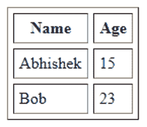
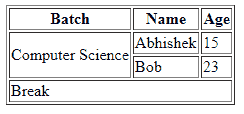
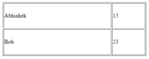
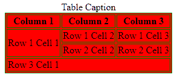

# 关于 HTML 表格你需要知道的一切

> 原文：<https://www.edureka.co/blog/html-tables/>

自从技术出现以来，表是存储和可视化数据的一种常见方式。它被用于几乎所有显示文本信息和数字数据的领域，在这些领域中你可以很容易地比较两个或更多的元素。在本文中，我将按以下顺序讨论 [HTML](https://www.edureka.co/blog/what-is-html/) 表格:

*   什么是 HTML 表格？
*   [HTML 表格标签](#tags)
*   [HTML 表格的变体](#variations)

## 什么是 HTML 表格？

简而言之，表格是由行和列组成的相关数据的集合。正如我们所知，HTML 是创建网页的标准标记语言&在网页浏览器中显示网页。因此，创建和使用表格成为掌握 HTML 的一项重要的子技能。在这篇博客中，我们将学习如何在 HTML 中使用表格。

 要定义一个 HTML 表格，我们使用 ** * <表格> * ** 标签。在 ** * <表格> * ** 标签里面，你先用***<tr>***标签定义表格行。接下来，你在***<th>***标签中定义表头。使用***<TD>***标签定义表格中的数据或单元格。

## **HTML 表格标签**

让我们先来看看用来创建表格的 HTML 标签列表。在这篇博客的后面，我们将借助例子来学习如何使用它们。

*   **<表> :** 用来定义一个表
*   **< th > :** 用于定义表格中的表头单元格
*   **< tr > :** 用来定义表格中的一行
*   **< td > :** 用于定义表格中的单元格
*   **<标题> :** 用于定义表格的标题
*   **<列组> :** 用于指定表格中一列或多列的组，用于格式化
*   **< col >** :用于指定< colgroup >元素中每一列的列属性
*   **<表头> :** 用于对表格表头内容进行分组
*   **< tbody >** :用于将表体内容分组
*   **< tfoot >** :用于对表格中的页脚内容进行分组

现在让我们看看创建表格的 HTML 代码示例。

```

<table> 
<tr> 
<th>Name</th> 
<th>Age</th> 
</tr> 
<tr> 
<td>Abhishek</td> 
<td>18</td> 
</tr> 
<tr> 
<td>Bob</td> 
<td>23</td> 
</tr> 
</table>

```

**输出:**


## **HTML 表格的变体**

*   **单元格填充和单元格间距属性**

有两个称为 cellpadding 和 cellspacing 的属性，可以用来调整表格单元格中的空白。cellspacing 属性定义表格单元格之间的间距，而 cellpadding 表示单元格边框和单元格内容之间的距离。

```
<!DOCTYPE html>
<html>
   <head>
      <title>Cellspacing & Cellpadding</title>
   </head>
   <body>
<table border = "1" cellpadding = "5" cellspacing = "5">
<tr>
<th>Name</th>
<th>Age</th>
</tr>
<tr>
<td>Abhishek</td>
<td>15</td>
</tr>
<tr>
<td>Bob</td>
<td>23</td>
</tr>
      </table>
   </body>
</html>
```



*   **列跨度和行跨度属性**

Colspan 属性用于合并两个或多个列，而 rowspans 用于合并两个或多个行。

```
<!DOCTYPE html>
<html>
   <head>
      <title>Colspan & Rowspan</title>
   </head>
   <body>
<table border = "1">
 <tr>
<th>Batch</th>
<th>Name</th>
<th>Age</th>
         </tr>
<tr>
<td rowspan = "2">Computer Science</td>
<td>Abhishek</td>
<td>15</td>
         </tr>
<tr>
 <td>Bob</td>
<td>23</td>
         </tr>
<tr>
<td colspan = "3">Break</td>
         </tr>
      </table>
   </body>	
</html>
```



*   **桌子高度和宽度**

HTML 为您提供了调整表格高度和宽度的杠杆。宽度属性和高度属性分别用于设置表格的宽度和高度。您可以用屏幕上可用区域的百分比或像素来指定它。

```
<!DOCTYPE html>
<html>
   <head>
      <title>Width & Height of HTML Table</title>
   </head>
   <body>
<table border = "1" width = "400" height = "150">
<tr>
<td>Abhishek</td>
<td>15</td>
         </tr>
<tr>
<td>Bob</td>
<td>23</td>
         </tr>
      </table>
   </body>	
</html>
```



*   **表头、表体和表尾**

表格可以分为三个部分，即标题、正文和页脚。页眉和页脚类似于 word 文档中的页眉和页脚，它在每个页面上都是通用的，而正文包含主要内容。

**< thead >** 标签创建单独的表头，而 **< tfoot >** 标签创建单独的表尾。 **< tbody >** 标签包含表体。

```
<!DOCTYPE html>
<html>
   <head>
      <title>HTML Table with header, footer & body</title>
   </head>
   <body>
<table border = "1" width = "100%">
    <thead>
<tr>
<td colspan = "4">Table Header</td>
            </tr>
         </thead
<tfoot>
<tr>
<td colspan = "4">Table Footer</td>
            </tr>
         </tfoot>
<tbody>
<tr>
<td>Name</td></pre>
<pre><td>Age</td></pre>
<pre><td>Marks</td>
            </tr>
         </tbody>
      </table>
   </body>	
</html>
```


*   **桌子背景&标题**

您也可以设置表格背景。属性为整个表格和一个单元格设置背景色，而背景属性为整个表格和一个单元格设置背景图像。

标题标签用作显示在表格顶部的表格的标题或说明。

```
<!DOCTYPE html>
<html>
   <head>
      <title>HTML Table Background</title>
   </head>
   <body>
<table border = "1" bordercolor = "green" bgcolor = "red">
<caption>Table Caption</caption>
<tr>
<th>Column 1</th>
<th>Column 2</th>
<th>Column 3</th>
         </tr>
<tr>
<td rowspan = "2">Row 1 Cell 1</td>
<td>Row 1 Cell 2</td>
<td>Row 1 Cell 3</td>
</tr>
<tr>
<td>Row 2 Cell 2</td>
<td>Row 2 Cell 3</td>
         </tr>
<tr>
<td colspan = "3">Row 3 Cell 1</td>
</tr>
      </table>
   </body>	
</html>
```



就这样，我们结束了这篇文章。现在，在执行了上面的代码片段之后，你应该已经理解了如何在 HTML 中创建表格。我希望这篇博客能给你带来信息和附加值。

*查看 Edureka 提供的* ***[Web 开发认证培训](https://www.edureka.co/complete-web-developer)*** *，edu reka 是一家值得信赖的在线学习公司，拥有遍布全球的 250，000 多名满意的学习者。* *Web 开发认证培训将帮助您学习如何使用 HTML5、CSS3、Twitter Bootstrap 3、jQuery 和 Google APIs 创建令人印象深刻的网站，并将其部署到亚马逊简单存储服务(S3)。*

有问题要问我们吗？请在这篇文章的评论部分提到它，我们会给你回复。