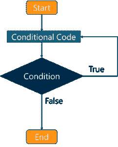

# Java 中的控制语句是什么？

> 原文：<https://www.edureka.co/blog/control-statements-in-java/>

[Java](https://www.edureka.co/blog/java-tutorial/) 中的控制语句是 Java 编程所需的基础之一。它允许程序流畅地运行。本文将涉及以下几点:

*   [决策陈述](#DecisionMakingStatements)
*   [简单 if 语句](#Simpleifstatement)
*   [if-else 语句](#if-elsestatement)
*   [嵌套 if 语句](#Nestedifstatement)
*   [开关语句](#Switchstatement)
*   [循环语句](#Loopingstatemenets)
*   [而](#While)
*   [Do-while](#Do-while)
*   [为](#For)
*   [For-Each](#For-Each)
*   [分支语句](#Branchingstatements)
*   [突破](#Break)
*   [继续](#Continue)

每个程序员都熟悉语句这个术语，它可以简单地定义为给计算机执行特定操作的指令。java 中的控制语句是决定是否执行其他语句的语句。它控制程序的流程。java 中的“if”语句决定一组两个语句之间的执行顺序。

控制报表可分为三类，即

*   选择语句
*   迭代语句
*   跳转语句

继续这篇关于 Java 中控制语句的文章

## **决策陈述**

决定何时执行哪条语句的语句称为决策语句。程序的执行流程由控制流语句控制。Java 中有四种决策语句可用。

继续这篇关于 Java 中控制语句的文章

## **简单 if 语句**

if 语句根据指定的条件确定是否应该执行代码。 **语法:**

```
if (condition) { 
Statement 1; //executed if condition is true
}
Statement 2; //executed irrespective of the condition

```

**输出:** If 语句！ 你好世界！

继续这篇关于 Java 中控制语句的文章

## **如果。**。**目不斜视声明**

在该语句中，如果指定的条件为真，则执行 if 块。否则，执行 else 块。 **例如:**

```

public class Main
{
public static void main(String args[])
{
int a = 15;
if (a > 20)
System.out.println("a is greater than 10");
else
System.out.println("a is less than 10");
System.out.println("Hello World!");
}
}
}

```

**输出:** 一个小于 10 的 你好世界！

继续这篇关于 Java 中控制语句的文章

## **嵌套 if 语句**

if 块中的 if 称为嵌套 if 块。它类似于一个 if..else 语句，只是它们是在另一个 if 中定义的..else 语句。 **语法:**

```

if (condition1) {
Statement 1; //executed if first condition is true
if (condition2) {
Statement 2; //executed if second condition is true
}
else {
Statement 3; //executed if second condition is false
}
}

```

**举例:**

```
public class Main
{
public static void main(String args[])
{
int s = 18;
if (s > 10)
{
if (s%2==0)
System.out.println("s is an even number and greater than 10!");
else
System.out.println("s is a odd number and greater than 10!");
}
else
{
System.out.println("s is less than 10");
}
System.out.println("Hello World!");
}
}

```

**输出:** s 是大于 10 的偶数！ 你好世界！

继续这篇关于 Java 中控制语句的文章

## **开关语句**

java 中的 switch 语句用于执行来自多个条件的单个语句。switch 语句可以用于 short、byte、int、long、enum 等类型。使用 switch 语句时必须注意某些点: α可以为一个 switch 表达式指定一个或 N 个 case 值。不允许出现重复的α大小写值。如果不使用唯一值，编译器会生成编译时错误。 α大小写值必须是文字或常量。不允许使用变量。使用 break 语句来终止语句序列。使用该语句是可选的。如果未指定该语句，则执行下一个案例。

**举例:**

```

public class Music {
public static void main(String[] args)
{
int instrument = 4;
String musicInstrument;
// switch statement with int data type
switch (instrument) {
case 1:
musicInstrument = "Guitar";
break;
case 2:
musicInstrument = "Piano";
break;
case 3:
musicInstrument = "Drums";
break;
case 4:
musicInstrument = "Flute";
break;
case 5:
musicInstrument = "Ukelele";
break;
case 6:
musicInstrument = "Violin";
break;
case 7:
musicInstrument = "Trumpet";
break;
default:
musicInstrument = "Invalid";
break;
}
System.out.println(musicInstrument);
}
}

```

**输出:** 长笛

继续这篇关于 Java 中控制语句的文章

## **循环语句**

重复执行一段代码直到满足特定条件的语句称为循环语句。Java 为用户提供了三种类型的循环:

继续这篇关于 Java 中控制语句的文章

## **而**

while 循环被称为最常见的循环，它计算某个条件。如果条件为真，则执行代码。这个过程一直持续到指定的条件被证明为假。while 循环中指定的条件必须是布尔表达式。如果使用的类型是 int 或 string，将会产生错误。

**语法:**

```

while (condition)
{
statementOne;
}

```

**举例:**

```
public class whileTest
{
public static void main(String args[])
{
int i = 5;
while (i <= 15)
{
System.out.println(i);
i = i+2;
}
}
}

```

**输出:**579111315

继续这篇关于 Java 中控制语句的文章

## 做。。在…期间

do-while 循环类似于 while 循环，唯一的区别是 do-while 循环中的条件是在循环体执行之后计算的。这保证了循环至少执行一次。

**语法:**

```

do{
//code to be executed
}while(condition);

```

**举例:**

```
public class Main 
{ 
public static void main(String args[]) 
{ 
int i = 20; 
do 
{ 
System.out.println(i); 
i = i+1; 
} while (i <= 20); 
} 
}
 &nbsp;

```

**输出:** 20

继续这篇关于 Java 中控制语句的文章

## **为**

java 中的 for 循环用于多次迭代和评估代码。当用户知道迭代次数时，建议使用 for 循环。

**语法:**

```

for (initialization; condition; increment/decrement)
{
statement;
}

```

**举例:**

```
public class forLoop
{
public static void main(String args[])
{
for (int i = 1; i <= 10; i++)
System.out.println(i);
}
}

```

**输出:**5678910

继续这篇关于 Java 中控制语句的文章

## **For-Each**

遍历数组中的元素可以通过 for-each 循环来完成。数组中出现的元素被逐个返回。必须注意，用户不必在 for-each 循环中递增值。

**举例:**

```

public class foreachLoop{
public static void main(String args[]){
int s[] = {18,25,28,29,30};
for (int i : s) {
System.out.println(i);
}
}
}

```

**输出:**1825282930

继续这篇关于 Java 中控制语句的文章

## **分支语句**

java 中的分支语句用于从一个语句跳转到另一个语句，从而转移执行流程。

继续这篇关于 Java 中控制语句的文章

## **突破**

java 中的 break 语句用于终止一个循环，中断程序的当前流程。 **例如:**

```

public class Test
{
public static void main(String args[])
{
for (int i = 5; i < 10; i++)
{
if (i == 8)
break;
System.out.println(i);
}
}
}

```

**输出:**567

继续这篇关于 Java 中控制语句的文章

## **继续**

为了跳到循环的下一次迭代，我们使用 continue 语句。该语句继续程序的当前流程，并在指定条件下跳过一部分代码。

**举例:**

```

public class Main
{
public static void main(String args[])
{
for (int k = 5; k < 15; k++)
{
// Odd numbers are skipped
if (k%2 != 0)
continue;
// Even numbers are printed
System.out.print(k + " ");
}
}
}

```

**输出:** 6 8 10 12 14

如果你刚刚开始，那么看看这篇 Java 循环教程来理解基本概念。

[https://www.youtube.com/embed/LGn-NhUzb6Q](https://www.youtube.com/embed/LGn-NhUzb6Q)

至此，我们结束了这篇关于 Java 中控制语句的文章。必须有效地使用 java 中的控制语句，以使程序有效且用户友好。

*edu reka[**Java 认证培训**](https://www.edureka.co/java-j2ee-training-course) 由专业人士根据行业要求和需求策划。该培训涵盖了核心 Java & J2EE 以及 Hibernate、Spring、& SOA 等流行框架的基础和高级概念的全面知识。在本课程中，您将获得 Java 数组、Java OOPs、Java 函数、Java 循环、Java 集合、Java 线程、Java Servlet 和使用行业用例的 Web 服务等概念的专业知识。今天就加入我们在芒格洛尔的 [Java 培训吧。](https://www.edureka.co/java-j2ee-training-course-mangalore)*