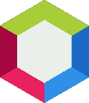
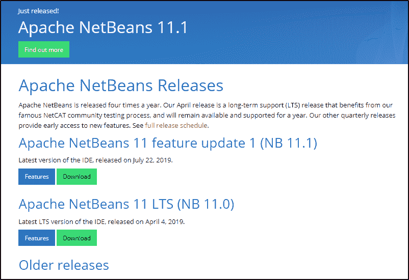
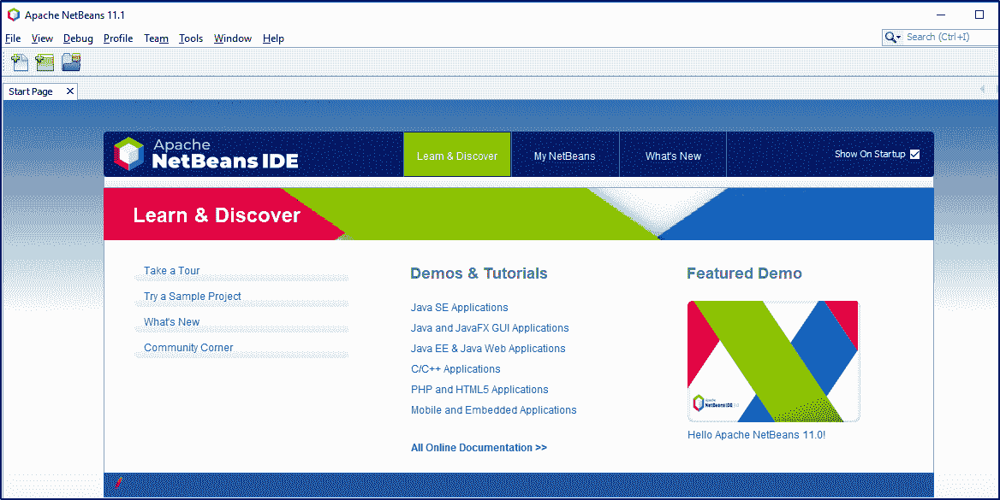
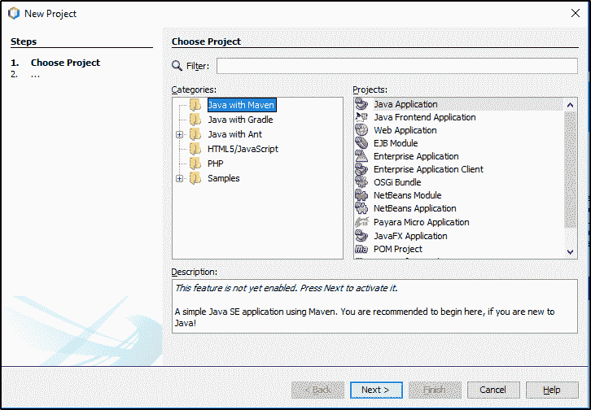
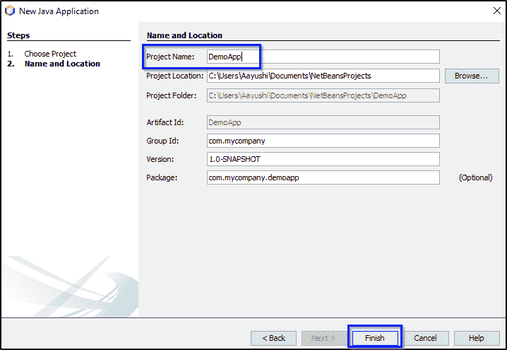
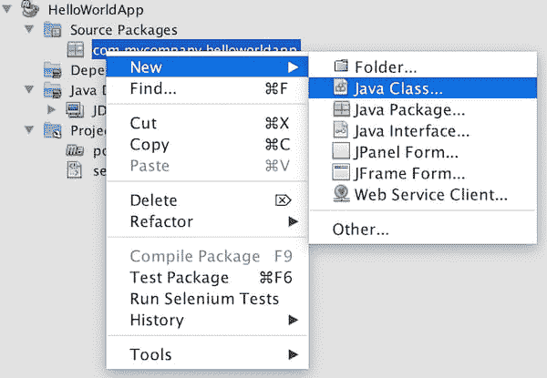

# Netbeans 教程:什么是 NetBeans IDE，如何入门？

> 原文：<https://www.edureka.co/blog/netbeans-tutorial/>

一边挠头一边想什么是 Netbeans？嗯，这是适合你的地方。Netbeans 是一个开源的集成开发环境，用于使用 [Java](https://www.edureka.co/blog/java-tutorial/) 、 [PHP](https://www.edureka.co/blog/php-tutorial-for-beginners/) 、 [C++](https://www.edureka.co/blog/object-oriented-programming-in-cpp/) 以及其他编程语言进行开发。本 Netbeans 教程将为您提供基本的工作流程以及关于 NetBeans 安装的完整见解。让我们看看这篇文章的议程！

*   [NetBeans 简介](#introduction)
*   [如何下载安装 NetBeans？](#downloadnetbeans)
*   [在 Netbeans IDE 中创建第一个项目](#firstproject)
*   [如何创建 Java 源文件？](#sourcefile)
*   [如何给 Java 源文件添加代码？](#addcode)
*   [如何运行应用程序？](#runjavaapp)

让我们开始吧。

## **NetBeans 简介**



Netbeans 是一个开源的集成开发环境(IDE)。用于用 Java、PHP、C++、 [HTML](https://www.edureka.co/blog/what-is-html/) 等多种编程语言开发应用。这些应用程序是使用 Java 中的模块开发的。NetBeans 可以在任何操作系统上运行，如 Windows、MacOS、Linux 等。

接下来，让我们看看如何设置 NetBeans。

## **如何下载并安装 NetBeans**

让我来指导您在系统上安装 NetBeans 的过程。只需遵循以下步骤:

**Step1:** 前往链接:[https://netbeans.apache.org/download/index.html](https://netbeans.apache.org/download/index.html)。您可以找到未来几年 NetBeans 的各种版本。最新版本是 Apache Netbeans 11.1。你可以根据自己的选择下载任何版本。

参考下面的截图，以便更好地理解。



点击与您匹配的系统配置的下载链接。下载完成后，您必须选择 Accept License Agreement 单选按钮，系统将指导您完成安装 IDE 的步骤。

按照这些步骤，您就完成了安装部分。在本 NetBeans 教程中，我们该构建自己的 Java 应用程序了。

激动吗？我们开始吧！

## **NetBeans 教程:创建您的第一个项目**

Netbeans IDE 具有简单的布局结构，按钮数量有限。

让我们看看 NetBeans UI 是什么样子的:



注意，让我们创建我们的第一个项目。

只需进入文件->新项目。选择“Java”类别和“Java 应用程序”项目。请参考下面的截图了解更多信息:



选择 Next 并命名您的第一个项目。您也可以根据自己的方便更改项目位置。



点击“完成”，你就可以开始了，你的项目已经准备好了！

创建项目后，下一步是创建 Java 源文件。

## **如何创建 Java 源文件？**

右键单击包名并选择 New，然后选择 [Java](https://www.edureka.co/blog/what-is-java/) class。

现在，在 New Java Class 向导中，在 class name 字段中键入 Main，然后单击 finish！



您的 Java 源文件将被创建并打开。

有些组件是您必须关注的:

*   **Source Editor** :这是一个中央区域，其中包含了您当前使用名为 main open 的 Java 源文件进行工作的文件。

*   **Projects 窗口**:它在左上角，包含了我们的核心所依赖的源文件和库以及其他几个组件。

*   **Navigator** :它位于左下角，用于在您选择的类中的元素之间导航。

现在，下一步是向 Java 源文件添加代码。

## **如何给 Java 源文件添加代码？**

您创建的主类将帮助您创建一些内容来生成 hello world 消息。

完成该任务的代码如下所示:

```
package Demoapp;

public class DemoApp {

    public static void main(String[] args) {
            System.out.println("Hello World!");
    }

} 
```

Hello world 将打印在输出屏幕上！看完代码后，让我向你展示如何运行这个应用程序。

## **如何运行应用程序？**

您必须首先保存 Java 源文件，然后右键单击项目并选择“运行”,或者选择“运行”菜单下的“运行项目”。之后，选择主类。

您将看到您的应用程序正在工作。通过打开“文件”窗口，然后展开目标节点，可以看到构建输出。

要了解更多关于 Java 及其程序的知识，这里列出了一些可能对您有所帮助的文章:

*   [在 Java 中设置路径](https://www.edureka.co/blog/how-to-set-path-in-java)
*   [用 Java 编译并运行程序](https://www.edureka.co/blog/how-to-compile-run-java-program/)
*   [Java 的 Hello World 程序](https://www.edureka.co/blog/hello-world-program-in-java/)
*   [Java 模式程序](https://www.edureka.co/blog/30-pattern-programs-in-java/)
*   [Java 基本和高级程序](https://www.edureka.co/blog/java-programs/)

至此，我们已经到达了博客的末尾。我希望你们都清楚我上面讨论的每一个方面。继续阅读，继续探索！

*既然您已经了解了 Java 的基础知识，请查看 Edureka 提供的  [**Java 培训**](https://www.edureka.co/java-j2ee-training-course)* *，edu reka 是一家值得信赖的在线学习公司，拥有遍布全球的 250，000 多名满意的学习者。Edureka 的 Java J2EE 和 SOA 培训和认证课程是为想成为 Java 开发人员的学生和专业人士设计的。该课程旨在为您提供 Java 编程的良好开端，并训练您掌握核心和高级 Java 概念以及各种 Java 框架，如 Hibernate & Spring。*

有问题要问我们吗？请在这个“NetBeans 教程”博客的评论部分提到它，我们将尽快回复您。