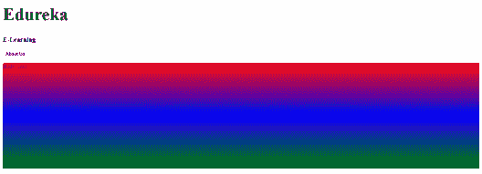
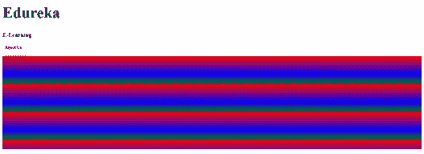
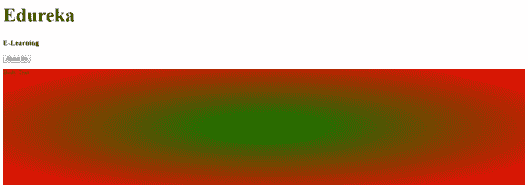

# 如何在 HTML 中实现背景图片

> 原文：<https://www.edureka.co/blog/background-image-in-html/>

在网页设计中，在 HTML 中添加背景图片是最常见的任务之一。本文将涉及以下几点:

*   [HTML 中的背景图片](#BackgroundImageinHTML)
*   [CSS 背景图像属性](#CSSbackground-imageProperty)
*   [背景重复](#Example1)
*   [使用类](#Example2)
*   [](#Example3)
*   [3 颜色渐变](#Example4)
*   [重复线性渐变](#Example5)
*   [径向梯度](#Example6)
*   [3 色径向渐变](#Example7)
*   [重复径向梯度](#Example8)

继续这篇关于 HTML 背景图片的文章

## **HTML 中的背景图片**

有多种方法可以将图像添加到网页中，使其看起来吸引人。其中一种方法是添加背景图像。在这篇博客中，我们将了解如何使用 HTML 和 CSS 在网页中添加背景图片。添加背景图像最常见也是最简单的方法是在标签中使用背景图像属性。

**例子**

```
<!DOCTYPE html>
<html>
<body background="edureka.png">
<h1>Welcome to Edureka</h1>
<p><a href="https://www.edureka.co">Edureka.co</a></p>
</body>
</html>

```

html 5 不支持我们在< body >标签中指定的背景属性。使用 CSS 属性，我们还可以在网页中添加背景图片。

让我们首先了解如何使用 CSS 在网页中添加背景图片。稍后，我们将看看不同的 CSS 属性，使用它们我们可以改变网页的外观和感觉。

## **CSS 背景图像属性**

在所有的例子中，我们将在

继续这篇关于 HTML 背景图片的文章

**例子**

```
<!DOCTYPE html>
<html>
<head>
<style> 
body {
  background-image: url("bg1.jpg");
  background-color: #cccccc;
}
</style>
</head>
<body>
	<p>Document Body</p>
</body>
</html>

```

 你也可以为<主体>元素添加两张背景图片。

**例子**

```
body {
background-image: url("bg3.png"), url("bg1.jpg");
background-color: #cccccc;
}

```

**备注:**

*   默认情况下，背景图像被添加到左上角，并双向重复，即水平和垂直。

*   最好保留背景色的原因是，如果图像不可用，那么将使用背景色属性并显示该属性。

现在，在理解如何使用不同的 CSS 属性值之前，让我们看看与背景图像相关的 CSS 属性值列表。

*   **url:** 背景图片的 url。如果有多个图像，需要提供逗号分隔的列表。
*   **linear-gradient():** 将线性渐变设置为背景图像。至少需要两种颜色。
*   **radial-gradient():** 设置一个径向渐变作为背景图像。至少需要两种颜色。
*   **重复线性渐变():**重复线性渐变
*   **重复径向梯度():**重复径向梯度
*   **initial:** 将属性设置为默认值
*   **inherit** :从其父元素继承该属性

继续这篇关于 HTML 背景图片的文章

现在让我们执行一些例子来理解如何使用 CSS 属性值。

## **背景重复**

在这里，我们试图添加几个背景图像，其中第一个图像将只出现一次，第二个图像将重复。我们使用背景重复来做到这一点。

```
<!DOCTYPE html>
<html>
<head>
<style>
body {
background-image: url("bg2.jpg"), url("bg3.png");
background-repeat: no-repeat, repeat;
background-color: #cccccc;
}

</style>
</head>
<body>
<p>Document Body</p>
</body>
</html>

```


继续这篇关于 HTML 背景图片的文章

## **使用类**

在本例中，我们使用各种背景属性(如图像、颜色、位置和重复)创建背景图像。我们的目标是 bg-image 类将背景属性应用于网页。

```
<!DOCTYPE html>
<html>
<head>
<style>
body {
margin: 0;
font-family: Arial, Helvetica, sans-serif;
}

.bg-image {
background-image: url("bg2.jpg");
background-color: #cccccc;
height: 500px;
background-position: center;
background-repeat: no-repeat;
background-size: cover;
position: relative;
}

.bg-text {
text-align: center;
position: absolute;
top: 50%;
left: 50%;
transform: translate(-50%, -50%);
color: white;
}

</style>
</head>
<body>
<div class="bg-image">
<div class="bg-text">
<h1 style="font-size:50px">Edureka</h1>
<h3>E-Learning</h3>
<button>About Us</button>
</div>
</div>

<p>Body Text</p>
</body>
</html>

```

 继续关注这篇 HTML 背景图片

**线性梯度**

这里，我们使用两种颜色(即红色和黄色)创建一个线性渐变，并将其设置为背景图像。

```
<!DOCTYPE html>
<html>
<head>
<style> 
#gradient {
  height: 200px;
  background-color: #cccccc;
  background-image: linear-gradient(red, yellow);
}
</style>
</head>
<body>
    <h1 style="font-size:50px">Edureka</h1>
    <h3>E-Learning</h3>
    <button>About Us</button>
<p id="gradient">Body Text</p>
</body>
</html>

```

 继续关注这篇 HTML 背景图片

## **3 颜色渐变**

这里我们使用三种颜色(即红、蓝、绿)创建一个线性渐变，并将其设置为背景图像。

```
<!DOCTYPE html>
<html>
<head>
<style>
#gradient1 {
height: 300px;
background-color: #cccccc;
background-image: linear-gradient(red, blue, green);
}
</style>
</head>
<body>
<h1 style="font-size:50px">Edureka</h1>
<h3>E-Learning</h3>
<button>About Us</button>

<p id="gradient1">Body Text</p>
</body>
</html>

```

 继续关注这篇 HTML 背景图片

## **重复线性渐变**

在这个例子中，我们使用 repeating-linear-gradient()函数重复线性渐变，并将其设置为背景图像。

```
<!DOCTYPE html>
<html>
<head>
<style>
#gradient1 {
height: 300px;
background-color: #cccccc;
background-image: repeating-linear-gradient(red, blue 20%, green 30%);
}

</style>
</head>
<body>
<h1 style="font-size:50px">Edureka</h1>
<h3>E-Learning</h3>
<button>About Us</button>

<p id="gradient1">Body Text</p>
</body>
</html>

```

 继续关注这篇 HTML 背景图片

**径向梯度**

这里，我们使用两种颜色(即红色和黄色)创建一个径向渐变，并将其设置为背景图像。

```
<!DOCTYPE html>
<html>
<head>
<style>
#gradient1 {
height: 300px;
background-color: #cccccc;
background-image: radial-gradient(green, red);
}

</style>
</head>
<body>
<h1 style="font-size:50px">Edureka</h1>
<h3>E-Learning</h3>
<button>About Us</button>

<p id="gradient1">Body Text</p>
</body>
</html>

```



## **3 色径向渐变**

这里我们使用三种颜色(即红、蓝、绿)创建一个径向渐变，并将其设置为背景图像。

```
<!DOCTYPE html>
<html>
<head>
<style>
#gradient1 {
height: 500px;
background-color: #cccccc;
background-image: radial-gradient(red, blue, green);
}

</style>
</head>
<body>
<h1 style="font-size:50px">Edureka</h1>
<h3>E-Learning</h3>
<button>About Us</button>

<p id="gradient1">Body Text</p>
</body>
</html>

```

 继续关注这篇 HTML 背景图片

**重复径向梯度**

在这个例子中，我们使用 repeating-radial-gradient()函数重复径向渐变，并将其设置为背景图像。****

```
<!DOCTYPE html>
<html>
<head>
<style>
#gradient1 {
height: 200px;
background-color: #cccccc;
background-image: repeating-radial-gradient(red, blue 10%, green 20%);
}

</style>
</head>
<body>
<h1 style="font-size:50px">Edureka</h1>
<h3>E-Learning</h3>
<button>About Us</button>

<p id="gradient1">Body Text</p>
</body>
</html>

```

现在，在执行了上面的代码片段之后，你应该已经理解了如何使用 HTML & CSS 在网页中插入背景图片。我希望这篇博客能给你带来信息和附加值。就此，我们来安结束这篇文章。

*查看我们的  [全栈 Web 开发人员硕士课程](https://www.edureka.co/masters-program/full-stack-developer-training) ，该课程包含讲师指导的现场培训和真实项目体验。本培训使您精通使用后端和前端 web 技术的技能。它包括关于 Web 开发、jQuery、Angular、NodeJS、ExpressJS 和 MongoDB 的培训。*

有问题要问我们吗？请在这个博客的评论部分提到它，我们会给你回复。