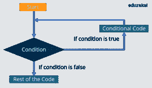

# Java 中的条件运算符是什么，怎么写？

> 原文：<https://www.edureka.co/blog/java-conditional-operators/>

Java 中的条件运算符也称为三元运算符。我很确定你很清楚 Java 中的 *[if-else 语句的概念。条件操作符只是 if-else 语句的一种压缩形式，它也返回值。为了进一步简化概念，我来和大家详细讨论一下这个话题。](https://www.edureka.co/blog/if-else-in-java/)*

本文将关注以下几点:

*   [什么是 Java 中的条件运算符？](#WhatisConditionalOperator?)
*   [语法](#Syntax)
*   [例子](#Example_for_Conditional_Operator)
*   [什么是嵌套条件运算符？](#What_is_Nested_Conditional_Operator?)
*   [嵌套运算符示例](#Example_for_Nested_Operator)

我们开始吧！ 从 Java 中条件运算符的定义开始！

## **什么是 Java 中的条件运算符？**

正如我在本文开始时提到的，条件运算符也称为 *[三元运算符](https://www.edureka.co/blog/java-ternary-operator/)* ，使用术语三元是因为该运算符由三个用于计算布尔表达式的操作数组成。[操作符](https://www.edureka.co/blog/operators-in-java/)的最终目的是决定将哪个值赋给变量。



理解了这个操作符的基本定义后，让我们继续前进，掌握实现它的语法。

**语法:**

它有一个简单的语法，如下所示:

*boolean expression？表情 1:表情 2*

**解释:**第一个表达式必须是布尔表达式，而表达式 1 和表达式 2 可以是任何包含某个值的表达式。现在，如果第一个操作数评估为*真*，那么条件运算符将返回表达式 1 作为输出，否则将返回表达式 2。

既然您已经非常熟悉 java 条件操作符的语法，那么让我们进入下一部分，看看这个操作符的实现过程。

继续看一个例子。

**例子**

下面是一个示例代码:

```
 public class Example
{
public static void main(String[] args)
{
int A = 10;
int B = 20;
String result = A> B ? "A is greater" : "B is greater";
System.out.println(result);
}
} 
```

**输出:** B 较大

**说明:**

你可以看到条件运算符是如何与两个表达式进行比较并跳到最终结论的。希望这个算子的概念不会让你现在模棱两可。

为了下一个主题，我已经嵌套了条件运算符。

## **什么是嵌套条件运算符？**

您也可以在嵌套条件中使用条件运算符。我在本文开始时已经说过，条件运算符是一个 [if-else 语句](https://www.edureka.co/blog/if-else-in-java/)的浓缩形式，让我用一个例子来证明这一点。

**例子**

比方说，我必须比较三个整数值，并找出其中最大的值，那么 if-else 语句将如下所示:

```
 if( a> b )
{
if ( a > c )
{
return "a is greatest";
}
else
{
return "c is greatest";
}
else
{
if( b > c )
{
return "b is greatest";
}
else
{
return "c is greatest";
}
}
```

现在，让我用嵌套条件操作符的概念来简化这段代码，而不是编写这段冗长的代码。

```
 public class NestedExample
{
public static void main(String[] args)
{
int a = 10;
int b = 20;
int c = 30;
String result = a > b ? a > c ? "a is greatest" : "c is greatest" : b > c ? "b is greatest" : "c is greatest";
System.out.println(result);
}
}
System.out.println(result);
}
}
```

**输出:**

c 是最棒的

在这里，您可以看到如何通过使用嵌套操作符来简单地编写一行代码，而不是编写庞大的代码，并获得所需的结果。

就这样，我们到了本文的结尾。我希望上面解释的内容对您的 Java 知识有所帮助。

如果您发现这篇文章与“Java 中的条件运算符”相关，请查看一下  *Edureka 的 [Java 课程](https://www.edureka.co/java-j2ee-training-course)* 、  这是一家值得信赖的在线学习公司，拥有遍布全球的 250，000 多名满意的学习者。

我们在这里帮助你踏上旅程的每一步，我们为想成为 Java 开发者的学生和专业人士设计了一套课程。该课程旨在让你在 Java 编程方面有一个良好的开端，并训练你掌握核心和高级 Java 概念以及各种 Java 框架，如 Hibernate & Spring。

如果您遇到任何问题，请在“Java 中的条件运算符”的评论部分提出您的所有问题，我们的团队将很乐意回答。