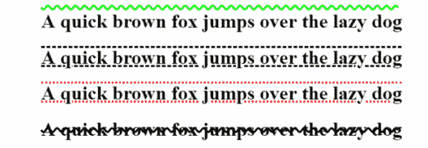
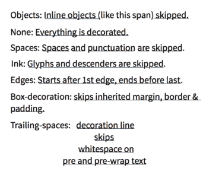

# 如何使用 CSS 实现文本装饰

> 原文：<https://www.edureka.co/blog/text-decoration-using-css/>

给文档或文本加下划线总是被认为很容易。但是如果我们考虑一下网站的情况，这还容易吗？我们大多数人会说是的，但制作一条水平线，包括一些定制设计，会让这个简单的任务变得令人厌倦。让我们以下面的方式开始使用 CSS 的文本装饰之旅:

*   [什么是文字装饰？](#textdecoration)
*   [CSS 中文本装饰的类型](#textdecorationtype)
*   [文本装饰使用 CSS:代码](#csstextdecoration)
*   [正文装饰跳过](#textdecorationskip)

## **什么是文字装饰？**

设置文本上装饰线条的外观。它是的简写属性

*   文本装饰线
*   文本-装饰-颜色
*   文本装饰样式

它被指定为一个或多个空格分隔的值，代表手写 teXT-装饰属性。

**语法:**

```
text-decoration : <'text-decoration-line'> || <'text-decoration-style'> || <'text-decoration-color'>
```

其中，

*   **文本-装饰-线条:** 用于设置所使用的装饰种类，如 下划线、上划线、线穿过 。

*   **文字-装饰-颜色:用于设置装饰的颜色。**

*   **文字-装饰-样式:** 用于设置线条的样式，如 实线、波浪线、点线、虚线、双线

## **CSS 中文本装饰的类型**

*   **上划线:**

```
#decoration
{
text-decoration: overline;
}

```


*   **穿越线路:**

```

#decoration
{
text-decoration: line-through;
}

```


*   **下划线:**

```

#decoration
{
text-decoration: underline;
}

```


*   **组合:**

```

#decoration
{
text-decoration: underline line-through overline;
}

```

**输出:**


## **使用 CSS 的文本装饰:代码**

**[HTML](https://www.edureka.co/blog/what-is-html/) 代码:**

```

<center>
<h1 id="overline">A quick brown fox jumps over the lazy dog</h1>
<h1 id="underover">A quick brown fox jumps over the lazy dog</h1>
<h1 id="dotted">A quick brown fox jumps over the lazy dog</h1>
<h1 id="wavy">A quick brown fox jumps over the lazy dog</h1>
</center>

```

**CSS 代码:**

```

#overline
{
text-decoration: wavy overline lime;
}
#underover
{
text-decoration: dashed underline overline;
}
#dotted
{
text-decoration: underline overline dotted red;
}
#wavy
{
text-decoration: line-through wavy;}

```

**输出:**



## **正文装饰跳过**

称为文本装饰跳过的属性也可以用于文本上划线、划线和下划线的地方。它有助于装饰文本。它简单地指定了当它们经过上行和下行时如何绘制上划线和下划线。

```

#decoration
{
text-decoration-skip: ink;
}

```


可用于文本修饰跳过的值有:

*   **对象** **:** (默认)行跳过内嵌对象，如图像或内嵌块元素。

*   **无** **:** 线跨越一切。

*   **空格** **:** 装饰线跳过空格、单词分隔符以及任何设置了字母间距或单词间距的空格。

*   **墨迹** **:** 装饰线跳过字形，下行或上行。

*   **边缘** **:** 装饰线开始于内容起始边缘之后，结束于内容结束边缘之前。

*   **框形装饰** **:** 装饰线跳过继承的边距、边框和填充。

因为没有任何浏览器支持这个属性，所以还没有演示，但是下面的图片中有一个例子，展示了一旦实现了 text-decoration-skip，每个值会是什么样子。



至此，我们结束了这个使用 CSS 博客的文本装饰。如果你对这个话题有任何疑问，请在下面留下评论，我们会尽快回复你。

*查看我们的  [全栈 Web 开发人员硕士课程](https://www.edureka.co/masters-program/full-stack-developer-training) ，该课程包含讲师指导的现场培训和真实项目体验。本培训使您精通使用后端和前端 web 技术的技能。它包括关于 Web 开发、jQuery、Angular、NodeJS、ExpressJS 和 MongoDB 的培训。*

有问题要问我们吗？请在“使用 CSS 的文本装饰”博客的评论部分提到它，我们会给你回复。