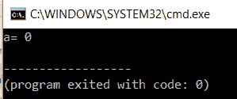

# 如何在 C 中实现静态变量？

> 原文：<https://www.edureka.co/blog/static-variable-in-c/>

众所周知，静态变量即使在退出作用域后仍会保留其值。它们保留它们的值，并且不会在新的范围内再次初始化。这篇文章将帮助你探索 c 语言中静态变量

本文将关注以下几点:

*   [函数内的静态变量](#StaticVariablesInsidetheFunction)
*   [静态变量的一些特征](#SomeFeaturesofStaticVariables)

那么让我们开始吧，

## **C 语言中的静态变量**

在声明静态变量时使用了关键字 static。

**语法:**

```
static Data_type Var_name = Var_value;
```

**举例:**

```
static int abc=80;
```

静态变量一直保存在内存中，直到程序结束，而普通变量在函数结束时被销毁。

继续讨论 C #文章中的静态变量

**函数内的静态变量** 函数内的静态变量不仅保存该值直到函数块结束，而且保存到整个程序结束。

**考虑代码显示静态关键字函数，**

```
#include<stdio.h>
void fun();
int main()
{
fun();
fun();
fun();
return 0;
}
void fun()
{
int a = 1;
static int b = 10;
printf("a = %dn", a);
printf("b = %dnn", b);
a++;
b++;
}

```

**输出**

****

**解释**

在上面的代码中，调用了一个名为 fun 的函数。在函数块内部，有一个初始化为 1 的普通变量 a 和一个初始化为 10 的静态变量 b。打印 a 和 b 的值，然后递增 a 和 b。

可以看出，正常变量值在所有三次调用中都保持不变，但是静态变量的值从 10 一直增加到 11 和 12。这是因为即使函数块结束，静态变量也会保留增量后的值。

继续讨论 C #文章中的静态变量，

**静态变量的一些特征**

*   数据段用于分配静态变量，而不是堆栈段。
*   默认情况下，静态变量有一些值，如果没有显式初始化，就用这些值进行初始化。

#### **默认情况下**

对于指针，它被赋给空指针。

对于算术值，它被赋为零。

**考虑代码，**

```
#include <stdio.h>
int main()
{
static int a;
printf("%d ", a);
}

```

**输出:**



在代码中，我们不初始化的值，但默认情况下，它被赋为 0。静态变量的初始化是使用常量来完成的

继续讨论 C #文章中的静态变量

**考虑代码，**

```
#include<stdio.h>
int a=10,b=10;
int sum()
{
return a+b;
}
int main()
{
static int i = sum();
printf(" value of i = %d", i);
return 0;
}

```

**输出**


当使用函数初始化变量时，我们会得到一个错误。

*   全局变量也可以是静态的。

这就是静态变量在 c 编程中的用法。静态关键字也可以用于函数。

至此，我们结束了这篇关于“C 语言中的静态变量”的博客。我希望你发现这是有益的，请继续关注更多类似主题的教程。您也可以查看我们的培训项目 t 以获得关于 jQuery 及其各种应用程序的深入知识，您可以 [**在此**](https://www.edureka.co/masters-program/full-stack-developer-training) 注册参加实时在线培训，享受全天候支持和终身访问。 用不同的字符串和修改实现上面的代码。现在，我们已经很好地理解了与指针相关的所有关键概念。

有问题要问我们吗？在这个博客的评论部分提到他们，我们会回复你。