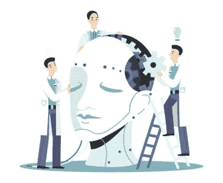
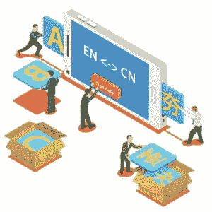

# 人工智能中如何实现专家系统？

> 原文：<https://www.edureka.co/blog/expert-system-in-artificial-intelligence/>

人工智能中的专家系统是一个在技术世界中流传的术语，这是有充分理由的。在本文中，我们将详细探讨这一主题。

本文将涉及以下几点:

*   [什么是人工智能？](#WhatisArtificialIntelligence?)
*   [人工智能专家系统](#ExpertSystemInArtificialIntelligence)
*   [使用专家系统的领域](#DomainswhereExpertSystemsareused)
*   [主要应用领域](#Mainareasofapplication)
*   [ES 设计的三个阶段](#ThreestagesofdesigningES)
*   [利弊和局限](#ProsConsAndLimitations)

让我们从这篇文章开始吧，

## **什么是人工智能？**

嗯，通常人工智能这个名字意味着人工机器的智能。人类拥有的智能被称为人类智能，就像机器展示的智能被称为人工智能一样。在计算机科学领域。人工智能(AI)，有时也称为机器智能。人工智能的研究领域诞生于 1956 年达特茅斯学院的一个车间。

通过[人工智能课程](https://www.edureka.co/executive-programs/machine-learning-and-ai)，你可以更好地理解人工智能，并推动你的职业生涯走向更好的工作和薪水。

**人工智能在现实世界中的应用:**

如今像 SIRI、CORTANA 这样的聊天机器人已经非常流行了。其他例子包括 EVA(电子虚拟助理)，这是一个由 HDFC 银行人工智能研究部门开发的基于人工智能的聊天机器人，它可以从数千个来源收集知识，并在不到 0.4 秒的时间内提供简单的答案。在我们社会的不同领域，你会发现很多人工智能应用的例子。

继续这个人工智能专家系统，

## **人工智能专家系统**

什么是专家系统？

斯坦福大学计算机科学系的研究人员介绍了这一人工智能领域，这是人工智能的一个重要研究领域。它是一个计算机应用程序，可以解决任何特定领域的最复杂的问题。它被认为是人类智力和专业知识的最高水平，因为它是基于从专家那里获得的知识。专家系统也可以被定义为基于计算机的决策系统，它可以利用事实和启发来解决复杂的决策问题。

继续这个人工智能专家系统，

## **使用专家系统的领域**

**今日专家系统**

美国医学协会批准了第一个专家系统——探路者系统。它建于 1980 年斯坦福大学，用于血液病理学诊断。该决策专家系统简称探路者，可以诊断淋巴结疾病。最终，它能处理 60 多种疾病，并能识别 100 多种症状。

**商业专家系统**

最近开发了一个专家系统 ROSS，即人工智能律师，ROSS 是一个自我学习系统，它使用数据挖掘、模式识别、深度学习和自然语言处理来模仿人类大脑的工作方式。

继续这个人工智能专家系统，

## **主要应用领域**

*   解释——根据数据得出高层次的结论。
*   预测——预测可能的结果。
*   诊断-确定故障、疾病等的原因。
*   设计—fi根据标准确定最佳配置。
*   规划——提出一系列行动来实现目标。
*   监控——将观察到的行为与预期的行为进行比较。
*   调试和修复——规定和实施补救措施。
*   指导——帮助学生学习。
*   控制——管理系统的行为。

**专家系统的目的**

专家系统的主要目的是获取人类专家的知识，并复制特定领域中人类专家的知识和技能。然后，系统将使用这些知识和技能，在没有人类专家参与的情况下，解决特定领域的复杂问题。

**专家系统特征**

*   高性能
*   可以理解的
*   可靠
*   高度响应

#### **基于规则或专家系统的主要组件**

**主要组件有:**

*   知识库
*   工作记忆
*   推理机
*   解说系统
*   用户界面
*   知识库编辑器

继续这个人工智能专家系统，

## **ES 设计的三个阶段**

**知识获取:**

通过访谈或通过观察人类专家、阅读特定书籍等方式从专家那里获取知识的过程。

**知识库:**

知识库是高质量知识的容器。技能是通过实践发展的，而智慧来自于知识。没有知识，一个人就无法证明或展示他或她的智慧，所以知识对于发展技能和展示智慧是非常重要的。同样，机器也需要知识来展示它的智能。预测的准确性以及系统的性能在很大程度上依赖于完美、准确和精确的知识的收集。

现在什么是知识？

知识是数据或信息。对于我们人类来说，通过阅读文章和书籍或从不同的资源中我们过去常常收集知识，如果我们能看到获得和丰富知识的过程，那么我们会发现通过阅读书籍或阅读文章或从任何资源中我们从不同的来源获取和提取数据和信息，然后我们将它们储存在我们的大脑中。所以知识就是数据，知识就是信息。知识也是事实的集合。

数据、信息和过去的经验结合在一起称为知识。

**知识表示:**

知识表示是选择最合适的结构来表示知识的方法。它是在知识库中组织和形式化知识的方法。它是以 IF-THEN-ELSE 规则的形式完成的。

**知识验证:**

测试专家系统的知识是否正确和完整。 这整个过程被称为知识工程。

**推理机:**

在基于知识的专家系统中，推理机从知识库中获取并处理知识，以得出特定的解决方案。

如果是基于规则的专家系统，

*   它将规则反复应用于事实，这些事实是从先前的规则应用中获得的。
*   如果需要，可以将新知识添加到知识库中。
*   当多个规则适用于一个特定案例时，它解决规则冲突。

推理机使用以下策略

*   正向链接
*   反向链接

**正向链接**

在正向链接中，推理引擎通过跟随条件和推导链给出结果。无论系统中输入了什么知识，它都会仔细检查所有的知识和事实，并在得出解决方案之前对它们进行分类。通过正向链接方法，专家系统试图回答“接下来会发生什么？”

正向链接的应用:房价预测、股票预测、股票市场预测等。

**反向链接**

当某个特定领域发生了某件事时，推理引擎会试图找出这个结果在过去可能发生的条件。通过反向链接法，专家系统试图回答“为什么会发生这种情况？”。通过反向链接方法，推理机试图找出原因或理由。

例如:人类血癌的诊断。

## **利弊和局限**

专家系统的优势

1.  保存海量信息
2.  最大限度降低员工培训成本
3.  集中决策过程
4.  通过减少解决问题所需的时间来提高效率
5.  结合各种人类专家智能
6.  减少人为错误
7.  提供可能给竞争对手带来问题的战略和比较优势
8.  查看人类专家可能想不到的交易
9.  为重复性的决策、流程和任务提供答案

**专家系统的缺点:**

1.  缺乏人类专家能够做出的创造性反应
2.  不能解释决策背后的逻辑和推理
3.  复杂流程的自动化并不容易
4.  没有适应变化环境的灵活性和能力
5.  没有回答时无法识别
6.  在做决定时没有使用常识

**限制:**

*   它无法做出创造性的反应，因为它是一台机器。
*   如果知识库中输入的数据不准确或不正确，将会给出错误的预测和错误的结果。
*   专家系统的维护成本很高。
*   当不同的问题出现时，人类专家可以给出不同的解决方案和创造性的反应，但专家系统却不能给出创造性的反应。

这就把我们带到了这篇关于人工智能专家系统的文章的结尾。

*如果你希望报名参加人工智能和机器学习的完整课程，Edureka 有一个专门策划的  [**机器学习工程师硕士项目**](https://www.edureka.co/masters-program/machine-learning-engineer-training) ，它将使你精通监督学习、非监督学习和自然语言处理等技术。它包括人工智能&机器学习方面的最新进展和技术方法的培训，如深度学习、图形模型和强化学习。*