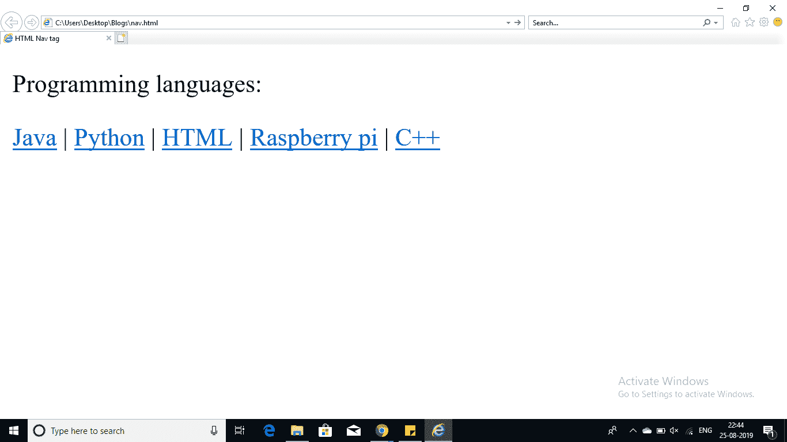

# 如何最好地利用 HTML 导航标签？

> 原文：<https://www.edureka.co/blog/html-nav-tag/>

在这个互联网的世界里，我们已经习惯了浏览网页。这也包括从一个页面跳到另一个页面。因此，当设计[网页](https://www.edureka.co/blog/what-is-html/)时，将这一特性融入你的计划中变得非常重要。HTML 导航标签帮助你实现准确的现象。这篇文章将帮助你详细了解这个概念。

本文将涉及以下几点，

*   [HTML 导航标签](#HTMLNavTag)
*   [样本程序](#SampleProgram)

那么让我们开始吧，

## **HTML 导航标签**

在这里，HTML < nav >标签指定了一个只包含导航链接的部分。HTML 中的< nav >标签换句话说，nav 元素代表页面的一部分，它的目的是提供导航链接。它还可以用来定义当前文档或其他文档中的导航链接块。这个< nav >标签主要用于导航到特定文档的链接。下面给出了使用< nav >标签并显示输出的示例代码。

现在我们知道了这个概念，让我们来看一个示例程序，更好地理解 HTML 导航标签

**举例:**

```
<!DOCTYPE html>
<html>
<head>
<title>HTML Nav tag</title>
</head>
<body>
<p>Programming languages:</p>
<nav>
<a href="java/index.htm">Java</a> |
<a href="python/index.htm">Python</a> |
<a href="html/index.htm">HTML</a> |
<a href="raspberry pi/index.htm">Raspberry pi</a> |
<a href="C++/index.htm">C++</a>
</nav>
</body>
</html>

```

**输出如下:**



所以就是这样，这就把我们带到了这篇文章的结尾。我希望这对你有益。

*既然你知道了什么是 HTML，那就来看看 Edureka 的 **[Web 开发认证培训](https://www.edureka.co/complete-web-developer)** 。* *Web 开发认证培训将帮助您学习如何使用 HTML5、CSS3、Twitter Bootstrap 3、jQuery 和 Google APIs 创建令人印象深刻的网站，并将其部署到亚马逊简单存储服务(S3)。*

*有问题吗？请在“什么是 HTML？”的评论部分提及。我们会回复你的。*