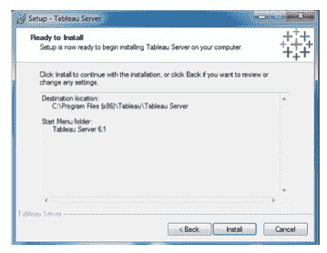
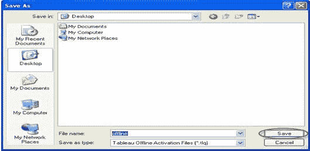
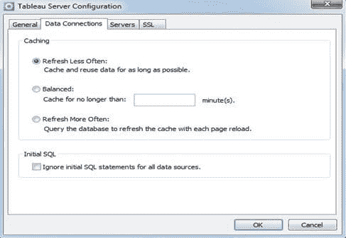
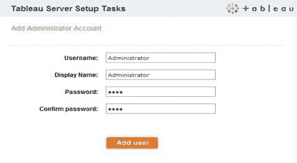
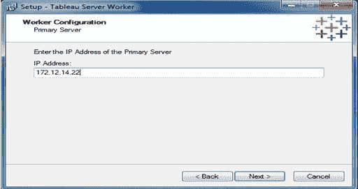
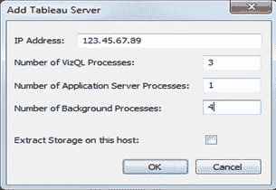
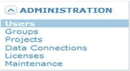
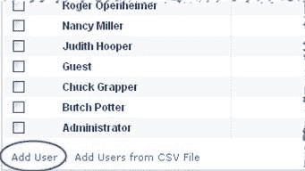
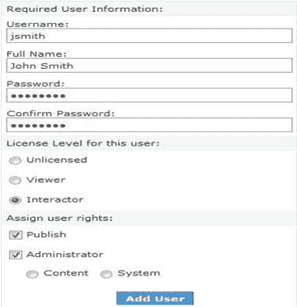

# Tableau 服务器教程:你需要知道的一切

> 原文：<https://www.edureka.co/blog/tableau-server-tutorial/>

[Tableau](https://www.edureka.co/blog/tableau-tutorial/) 服务器是分发 Tableau 工作簿最安全的方式。它可以帮助您嵌入实时交互式仪表板，并为您的数据提供高安全性。这个 Tableau 服务器教程，让你对 Tableau 服务器的基础有一个大概的了解。以下是本教程涵盖的主题，

*   [Tableau 服务器组件](#TableauServerComponents)
*   [Tableau 服务器安装](#TableauServerInstallation)
*   [激活产品](#ActivatingtheProduct)
*   [配置服务器](#ConfiguringtheServer)
*   [设置分布式服务器](#SettingUpDistributedServers)
*   [添加用户](#AddingUsers)

让我们从 Tableau 服务器教程开始吧

## **Tableau 服务器组件**

以下是 Tableau 的各种服务器组件:

*   **应用服务器**:这个进程处理 Tableau 服务器 Web 和移动接口的浏览和权限。
*   **VizQL 服务器**:它根据客户端的请求向数据源发送查询，并返回一个呈现为图像的结果集。最终，它将它们呈现给用户。
*   **数据服务器**:它让用户管理和存储 Tableau 数据源，同时也维护 Tableau 桌面的元数据。

[https://www.youtube.com/embed/zU8jetnJwz0](https://www.youtube.com/embed/zU8jetnJwz0)

## **Tableau 服务器安装**

*   双击安装文件。
*   按照屏幕上的指示完成*设置向导*。
*   安装应用程序。
*   安装完成后，点击*下一步*打开*产品密钥管理器*窗口****

继续这篇关于 Tableau 服务器教程的文章

## **激活产品**

安装 Tableau Desktop/Tableau Server 后，您需要激活您的产品。它们都需要产品密钥来激活这些产品。

Tableau 服务器至少需要一个产品密钥。它应该既能激活服务器，又能确定可以分配给用户的许可级别数。产品密钥可从客户帐户中心的*表格中获取。*****

## **激活并注册**

安装和配置服务器后，产品密钥管理器会自动打开，您可以输入产品密钥并注册产品。

*   选择*激活产品*

*   将您的服务器产品密钥粘贴到相应的文本框中，然后单击*激活*。

*   当你在线的时候，它就在这里。但是当您脱机时，激活将会失败，您可以选择保存一个文件，以便脱机激活。点击*保存*。

*   继续选择文件的位置，并点击*保存*。该文件将被保存为 *tlq* ，并将包含关于要在其上激活许可证的主机的信息。

继续这篇关于 Tableau 服务器教程的文章

## **配置服务器**

在 Tableau 服务器安装期间， *Tableau 服务器配置*实用程序会打开，您可以在服务器启动之前设置配置选项。服务器在安装过程结束时启动。

1.  默认情况下，Tableau 服务器通过使用*网络服务*帐户运行。

2.选择是否要使用 *Active Directory* 来验证服务器上的用户。

## **数据连接配置**

*数据连接*选项卡用于配置适用于完整数据连接的缓存和初始 SQL 语句使用的各个方面。

发布到 Tableau Server 的视图是非常交互式的，并且经常有到数据库的实时连接。当用户在 web 浏览器中与视图交互时，查询的数据存储在缓存中。随后，如果可行，访问将从该缓存中提取数据。

## **配置缓存**

*   在*表服务器配置*对话框中选择名为*数据连接*的选项卡。

*   然后，您可以从下列选项中选择一个；

1.  **减少刷新频率–**当数据不经常更改时，选择此选项。无论数据何时添加到缓存中，只要数据可用，就会被缓存和重用。该选项最大限度地减少了发送到数据库的查询，提高了性能。

2.  **平衡–**在指定时间后，数据将从缓存中删除。如果在指定的时间范围内将数据添加到缓存中，将使用缓存的数据，否则，将从数据库中查询新数据。

3.  **更频繁地刷新—**每次加载页面时都会查询数据库。数据仍然被缓存，并将被重用，直到用户重新加载页面。此选项将确保用户看到最新的数据。但是，这可能会降低性能。

**设置任务**

以下几个步骤是添加管理员帐户。

继续这篇关于 Tableau 服务器教程的文章

**设置分布式服务器**

完成初始配置后，设置 Tableau 服务器在多台计算机上运行。这也被称为*分布式安装*或*集群*。这增加了 Tableau 服务器环境的可伸缩性。

*   您可以设置 Tableau 服务器在多台机器上运行。您还可以微调哪些 Tableau 服务器进程可以在单独的机器上运行(包括主服务器)。

*   这种类型的环境可以帮助您支持更多的用户，改善观众的互动和浏览。它还优化了服务器后台任务的处理。
*   一旦工作者软件安装在工作者机器上，您需要返回到主服务器并打开配置实用程序。你可以通过选择*开始菜单*上的 **Tableau 服务器 8 >配置 Tableau 服务器**来完成。
*   在*配置实用程序*中，转到**服务器选项卡**，点击**添加按钮**。

*   在接下来出现的对话框中，键入其中一台工作机的 IP 地址。表示分配给机器的 *VizQL 进程*、*应用服务器进程*和*后台进程*的数量。

继续这篇关于 Tableau 服务器教程的文章

**添加本地用户**

您可以添加所有单个用户的信息，然后从 CSV 文件(逗号分隔值文件)导入多个用户。您还可以在 CSV 文件中包含诸如站点角色和发布能力等属性，以便应用到用户的同时导入它们。

因此，要添加本地用户，您需要执行以下操作；

*   通过输入您的管理员用户名和密码登录 Tableau 服务器。
*   点击页面左侧管理区中的选项*用户*

*   单击以下链接之一

1.  **添加用户**通过一次指定一个用户名和密码来添加用户。
2.  **从 CSV 文件添加用户**从一个 CSV 文件添加多个用户。

1.  **用户名**–输入一个仅由字母和数字组成的用户名。
2.  **全名**–输入显示名称。
3.  **密码**–输入一个强密码。
4.  **确认** **密码**–再次输入您之前输入的密码进行确认。
5.  **许可级别**–选择许可级别。
6.  **分配用户权限**–选择用户是否有权发布工作簿并分配管理员权限。

点击添加*用户*

至此，我们已经结束了这个 Tableau 服务器教程。

这就把我们带到了 Tableau 服务器教程的结尾。如果您希望掌握 Tableau，Edureka 在  **[Tableau 在线课程](https://www.edureka.co/tableau-certification-training)** 上有一个策划课程，它深入涵盖了数据可视化的各种概念。

*有问题吗？请在评论区提到它，我们会尽快回复您。*