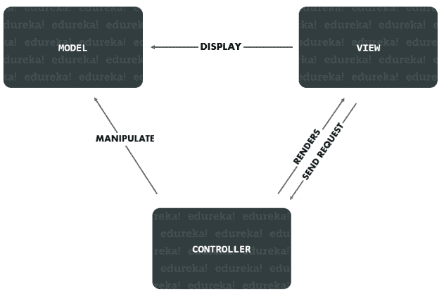

# AngularJS 真的是基于 MVC 架构吗？

> 原文：<https://www.edureka.co/blog/angular-mvc-architecture/>

web 开发的世界是一个永远在变化的世界。无论是就框架而言，还是就事情的实现方式而言，在一段时间之后，没有什么事情是一成不变的。在这样的演变过程中，有两样东西在开发人员中变得流行起来——Angular 和 MVC 架构。在这篇博客中，我们将同时讨论 [Angular](https://www.edureka.co/blog/angular-tutorial/) 和 MVC 架构，以及如何使用前者来实现后者。本博客涵盖了以下主题:

*   [什么是 Angular/ AngularJS？](#what-is-angular)
*   [什么是 MVC 架构？](#MVC-architecture)
*   [MVC 的组件](#MVC-component)
*   [Angular 对 MVC 的实现。](#Angular-MVC)
*   [MVVM 建筑](#MVVM-architecture)

在我们继续讨论这个博客之前，我想提醒你，如果你想成为一名熟练的 angular 开发者，你一定要看看我们的 [Angular 课程](https://www.edureka.co/angular-training)，它将由一名认证的行业专家在一个在线课堂上教授你。

## **什么是 Angular/ AngularJS？**

AngularJS 是一个基于 JavaScript 的框架，由 Google 开发。它于 2010 年末首次发布，但直到 2011 年初才获得第一个稳定版本。它被大肆宣传为一个健壮的[框架](https://www.edureka.co/blog/top-10-javascript-frameworks/)，通过实现模型-视图-控制器来创建动态网络应用，也就是通常所说的 MVC 架构。 Google 还负责维护和不断更新框架。在他们的第二次更新中，AngularJS 被完全否决，并以 **Angular** 的名字重新开始。从那以后，Angular 每两年更新一次，今天，Angular 的最新版本是 *Angular 8。*唯一不同的是 Angular 现在是基于 TypeScript 的，TypeScript 是 JavaScript 的超集，但是仍然保持了 MVC 架构。

以上是对 Angular 的简短介绍，现在让我们来看看 MVC 架构背后的精髓是什么。

## **什么是 MVC 架构？**

正如你现在已经知道的，MVC 代表模型-视图-控制器。基本思想是有三个独立的实体，永远不要把它们混在一起。在 MVC 架构的概念出现之前，开发人员努力将他们的逻辑集成到他们的视图中，而视图也必须以某种方式建模。事情通常会变得非常混乱，这是不希望的，尤其是在处理跨越数千行代码的大型项目时。这使得调试和维护等活动变得非常困难。 在 MVC 架构中，实体是分离的，因此将所有东西联系在一起的业务逻辑总是单独编写的。因此，我们也可以说 MVC 更多的是一种软件模式，而不是架构。现在我们对 MVC 有了一个简单的概念，让我们来看看它的三个主要组成部分。

## **MVC 的组件**

1.  **模型**——负责管理应用数据。它响应来自视图的请求和来自控制器的指令来更新自身。
2.  **视图**–负责向用户显示全部数据或部分数据。它还以特定的格式指定数据，该格式是由控制器决定显示数据而触发的。它们是基于脚本的模板系统，如 JSP、ASP、 [PHP](https://www.edureka.co/blog/php-tutorial-for-beginners/) ，非常容易与 AJAX 技术集成。
3.  **控制器**-负责控制模型和视图之间的关系。它响应用户输入并在数据模型对象上执行交互。控制器接收输入，验证输入，然后执行修改数据模型状态的业务操作

## **Angular 对 MVC 的实现**

嗯，我写这篇博客的时候已经是 2019 年末了，AngularJS 已经被弃用很久很久了。AngularJS 肯定遵循了 MVC 架构，但是今天 Angular 就不一样了。让我们来看一些示例代码片段来解释我的意思。

```
<!DOCTYPE html>
<html ng-demo>
<head>
<title>Example mvc</title>
<script type="text/javascript" src="angular.min.js"></script>
</head>
<body ng-controller="DisplayText">
<p>{{demoText}}</p>
</body>

<script>
function DisplayText($scope) {
$scope.demoText= 'This is a demo!';
}
</script>
</html>

```

在上面的代码片段中，我们的文本由变量 *demoText* 表示。这是我们的模型。控制器通过用变量 *demoText* 中包含的值替换 *{{demoText}}* 来显示视图上的数据，从而更新视图。是控制器在管理我们的模型和视图(HTML)之间的关系。

MVC 的一个缺点是，如果我们在视图中做了任何改变，它不会在模型中得到更新。这个问题在 Angular2 中通过转移到 MVVM 架构得到了解决。

## **MVVM 建筑**

MVVM 基本上包括三样东西:

*   模型
*   视角
*   视图模型

在 MMVM 设计模式中，控制器实际上被视图模型所取代。视图模型只不过是一个 JavaScript 函数，它又像一个控制器，负责维护视图和模型之间的关系，但这里的区别是，如果我们更新视图中的任何内容，它会在模型中更新，在模型中更改任何内容，它会显示在视图中，这就是我们所说的双向绑定。

```

<!DOCTYPE html>
<html ng-app>
<head>
<title>Number Adition</title>
<script type="text/javascript" src="angular.min.js"></script>
</head>
<body>
<form ng-controller="AdditionController">
<label>Number :</label> <input name="number" ng-change="additionNeeded()" ng-model="data.number1">
<label>Number entered by User :</label> {{data.number1}} <br>
<label>Divisor :</label> <input name="divisor" ng-change="additionNeeded()" ng-model="data.number2">
<label>Number entered by User :</label> {{data.number2}} <br>
<label>Result :</label> {{data.result}}
</form>
</body>
<script>
function DivisionController($scope) {
$scope.data = {number1: 0, number2: 0, result: 0};
$scope.additionNeeded = function () {
$scope.data.result = $scope.data.number1 + $scope.data.number2;
}
}
</script>
</html>

```

上面的代码片段将在作为用户输入的两个数字之间执行加法，然后将其显示在名为 *result* 的框中。现在，让我们将它分解成各个组件——模型、视图和视图模型。


*视图*是我们的 [HTML](https://www.edureka.co/blog/what-is-html/) ，在这种功能分离的方式下，*视图*和*视图模型*可以相互通信。因此，每当*视图中有变化时，*视图模型*就会知道。然后*视图模型*更新*模型。*这就是 angular 最新版本的工作原理。*

就这样，我想在这里结束我的博客。如果你对这篇文章有任何疑问，请在下面的评论区发表。如果你想从这个博客中学到更多关于 angular 的知识，并把你的职业生涯定位于精通 angular 的开发者，那么考虑报名参加我们的 **[Angular 认证课程](https://www.edureka.co/angular-training)** 。

*有问题吗？请在这个“*Angular MVC”*的评论区提出来，我们会给你回复。*