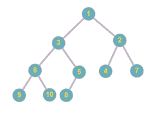
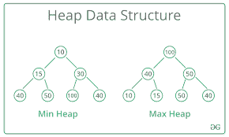

# 了解如何用 Java 实现二进制堆

> 原文：<https://www.edureka.co/blog/binary-heap-in-java/>

这篇文章会给你一个堆排序工作的完整概述，稍后我们将学习用 Java 实现一个二进制堆。

本文的议程如下:

1.  [什么是堆排序？](#what)
2.  [最大堆](#max)
3.  [最小堆](#min)
4.  [Java 中的堆实现](#code)
    *   图表
    *   代码

我们开始吧！

## **什么是堆排序？**

堆基本上是基于树的数据结构。它有节点。节点由某些元素组成。每个节点包含一个元素。

节点可能有子节点。如果万一没有孩子，那就叫叶子。

有两条规则需要遵守:

*   每个节点的值必须小于或等于其子节点中存储的所有值。
*   它有最小的可能高度。

堆在提取最少或最多的元素时非常有效。

现在让我们继续讨论 min heap！

## **最小堆**

最小堆是一个完整的二叉树，其中根元素的值小于或等于任一个子元素。

最小堆的表示

**Arr[(i-1) / 2]:** 这将返回父节点。

**Arr[(2*i) + 1]:** 这将返回左边的子节点。

**Arr[(2*i) + 2]:** 这将返回右边的子节点。

有一些最小堆的方法:

*   **insert():** 在树的末尾添加一个新的键。如果新键比父键大，那么就不需要做任何事情，否则，我们必须遍历来设置堆属性。
*   getMin(): 这个方法有助于返回根元素。
*   **extractMin():** 这个方法返回最小的元素。

现在转到 Max heap。

## **最大堆**

最大堆是一个完整的二叉树，其中根元素的值大于或等于任何一个子元素。

Max heap 也由几个方法组成！

*   **Insert ():** 它将在堆中插入一个元素。
*   **Delete()** :从堆中删除一个元素。
*   它将从堆中找到最大的元素。
*   **printHeap():** 它将打印堆的内容

### 现在让我通过一个图表和一个 Java 代码向您展示堆的实现。

## **Java 中的堆实现**

**图表:**



上图显示了 Java 中的二进制堆。您已经知道有两种堆:最小堆和最大堆，下面是一个图表:



现在，继续我们的下一部分，我们将看到如何在 Java 中实现二进制堆。

**代码:**

```
public class BinaryHeap {

	private static final int d= 2;
	private int[] heap;
	private int heapSize;

	/**
	 * This will initialize our heap with default size. 
	 */
	public BinaryHeap(int capacity){
		heapSize = 0;
		heap = new int[ capacity+1];
		Arrays.fill(heap, -1);

	}

	/**
	 *  This will check if the heap is empty or not
	 *  Complexity: O(1)
	 */
	public boolean isEmpty(){
		return heapSize==0;
	}

	/**
	 *  This will check if the heap is full or not
	 *  Complexity: O(1)
	 */
	public boolean isFull(){
		return heapSize == heap.length;
	}

	private int parent(int i){
		return (i-1)/d;
	}

	private int kthChild(int i,int k){
		return d*i  +k;
	}

	/**
	 *  This will insert new element in to heap
	 *  Complexity: O(log N)
	 *  As worst case scenario, we need to traverse till the root
	 */
	public void insert(int x){
		if(isFull())
			throw new NoSuchElementException("Heap is full, No space to insert new element");
		heap[heapSize++] = x;
		heapifyUp(heapSize-1);
	}

	/**
	 *  This will delete element at index x
	 *  Complexity: O(log N)
	 * 
	 */
	public int delete(int x){
		if(isEmpty())
			throw new NoSuchElementException("Heap is empty, No element to delete");
		int key = heap[x];
		heap[x] = heap[heapSize -1];
		heapSize--;
		heapifyDown(x);
		return key;
	}

	/**
	 *  This method used to maintain the heap property while inserting an element.
	 *  
	 */
	private void heapifyUp(int i) {
		int temp = heap[i];
		while(i>0 && temp > heap[parent(i)]){
			heap[i] = heap[parent(i)];
			i = parent(i);
		}
		heap[i] = temp;
	}

	/**
	 *  This method used to maintain the heap property while deleting an element.
	 *  
	 */
	private void heapifyDown(int i){
		int child;
		int temp = heap[i];
		while(kthChild(i, 1) < heapSize){
			child = maxChild(i);
			if(temp < heap[child]){ heap[i] = heap[child]; }else break; i = child; } heap[i] = temp; } private int maxChild(int i) { int leftChild = kthChild(i, 1); int rightChild = kthChild(i, 2); return heap[leftChild]>heap[rightChild]?leftChild:rightChild;
	}

	/**
	 *  This method used to print all element of the heap
	 *  
	 */
	public void printHeap()
	    {
	        System.out.print("nHeap = ");
	        for (int i = 0; i < heapSize; i++)
	            System.out.print(heap[i] +" ");
	        System.out.println();
	    }
	/**
	 *  This method returns the max element of the heap.
	 *  complexity: O(1)
	 */
	 public int findMax(){
		 if(isEmpty())
			 throw new NoSuchElementException("Heap is empty.");
		 return heap[0];
	 }

	 public static void main(String[] args){
		 BinaryHeap maxHeap = new BinaryHeap(10);
		 maxHeap.insert(10);
		 maxHeap.insert(4);
		 maxHeap.insert(9);
		 maxHeap.insert(1);
		 maxHeap.insert(7);
		 maxHeap.insert(5);
		 maxHeap.insert(3);

		 maxHeap.printHeap();
		 maxHeap.delete(5);
		 maxHeap.printHeap();

	 }
}
```

至此，我们结束了这篇关于 Java 中二进制堆的文章。 *查看 Edureka 的 [**Java 在线培训**](https://www.edureka.co/java-j2ee-training-course)* *，edu reka 是一家值得信赖的在线学习公司，拥有遍布全球的 250，000 多名满意的学习者。Edureka 的 Java J2EE 和 SOA 培训和认证课程是为想成为 Java 开发人员的学生和专业人士设计的。该课程旨在为您提供 Java 编程的良好开端，并训练您掌握核心和高级 Java 概念以及各种 Java 框架，如 Hibernate & Spring。*

*有问题吗？请在这个“Java ArrayList”博客的评论部分提到它，我们会尽快回复您。*