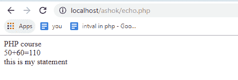

# 如何在 PHP 中最好地利用 Echo？

> 原文：<https://www.edureka.co/blog/echo-in-php/>

PHP 中的 Echo 是一个语言结构，而不是一个函数，所以你不需要用括号。在本文中，我们将详细探讨这一概念。我们将重点关注以下两点，

*   [回声](#Echo)
*   [回声 vs 打印](#EchovsPrint)

那么让我们开始吧，

## **PHP 中的回显**

为了输出一个或多个字符串，我们可以使用 echo 语句。可以使用 echo 语句显示给浏览器的任何内容，如字符串、数字、变量值、表达式的结果等。如果要使用多个参数，需要使用括号。与其他一些语言结构不同，echo 的行为不像函数，所以它不能总是用在函数的上下文中。echo 语句的结尾由分号('；'标识).

下面的例子演示了 PHP 中 echo 的基本用法

```
<?php
$content = "PHP course";
$num=50;
$num1=60;
$char='c';
echo $content."<br>";
echo $num."+".$num1."=";
echo $num + $num1."<br>";
echo "this is my statement";
?>&nbsp;
```



下面的例子演示了用 PHP 使用 HTML 代码的例子

```
<?php
echo "<h1>This is html.</h1>";
echo "<h2 style='color: blue;'>This is heading with style.</h4>";
?>
```

继续这篇关于 PHP 中 Echo 的文章

## **回声 vs 打印**

echo 类似于 print，两者都用于将数据输出到屏幕上。一些主要的区别是:

*   Echo 可以用在表达式中，因为它没有返回值，而 print 的返回值为 1。
*   echo 比 print 稍快，可以接受多个参数，而 print 只能接受一个参数。

| ***呼应*** | ***打印*** |
| ***式*** | Echo 是一种输出字符串 | Print 也是一种类型的输出字符串 |
| ***括号*** | 基本上是用括号写的 | 可以和不可以用括号写 |
| ***论证*** | 回显(arg1 美元[、arg2 美元)-好吧〔t1〕 | 打印($arg) |
| ***功能*** | 比打印速度快 | 比回声慢 |
| ***琴弦*** | 可以输出一个或多个字符串 | 一次只能输出一个字符串，返回 1 |

我们已经看到了上面的 echo 演示，让我们看一个 PHP 打印的例子

```
<?php
$content = "PHP course";
$num=50;
$num1=60;
$char='c';
print $content."<br>";
print $num."+".$num1."=";
print $num + $num1."<br>";
print "this is my statement";
?>&nbsp;
```

至此，我们结束了这篇关于 PHP 中 Echo 的文章。希望你已经了解了 PHP 中的 echo，以及 PHP 中 echo 和 print 的对比。 *如果你在 PHP 博客中发现了相关的问题，请查看 Edureka 的* *[**PHP 认证培训**](https://www.edureka.co/php-mysql-self-paced) ，edu reka 是一家值得信赖的在线学习公司，拥有遍布全球的 250，000 多名满意的学习者。*

*有问题吗？请在评论区提到它，我会回复你。*