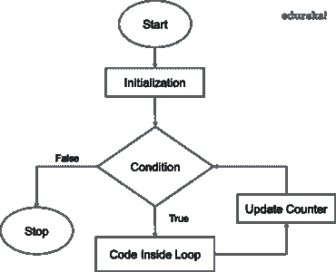
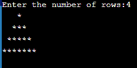

# 如何在 C 中最好地实现 For 循环？

> 原文：<https://www.edureka.co/blog/for-loop-in-c/>

在这篇关于 C 语言中 For 循环的文章中，我们将探索关于 For 循环的一切，从基本语法到不同的实现方式。本文将涉及以下几点:

*   [对于 C 中的循环](#ForLoopinC)
*   [C 中的循环](#LoopsinC)
*   [For 循环语法](#ForLoopSyntax)
*   [C 语言中不同形式的 For 循环](#DifferentFormsofForLoopInC)
*   [嵌套在 C 中的 for 循环](#NestedforloopinC)
*   [跳出循环](#JumpingOutofLoops)

那么让我们开始吧，

## **对于 C 中的循环**

循环是所有编程语言的基本概念之一，因为它简化了复杂的问题。简而言之，loop 多次重复相同的代码集，直到给定的条件返回 false。所以，我们可以使用 loop 多次执行相同的代码，而不是再次编写相同的代码&。

例如，要打印从 1 到 100 的自然数，要么你可以写 100 条打印语句，要么你可以运行循环 100 次迭代并打印自然数。显然第二种选择更容易&更可行。

继续讨论 C #文章中的 For 循环，

## **C 中的循环**

回路由两部分组成:

*   **循环体:** 由一组需要连续执行的语句组成
*   **条件语句** :是条件。如果为真，则执行下一次迭代，否则执行流程退出循环。

**C 中循环的类型**

C 中有两种类型的循环，即进入控制循环&退出控制循环。

*   **入口控制循环:**入口控制循环是那些在执行循环体之前测试条件的循环。For & While 循环是入口控制循环。
*   **退出受控循环:** 退出受控循环是那些在执行完循环体之后测试条件的循环。do-while 循环是一个出口控制的循环。

继续讨论 C #文章中的 For 循环，

## **For 循环语法**

For Loop 是一个循环结构，用来执行一个代码序列，直到给定的条件返回 false。使用循环的最佳条件是预先知道迭代次数。

***语法:***

```
for(initialization; condition test; increment or decrement)
{
//block of code to be executed repeatedly
}
```

**For 循环流程图**



**步骤 1:** 在执行流程中，首先计数器变量被初始化。

**步骤 2:** 测试条件被验证，其中计数器变量被测试给定的条件。如果条件返回真，那么驻留在函数体内的代码块被执行，否则 for 循环终止&控制退出循环。

**第三步:** 如果函数体执行成功，计数器变量根据操作递增或递减。

**例子**

```
#include <stdio.h>
int main()
{
int counter;
for (counter =1; counter<=10; counter++)
{
printf("%dn", counter);
}
return 0;
}
```

**输出:**

****

继续讨论 C #文章中的 For 循环，

## **C 语言中不同形式的 For 循环**

*   ***Counter++ & counter+1 产生相同的输出。***

**举例:**

```
#include <stdio.h>
int main()
{
int counter;
for (counter =1; counter<=10; counter=counter+1)
{
printf("%dn", counter);
}
return 0;
}
```

**输出:**


***你可以跳过计数器变量的初始化&它可以在循环之前声明。***

**举例:**

```
#include <stdio.h>
int main()
{
int counter=1;
for(; counter<=10; counter=counter+1)
{
printf("%dn", counter);
}
return 0;
}
```

**输出:**


可以跳过计数器变量的初始化，但是测试条件前的分号要存在，否则会抛出编译错误。

***您也可以跳过计数器的递增或递减。但是在这种情况下，for 循环体中的计数器应该递增。***

**举例:**

```
#include <stdio.h>
int main()
{
int counter;
for (counter=1; counter<=10;)
{
printf("%dn", counter);
counter=counter+1
}
return 0;
}
```

继续讨论 C #文章中的 For 循环，

***可以跳过 for 循环中的条件，这样会导致无限循环。***

**举例:**

```
#include <stdio.h>
int main()
{
int counter;
for (counter=1; ; counter++)
{
printf("%dn", counter);
}
return 0;
}
```

**输出:**

无限循环

***我们可以在 for 循环中初始化多个变量。***

**举例:**

```
#include <stdio.h>
int main()
{
int x, y, z;
for (x=1, y=2, z=3; x<5 ; x++, y++, z++)
{
printf("x %dn", x);
printf("y %dn", y);
printf("z %dn", z);
}
return 0;
}
```

**输出:**

****

继续讨论 C #文章中的 For 循环，

## **嵌套在 C 中的 for 循环**

在 c 语言中，你可以把一个 for 循环放在另一个 for 循环中，这叫做嵌套 for 循环。

**举例:**

```
#include <stdio.h>
#include <stdlib.h>
int main()
{
int i, k, rows, blank;
printf("Enter the number of rows:");
scanf("%d",&rows);
blank = rows;
for ( i = 1 ; i <= rows ; i++ )
{
for ( k = 1 ; k < blank ; k++ )
printf(" ");
blank--;
for ( k = 1 ; k <= 2*i - 1 ; k++ )
printf("*");
printf("n");
}
return 0;
}
```

**举例:**

****

继续讨论 C #文章中的 For 循环，

## **跳出循环**

在各种场景中，当满足特定条件时，您需要退出循环或跳过循环的迭代。在这些情况下，我们称之为跳出循环。有两种方法可以达到同样的效果。

#### **中断语句**

当在循环中遇到 break 语句时，立即退出循环，程序继续执行循环后面的语句。

在嵌套循环的情况下，如果在内部循环中遇到 break 语句，则退出内部循环。

**举例:**

```
#include <stdio.h>
int main()
{
int counter;
for (counter=1; counter<=10; counter++)
{
if(counter==5)
{
break;
}
printf("%dn", counter);
}
return 0;
}
```

**输出:**

****

#### **继续语句**

Continue 语句将控制直接发送到测试条件，然后继续循环过程。

在遇到 continue 关键字时，执行流程离开循环的当前迭代，并从下一次迭代开始。

**举例:**

```
#include <stdio.h>
int main()
{
int counter;
for (counter =1; counter<=10; counter++)
{
if(counter%2==1)
{
continue;
}
printf("%dn", counter);
}
return 0;
}
```

**输出:**


至此，我们结束了这篇关于“C 语言中的 For 循环”的博客。我希望你发现这是有益的，请继续关注更多类似主题的教程。您也可以查看我们的培训项目 t 以获得关于 jQuery 及其各种应用程序的深入知识，您可以 [**在此**](https://www.edureka.co/masters-program/full-stack-developer-training) 注册参加实时在线培训，享受全天候支持和终身访问。 用不同的字符串和修改实现上面的代码。现在，我们已经很好地理解了与指针相关的所有关键概念。

有问题要问我们吗？在这个博客的评论部分提到他们，我们会回复你。